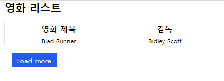
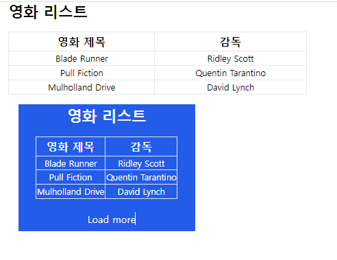
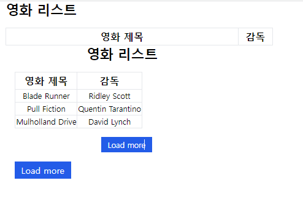
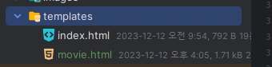
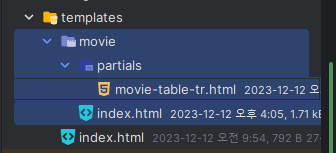
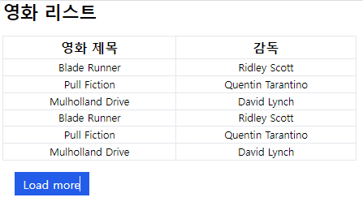

- 참고유튜브: https://www.youtube.com/watch?v=yu0TbJ2BQso&list=PL-2EBeDYMIbSppj2GYHnvpZ9W69qmkInS

1. table태그 + 더보기 버튼를 tailwind와 함께 만든다
    ```html
    <body>
    <div class="mx-4">
        <p class="text-2xl font-bold mb-4">영화 리스트</p>
        <table class="min-w-[50%] mb-4">
            <thead class="border-b text-lg">
            <tr>
                <th class="border">영화 제목</th>
                <th class="border">감독</th>
            </tr>
            </thead>
            <tbody class="text-center text-sm">
            <tr>
                <td class="border">Blad Runner</td>
                <td class="border">Ridley Scott</td>
            </tr>
            </tbody>
        </table>
    
        <button class="px-3 py-1 bg-blue-600 text-white ml-4">Load more</button>
    </div>
    </body>
    ```
   


2. db연결이 안되어있으므로, route에서 dict list로 칼럼명을 key에 매번 적으면서 데이터를 만들어, context에 같이 내려줌.
    ```python
    @app.get("/movie/")
    async def index(request: Request, response_class=HTMLResponse):
        films = [
            {'name': 'Blade Runner', 'director': 'Ridley Scott'},
            {'name': 'Pull Fiction', 'director': 'Quentin Tarantino'},
            {'name': 'Mulholland Drive', 'director': 'David Lynch'},
        ]
    
        context = {'request': request, 'films': films}
        return templates.TemplateResponse("movie.html", context)
    
    ```


3. table의 thead는 두고, tbody의 tr속 `반복되는 thr > th*칼럼갯수`들만 삭제한 뒤, jinja for문으로 context 변수로 변경

4. load more button에 `hx-get`만 걸어, `접속 route인 /movie`에서 `일단 전체 html response`를 받아오도록 한다.
    - **hx-get만 일단 작성해서 처음부터 다 받아온다.**
    ```html
    <button class="px-3 py-1 bg-blue-600 text-white ml-4"
            hx-get="{{ url_for('movie') }}"
    >
        Load more
    </button>
    ```
   


5. 2번째로 `hx-target="#id"`을 정해줘서, 버튼이 아니라, id를 가진놈만 바뀌게 한다.
    - **for문이 들어갈 자리의 부모태그인 tbody를 타겟으로 한다.**
    ```html
    <tbody class="text-center text-sm" id="movie-table-body">
    
    
    <tr>
        <!--<td class="border">Blad Runner</td>-->
        <!--<td class="border">Ridley Scott</td>-->
        <td class="border">{{ film.name }}</td>
        <td class="border">{{ film.director }}</td>
    </tr>
    
    </tbody>
    
    
    <button class="px-3 py-1 bg-blue-600 text-white ml-4"
        hx-get="{{ url_for('movie') }}"
        hx-target="#movie-table-body"
    >
    Load more
    </button>
    ```
   


3. 요청주소(기존 쓰던route) + 타겟을 정했으면, `전체가 아닌 일부html`만 받을 수 있도록 `partials html`을 생성한 뒤, `include 'html'` 문법을 사용해서 최초html에도
   넣어준다.
    - **반복되는 부분 부모태그를 hx-target 정함 -> 반복되는 부분을 partials로 뺌 -> 초기렌더에도 사용되면 include로 채움 -> route에서 최초가 아닌 htmx요청일 때, partials만 렌더링**
    - 도메인폴더 `movie`를 만들고 > movie.html을 `index.html`로 변경 > partials 폴더를 만들고 > 거기에 `xxx-태그명.html`으로 `movie-table-tr.html`을
      만든다.
      
      
    - movie.html의 위치도 바꼈으니, route에서 경로를 추가해준다.
        ```python
       @app.get("/movie/")
        async def movie(request: Request, response_class=HTMLResponse):
            # ...
            return templates.TemplateResponse("movie/index.html", context)
        ```
    - **반복되는 `for문 + tr태그`를 그대로 잘라내기 해서 붙혀준다. 최초로딩때도 사용되어야하니, include문법을 써준다**
        - movie-table-tr.html
        ```html
        
        <tr>
            <td class="border">{{ film.name }}</td>
            <td class="border">{{ film.director }}</td>
        </tr>
        
        ```
    - movie/index.html
        ```html
        <tbody class="text-center text-sm" id="movie-table-body">
            
        </tbody>
        ```
      
4. 이제 route에서, 최초렌더링이 아니라 `htmx Load more`일 경우, paritals만 렌더링
    - htmx문서에 `HX-Request`가 set "true"로 되어있다고 한다.
    - route에서 Header를 확인해야하는데 fastapi Header 모듈을 import해서 Optional[str]으로 받을 수 있다.
    - **`Header(None)`을 의존성으로 가져오면, Front가 대문자로 줬어도 `snake_case`형태로 아무거나 꺼내볼 수 있다. `변수이름만으로 원하는 Header정보를 꺼내보는 마법`이다.**
        - User-Agent -> user_agent
        - HX-Requested -> hx_requested

    ```python
    from fastapi import FastAPI, Request, Header
    
    @app.get("/movie/")
    async def movie(request: Request, user_agent: Optional[str] = Header(None), response_class=HTMLResponse):
    
        print(f"user_agent >> {user_agent}")
    
    # user_agent >> Mozilla/5.0 (Windows NT 10.0; Win64; x64) AppleWebKit/537.36 (KHTML, like Gecko) Chrome/119.0.0.0 Safari/537.36
    ```
    ```python
    from fastapi import FastAPI, Request, Header
    
    @app.get("/movie/")
    async def movie(request: Request, hx_request: Optional[str] = Header(None), response_class=HTMLResponse):
    
        print(f"hx_request >> {hx_request}")
    
    # hx_request >> None (최초로딩)
    # hx_request >> true (Load more을 통한 hx-get 호출)
    ```
    - **대박) hx-reqeust판단은 `hx_request: Optional[str] = Header(None)`으로 하며, 없으면 `python - None` 있으면 `string - "true"`가 들어가 있다.**


5. hx_request 헤더가 "true"로 있으면, partials를 응답하면 된다.
    ```python
    @app.get("/movie/")
    async def movie(request: Request, hx_request: Optional[str] = Header(None), response_class=HTMLResponse):
        films = [
            {'name': 'Blade Runner', 'director': 'Ridley Scott'},
            {'name': 'Pull Fiction', 'director': 'Quentin Tarantino'},
            {'name': 'Mulholland Drive', 'director': 'David Lynch'},
        ]
    
        context = {'request': request, 'films': films}
    
        if hx_request:
            return templates.TemplateResponse('movie/partials/movie-table-tr.html', context)
    
        return templates.TemplateResponse("movie/index.html", context)
    ```
   
6. `hx-swap`을 통해, `target의 child 끝에 똑같은 것들을  append`하며, `if hx_request:`안에서 `pagination을 적용하여 새로운 데이터만` 조회해야할 것이다
    - 현재는 dict list의 고정된 데이터라서 그냥 똑같은 부분만 그대로 가져오게 한다.
    - [htmx 문서](https://htmx.org/attributes/hx-swap/)
        - `beforeend` - Insert the response after the last child of the target element 
    ```html
    <button class="px-3 py-1 bg-blue-600 text-white ml-4"
            hx-get="{{ url_for('movie') }}"
            hx-target="#movie-table-body"
            hx-swap="beforeend"
    >
        Load more
    </button>
    ```
    