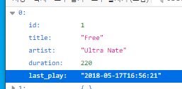
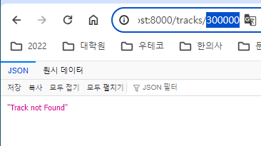
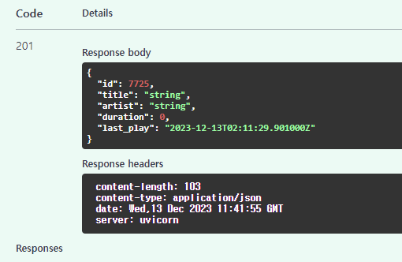

- 참고유튜브: https://www.youtube.com/watch?v=gV-EpY2TeQ0&list=PL-2EBeDYMIbSppj2GYHnvpZ9W69qmkInS&index=3

### json을 pydantic으로 검증+변형하여 dict list로 보유

1. root에 `data`폴더를 만들고, 내부에 json파일을 넣는다.
    - 데이터 출저: https://github.com/bugbytes-io/fastapi-crud-api/blob/master/data/tracks.json
    - 데이터는 dict list 모양으로 채우면되고, 매 dict 데이터마다 칼럼을 기입해야함.

2. `pydantic`을 설치한다.
3. schemas.py를 만들고, BaseModel 모듈을 가져와, **일단은 `데이터칼럼과 일치` + `매핑반영한 type으로 정의`해준다.**
    - 자동으로 mapping해주기 떄문에 "1"의 id라도 `id: int`로 받아준다.
    - duration의 경우, 소수점이 나올 수 잇어서 float로 받는다.
    - **last_play의 경우, 문자열 datetime `2016-02-16 18:29:24`인데, datetime의 datetime으로 받으면 된다.**

    ```python
    class Track(BaseModel):
        id: int
        title: str
        artist: str
        duration: float
        last_play: datetime
    ```


4. **Create의 경우, id는 안들어온다. typing의 `Optional[ type ] = None`로 기존 type을 감싸주고 안들어오면 `None을 default값`으로 가지게 한다**
    - id칼럼은 항상 Optional 인 것을 생각하자
    ```python
    class Track(BaseModel):
        id: Optional[int] = None
    ```


5. main.py의 lifespan으로 가서, pathlib + json 모듈을 이용하여 json을 불러온다.
    - **pathlib.Path()에 `/`일반 슬래쉬로 데이터 경로까지 가면 된다.**
    - **with open+r + json.load로 파일들 json파일을 불러온 뒤, `sqlalchemy 모델이 아닌 pydantic model schema`에 orm객체처럼 `**dict`를 언패킹해서
      `Schema객체`를 만듬과 동시에 `.model_dump()`를 이용해 `type mapping된 dictionary`를 만든다**
    - **db.add()를 db에 하는게 아니라 `main.py 전역변수`의 `tracks_data=[]`의 빈 list에 mapping된 dict들을 append해준다.**
    ```python
    tracks_data = []
    
    @asynccontextmanager
    async def lifespan(app: FastAPI):
        # startup
    
        # 2) [tracks] json -> dict -> pydantic schema model
        tracks_path = pathlib.Path() / 'data' / 'tracks.json'
    
        with open(tracks_path, 'r') as f:
            tracks = json.load(f)
    
            for track in tracks:
                tracks_data.append(Track(**track).model_dump())
    
        print(f"[tracks] {len(tracks_data)}개의 json 데이터 로드 in tracks_data\n - 예시: {tracks_data[0]}")
    
    # [tracks] 2669개의 json 데이터 로드 in tracks_data
    # - 예시: {'id': 1, 'title': 'Free', 'artist': 'Ultra Nate', 'duration': 220.0, 'last_play': datetime.datetime(2018, 5, 17, 16, 56, 21)}
    ```

### CRUD

1. Read시, pydantic Schema가 있다면, HTML응답용 response_class가 아닌 `response_model`로 지정해준다.
    - tracks(전체 조회)
    ```python
    @app.get("/tracks/", response_model=List[Track])
    def tracks():
        return tracks_data
    
    ```
   
    - tracks/{track_id} (단일 조회)
        - **get의 path파라미터는, `viewfunction에서 파라미터로 type매핑`까지해서 내부에서 쓸 수 있다.**
        - **전체조회는 데이터가 없으면 `빈 list`를 그대로 반환하지만, 단일조회는, `지정한 id가 없으면 None처리`까지 추가로 해줘야한다.**
        - **db가 아닌 list조회기 때문에 `for 순회하면서 조회하되, 미리 None flag변수를 선언해놓고 찾기`를 수행한다**
            - **for순회해서 조회는, `기본값으로 없을시 None flag` -> `for 순회중 찾으면 할당 후 break` 해주기**
        ```python
        @app.get("/tracks/{track_id}", response_model=Track)
        def track(track_id: int):
            track = None
            for t in tracks_data:
                if t['id'] == track_id:
                    track = t
                    break
        
            return track
        ```
        - **단일조회에서 못찾으면 `status를 바꿔줘야한다`. return으로는 참고 메세지만 보내주면 된다?!**
            - **status를 바꿔주기 위해서는 Response를 주입받아서 사용해야한다.**
            - return으로 안넣어줘도 알아서 status code가 바뀐다.
        ```python
        @app.get("/tracks/{track_id}", response_model=Track)
        def track(track_id: int, response: Response):
            track = None
            for t in tracks_data:
                if t['id'] == track_id:
                    track = t
                    break
        
            if track is None:
                response.status_code = 404
                return "Track not Found"
        
            return track
        ```
        - **또한, 찾을때의 Schema 반환과 달리, 참고메세지를 응답하기 위해서는 response_model에 `Union[ , ]`을 이용해서 Track외 `str`도 추가해줘야한다.**
            - response type을 추가안해주면, pydantic vadlidation에러가 뜬다.
        ```python
        @app.get("/tracks/{track_id}", response_model=Union[Track, str])
        ```
      


2. create의 경우, 200(default) or 404의 선택이 아니라, `201 고정 status`로서, response_model 옆에 데코레이터에 명시해줄 수 있다.
    - post의 경우, path에 `{}` 없이도  `json (view) ->검증+매핑된 pydantic Schema`를 쿼리파라미터처럼 `viewfunction의 파라미터`로만 받아주면 된다.
    - **Schema로 들어왔다면, route내부에서는 `.model_dump()`를 통해 python `dict로 변경`해서 `id부여 등`의 작업을 해줘야한다.**
    - **id를 부여하기 위해서는 전역변수에 있는 데이터를 순회하면서 찾아야하는데, `값1개를 id기준`으로 `max`값을 찾으므로 `max( , lambda)`를 이용해서 찾고 `+1`을해서 부여하면 된다.
      **
        - unique칼럼 존재여부 등의 검사는 생략한다.
    ```python
    @app.post("/tracks/", response_model=Track, status_code=201)
    def create_track(track: Track):
        track_dict = track.model_dump()
        # track_dict >> {'id': None, 'title': 'string', 'artist': 'string', 'duration': 0.0, 'last_play': datetime.datetime(2023, 12, 13, 2, 11, 29, 901000, tzinfo=TzInfo(UTC))}
    
        # 최고 id찾아서 id 부여
        track_dict['id'] = max(tracks_data, key=lambda x: x['id']).get('id') + 1
    
        # 전역변수에 append( session.add + commit )
        tracks_data.append(track_dict)
    
        return track_dict
    ```
    - **json 데이터의 전달은, form이 아니므로, `/docs`의 스웨거를 이용하거느 `curl`을 보내면 된다.**
      
    - 전체조회인 /tracks에 들어가서 추가한 데이터를 확인한다.

3. **update의 경우, `단일조회`를 복사해서 수정하자.**
    - app.get -> app.put
    - **update도, `단일조회처럼, 성공시 객체Schema / 못찾으면 str`을 반환하게 되어있다.**
        - **그래서 `id존재여부 검사 -> 없을시 status 404 + str반환`은 그대로 놔두고, update로직을 추가한다.**
    - 단일 조회 -> update 과정을 위해 path의 track_id는 그대로지만, `업데이트할 객체데이터 json이 Schema`로 들어와야하고 받아야하므로, viewfunction 파라미터로
      Schmea를 `updated_track`으로 받아준다.
    - **수정의 경우, dict list 단일조회후 새변수에 재할당하지만, list속 위치값을 넘겨주기 때문에, track(조회된 값) 수정시, track_data 속 데이터도 같이 수정된다.**
    ```python
    @app.put("/tracks/{track_id}", response_model=Union[Track, str])
    def track(track_id: int, updated_track: Track, response: Response):
        # 단일조회 로직 시작
        track = None
        for t in tracks_data:
            if t['id'] == track_id:
                track = t
                break
    
        if track is None:
            response.status_code = 404
            return "Track not Found"
        # 단일조회 로직 끝 (찾은 상태)
    
        # 수정 로직 시작
        # 1) schema를 dict로 바꾼뒤 .items()로 순회하며 업데이트한다. (생성시에는 dict로 바꿔서, id부여 + append)
        for key, value in updated_track.model_dump().items():
            # 2) id는 바꾸면 안되므로 continue 시키고 나머지를 재할당하여 업데이트한다.
            if key == 'id':
                continue
            track[key] = value
    
        # 3) 조회시 track = t로 참조했으므로, track을 업데이트하면 t도 업데이트된다.
        # => t는 dict list안의 dict이며, dict든 list든 참조형으로서 위치(주소)값만 넘기기 때문에, 그 위치의 값들은 같은 곳을 바라봐서
        #    같이 수정된다.
    
        return track
    ```
    - 1번 id를 스웨거로 수정해서 확인하면 된다.

4. delete의 경우, 단일조회를 복사한 `update(수정)`을 복사해서 코드를 작성한다.
    - 그 이유는 `단일조회` + `삭제`의 과정을 거치기 때문이라 로직이 비슷하기 때문이다.
    - **삭제시에는 response_model=Union[Track, str]을 삭제한다. 삭제한 데이터 정보는 내려보내주지 않는가보다.**
        - **id로 수정할 dict조회가 아니라 id로 삭제할 dict의 index조회(by enumerate) `조회실패시 str`응답은 `default response`이며 status code만 바뀌고**
        - **삭제성공해도 Track데이터가 아니라, `Response(status_code=200)`의 기본resonse를 응답할 것이기 때문이다.**
    - **또한, 수정할 Track json->schema는 안들어오니 빼준다.**
    - **`단일조회 변경점`으로, track dict를 찾는게 아니라, `삭제요청 id와 동일한 track의 index`를 `enumerate`를 통해 찾는다.**
        - **dict list에서 수정은 track(dict)자체를 찾으면, 사실상 위치값을 찾고, 수정하면 바로 같이 수정되지만** 
        - **`dict list에서 삭제`는, 수정과 달리, `index`를 알아야 바로 삭제 가능하기 때문이다.**
    - **삭제 로직은 `del 전역데이터list[index]`를 통해 삭제한다**
    ```python
    @app.delete("/tracks/{track_id}")
    def track(track_id: int, response: Response):
        # 단일 <index> 조회 로직 시작
        track_index = None
        for idx, t in enumerate(tracks_data):
            if t['id'] == track_id:
                track_index = idx
                break
    
        if track_index is None:
            response.status_code = 404
            return "Track not Found"
        # 단일 <index> 조회 로직 끝 (찾은 상태)
    
        # 삭제 로직 시작
        del tracks_data[track_index]
    
        return Response(status_code=200)
    ```
    - docs에서 1번 데이터를 삭제해서 확인한다. 같은 것을 2번 삭제 요청해서 404의 Track not found도 확인하자.


5. **단일조회에서 `첫번째 1개만 찾는 순회`를 `flag + for + break` 대신 `next(,None)`으로 바꿔보자.**
    - get / update
       ```python
       # track = None
       # for t in tracks_data:
       #     if t['id'] == track_id:
       #         track = t
       #         break
       track = next(
           (t for t in tracks_data if t['id'] == track_id), None
       )
        ```
   - delete
        ```python
        # track_index = None
        # for idx, t in enumerate(tracks_data):
        #     if t['id'] == track_id:
        #         track_index = idx
        #         break
        track_index = next(
            (idx for idx, t in enumerate(tracks_data) if t['id'] == track_id), None
        )
        ```