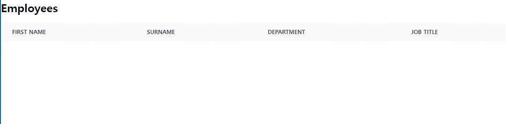
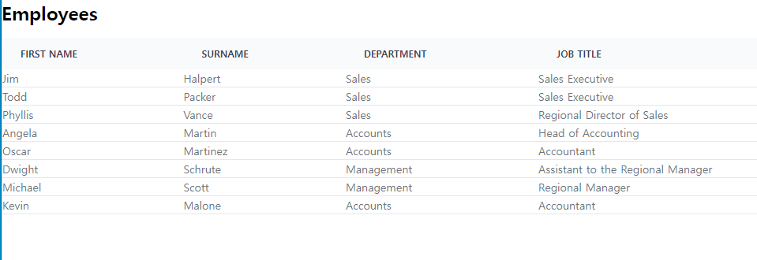
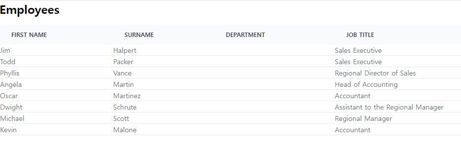
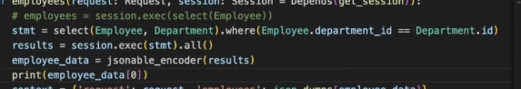
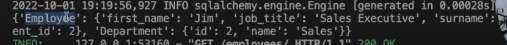
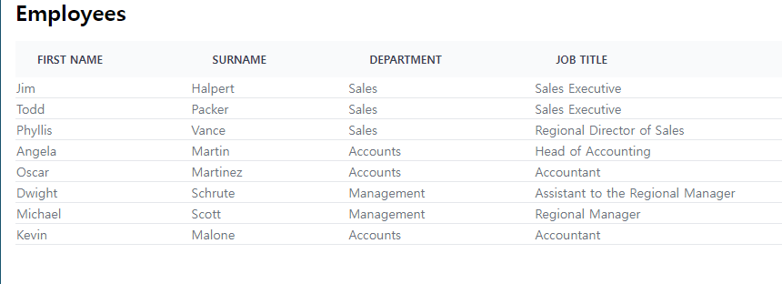
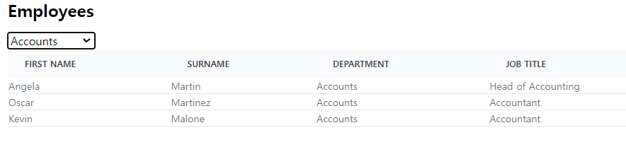
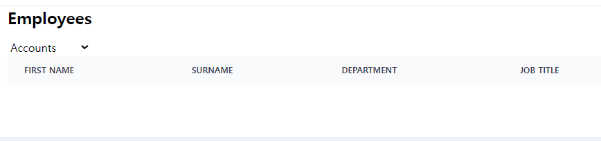
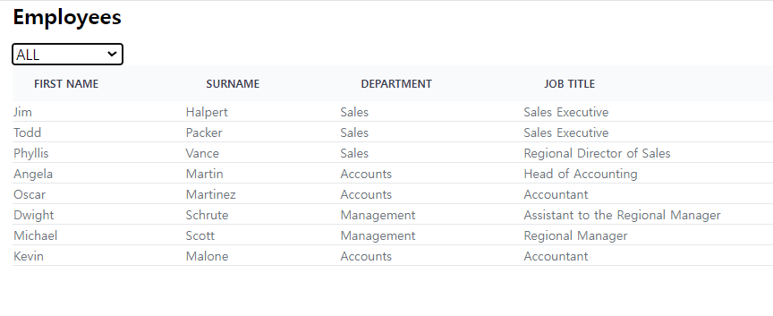

- 참고유튜브: https://www.youtube.com/watch?v=qlXJu2U1jc4&list=PL-2EBeDYMIbSppj2GYHnvpZ9W69qmkInS&index=5
- 초기깃허브: https://github.com/bugbytes-io/fastapi-alpinejs

### 데이터 -> DB 준비

1. 데이터 모델에 상응하게될 dict list를 lifespan에 만들어놓는다.
    - **이 때, `부서의 many가 될 Employee`의 `one의 id`는 one dict에서 추출해서 입력해놓고**
    - **추후, db model이 되면, first()로 one(부모)조회 -> .id로 입력해줄 준비를 한다.**
    ```python
    # 3) [EmpDept] dict -> sqlalchemy orm class
    departments = [
        {"id": 1, "name": "Accounts"},
        {"id": 2, "name": "Sales"},
        {"id": 3, "name": "Management"},
    ]
    
    employees = [
        {
            'id': 1,
            'first_name': 'Jim',
            'surname': 'Halpert',
            'job_title': 'Sales Executive',
            'department_id': departments[1].get("id")
        },
        # ...     
    ]
    ```

2. dict list에 대응되는 sqlalchemy model을 models.py에 정의한다.
    ```python
    class Employee(Base):
        __tablename__ = "employees"
    
        id = Column(Integer, primary_key=True, index=True)
        first_name = Column(String)
        surname = Column(String)
        job_title = Column(String)
    
        department_id = Column(Integer, ForeignKey("departments.id"))
        department = relationship("Department", back_populates="employees",
                                  foreign_keys=[department_id],
                                  uselist=False,
                                  )
    
    
    class Department(Base):
        __tablename__ = "departments"
    
        id = Column(Integer, primary_key=True, index=True)
        name = Column(String)
    
        employees = relationship("Employee", back_populates="department")
    
    ```


3. 이제 lifespan에 적어둔 dict list를 순회하며 순회하며 add + `one부터 commit 후, first()로 조회해서 many에서는 one.id를 사용하자`
    - **one인 부서를 먼저 조회해놓고 -> many의 fk에 변수로 입력시키자.**
    ```python
        num_departments = db.query(models.Department).count()
        if num_departments == 0:
            departments = [
                {"id": 1, "name": "Accounts"},
                {"id": 2, "name": "Sales"},
                {"id": 3, "name": "Management"},
            ]
            for department in departments:
                db.add(models.Department(**department))
            db.commit()
        else:
            print(f"[EmpDept] : {num_departments} departments already in DB.")
        num_employees = db.query(models.Employee).count()
        if num_employees == 0:
            accounts = db.query(models.Department).filter(models.Department.name == "Accounts").first()
            sales = db.query(models.Department).filter(models.Department.name == "Sales").first()
            management = db.query(models.Department).filter(models.Department.name == "Management").first()
    
            employees = [
                {
                    'id': 1,
                    'first_name': 'Jim',
                    'surname': 'Halpert',
                    'job_title': 'Sales Executive',
                    'department_id': sales.id
                },
                {
                    'id': 2,
                    'first_name': 'Todd',
                    'surname': 'Packer',
                    'job_title': 'Sales Executive',
                    'department_id': sales.id
                },
                {
                    'id': 3,
                    'first_name': 'Phyllis',
                    'surname': 'Vance',
                    'job_title': 'Regional Director of Sales',
                    'department_id': sales.id
                },
                {
                    'id': 4,
                    'first_name': 'Angela',
                    'surname': 'Martin',
                    'job_title': 'Head of Accounting',
                    'department_id': accounts.id
                },
                {
                    'id': 5,
                    'first_name': 'Oscar',
                    'surname': 'Martinez',
                    'job_title': 'Accountant',
                    'department_id': accounts.id
                },
                {
                    'id': 6,
                    'first_name': 'Dwight',
                    'surname': 'Schrute',
                    'job_title': 'Assistant to the Regional Manager',
                    'department_id': management.id
                },
                {
                    'id': 7,
                    'first_name': 'Michael',
                    'surname': 'Scott',
                    'job_title': 'Regional Manager',
                    'department_id': management.id
                },
                {
                    'id': 8,
                    'first_name': 'Kevin',
                    'surname': 'Malone',
                    'job_title': 'Accountant',
                    'department_id': accounts.id
                },
            ]
    
            for employee in employees:
                db.add(models.Employee(**employee))
    
            db.commit()
    
        else:
            print(f"[EmpDept] : {num_employees} employees already in DB.")
    ```

### view 준비 + lazy 공부

1. 일단 기본 index페이지를 렌더링할 route를 개설한다.
    - request 모듈 for context ?? / session for db 를 파라미터로 받아준다.
    ```python
    @app.get("/employees/", response_class=HTMLResponse)
    def employees(
            request: Request,
            db: Session = Depends(get_db),
    ):
        employees = db.query(models.Employee).all()
        context = {'request': request, 'employees': employees}
    
        return templates.TemplateResponse("employees/index.html", context)
    
    ```


2. `templates/employees`폴더를 만들고 index.html을 만들되 alpine.js를 추가한다.
    ```html
    <!DOCTYPE html>
    <html lang="en">
    
    <head>
        <meta charset="UTF-8">
        <meta http-equiv="X-UA-Compatible" content="IE=edge">
        <meta name="viewport" content="width=device-width, initial-scale=1.0">
        <title>FastAPI + Htmx</title>
    
        <!-- htmx -->
        <script src="https://unpkg.com/htmx.org@1.6.1"
            integrity="sha384-tvG/2mnCFmGQzYC1Oh3qxQ7CkQ9kMzYjWZSNtrRZygHPDDqottzEJsqS4oUVodhW" crossorigin="anonymous">
        </script>
        <script>
            htmx.config.useTemplateFragments = true; // table row 조작을 위한 설정
            // 없으면 htmx-swap 에러가 남 : htmx.org@1.6.1:1 Uncaught TypeError: e.querySelectorAll is not a function
        </script>
        <!-- alpinejs -->
        <script defer src="https://unpkg.com/alpinejs@3.10.3/dist/cdn.min.js"></script>
    
        <!-- css -->
        <script src="https://cdn.tailwindcss.com"></script>
    </head>
    
    <body>
        <p class="p-6 bg-red-500">hello world</p>
    </body>
    
    </html>
    ```


3. employee정보를 담을 테이블의 thead태그부터 만든다.
    - scope="col"은 접근성용이다.
    - 일단 table자체를 w-full로 때려놓고, thead들은 모두 대문자로 나오게 한다
    ```html
    <table class="w-full text-sm text-left text-gray-500 dark:text-gray-400">
        <thead class="text-xs text-gray-700 uppercase bg-gray-50 dark:bg-gray-700">
            <tr>
                <th scope="col" class="px-6 py-3">First Name</th>
                <th scope="col" class="px-6 py-3">Surname</th>
                <th scope="col" class="px-6 py-3">Department</th>
                <th scope="col" class="px-6 py-3">Job Title</th>
            </tr>
        </thead>
        <tbody>
        
        </tbody>
    </table>
    ```
   


4. 템플릿에서는 tbody의 tr들을 반복문으로 주로 만든다.
    - thead와 달리, tbody는 tr들마다 css class를 줘서 꾸민다.
    ```html
    <tbody>
        
        <tr class="bg-white border-b dark:bg-gray-800 dark:border-gray-700">
            <td>{{ employee.first_name }}</td>
            <td>{{ employee.surname }}</td>
            <td>{{ employee.department.name }}</td>
            <td>{{ employee.job_title }}</td>
        </tr>
        
    </tbody>
    ```
   


5. template에서 관계에 접근해도, session detach가 일어나지 않는, relationship의 `default lazy='select'`
    - get_db -> 템플릿 렌더링시에도 session유지 -> yield -> session.close()라서 **lazy(호출시 로드)상태에서도 템플릿에서 session이 유지되나보다.**

    1. relationship에 `lazy옵션을 안준 경우` -> `lazy: _LazyLoadArgumentType = "select",`로서 select가 기본값
        - `lazy=True`도 동일한듯.
        ```sql
        # employees 조회
        BEGIN (implicit)
        SELECT employees.id AS employees_id, employees.first_name AS employees_first_name, employees.surname AS employees_surname, employees.job_title AS employees_job_title, employees.department_id AS employees_department_id 
        FROM employees
         
        # employees[0].department 조회
        sqlalchemy.engine.Engine SELECT departments.id AS departments_id, departments.name AS departments_name 
        FROM departments 
        ```    

    2. `lazy="selectin"`
       ```sql
       # employees 조회
       BEGIN (implicit)
       SELECT employees.id AS employees_id, employees.first_name AS employees_first_name, employees.surname AS employees_surname, employees.job_title AS employees_job_title, employees.department_id AS employees_department_id 
       FROM employees
       SELECT departments.id AS departments_id, departments.name AS departments_name 
       FROM departments 
       WHERE departments.id IN (?, ?, ?)
     
       # employees[0].department 조회
       nothing
       ```
    3. `lazy="joined"`
       ```sql
       # employees 조회
       BEGIN (implicit)
       SELECT employees.id AS employees_id, employees.first_name AS employees_first_name, employees.surname AS employees_surname, employees.job_title AS employees_job_title, employees.department_id AS employees_department_id, departments_1.id AS departments_1_id, departments_1.name AS departments_1_name 
       FROM employees LEFT OUTER JOIN departments AS departments_1 ON departments_1.id = employees.department_id
     
       # employees[0].department 조회
       nothing
       ```
    4. **`lazy=False`는, 지연로딩을 안하는 대신 join으로 eagerload를 해버리니 쓰면 안될 것 같다.**
       ```sql
       # employees 조회
       BEGIN (implicit)
       SELECT employees.id AS employees_id, employees.first_name AS employees_first_name, employees.surname AS employees_surname, employees.job_title AS employees_job_title, employees.department_id AS employees_department_id, departments_1.id AS departments_1_id, departments_1.name AS departments_1_name 
       FROM employees LEFT OUTER JOIN departments AS departments_1 ON departments_1.id = employees.department_id
     
       # employees[0].department 조회
       nothing
       ```
    5. `lazy=None`을 해버리면, 관계호출시 쿼리없이 None이 반환된다.
       ```sql
       # employees 조회
       BEGIN (implicit)
       SELECT employees.id AS employees_id, employees.first_name AS employees_first_name, employees.surname AS employees_surname, employees.job_title AS employees_job_title, employees.department_id AS employees_department_id 
       FROM employees
     
       # employees[0].department 조회
       employees[0] >> None
       ```
       

    - **결론) relationship을 쓰는 순간 lazy="select"가 자동 적용된다. session이 끊어지지 않는다면 접근시 쿼리를 날린다.**

### alpine js로 상태값 선언 -> two table join 후 짝을 만들어서 -> 짝 모델 dict list -> json 시리얼라이즈 -> {{}}에 json을 받기 -> jinja for문 대체

- filter마다 요청을 날리면, 서버비용이 증가하기 때문에, 한번에 관계모델 2개의 정보를 맞춰서 백엔드에서 내려보내주고
- **관계데이터를, view에서 상태값을 이용해 처리한다. alpinejs or hyperscript로 가능하다.**
- **view의 alpinejs의 상태값으로 쓸려면, `json`으로 변환한 뒤, context에 넣어 내려보내주고, `템플릿에서는 {{ json }}`을 받아서 사용하면 된다.**

1. 전체를 싸는 div를 만들고 `x-data=" { json }"`의 문법으로 상태값 변수를 선언할 수 있다.
    ```html
    <div class="mx-4" x-data="{ results: [] }">
    ```

#### isort + ipython + jsonable_encoder

- **짝을 이루면, 관계를 depth로 넘겨줄 필요가 없어진다. `이렇게 하는 이유는, view에서 필터링하기 쉽게`**
- 이 때, **scalars()가 아닌 exceute()로 실행해야 2개 테이블이 모두 찍힌다.**
    - scalars()를 호출하면, select에 테이블2개를 넣어도, 1개만 뽑힌다.

1. view json에 담을 데이터는 fastapi에서 `시리얼라이즈`된 데이터를 내려줘야하는데 **내장 `jsonable_encoder`모듈을 사용한다**
    - **그전에 `isort`패키지를 설치한 뒤, 터미널에서 isort main.py를 이용해 import를 정리할 수 있다.**
    ```shell
    pip install isort
    pip freeze > .\requirements.txt
    
    isort .\main.py
    ```
    ```python
    from fastapi.encoders import jsonable_encoder
    ```

2. **DB모델을 테스트하기 위해서, `main.py`를 interactive 환경에서 실행하여 `flask shell`과 같은 느낌으로 테스트하면 된다.**
    - **터미널에서 `ipython`을 실행한 뒤, `run main.py`를 하면, main.py의 모든 코드가 실행된다.**
    - **main.py를 실행해야, database관련 설정들이 다 올라온다.**
        - **main.py에 `import models`, `from database import SessionLocal, engine`가 import된 상태다**
        - **`from fastapi.encoders import jsonable_encoder`까지 올라가 있는 상태다.**
    ```python
    run main.py
    # 2023-12-14 22:07:36,243 INFO sqlalchemy.engine.Engine BEGIN (implicit)
    # 2023-12-14 22:07:36,243 INFO sqlalchemy.engine.Engine PRAGMA main.table_info("films")
    # 2023-12-14 22:07:36,243 INFO sqlalchemy.engine.Engine [raw sql] ()
    # 2023-12-14 22:07:36,244 INFO sqlalchemy.engine.Engine PRAGMA main.table_info("employees")      
    # 2023-12-14 22:07:36,244 INFO sqlalchemy.engine.Engine [raw sql] ()
    # 2023-12-14 22:07:36,244 INFO sqlalchemy.engine.Engine PRAGMA main.table_info("departments")    
    # 2023-12-14 22:07:36,244 INFO sqlalchemy.engine.Engine [raw sql] ()
    # 2023-12-14 22:07:36,245 INFO sqlalchemy.engine.Engine COMMIT
   
    db = SessionLocal()
    ```

3. **이제 `select(t1, t2).where(fk == pk )을 이용한 multitable join`을 통해, 2개의 테이블이 짝을 이룬상태로 1row에 나타낸다.**
    - **SQLModel사용시, 2테이블 select execute 후 `jsonable_encoder()`에 넣으면, tuple list -> 1) 2객체가 `묶여서 dict` + 2) `테이블명이 key`로
      자동으로 들어간다**
      
      
    - **하지만, `sqlalchemy`사용시, 2테이블 select execute의 결과는**
        - tuple모양의 `sqlalchemy.row.Row` object list가 나오는데, 2개의 table이 들어있는 순간 **`jsonable_encoder()에 안넣어진다.`**
        - **tuple처럼 반복문에서 a,b로 풀어서 각각을 jsonable_encoder()에 넣어도, `1) 테이블명이 key` + `2) 2개가 합친 dict`가 안나온다.**
            - 각각을 jsonable_encoder()에 넣어도, list안에 [ dict, dict ]형태로만 나와서, 전체가 [[dict, dict]]가 된다.
            - **하지만 우리가 필요한 형태는 [ dict(테이블명=dict, 테이블2명=dict)]형태로 `짝지어진 2개의 테이블이 1개의 dict안에 테이블명key안에` 들어가있길 원한다**
    - ipython에서 연습한 내역
    ```python
    results = db.execute(
        select(models.Employee, models.Department)
        .where(models.Employee.department_id == models.Department.id)
    ).all()
    
    type(results[0])
    # sqlalchemy.engine.row.Row
    
    jsonable_encoder(results)
    # ValueError: [TypeError('cannot convert dictionary update sequence element #0 to a sequence'), TypeError('vars() argument must have __dict__ attribute')]
    
    ## Row 객체를 tuple로 간주해서, t1, t2로 받아서 처리할 준비를 한다.
    # => 그랬더니, encode결과, tuple -> [] list로 변환되고 + t1, t2가 따로 있고 + table명이 key로 안잡힌다.
    jsonable_encoder((t1, t2)  for t1, t2 in results)
    # [
    #     [
    #         {'id': 1,
    #           'surname': 'Halpert',
    #           'department_id': 2,
    #           'job_title': 'Sales Executive',
    #           'first_name': 'Jim'},
    #          {'id': 2, 'name': 'Sales'}
    #      ],
    # ]
    
    ## dict로 묶어주고,각각의 객체를 dict key로 가져온다.
    # => jsonable_encoder({ 'key': 원래대상})으로 넣어주면, 같이 묶여서 처리된다.
    jsonable_encoder({t1.__class__.__name__:t1, t2.__class__.__name__:t2}  for t1, t2 in results)
    # [
    #     {'Employee': {
    #           'id': 1,
    #           'surname': 'Halpert',
    #           'department_id': 2,
    #           'job_title': 'Sales Executive',
    #           'first_name': 'Jim'
    #           },
    #      'Department': {
    #           'id': 2, 
    #           'name': 'Sales'}
    #           },
    # ] 
    # => 이대로 가면, view에서 json으로 건네주면 짝으로 쓸 수 있다.
    ```

4. route에 적용해서 `json.dumps()`로 실제 json으로 만든 뒤, view에 건네주도록 context에 포함시킨다.
    ```python
    ############
    # EmpDept
    ############
    @app.get("/employees/", response_class=HTMLResponse)
    def employees(
            request: Request,
            db: Session = Depends(get_db),
    ):
        # results = db.query(models.Employee).all()
        results = db.execute(
            select(models.Employee, models.Department)
            .where(models.Employee.department_id == models.Department.id)
        ).all()
        # SELECT employees.id, employees.first_name, employees.surname, employees.job_title, employees.department_id, departments.id AS id_1, departments.name
        # FROM employees, departments
        # WHERE employees.department_id = departments.id
        # results >> [(<models.Employee object at 0x000002FD21CA90D0>, <models.Department object at 0x000002FD21CA9190>), (<models.Employee object at 0x000002FD21CA91C0>, <models.Department object at 0x000002FD21CA9190>), (<models.Employee object at 0x000002FD21CA9220>, <models.Department object at 0x000002FD21CA9190>), (<models.Employee object at 0x000002FD21CA9250>, <models.Department object at 0x000002FD21CA9280>), (<models.Employee object at 0x000002FD21CA92B0>, <models.Department object at 0x000002FD21CA9280>), (<models.Employee object at 0x000002FD21CA9310>, <models.Department object at 0x000002FD21CA9340>), (<models.Employee object at 0x000002FD21CA9370>, <models.Department object at 0x000002FD21CA9340>), (<models.Employee object at 0x000002FD21CA95E0>, <models.Department object at 0x000002FD21CA9280>)]
        # => scalars로 수행하면, 첫번째 class만 조회된다. tuple쌍의 장점이 사라짐.
        # ==> results >> [<models.Employee object at 0x0000022419ED9340>, <models.Employee object at 0x0000022419ED93D0>, <models.Employee object at 0x0000022419ED9430>, <models.Employee object at 0x0000022419ED9460>, <models.Employee object at 0x0000022419ED94C0>, <models.Employee object at 0x0000022419ED9730>, <models.Employee object at 0x0000022419ED9790>, <models.Employee object at 0x0000022419ED97F0>]
    
        # SQLModel과 달리, sqlalchemy의 execute결과인 Row객체 list는 2table형태의 json을 바로 만들 수 없다.
        # - **SQLModel사용시, 2테이블 select execute 후 `jsonable_encoder()`에 넣으면, tuple list -> 1) 2객체가 `묶여서 dict` + 2) `테이블명이 key`로 자동으로 들어간다**
        # - **하지만, `sqlalchemy`사용시, 2테이블 select execute의 결과는**
        #   - tuple모양의 `sqlalchemy.row.Row` object list가 나오는데, 2개의 table이 들어있는 순간 **`jsonable_encoder()에 안넣어진다.`**
        #   - **tuple처럼 반복문에서 a,b로 풀어서 각각을 jsonable_encoder()에 넣어도, `1) 테이블명이 key` + `2) 2개가 합친 dict`가 안나온다.**
        #       - 각각을 jsonable_encoder()에 넣어도, list안에 [ dict, dict ]형태로만 나와서, 전체가 [[dict, dict]]가 된다.
        #       - **하지만 우리가 필요한 형태는 [ dict(테이블명=dict, 테이블2명=dict)]형태로 `짝지어진 2개의 테이블이 1개의 dict안에 테이블명key안에` 들어가있길 원한다**
    
        # 2 모델 to dict for json
        employee_data = jsonable_encoder(({t1.__class__.__name__: t1, t2.__class__.__name__: t2}) for t1, t2 in results)
        # [
        #     {'Employee': {
        #           'id': 1,
        #           'surname': 'Halpert',
        #           'department_id': 2,
        #           'job_title': 'Sales Executive',
        #           'first_name': 'Jim'
        #           },
        #      'Department': {
        #           'id': 2,
        #           'name': 'Sales'}
        #           },
        # ]
    
        # <key와 함께 짝을 이룬 dict> list to json
        employees = json.dumps(employee_data)
        # employees >> [{"Employee": {"job_title": "Sales Executive", "id": 1, "first_name": "Jim", "surname": "Halpert", "department_id": 2}, "Department": {"id": 2, "name": "Sales"}}, {"Employee": {"job_title": "Sales Executive", "id": 2, "first_name": "Todd", "surname": "Packer", "department_id": 2}, "Department": {"id": 2, "name": "Sales"}}, {"Employee": {"job_title": "Regional Director of Sales", "id": 3, "first_name": "Phyllis", "surname": "Vance", "department_id": 2}, "Department": {"id": 2, "name": "Sales"}}, {"Employee": {"job_title": "Head of Accounting", "id": 4, "first_name": "Angela", "surname": "Martin", "department_id": 1}, "Department": {"id": 1, "name": "Accounts"}}, {"Employee": {"job_title": "Accountant", "id": 5, "first_name": "Oscar", "surname": "Martinez", "department_id": 1}, "Department": {"id": 1, "name": "Accounts"}}, {"Employee": {"job_title": "Assistant to the Regional Manager", "id": 6, "first_name": "Dwight", "surname": "Schrute", "department_id": 3}, "Department": {"id": 3, "name": "Management"}}, {"Employee": {"job_title": "Regional Manager", "id": 7, "first_name": "Michael", "surname": "Scott", "department_id": 3}, "Department": {"id": 3, "name": "Management"}}, {"Employee": {"job_title": "Accountant", "id": 8, "first_name": "Kevin", "surname": "Malone", "department_id": 1}, "Department": {"id": 1, "name": "Accounts"}}]
    
        context = {'request': request, 'employees': employees}
    
        return templates.TemplateResponse("employees/index.html", context)
    
    ```

5. **이제 json을 div의 `x-data에서 받아 초기화`시켜준 뒤, jinja for문을 x-data => `template태그 + x-for`를 통해 순회한 뒤 `td태그 + x-text=`를 사용해서,
   json값을 태그의 text로 입력시킨다.**
    - **이 때, json은 `result.key명.key명`으로 접근이 가능해지며, Employee와 Department가 이미 짝지어져있으니, Employee.department_id(fk) 대신
      Department.name을 바로 사용하면 된다.**
    ```html
    <div class="mx-4" x-data="{ results : {{ employees }} }">
    ```
    - **jinja for loop를 제거하고, `template태그 + x-for`에서 x-data의 변수를 사용한다**
    ```html
    <tbody>
    <template x-for="result in results">
        <tr class="bg-white border-b dark:bg-gray-800 dark:border-gray-700">
            <td x-text="result.Employee.first_name"></td>
            <td x-text="result.Employee.surname"></td>
            <td x-text="result.Department.name"></td>
            <td x-text="result.Employee.job_title"></td>
        </tr>
    </template>
    </tbody>
    ```
   

### alpinejs로 filtering

1. route에서 `부모`(one)인 Department의 `name`만, 추출해서 초기렌더링으로 넘겨준다.
    - **이 떄, json으로 만들기 전의 2table dict에서 set으로 추출해서 context로 내려준다**
    - **순회하는 데이터는 json -> alpinejs의 상태값에
      들어가있지만, `select에 쓸 부모의 종류는 set의 python -> template으로 처리하여 aplinejs상태값과 상관없이 초기데이터로 뿌린다는 의미`**
    ```python
        # 2 table to dict for json
    
        employee_data = jsonable_encoder(({t1.__class__.__name__: t1, t2.__class__.__name__: t2}) for t1, t2 in results)
    
        departments = set(e['Department']['name'] for e in employee_data)
        # departments >> {'Management', 'Accounts', 'Sales'}
    
        # <key와 함께 짝을 이룬 dict> list to json
        employees = json.dumps(employee_data)
    
        context = {
            'request': request, 
            'employees': employees,
            'departments': departments,
        }
    
    ```


2. **select태그로 jinja for로 departments를 뿌리되 `x-model="chosenDepartment`의 value를 가지게 만들고, 초기데이터인 `x-data="{}"`
   에 `chosenDepartment를 null로 초기화`한다**
    1. **`select태그에 x-model로 chosen변수를 선언`하고**
    2. jinja for 로 부모의 name을 순회하면서, `option태그에 name=은 편하게 + value=와 text는 jinja변수로` 순회시킨다.
    3. **이 때, x-model `chosen변수`로 들어갈 optional값을 받아줄 js변수를 `div태그의 x-data=`에 `null`로 초기화해준다**
    ```html
    
        <select x-model="chosenDepartment">
            
            <option name="dept" value="{{department}}">{{ department }}</option>
            
        </select>
    
    ```
    ```html
    <div class="mx-4" x-data="{ results : {{ employees }}, chosenDepartment: null }">
    ```


3. **x-for로 전체json을 순회하고 있던 tbody속 template태그의 `x-for="result in results"`
   를, `전체 데이터가 아닌 chosenDepartment와 동일한 Department.name을 가진 것만 순회`시키는 `상태값 참고 순회`를 통해 필터링한다**
    - **이 때, 변수 results에 `js문법으로 array에 필터링`을 `.fiter(r=> r조건)`으로 걸어서 필터링 순회시킨다.**
    - **이 때, select -> option={{부서이름}} -> x-model chosenDeparmtent -> x-for를 쓰는 tbody순회에 적용되어, 선택시에는 해당변수로 필터링된 result를
      순회하여 보이게 된다.**
      
    - 하지만 초기값 chosenDeparmtent: null에 이해, 처음 순회는 필터링에서 null에 해닿아는 부서이름이 없으므로, 아무것도 안뜨게 된다.
        

4. **필터링 순회가 처리가 끝난 뒤 `jinja for돌기 전에 option태그 추가해서 all처리`하기**
    1. option태그를 추가하고, name은 동일하게 + value와 text는 `ALL`을 raw string으로 작성한다.
    ```html
    <select x-model="chosenDepartment">
        <option name="dept" value="ALL">ALL</option>
        
        <option name="dept" value="{{department}}">{{ department }}</option>
        
    </select>
    ```
    2. **초기데이터인 x-data에서 chosenDepartment를 null이 아닌, `'ALL'`의 string으로 초기화하고, `필터링순회 조건`에 `데이터와 무관한 chosen변수 == 'ALL' ||`의 `or 필터링조건` 전략으로 앞에가 아닐 때 필터링 작동시키는 전략을 적용한다**
    ```html
    <div class="mx-4" x-data="{ results : {{ employees }}, chosenDepartment: 'ALL' }">
    ```
    3. **필터링 순회의 조건에 ` chosenDepartment == 'ALL' || 기존 조건`으로 `필터링조건은 앞에 필터링대상조건데이터와 관계없는 조건이 True가 아닐때만 작동`하도록 한다**
       - **`데이터와 관계없는 조건`이 true라면, 전체데이터가 나오게 된다.**
       ```html
        <template x-for="result in results.filter(r => chosenDepartment =='ALL' || r.Department.name == chosenDepartment)">
        ```
       