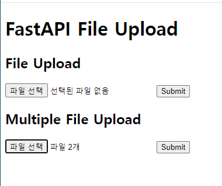
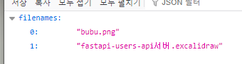
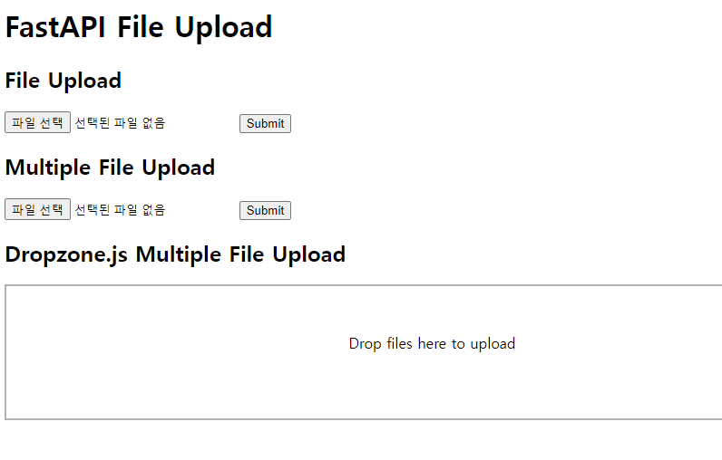
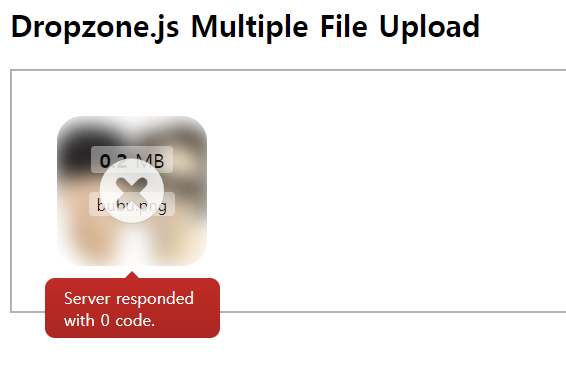
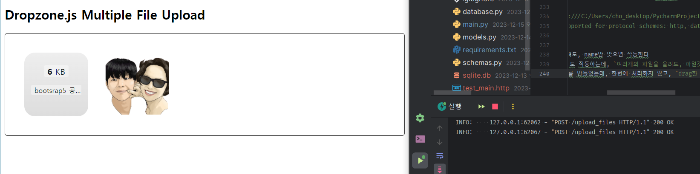
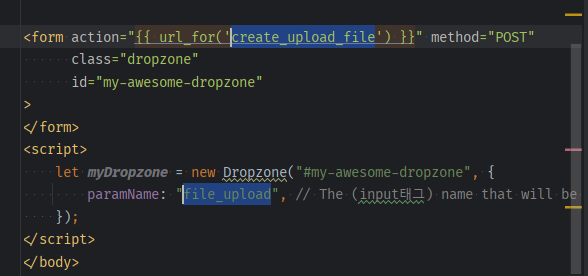
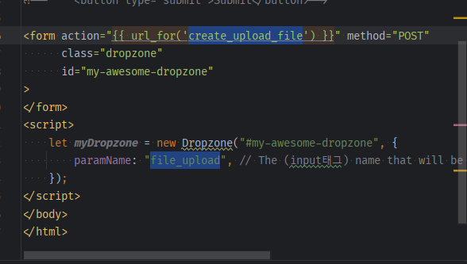

- 참고유튜브: https://www.youtube.com/watch?v=FFZdw7pn8OM&list=PL-2EBeDYMIbSppj2GYHnvpZ9W69qmkInS&index=6

### 기본 HTML -> 1개 파일 받기
1. fastapi 문서에서 [`Request Files`](https://fastapi.tiangolo.com/tutorial/request-files/?h=request+files) 살펴보기
    - 2개의 endpoint를 비교한다.
    - 원래는 typing의 Annotated[] 안에 raw bytes와 fastapi File()객체 2개를 받을 수 있게 file 파라미터를 구성한다.
    - **하지만 fastapi에서 제공해주는 `UploadFile` 모듈을 inject하면 장점이 많다고 서술되어있음**
        - .filename
        - .content_type
        - .file 등등

    - 우리는 `Multiple File Uploads`를 살펴본다.


2. **여러개의 파일을 올리기 위해선 `python-multipart`패키지를 필수로 설치해야한다고 한다.**
    - `pip install python-multipart`

3. post로 route를 작성하되, 파라미터로 `UploadFile`을 사용한다.
    - 문서의 예시로서, file이름만 dict로 반환한다.
    ```python
    @app.post('/upload_file')
    async def create_upload_file(file: UploadFile):
        return {'filename': file.filename}
    ```
   
4. `/templates/upload_file/index.html`로 view를 작성한다.
    - html:5로 시작하고
    - form태그를 `form[method="POST"]`로 작성을 시작하며 action에는 url_for로 route를 넣어주고, **첨부파일form으로서 `enctype="multipart/form-data"`를 넣어준다**
    - form내부에는 input[type="file"]을 넣고 **name=""을 백엔드에서 받을 `file_upload`정도로 넣어준다**
        - **라우트의 `UploadFile 모듈`을 이용한 `파라미터 이름`이 바로 `input[type="file"]태그의 name`과 일치해야한다.**
    - 이후 button[type="submit"]을 넣어준다.
    ```html
    <form action="{{ url_for('create_upload_file') }}" method="POST"
          enctype="multipart/form-data">
        <input type="file" name="file_upload"/>
        <button type="submit">Submit</button>
    </form>
    ```
    ```python
    @app.post('/upload_file')
    async def create_upload_file(file_upload: UploadFile):
        # UploadFile의 파라미터명 => input[type="file"]의 name과 일치해야한다!!!
        
        return {'filename': file_upload.filename}
    
    ```
   
5. form을 가진 html을 렌더링한다.
    ```python
    @app.get('/upload_file')
    async def upload_file(request: Request):
        context = {'request': request}
        return templates.TemplateResponse("upload_file/index.html", context)
    ```
    

6. **이제 upload할 dir 지정등의 작업을 해야한다.**
    - main.py에 `UPLOAD_DIR` 상수를 pathlib으로 `uploads`로 지정해주고, 루트에 `uploads`폴더를 만든다.
    ```python
    UPLOAD_DIR = pathlib.Path() / 'uploads'
    ```
    - real application에서는 S3로 바꿔야한다.
    - file_upload파라미터에서 `.read()`함수를 data로 받는데, 비동기함수라 `await`로 기다렸다가 진행한다.
    - **`저장경로(UPLOAD_DIR) / 파일명(file_upload.filename)`를 합쳐서 `with open( save_to, 'wb')`의 bytes로 `read한 data`를 write해야한다**
    ```python
    @app.post('/upload_file')
    async def create_upload_file(file_upload: UploadFile):
        # UploadFile의 파라미터명 => input[type="file"]의 name과 일치해야한다!!!
    
        data = await file_upload.read()
    
        save_to = UPLOAD_DIR / file_upload.filename
        with open(save_to, 'wb') as f:
            f.write(data)
    
        return {'filename': file_upload.filename}
    
    ```
   - 테스트해보면, uploads폴더에 파일이 잘 저장되고, filename이 응답된다.
   - **만약, 파일이 없을 수도 있다면, `파라미터에 기본값 = None`을 줘놓고, 내부에서 `if not file`로 예외처리해줘야한다.**
    ```python
    @app.post('/upload_file')
    async def create_upload_file(file_upload: Union[UploadFile, None] = None):
        # UploadFile의 파라미터명 => input[type="file"]의 name과 일치해야한다!!!
        
        # 파일이 없는 경우 예외처리
        if not file_upload:
            return {'message': 'No file sent'}
    
        data = await file_upload.read()
    
        save_to = UPLOAD_DIR / file_upload.filename
        with open(save_to, 'wb') as f:
            f.write(data)
    
        return {'filename': file_upload.filename}
    
    ```

### 추가) Preview by #id를 가진 img태그를 두고, type file input의 onchange 속성을 이용
```html
<form action="{{ url_for('create_upload_file') }}" method="POST"
      enctype="multipart/form-data">
    <input type="file" name="file_upload"
            onchange="document.getElementById('blah').src = window.URL.createObjectURL(this.files[0])"
    />
    <button type="submit">Submit</button>
    
</form>
```

### 여러 파일 받기 -> 단일upload의 backend -> view 순서로 수정
- [문서](https://fastapi.tiangolo.com/tutorial/request-files/?h=request+files#multiple-file-uploads)를 보면, `list[UploadFile]`로 받을 수 있다고 한다.
1. route도 `upload_files`로 추가하자
   - 파라미터도, None이 필요없다 빈 list가 될 것이며 `list[]`로 UploadFile 모듈을 감싸주면 된다.
       ```python
       @app.post('/upload_files')
       async def create_upload_files(file_uploads: list[UploadFile]):
           #...
       ```
   - 기존 파일 처리를 `for문`을 돌면서 1개씩 저장하도록 변경한다.
   - 파일이름 1개 반환을 list comp로 list로 반환하게 한다.
    ```python
    @app.post('/upload_files')
    async def create_upload_files(file_uploads: list[UploadFile]):
        # UploadFile의 파라미터명 => input[type="file"]의 name과 일치해야한다!!!
    
        # 파일이 없는 경우 예외처리
        if not file_uploads:
            return {'message': 'No file sent'}
    
        # for문 추가 for multiple files(file_uploadssss)
        for file_upload in file_uploads:
            data = await file_upload.read()
    
            save_to = UPLOAD_DIR / file_upload.filename
            with open(save_to, 'wb') as f:
                f.write(data)
        
        # list comp로 변경 for multiple files
        return {'filenames': [file_upload.filename for file_upload in file_uploads]}
    ```
   

2. **이제 view와 연결되었던 UploadFile 파라미터명이 `s`추가되어 바뀌었으니, input[type="file"]의 name도 변경해주자.**
    - Multiple File Upload로 form을 추가했다. 
    - `url_for`의 주소와, `input[type="file"]의 name`을 바꿔준다.
    - **또한, `input[type="file"]에 multiple` 속성을 추가해줘야한다!**
        ```html
        <input type="file" name="file_uploads" multiple/>
        ```
    ```html
    <h2>Multiple File Upload</h2>
    <form action="{{ url_for('create_upload_files') }}" method="POST"
          enctype="multipart/form-data">
        <input type="file" name="file_uploads" multiple/>
        <button type="submit">Submit</button>
    </form>
    ```
    
    


### dropzone.js 반영하기
1. [dropzone.js installation 검색 > stand-alone file](https://docs.dropzone.dev/getting-started/installation/stand-alone)를 사용한다.
    - 복사해서 index.html에 붙혀준다.
    - 5버전을 사용한다
    ```html
    <script src="https://unpkg.com/dropzone@5/dist/min/dropzone.min.js"></script>
    <link rel="stylesheet" href="https://unpkg.com/dropzone@5/dist/min/dropzone.min.css" type="text/css" />
    ```
   
2. setup페이지를 참고해서 `form을 변형`한다.
    - **`class="dropzone"`을 추가하고, `id=""`도 준다.**
    - **`enctype="multipart/form-data"을 삭제`한다. dropzone에서 알아서 처리해주나보다.**
    - **`input태그와 submit버튼 또한 삭제`한다. dropzone에 위임**
    ```html
    <h2>Dropzone.js Multiple File Upload</h2>
    <!-- 1) id와 class="dropzone"이 추가된다.-->
    <!-- 2) enctype="multipart/form-data" 삭제한다. dropzone이 알아서 처리하게 한다-->
    <!-- 3) input태그와 submit버튼 또한 삭제한다. dropzone에 위임-->
    
    <!--    <input type="file" name="file_uploads" multiple/>-->
    <!--    <button type="submit">Submit</button>-->
    
    <form action="{{ url_for('create_upload_files') }}" method="POST"
          class="dropzone"
          id="my-awesome-dropzone"
    >
    ```
    

3. 이제 Imperative를 보고 js configuration을 한다.
    - script태그안에 설정을 복사해놓고
    - **이미 form action에 url이 적혀있다면, 예시와 달리 `{}`로 빈 url 정보를 입력한다**
    ```html
    let myDropzone = new Dropzone("#my-awesome-dropzone", {});
    ```
   
4. **현재 input[type="file"]태그를 지웠기 때문에, name전달을 해줘야하는데, 설정이 없다.**
    - 다시 Declarative로 돌아가서 보면, 기본적으로`name="file"`이라고 되어있으며, **다른name을 쓸 경우, option `paramName`을 configure에서 사용하라고 한다.**
      - `If you want another name than file you can configure Dropzone with the option paramName` 
    - script태그에 적어둔 설정에서 옵션 `paramName`을 추가하고, `file_uploads`로 설정한다.
    ```html
    <script>
        let myDropzone = new Dropzone("#my-awesome-dropzone", {
            paramName: "file_uploads", // The (input태그) name that will be used to transfer the file
        });
    </script>
    ```
    
    - **드랍존은 `drag하자마자 바로 업로드부터 내부 ajax`를 통해 요청된다.**
    

5. **fastapi의 localhost, 127.0.0.1이 아닌 `해당 html을 윈도우에서 열어 -> 외부 접근`을 만들면 CORS 에러로 인해 아래와 같이 나온다.**
    
    
    - **cors middleware를 설정하여, `ajax request를 통한  submit`이 가능하도록, 먼저 설정한다**
    - fastapi문서의CORS 파트를 가보면,
      - origin : 프로토콜 + 도메인 + port의 조합인데, 1개라도 달라지면 `cross origin`이다.
      - `Use CORSMiddleware`메뉴로 가서 사용법을 확인하여 적용한다.
      - 예제에서는 origin을 list로 몇개를 추가했지만 편리성을 위해 `['*']`로 바꿔서 적용한다.

    ```python
    app = FastAPI(lifespan=lifespan)
    
    origins = [
        "http://localhost.tiangolo.com",
        "https://localhost.tiangolo.com",
        "http://localhost",
        "http://localhost:8080",
    ]
    app.add_middleware(
        CORSMiddleware,
        # allow_origins=origins,
        allow_origins=["*"],
        allow_credentials=True,
        allow_methods=["*"],
        allow_headers=["*"],
    )
    ```
   
6. **이제 다시 `직접 연 index.html`로 드랍존을 통해 파일을 업로드하면, `파일이름`이 응답된다.**
    - **이상하게도,` 직접 연 index.html의 프로토콜이 cors 정책에 위반`된다면서 안됨.**    
    ```
    Access to XMLHttpRequest at 'file:///C:/Users/cho_desktop/PycharmProjects/htmx/templates/upload_file/%7B%7B%20url_for('create_upload_files')%20%7D%7D' from origin 'null' has been blocked by CORS policy:
    Cross origin requests are only supported for protocol schemes: http, data, isolated-app, chrome-extension, chrome, https, chrome-untrusted.
    ```
   
7. dropzone은, 1개파일 업로드 route를 가져도, name만 맞으면 작동한다
    - **파라미터가 s가 빠진 file_upload여도 작동하는데, `여러개의 파일을 올려도, 파일갯수만큼 route를 비동기호출 즉시 처리`된다.**
    - 예를 들어, `file_uploads`로 route를 만들었는데, 한번에 처리하지 않고, `drag한 파일갯수만큼 route를 호출해서 1개씩 `처리
        - 파일을 한번에 2개를 drag했으면, 2번 route를 호출하니, multiple file upload route가 필요가 없다.
        
    


8. **그렇다면, dropzone.js로 여러개 파일을 1번씩 비동기호출로 업로드할 땐, `파일1개 업로드 route`로만 작성해서 처리하면 된다.**
    
    ```html
    <!-- 4) 사실상 파일갯수만큼, route를 비동기호출(ajax)하므로, 파일1개 업로드 route만 호출하면 된다.-->
    <form action="{{ url_for('create_upload_file') }}" method="POST"
          class="dropzone"
          id="my-awesome-dropzone"
    >
    </form>
    <script>
        let myDropzone = new Dropzone("#my-awesome-dropzone", {
            paramName: "file_upload", // The (input[type="file"태그의) name -> fastapi UploadFile 파라미터와 일치해야함.
        });
    </script>
    ```
   

9. 추후 `aiofiles`패키지를 사용하면, 더 빠른 파일 저장 등이 된다고 한다.