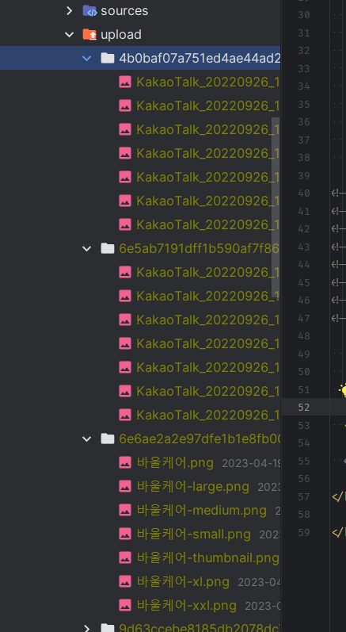

### 기존 업로드 유틸 정리

#### sqlalchemy_2022 - directory_name + file로 -> 전체 업로드경로 + 새 파일명 얻어 db field에 저장 + download해서 보여주기
1. directory_name을 주면, `UPLOAD_DIR` 이후, UPLOAD_DIR과 연결되는 path를 생성하는데, `하위폴더를 생성`을 보장한 `전체 directory경로를 생성`한다
    ```python
    def get_upload_file_path(directory_name, UPLOAD_DIR=None):
        if not UPLOAD_DIR:
            # project_config.UPLOAD_FOLDER 
            UPLOAD_DIR = pathlib.Path() / 'uploads'
   
        file_path = UPLOAD_DIR / f'{directory_name}'
        if not os.path.exists(file_path):
            os.makedirs(file_path, exist_ok=True)
   
        return file_path
    ```
   
2. **injection가능한 파일명 -> `확장자`만 추출 + `uuid4를 통해 파일명생성`한 새로운 filename을 생성한다**
    - fastapi에서는 secure_filename이 없어서, 필터링 없이 바로 uuid4 + 확장자로 생성한다
    ```python
    def get_updated_filename(file):
        # 3-1) filename에 실행파일 등이 존재할 수 있으므로, secure_filename메서드를 이용해 한번 필터링 받는다
        # filename = secure_filename(f.filename)
        # print(f"filename>>> {secure_filename(f.filename)}")
        # 3-2) filename을 os.path.split  ext()를 이용하여, 경로 vs 확장자만 분리한 뒤, ex> (name, .jpg)
        #      list()로 변환한다.
        _, ext = os.path.splitext(file.filename)
        # print(f"name, ext>>> {_, ext}")
        # 3-3) name부분만 uuid.uuid4()로 덮어쓴 뒤, 변환된 filename을 반환한다
        # https://dpdpwl.tistory.com/77
        # -> uuid로 생성된 랜덤에는 하이픈이 개입되어있는데 split으로 제거한 뒤 합친다. -> replace로 처리하자
        filename = str(uuid.uuid4()).replace('-', '') + ext
        # print(f"uuid + ext>>> {filename}")
        return filename
    ```
   
3. UPLOAD_DIR와 연결된 `directory_name`의 경로 + `uuid4로 바꾼 파일명`을 이용하여 `경로 / 파일명`의 전체경로 + `uuid4파일명`을 tuple로 반환해준다.
    ```python
    def get_upload_filepath_and_filename(directory_name, file):
        # 2) 개별 directory 이름 -> uploads폴더와 연결한 뒤, 디렉토리가 없으면 생성하고, 경로를 반환받는다.
        file_path = get_upload_file_path(directory_name)
        # 3) file(file객체)를 입력받아, db저장용 filename으로 변경한다.
        updated_filename = get_updated_filename(file)
        # 4) file_paht + filename  및  단독 filename 2개를 tuple로 return한다.
        #  file save용 전체경로(개별폴더경로까지) + 변경filename ,   변경filename만
        # print("업로드된 파일>>>", file_path / filename)
        upload_filepath = file_path / filename
        return upload_filepath, updated_filename
    
    ```
   
4. 이제 로직에서, 원하는 디렉토리명, 받은 file을 입력해주면 tuple로 `업로드된 경로, 바뀐파일명`을 받을 수 있다.
    ```python
    avatar_file = data.get('avatar')
    upload_filepath, updated_filename = upload_file_path(directory_name='avatar', file=avatar_file)
    # 1) 원본data를 updated_filename를 내포한 upload_filepath로 저장하고
    avatar_file.save(upload_filepath)
    # 2) db에는 directory_name / updated_filename로 저장한다.
    data['avatar'] = f'avatar/{filename}'
    
    result, msg = User.create(**data)
    ```
   

5. view에서는, user.avatar(static_img_url)가 채워져있을 경우, url_for로 src경로를 입력한다
    - **그 전에, url_for로 접근할 수 있게 route 등록을 해놔야한다. flask용**
    ```python
    def download_file(filename):
        return send_from_directory(project_config.UPLOAD_FOLDER, filename)
    ```
    ```html
    
    <figure class="image is-48x48">
        
    </figure>
        
    ```
   
6. ajax등으로 바로 업로드 후, 파일을 볼 수 있는 경로를 url_for로 백엔드에서 만들어, dict -> json으로 전달 할 수 있다.
    ```python
    @util_bp.route('/upload/<path:directory_name>', methods=['POST'])
    @login_required
    def upload(directory_name):
        if request.method == 'POST':
            # 2. 파일객체는 new FormData()객체 속 'upload'로 append했는데
            # -> request.files.get('upload')로 받아낼 수 있다.
            f = request.files.get('upload')
            # 3. file객체를 .read()로 내용물을 읽고 file size를 젠 뒤
            # -> file객체의 읽은 위치를 다시 처음으로 초기화해놓는다.(읽고 커서가 뒤로 갔지만, 다시 원위치
            file_size = len(f.read())
            f.seek(0)
            # 4. 업로드 파일 사이즈를 체크한다. form에서는 validators= [FileSize(max_size=2048000))]으로 해결
            # -> 사이즈가 넘어가면 alert를 띄울 수있게 message를 같이 전달한다.
            if file_size > 2048000:
                return {
                    'code': 'err',
                    'message': '파일크기가 2M를 넘을 수 없습니다.'
                }
            # 5. upload유틸을 이용해서, '/uploads/`폴더에 붙을 '개별디렉토리', file객체를 넣어주면
            # -> save할 path와 filename이 주어진다.
            # -> 그렇다면, front에서 upload할 개별디렉토리도 보내줘야한다?!
            upload_path, filename = upload_file_path(directory_name=directory_name, file=f)
            # print(upload_path, filename)
            # C:\Users\is2js\pythonProject\2022_sqlalchemy\uploads\post\28d12f83306f4bf6984c9b6bcef7dda5.png 28d12f83306f4bf6984c9b6bcef7dda5.png
    
            # 6. 저장 후 ok return 시  jsonify없이 그냥 dict로 반환한다?
            # -> 반환시 view에서 볼 img저장경로를 넘겨줘야, 거기서 표시할 수 있을 것이다.
            f.save(upload_path)
            # print(url_for('download_file', filename=f'{directory_name}/{filename}'))
            # /uploads/post/862e406dd33a48b6aed55e64e68586ff.png
    
            return {
                'code': 'ok',
                # 'url': f'/uploads/{directory_name}/{filename}',
                'url': url_for('download_file', filename=f'{directory_name}/{filename}'),
            }
    
    ```
7. **article 생성 form html에서는 axios()를 통해, 미리보기를 수행했었다?!**
    ```html
    
    
    
    
    <!-- selectize css & jquery -> js   -->
    <link rel="stylesheet" href="https://cdnjs.cloudflare.com/ajax/libs/selectize.js/0.12.1/css/selectize.min.css">
    <script src="https://code.jquery.com/jquery-2.2.4.min.js"></script>
    <script src="https://cdnjs.cloudflare.com/ajax/libs/selectize.js/0.12.1/js/standalone/selectize.min.js"></script>
    
    <!--quill css & axios js-->
    <link href="https://cdn.quilljs.com/1.3.6/quill.snow.css" rel="stylesheet"/>
    <!--<script src="https://unpkg.com/axios/dist/axios.min.js"></script>-->
    <script src="{{url_for('static', filename='js/axios.min.js')}}"></script>
    
    
    
    
    <!-- select 화면에서 우측상단 버튼들(add) 제거-->
    
    
    
    
    <form action="" method="post" class="mt-4">
        {{ form.csrf_token }}
        <div class="field">
            {{ form.title.label(class='label') }}
            <div class="control">
                {{ form.title(class='input', placeholder='Title') }}
            </div>
        </div>
        <div class="field">
            {{ form.desc.label(class='label') }}
            <div class="control">
                {{ form.desc(class='input', placeholder='Description') }}
            </div>
        </div>
    
        <div class="field">
            {{ form.category_id.label(class='label') }}
            <div class="control">
                <div class="select is-fullwidth">
                    {{ form.category_id }}
                </div>
            </div>
        </div>
    
        <div class="field">
            {{ form.content.label(class='label') }}
            <div class="control">
                <!-- form input 중에 textarea는 class='input' 대신 class='textarea' + rows=''를 준다.  -->
                {{ form.content(class='textarea', rows="10", placeholder='Contents') }}
                <!--  markdown적용할 필드의 form.필드 input태그아래에 rich editor를 위한 div개설-->
                <div id="editor" style="height: 500px;"></div>
            </div>
        </div>
    
        <div class="field">
            {{ form.tags.label(class='label') }}
            <div class="control">
                <div class="select is-fullwidth is-multiple">
                    <!-- <select id='tags'> 태그가 완성되는데, selecize에 의해 이쁘게 나오게 한다-->
                    {{ form.tags(size='5') }}
                </div>
            </div>
        </div>
    
        <!-- label+input을 한번에 올리려면 div.field 이외에 .is-horizontal을 class로 넣어줘야한다.   -->
        <div class="field is-horizontal">
            {{ form.has_type.label(class='label') }}
            <div class="field-body ml-4">
                <div class="control">
                    <!--  radio 필드는 input필드를 직접 구현해야 생성시 default 와 edit시 현재값이 checked를 확인할 수 있다.-->
                    
                    <input checked  type="radio"
                           id="{{ subfield.id }}" name="{{ form.has_type.id }}" value="{{ subfield.data }}">
                    {{ subfield.label }}
                    
                </div>
            </div>
        </div>
        <div class="is-block">
            <div class="box has-background-light is-shadowless level">
                <a href="" class="is-danger button level-left">다시 입력</a>
                <div class="level-right">
                    <a href="{{ url_for('admin.article') }}" class="button is-primary is-light mr-2">뒤로가기</a>
                    <input type="submit" value="생성" class=" button is-success">
                </div>
            </div>
        </div>
    
    </form>
    
    
    
    
    <!--selectize init -->
    <script>
        $(function () {
            // select태그를 selectize화 시켜서, tags들을 여러개 선택할 수 있게 한다.
            $('select#tags').selectize({
                plugins: ['remove_button'],
            });
        });
    </script>
    
    <!--quill js 추가(아마도 axios불러오고나서 해야되서?) -->
    <script src="https://cdn.quilljs.com/1.3.6/quill.js"></script>
    <!--<script src="https://cdn.quilljs.com/2.0.0-dev.3/quill.js"></script>-->
    
    
    <!--quill js 초기화 in vue block-->
    
    <script>
        var toolbarOptions = [
            ['bold', 'italic', 'underline', 'strike', 'link'],        // toggled buttons
            ['blockquote', 'code-block', 'image'],
    
            // [{ 'header': 1 }, { 'header': 2 }],               // custom button values
            [{'list': 'ordered'}, {'list': 'bullet'}],
            // [{ 'script': 'sub'}, { 'script': 'super' }],      // superscript/subscript
            [{'indent': '-1'}, {'indent': '+1'}],          // outdent/indent
            [{'direction': 'rtl'}],                         // text direction
    
            // [{ 'size': ['small', false, 'large', 'huge'] }],  // custom dropdown
            [{'header': [1, 2, 3, 4, 5, 6, false]}],
    
            [{'color': []}, {'background': []}],          // dropdown with defaults from theme
            [{'font': []}],
            [{'align': []}],
    
            // table 1 : https://dalezak.medium.com/using-tables-in-quill-js-with-rails-and-stimulus-ddd0521ab0cb
            // ['table', 'column-left', 'column-right', 'row-above', 'row-below', 'row-remove', 'column-remove'],
    
            ['clean']                                         // remove formatting button
        ];
        var quill = new Quill('#editor', {
            debug: 'info',
            modules: {
                toolbar: toolbarOptions,
                // table: true
            },
            theme: 'snow',
            placeholder: '내용을 작성해주세요.',
            readOnly: false,
            formats: {}
        })
    
        // 기존 내용을 주입하기 위해, html요소들 미리 변수화
        var html = quill.container.firstChild.innerHTML;
        var content = document.querySelector("textarea[name='content']");
    
        //7. 작동확인이 끝나서, 자동으로 채워지는 content는 display:none으로 돌린다
        content.setAttribute('style', 'display:none');
    
        // Listen to rich text and sync to the form
        quill.on('text-change', function (delta, oldDelta, source) {
            content.innerHTML = quill.container.firstChild.innerHTML;
        });
    
        // textarea[name='content']로 잡은 태그의 내용인.value로 quill에 집어넣기 by .pasteHTML
        quill.pasteHTML(content.value)
    
        // upload image를 위한 함수 선언
        var showImageUI = function () {
            // console.log('asdkjlfalsd')
            // 1. 애초에 file input태그가 존재하는지 받아본다. quill에서는 input class="ql-image" type="file"로 존재하나보다.
            var fileInput = this.container.querySelector('input.ql-image[type=file]')
            // console.log(fileInput)
            // 2. file input태그가 없으면 실시간 생성해야한다.
            if (fileInput == null) {
                // console.log("fileInput없다")
                fileInput = document.createElement('input');
                fileInput.setAttribute('type', 'file');
                fileInput.setAttribute('accept', 'image/png, image/gif, image/jpeg, image/jpeg, image/bmp, image/x-icon');
                fileInput.classList.add('ql-image');
            }
            // } else {
            //     console.log("fileInput있다")
            // }
            //3. fileInput태그에 change listener를 달아서
            // (1) fileinput에 든 files files[0]이 null이 아니라면,
            // (2) new Formdata()객체를 만들고
            // (3) fileinput에 있는 files[0]을 formdata에 'upload'이름으로 append하고
            // (4) axios()로 post요청을 보낸다. -> route완성전에는 log만 찍어본다.
            fileInput.addEventListener('change', function () {
                if (fileInput.files != null && fileInput.files[0] != null) {
    
                    const formData = new FormData();
                    formData.append('upload', fileInput.files[0]);
    
                    axios({
                        url: '{{ url_for("util.upload", directory_name="post") }}',
                        method: 'post',
                        data: formData,
                        headers: {'content-type': 'multipart/form-data'},
                    }).then(res => {
                        // 5. route 자체에서 파일크기제한으로 'code': 'err'가 올 수 있다.
                        if (res.data.code == 'err') {
                            alert(res.data.message)
                            return
                        }
                        // 6.  정상으로 이미지 url이 올경우, quill에서, 현재위치를 찾은 뒤, 넣고 다음칸으로
                        var curr = quill.getSelection(true);
                        quill.insertEmbed(curr.index, 'image', res.data.url);
                        quill.setSelection(curr.index + 1);
                    }).catch(err => {
                        console.log( err);
                    });
                }
            });
    
            // 8. 원본에는 동적생성한 코드를 quill에 append해주는데, 딱히, 업로드의 역할만 하는거라서 안해줘도 된다?
            // this.container.appendChild(fileInput);
            // 만약 해주면, 글 수정시 file input태그가 있는 것으로 인식될 것이다?
            // 기본 wtf form에서 내려주는 input태그가 아니므로 안찍히게 된다. => 생략
    
    
            // 4. fileINnput태그를 click()까지 해줘야 그림창이 열리고 -> change가 작동하게 된다.
            fileInput.click();
        };
    
        // pload image를 위한 handler 함수 추가
        var toolbar = quill.getModule('toolbar');
        toolbar.addHandler('image', showImageUI);
    
    </script>
    
    
    ```

8. 새롭게 저장한다면, 기존 파일을 filesystem에서 삭제하는 유틸도 만들어준다.
    ```python
    #### 추가: db.field에    /uploads/ 이후 값을 받아 파일이 존재하면 삭제한다.
    # -> 3.8부터는 Path.unlink()의 missing_ok가 가능한데, 직므 3.7이라서 os로 한다.
    # https://stackoverflow.com/questions/6996603/how-do-i-delete-a-file-or-folder-in-python
    def delete_uploaded_file(upload_file_path, UPLOAD_DIR=None):
        if not UPLOAD_DIR:
            # project_config.UPLOAD_FOLDER 
            UPLOAD_DIR = pathlib.Path() / 'uploads'
            
        # 애초에 avatar가 없다가 추가하는 경우, upload_file_path = user.avatar에는 
        # -> None으로 경로가 들어온다 미리  예외처리하여 종료
        if not upload_file_path:
            return
        # project_config.UPLOAD_FOLDER == '~/uploads/'까지의 경로
        file_path = UPLOAD_DIR / upload_file_path
        # file_paht == '~/uploads/' + 'avatar/uuid4.파일명'
        if os.path.isfile(file_path):
            os.remove(file_path)
        # Path(file_path).unlink(missing_ok=True) # python3.8부터
        print("삭제된 파일>>>", file_path)
    ```
    ```python
    avatar_file = user_data.get('avatar')
    
    avatar_path, filename = upload_file_path(directory_name='avatar', file=avatar_file)
    
    avatar_file.save(avatar_path)
    
    delete_uploaded_file(upload_file_path=user.avatar)
    user_data['avatar'] = f'avatar/{filename}'
    ```
   
#### rq - PIL을 이용한 resizing + queue -> static내부에 저장한 것을 반환하기
1. `static폴더 내부에 image폴더`를 만들어놓고, `언제든 접근가능`하게 한다.
2. `get`으로 오면 view_url=None 인 상태로 html을 render하는데 / form-`POST`로 들어올 경우, view_url=None을 채워주고 html을 render하게 되는 로직이다.
    - 여기서는 directory_name을 직접 입력안하고, secrets모듈로 랜덤생성하고
    - UPLOAD_DIR과 연결한 경로를 makedir까지 한 뒤,
    - 거기다가 원본 이미지를 저장해놓고 -> queue에 여러사이즈를 만들러 간다
    - os.path.splitext로 `원본이미지의 파일명 / 확장자`를 분리 한뒤, 들어온 `랜덤 directory` + `파일명만`을 가지고 view_url을 만들어 반환해준다.
    - 일회성인 듯. db에 경로를 저장안하므로, 끝나면 다시 회수는 힘든 상태인 것 같다.
    ```python
    @main_bp.route('/upload-image', methods=['GET', 'POST'])
    def upload_image():
        view_url = None
    
        if request.method == 'POST':
            # form이 넘어오면 처리한다.
            image = request.files['image']
            # 개별 디렉토리이름은 secrets 패키지로 익명으로 만든다.
            image_dir_name = secrets.token_hex(16)
    
            # 폴더 만들기 -> 여러 경로의 폴더를 이어서 만들 땐, os.makedirs( , exist_ok=True)로 한다
            image_dir_path = app.config['UPLOAD_FOLDER'].joinpath(image_dir_name)
            if not os.path.exists(image_dir_path):
                # os.mkdir(image_dir_path)
                os.makedirs(image_dir_path, exist_ok=True)
    
            # 파일객체(image)를 일단 local에 save한다.
            image.save(os.path.join(image_dir_path, image.filename))
    
            # queue에 폴더와 파일이름을 따로 넣어준다.
            queue.enqueue(create_image_set, image_dir_path, image.filename)
    
            # queue에 넘겼으면, flash를 띄워서 마무리한다
            flash('Image uploaded and sent for resizing', 'success')
    
            # view_url에는 확장자를 뺀 이미지 name만 들어가게 해야한다.
            image_file_name, image_ext = os.path.splitext(image.filename)
            view_url = f'/image/{image_dir_name}/{image_file_name}'
    
        return render_template('upload_image.html', view_url=view_url)
    ```
    ```html
    <!doctype html>
    <html lang="en">
    
    <head>
        <!-- Required meta tags -->
        <meta charset="utf-8">
        <meta name="viewport" content="width=device-width, initial-scale=1, shrink-to-fit=no">
    
        <!-- Bootstrap CSS -->
        <link rel="stylesheet" href="https://stackpath.bootstrapcdn.com/bootstrap/4.3.1/css/bootstrap.min.css"
              integrity="sha384-ggOyR0iXCbMQv3Xipma34MD+dH/1fQ784/j6cY/iJTQUOhcWr7x9JvoRxT2MZw1T" crossorigin="anonymous">
    
        <title>Upload image</title>
    </head>
    
    <body>
    
    <div class="container">
        
        
        
        <div class="alert alert-{{ category }} alert-dismissible fade show mt-3" role="alert">
            {{ message }}
            <button type="button" class="close" data-dismiss="alert" aria-label="Close">
                <span aria-hidden="true">&times;</span>
            </button>
        </div>
        
        
        
        <div class="row">
            <div class="col">
                <div class="mb-3 mt-3">
    
                    <h2 class="mb-3" style="font-weight: 300">Upload image</h2>
    
                    <form action="/upload-image" method="POST" enctype="multipart/form-data" class="mb-3">
                        <div class="form-group mb-3">
                            <div class="custom-file">
                                <input type="file" class="custom-file-input" name="image" id="image">
                                <label id="file_input_label" class="custom-file-label" for="image">Select file</label>
                                <small class="text-muted">Images should be 2560px x 1440px and not contain a dot in the
                                    filename</small>
                            </div>
                        </div>
    
                        <button type="submit" class="btn btn-primary">Upload</button>
                    </form>
    
                    
                    <a href="{{ view_url }}" class="mt-3">View image</a>
                    
    
                </div>
            </div>
        </div>
    </div>
    
    <!-- import bootstrap JS here -->
    
    </body>
    
    </html>
    ```
3. queue에서 돌아가는, image_set(사이즈별 이미지) 생성 로직
    - **dict로 size string별 tuple로 x,y 사이즈를 저장해놓고**
    - PIL의 image모듈.open()으로 이미지를 객체화한 뒤
    - 이미지의 파일명 + 확장자를 분리한 상태에서, size dict를 items()로 순회하며 
    - image객체.copy() -> 카피된image객체.thumnail( size tupe )로 inplace변화 -> .save()에 분리된 파일명-size를 붙인 뒤 확장자와 같이 저장한다
    - 각 size별 result를 dict()에 담아서 결과를반환해준다.
    ```python
    #### CREATE IMAGE SET ####
    import os
    
    from PIL import Image
    import time
    
    
    def create_image_set(image_dir, image_name):
        start = time.time()
    
        # 각 최소 px 사이즈를 미리 정해놓는다.
        size_map = dict(
            thumbnail=(35, 35),
            small=(540, 540),
            medium=(768, 768),
            large=(992, 992),
            xl=(1200, 1200),
            xxl=(1400, 1400),
        )
    
        # file -> image객체를 만든다.
        image = Image.open(os.path.join(image_dir, image_name))
    
        # 각 save 전 이름 뒤에 "-size"를 적어줘야하기 때문에 ext(확장자)이름을 미리 빼놓는다.
        # image_ext = image_name.split('.')[-1]
        # -> image_ext에는 .png처럼 dot이 맨앞에 포함되어있다.
        image_name, image_ext = os.path.splitext(image_name)
    
        # 각 image객체를 사이즈별ㄹ .copy()부터 한 뒤, .thumbnail()메서드로 resize 후 .save()까지 한다.
        # thumbnail_image = image.copy()
        # thumbnail_image.thumbnail(size_map['thumbnail'], Image.LANCZOS)  # replace함수
        # thumbnail_image.save(f'{os.path.join(image_dir, image_name)}-thumbnail.{image_ext}',
        #                      optimize=True, quality=95)
    
        result = dict()
    
        for size_name, size in size_map.items():
            copied_image = image.copy()
            copied_image.thumbnail(size, Image.LANCZOS)  # replace함수
            copied_image.save(f'{os.path.join(image_dir, image_name)}-{size_name}{image_ext}',
                              optimize=True, quality=95)
    
            result[size_name] = f'{os.path.join(image_dir, image_name)}-{size_name}{image_ext}'
    
        end = time.time()
    
        time_elapsed = end - start
    
        print(f'Task complete in: {time_elapsed}')
    
        return result
    ```
    
4. view_url이 들어간 POST-이미저장 후 html렌더링됬다면, `view_url로 가는 a태그` + view_image route가 있다.
    ```html
    
    <a href="{{ view_url }}" class="mt-3">View image</a>
    
    ```
    - 해당 a태그를 클릭하면, `view_url = f'/image/{image_dir_name}/{image_file_name}'`로서 view_image route에 접근하여 view_image.html에서 `size별 모든 사진`이 보여진다.
    ```python
    @main_bp.route('/image/<image_dir_name>/<image_file_name>')
    def view_image(image_dir_name, image_file_name):
        return render_template('view_image.html', image_dir_name=image_dir_name, image_file_name=image_file_name)
    ```
    ```html
    <!doctype html>
    <html lang="en">
    
    <head>
      <!-- Required meta tags -->
      <meta charset="utf-8">
      <meta name="viewport" content="width=device-width, initial-scale=1, shrink-to-fit=no">
    
      <!-- Bootstrap CSS -->
      <link rel="stylesheet" href="https://stackpath.bootstrapcdn.com/bootstrap/4.3.1/css/bootstrap.min.css" integrity="sha384-ggOyR0iXCbMQv3Xipma34MD+dH/1fQ784/j6cY/iJTQUOhcWr7x9JvoRxT2MZw1T" crossorigin="anonymous">
    
      <title>View image</title>
    </head>
    
    <body>
    
      <main>
    
        <div class="container mt-3">
          <div class="row">
            <div class="col">
    
              <picture>
                <!-- thumbnail -->
                <source class="img-fluid" srcset="/static/image/upload/{{image_dir_name}}/{{image_file_name}}-thumbnail.png" media="(max-width: 35px)">
                <!-- small -->
                <source class="img-fluid" srcset="/static/image/upload/{{image_dir_name}}/{{image_file_name}}-small.png" media="(max-width: 540px)">
                <!-- medium -->
                <source class="img-fluid" srcset="/static/image/upload/{{image_dir_name}}/{{image_file_name}}-medium.png" media="(max-width: 768px)">
                <!-- large -->
                <source class="img-fluid" srcset="/static/image/upload/{{image_dir_name}}/{{image_file_name}}-large.png" media="(max-width: 992px)">
                <!-- xl -->
                <source class="img-fluid" srcset="/static/image/upload/{{image_dir_name}}/{{image_file_name}}-xl.png" media="(max-width: 1200px)">
                <!-- xxl -->
                <source class="img-fluid" srcset="/static/image/upload/{{image_dir_name}}/{{image_file_name}}-xxl.png" media="(max-width: 1400px)">
                <!-- original -->
                
              </picture>
    
            </div>
          </div>
        </div>
    
      </main>
    
      <!-- Import bootstrap JS here -->
    
    </body>
    
    </html>
    ```


#### 