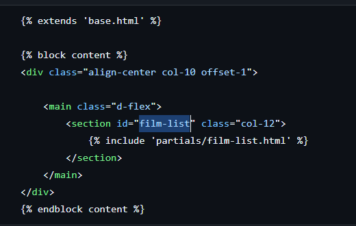
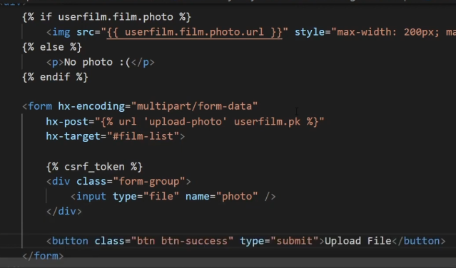
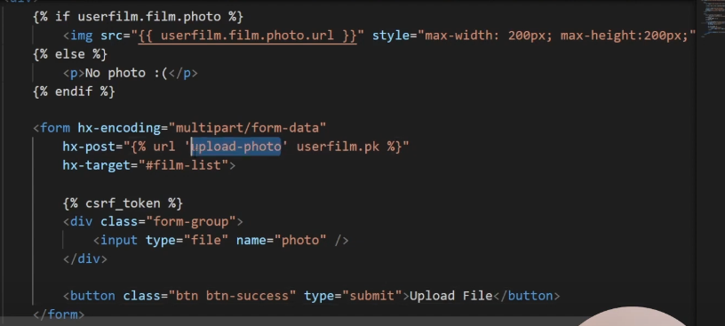
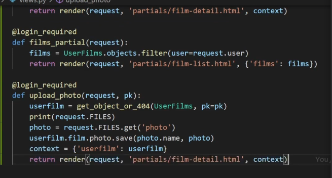
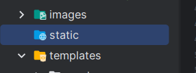
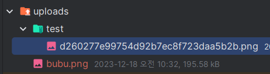
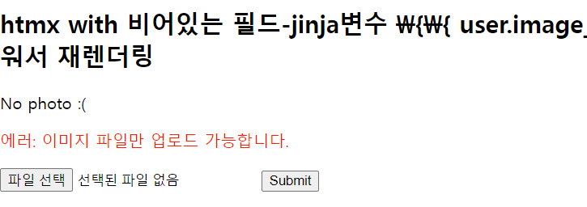

### django 참고

- django - 이미지저장후, jinja로 img태그를 채운 뒤, get화면 그대로
  redner : https://www.youtube.com/watch?v=flqSOdo51tI&list=PL-2EBeDYMIbRByZ8GXhcnQSuv2dog4JxY&index=8


1. root에 static폴더를 생성하고, 사용될 수 있도록 app에 등록한다.
    ```python
    # static
    static_directory = Path(__file__).resolve().parent / 'static'
    app.mount('/static', StaticFiles(directory=static_directory), name='static')
    ```
2. sqalchemy model이 존재한다면, db의 image필드에 경로를 저장할 수 있게 한다.
    - 장고버전
    - 

3. `pip list`로 Pillow 설치를 확인하고 없으면 설치한다.
    - **추가로, 현재 `#film-list`라는 부모element(index.html)에서 자리를 비워두고, 새로고침없이 바뀔 부분을 `partials를 include`한 상태이며, upload후,
      include된 partials를 재렌더링 해줄 예정이다.**
    - 이 때, 재 렌더링되는 부분에는 img src에 들어갈 필드 img_url이 채워져서 partials 렌더링이 될 것이다.
      

4. view에서 `이미지업로드 form의 미리보기`부터 생성한다
    - image필드를 `jif else`로 존재하진 않은 상태여서, 비워두고 else부분부터 `No photo :(`의 텍스트를 미리 채워둔다.
    - 있다면, static폴더를 타고가서 사용하게 한다
    - static이 아니라면, 따로 route를 만들어야한다.
    - 장고버전
      

5. **upload form에 대해서, `htmx`를 아래와 같이 적용시킨다.
    - form의 `enctype="multipart/form-data"` 속성 => `hx-encoding="multipart/form-data"`로 변경
    - form의 `method="POST"` 속성 => `hx-post`로 변경 + 해당model의 pk를 같이전달하여, 조회->필드값으로 넣을 준비
    - hx-target을 부모로??
    - input[type="file"]의 name을 맞춰서 넣어주기
    - submit 버튼
    - 장고의 경우, 을 넣어줘야한다.
      


6. db field의 if else여부로 미리보기가 표시된다면,
    - 사실상 미리보기가 아님 -> route에서는 get처럼, post처리(필드에 담음) -> None이었던 user.이미지필드가 채워지는  `get과 동일한 화면 렌더링`을 htmx로 부분만 다시 수행
      

### fastapi에 적용하기

#### static 설정 및 form을 htmx로 변경하기

1. static 폴더 설정이 안되어있다면, 루트에 `static`폴더를 생성하고, main.py에서 해준다.
    - static 폴더세팅이 되어있어야 -> file-system에 upload한 이미지를 보여줄 수 있다.
    ```python
    templates = Jinja2Templates(directory="templates")
    # static_directory = pathlib.Path(__file__).resolve().parent / 'static'
    app.mount('/static', StaticFiles(directory='static'), name='static')
    ```
   

2. 재 렌더링 될 부분(여기선 form, 나중엔 form을 포함한 부분페이지) 의 부모에 id를 정해놓고,
    ```html
    <!-- htmx -->
    <script src="https://unpkg.com/htmx.org@1.6.1"
            integrity="sha384-tvG/2mnCFmGQzYC1Oh3qxQ7CkQ9kMzYjWZSNtrRZygHPDDqottzEJsqS4oUVodhW" crossorigin="anonymous">
    </script>
    <script>
        htmx.config.useTemplateFragments = true; // table row 조작을 위한 설정
        // 없으면 htmx-swap 에러가 남 : htmx.org@1.6.1:1 Uncaught TypeError: e.querySelectorAll is not a function
    </script>
    ```
    ```html
    <h2>htmx with 비어있는 user.image_url을 채워서 재렌더링</h2>
    <div id="hx-upload-form">
        <form action="{{ url_for('create_upload_file') }}" method="POST"
              enctype="multipart/form-data">
            <input type="file" name="file_upload"/>
            <button type="submit">Submit</button>
        </form>
    </div>
    ```
3. hxtm문법으로 수정한 뒤, post전달이 제대로 되는지 확인한다.
    - 현재 route는 파일명을 return하는데, partials로 필요함을 느낀다.
    - form의 `enctype="multipart/form-data"` 속성 => `hx-encoding="multipart/form-data"`로 변경
    - form의 `method="POST"` 속성 => `hx-post`로 변경
    - hx-target을 form + 미리보기를 포함한 부모id로 지정
    - input[type="file"]의 route의 name을 맞춰서 넣어주기
    - submit 버튼
    ```html
    <div id="hx-upload-form">
        <form hx-post="{{ url_for('create_upload_file') }}"
              hx-encoding="multipart/form-data"
              hx-target="#hx-upload-form"
        >
            <input type="file" name="file_upload"/>
            <button type="submit">Submit</button>
        </form>
    </div>
    ```
4. route를 파일1개 업로드 route에서 이름을 `hx-`를 넣어 변경하여 새로 판다.
    - **이 때, template reponse를 하기 위해선 `request`객체가 필수로 context에 들어가야한다**
    ```python
    @app.post('/hx-upload-file')
    async def hx_upload_file(request: Request, file_upload: Union[UploadFile, None] = None):
        # UploadFile의 파라미터명 => input[type="file"]의 name과 일치해야한다!!!
    
        # 파일이 없는 경우 예외처리
        if not file_upload:
            return {'message': 'No file sent'}
    
        data = await file_upload.read()
    
        save_to = UPLOAD_DIR / file_upload.filename
        with open(save_to, 'wb') as f:
            f.write(data)
    
        # return {'filename': file_upload.filename}
        context = {'request': request}
        return templates.TemplateResponse("upload_file/partials/upload-form.html", context)

    ```

5. 이제 paritals로 빼서, 최초렌더링시 include + form제출시에도 render되도록 한다
    - 아직 미리보기를 위한 img태그는 없다.
    ```html
    <h2>htmx with 비어있는 필드-jinja변수 \{\{ user.image_url \}\}을 채워서 재렌더링</h2>
    <div id="hx-upload-form">
        
    </div>
    ```

#### 유틸 모듈 적용하여, 원하는 경로에 저장하기

1. utils.py를 생성한 뒤, 파일명을 제외한 directory_name을 받아서, upload폴더와 연결된 디렉토리를 생성할 수 있게 한다.
    - 이 때, 파일명은 uuid4를 이용해서 변경한 것으로 업로드하게한다.
    ```python
    import os
    import pathlib
    import uuid
    
    
    def _make_dir(file_path):
        if not os.path.exists(file_path):
            os.makedirs(file_path, exist_ok=True)
    
    
    def make_dir_and_file_path(directory_name, UPLOAD_DIR=None):
        if not UPLOAD_DIR:
            # project_config.UPLOAD_FOLDER
            # TODO: upload폴더를 지정하지않으면, root의 uploads폴더를 생성하여 저장한다.
            UPLOAD_DIR = pathlib.Path() / 'uploads'
    
        file_path = UPLOAD_DIR / f'{directory_name}'
    
        _make_dir(file_path)
    
        return file_path
    
    
    def get_updated_file_name_by_uuid4(file):
        # filename을 os.path.split  ext()를 이용하여, 경로 vs 확장자만 분리한 뒤, ex> (name, .jpg)
        #      list()로 변환한다.
        _, ext = os.path.splitext(file.filename)
        # print(f"name, ext>>> {_, ext}")
        # 3-3) name부분만 uuid.uuid4()로 덮어쓴 뒤, 변환된 filename을 반환한다
        # https://dpdpwl.tistory.com/77
        # -> uuid로 생성된 랜덤에는 하이픈이 개입되어있는데 split으로 제거한 뒤 합친다. -> replace로 처리하자
        filename = str(uuid.uuid4()).replace('-', '') + ext
        # print(f"uuid + ext>>> {filename}")
        return filename
    
    ```


2. util을 사용하여, save_to를 변경한다.
    - 기존: uploads / 업로드 파일명
    - 변경: uploads / directory_name / uuid4 + 확장자
    ```python
    # save_to = UPLOAD_DIR / file_upload.filename
    file_path = make_dir_and_file_path('test', UPLOAD_DIR=UPLOAD_DIR)
    updated_file_name = get_updated_file_name_by_uuid4(file_upload)
    save_to = file_path / updated_file_name
    ```

   

3. 'test'로 썼던, `directory_name`을 앞으로 front에서 `path parameter`로 받게 한다.
    - path parameter는 nullable로서 `반드시 포함`되어야하게 된다.
    - **jinja에서 url_for를 쓸 때, directory_name=이 입력안되면, 없는 route로 간주한다.**
    ```python
    @app.post('/hx-upload-file/{directory_name}')
    async def hx_upload_file(
            request: Request,
            directory_name: str = 'test',
            file_upload: Union[UploadFile, None] = None
    ):
        file_path = make_dir_and_file_path(directory_name=directory_name, UPLOAD_DIR=UPLOAD_DIR)
        updated_file_name = get_updated_file_name_by_uuid4(file_upload)
        save_to = file_path / updated_file_name
    ```
    ```python
    # <form hx-post="{{ url_for('hx_upload_file') }}"
    
    # raise NoMatchFound(__name, path_params)
    # starlette.routing.NoMatchFound: No route exists for name "hx_upload_file" and params "".
    ```

4. **해결방법으로 @app.post() `데코레이터`를 1개의 view function에 `2개`를 배정하고, 더 구체적인 것을 위에 준다.**
    - [issue](https://github.com/tiangolo/fastapi/issues/4449)를 참고했지만, 2번째 path는 Query로 쓰더라. 나는 path 1개가 optional
    - **directory_name이 안들어왓을 땐, upload폴더의 'test'폴더에 업로드 되도록 한다**
    ```python
    @app.post('/hx-upload-file/{directory_name}')
    @app.post('/hx-upload-file/')
    async def hx_upload_file(
            request: Request,
            directory_name: str = 'test',
            file_upload: Union[UploadFile, None] = None
    ):
        #...
    ```
    - **view의 form에서는 directory_name이 없어도 되고, 있으면 해당경로에 저장하게 된다.**
        - directory_name 없이 호출하면, default값 = 'test'를 디렉토리로 잡는다.
    ```html
    <form hx-post="{{ url_for('hx_upload_file', directory_name='abc') }}"
          hx-encoding="multipart/form-data"
          hx-target="#hx-upload-form"
    >
    ```
    ```html
    <form hx-post="{{ url_for('hx_upload_file' }}"
          hx-encoding="multipart/form-data"
          hx-target="#hx-upload-form"
    >
    ```
#### 파일 경로를 db에 저장해놓고, view에 던져주기
1. static폴더 외, `uploads`폴더도 file serving을 하려면, Static으로 app에 mount해줘야한다.
    - flask에서는 send_from_directory()로 바로 서빙할 수 있었다.
    ```python
    # static_directory = pathlib.Path(__file__).resolve().parent / 'static'
    app.mount('/static', StaticFiles(directory='static'), name='static')
    app.mount('/uploads', StaticFiles(directory='uploads'), name='uploads')
    ```
2. 만약, db의 필드에 저장이 아니라 일회성으로 보여주려면, `view가 아닌 backend에서 request.url_for()를 이용한 image_url`을 만들어서 context로 뿌려준다.
    - **db 필드 저장 후 -> view에서 model.이미지필드로 보여주기 전에, `직접 url변수를 만들어 던져주는 테스트`로서 수행해본다.**
    - **jinja에서는 url_for이지만, 백엔드에선 `request.url_for()`를 쓴다**
    - **static이든 uploads폴더든, static파일 서빙서빙시 `path=`에 하위 파일경로를 적어준다(flask에서는 filename=)**
    - **save_to는 filesystem경로이고, url_for에 쓸 것은 uploads폴더를 제외한 하위경로들만 붙혀줘야하기 때문에 다르다.**
    ```python
    @app.post('/hx-upload-file/{directory_name}')
    @app.post('/hx-upload-file/')
    async def hx_upload_file(
            request: Request,
            directory_name: str = 'test',
            file_upload: Union[UploadFile, None] = None
    ):
        # UploadFile의 파라미터명 => input[type="file"]의 name과 일치해야한다!!!
    
        # 파일이 없는 경우 예외처리
        if not file_upload:
            return {'message': 'No file sent'}
    
        data = await file_upload.read()
    
        # save_to = UPLOAD_DIR / file_upload.filename
    
        # file_path = make_dir_and_file_path('test', UPLOAD_DIR=UPLOAD_DIR)
        file_path = make_dir_and_file_path(directory_name=directory_name, UPLOAD_DIR=UPLOAD_DIR)
        updated_file_name = get_updated_file_name_by_uuid4(file_upload)
        save_to = file_path / updated_file_name
    
        with open(save_to, 'wb') as f:
            f.write(data)
    
        # 파일 저장 후, db 개통 전, [일회성 파일]로서 url만들어 view에서 확인하기
        # image_url = request.url_for('static', path=save_to) #  'WindowsPath' object has no attribute 'lstrip'
        # -> 'uploads'가 포함되었지만 test로 넣어본 save_to -> WindowPath객체로서 안들어감 #  'WindowsPath' object has no attribute 'lstrip'
        # -> save_to는 file system의 경로 <-> upload(static)폴더 + path= 디렉토리 + 파일명.확장자 경로가 다름
        image_url = request.url_for('uploads', path=directory_name +'/' + updated_file_name)
        # image_url >> http://127.0.0.1:8000/uploads/test/f15db93682eb40d5a1c9828a8afac2a6.png
    
        # return {'filename': file_upload.filename}
        context = {'request': request, 'image_url': image_url}
    
        return templates.TemplateResponse("upload_file/partials/upload-form.html", context)
    ```
   

3. view에서는 image_url을 받은 시점에서 img태그에 경로대로 뿌려줄 수 있게한다
    ```html
    
    
    <form hx-post="{{ url_for('hx_upload_file', directory_name='test') }}"
          hx-encoding="multipart/form-data"
          hx-target="#hx-upload-form"
    >
        <input type="file" name="file_upload"/>
        <button type="submit">Submit</button>
    </form>
    ```

4. **이미지가 너무 크게 보이니, `thumbnail`따로 저장 + img태그의 max-height, width도 걸어주자.**

#### 미리보기를 위한 thumbnail 유틸 + img태그
1. 유틸을 완성한다. `Pillow`패키지를 설치하여 `PIL.ImageObs`모듈을 사용할 것이다.
    ```shell
    pip install Pillow
    ```
    - file_upload파라미터에서 `.content_type`을 치면, mime_type이 나온다. **우리는 확장자 대신 `mime_type`을 저장하고, img태그의 type으로 돌려줄 예정이다.**
        - **이미지는 img태그 src에 확장자 없이 넣어도 나온다. type속성은 웹브라우저를 위함이다.**
    ```python
    mime_type = file_upload.content_type  # mime_type >> image/png

    # image인 경우, PIL로 열어서 resize하고 저장한다.
    if mime_type.startswith('image/'):
        has_thumbnail = create_thumbnail(data, file_path, file_name, mime_type)
    ```
    - 읽은 file인 data를 받아서, `BytesIO()`를 한번 씌워 buffer.read() 등을 수행할 수 있는 buffer를 `PIL`의 Image클래스에 집어넣어 image객체를 얻는다. 
    - inplace동작이 많아서, image객체를 .copy()해놓고 사용한다.
    - 이미지의 w,h 둘중에 하나라도 200을 초과한다면, `ImageOps.contain`모듈을 이용해서, (200, 200)에 포함되도록 `비율유지하며 resize`한다
        - 만약, 둘다 200이 초과안된다면, thumbnail을 안만들고 None이 return된다.
    - mime_type을 이용해, 확장자를 추론해서 가져오지만, jpg를 가져오는데 PIL의  save함수에 `확장자 없이 저장시 format=을 넣어줘야하는데 .을 땐 jpg를 안받아줘서 jpeg로 수동으로 교환`해줬다.
        - **`-thumbnail`을 붙혀서 파일명을 만들고 `확장자가 없어야 편하게 붙일 수 있다`**
    - 저장경로는 uploads폴더를 제외해야하므로 file_path와 file-name + `-thumbnail`로 한다.
    ```python
    from PIL import Image, ImageOps
    
    
    def get_extension_from_mime(mime_type):
        """
        MIME 타입으로부터 파일 확장자를 가져오는 함수
        """
        extension = mimetypes.guess_extension(mime_type, strict=False)
        return extension
    
    
    def create_thumbnail(data, file_path, file_name, mime_type, max_size=(200, 200)):
        # file(X) data로  -> image객체를 만든다.
        # image = Image.open(os.path.join(image_dir, image_name))
        image = Image.open(BytesIO(data))
    
        # 각 image객체를 사이즈별ㄹ .copy()부터 한 뒤, .thumbnail()메서드로 resize 후 .save()까지 한다.
        copied_image = image.copy()
    
        # 이미지 크기가 최대 크기보다 큰 경우에만 리사이즈 수행
        if not (copied_image.width > max_size[0] or copied_image.height > max_size[1]):
            return
    
        # 비율을 유지하면서 큰 쪽에 맞춰서 조절 -> .resize가 알아서 생성
        copied_image = ImageOps.contain(copied_image, max_size, Image.LANCZOS)  # inplace아님(.thumbnail은 inplace)
   
        # 확장자 없이 저장하기 위해선, format=에 확장자를 지정해줘야하는데, mime_type에서 추출해서 쓴다.
        ext = get_extension_from_mime(mime_type).strip('.')
        ext = 'jpeg' if ext == 'jpg' else ext
        copied_image.save(file_path / f'{file_name}-thumbnail', optimize=True, quality=95, format=ext)
        
        return True  # 외부에서 thumbnail 있으면 생성되었다고 알려서 그것으로 url 아니라면, 원본 url
    
    ```
   
2. 이제 image_url을 `has_thumbnail`이 True라서 만들어졌으면, `-thumbnail`을 붙인 것으로 만들어서 반환해준다.
    - 추가로 `mime_type`도 같이 반환해줘서, img태그에 사용되게 한다.
    ```python
    @app.post('/hx-upload-file/{directory_name}')
    @app.post('/hx-upload-file/')
    async def hx_upload_file(
            request: Request,
            directory_name: str = 'test',
            file_upload: Union[UploadFile, None] = None
    ):
        # 파일이 없는 경우 예외처리
        if not file_upload:
            return {'message': 'No file sent'}
    
        data = await file_upload.read()
        file_path = make_dir_and_file_path(directory_name=directory_name, UPLOAD_DIR=UPLOAD_DIR)
    
        file_name, file_ext = get_updated_file_name_and_ext_by_uuid4(file_upload)
    
        save_to = file_path / file_name
    
        mime_type = file_upload.content_type  # mime_type >> image/png
    
        # image인 경우, PIL로 열어서 resize하고 저장한다.
        if mime_type.startswith('image/'):
            has_thumbnail = create_thumbnail(data, file_path, file_name, mime_type)
    
        with open(save_to, 'wb') as f:
            f.write(data)
        image_url = request.url_for('uploads', path=directory_name + '/' + file_name  ) if not has_thumbnail \
            else request.url_for('uploads', path=directory_name + '/' + file_name + '-thumbnail')
        # image_url >> http://127.0.0.1:8000/uploads/test/f15db93682eb40d5a1c9828a8afac2a6.png
    
        context = {'request': request, 'image_url': image_url, 'mime_type': mime_type}
    
        return templates.TemplateResponse("upload_file/partials/upload-form.html", context)
    ```
   
3. view에서는 mime_type을 img태그의 속성에 추가하고, **max-weihgt, height도 thumbnail기준으로 주자.**
    ```html
    
    ```
   

4. 이제 image_url이 최초로딩되서 없을 때는, `No photo :(` 있으면 img태그를 나타나게 해놓자
    ```html
    
    
    
    <p>No photo :(</p>
    
    ```
    

5. 추가로, file size제한, file mime_type을 이미지로 제한한다
    ```python
    @app.post('/hx-upload-file/{directory_name}')
    @app.post('/hx-upload-file/')
    async def hx_upload_file(
            request: Request,
            directory_name: str = 'test',
            file_upload: Union[UploadFile, None] = None
    ):
        # UploadFile의 파라미터명 => input[type="file"]의 name과 일치해야한다!!!
    
        # 파일이 없는 경우 예외처리
        if not file_upload:
            return {'message': 'No file sent'}
    
        mime_type = file_upload.content_type  # mime_type >> image/png, image/gif, image/jpeg, image/jpeg, image/bmp, image/x-icon
    
        # 업로드를 이미지로 제한
        if not mime_type in ['image/png', 'image/gif', 'image/jpeg', 'image/bmp', 'image/x-icon']:
            return {'message': 'File is not image'}
        
        # 업로드 용량을 2MB로 제한
        if file_upload.size > 2048000:
            return {'message': 'File is too large(plz below 2MB)'}
    
    ```
   
6. error시 json으로 간단하게 반환하던 것을 `image_url, mime_type없이 error_message`를 context에 넣어 template early return하기
    ```html
    
    
    
    <p>No photo :(</p>
    
    
    
        <p style="color: red;">에러: {{ error_message }}</p>
    
    
    <form hx-post="{{ url_for('hx_upload_file', directory_name='test') }}"
          hx-encoding="multipart/form-data"
          hx-target="#hx-upload-form"
    >
        <input type="file" name="file_upload"/>
        <button type="submit">Submit</button>
    </form>
    ```
    