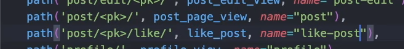
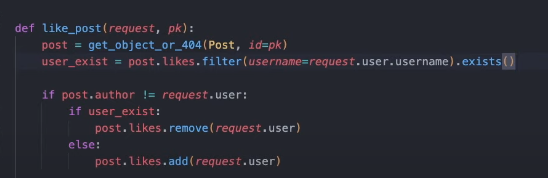

### 데이터 추가

- **작성하고 보니, json원본데이터에서는 `다대다에서 one.many = []`는 `optional[관계Schema]`를 달고, json에서는 `schema풀 [json객체{}]`를쓰거나 `아예 비워두기`로
  한다. fk_list로 두면 Schema 변환시 에러난다.**
    - json에서는[{}] 풀객체 list를 쓰기 힘드니, `관계테이블 json`에 fk_id를 각각 적어놓고 crud과정에서 넣어줘야한다.
    - 즉, 다대다는 관계테이블을 json으로 각각의 fk와 함꼐 정의 / 각테이블(one)에서의 many관계객체array는 `full 객체{} list`로 넣던지, `생략!!!`하던지 /
      Schema에서는 `Optional[List[Schema]]`로 반드시 처리

1. likes는 `user-post`에 대한 `asscociation관계`이므로, `user_id, post_id`를 이용해서 likes key를 json에 정의한다.
    - like는 수정할 일이 없으니, updated_at이 없다.
    ```json
    "likes": [
    {
      "id": 1,
      "user_id": 2,
      "post_id": 1,
      "created_at": "2023-01-01 12:00:00"
    },
    {
      "id": 2,
      "user_id": 1,
      "post_id": 1,
      "created_at": "2023-02-01 14:30:00"
    },
    {
      "id": 3,
      "user_id": 1,
      "post_id": 2,
      "created_at": "2023-03-01 08:45:00"
    },
    {
      "id": 4,
      "user_id": 2,
      "post_id": 2,
      "created_at": "2023-04-01 16:20:00"
    }
    ],
    ```
2. tags는 post와 `M:N관계`인데, 개별로 보면, `one(tag.posts)`도 되고 `many(post.tags)`도 된다.
    - **`M:M`관계도 likes처럼 `association = tagposts`로 만들어야하지만, orm에서만 만들고**
    - **post와 동급으로서, `"tags"를 정의`하되, `"posts"에만 fk tag list(many-post.tags)`로 일단 정의해놓자**
    - **즉, `post의 many`를 위주로 생각하며, `"posts"`에만 정의해놓는다.**

    ```json
    "tags": [
        {"id": 1, "name": "Tech", "created_at": "2022-05-17 16:56:21", "updated_at": "2023-05-17 16:56:21"},
        {"id": 2, "name": "Programming", "created_at": "2022-05-17 16:56:21", "updated_at": "2023-05-17 16:56:21"},
        {"id": 3, "name": "Design", "created_at": "2022-05-17 16:56:21", "updated_at": "2023-05-17 16:56:21"},
        {"id": 4, "name": "Testing", "created_at": "2022-05-17 16:56:21", "updated_at": "2023-05-17 16:56:21"}
    ],
    ```
    - **user-post의 중간테이블 격인 comments, likes와 달리 `post-tags`의 다대다를 이어줄 `post_tags`의 테이블 데이터는 따로 만들어야한다.**
    ```json
    "post_tags": [
        {"id": 1, "post_id": 1, "tag_id": 1, "created_at": "2022-05-17 16:56:21", "updated_at": "2023-05-17 16:56:21"},
        {"id": 2, "post_id": 1, "tag_id": 2, "created_at": "2022-05-17 16:56:21", "updated_at": "2023-05-17 16:56:21"},
        {"id": 3, "post_id": 2, "tag_id": 3, "created_at": "2022-05-17 16:56:21", "updated_at": "2023-05-17 16:56:21"},
        {"id": 4, "post_id": 2, "tag_id": 4, "created_at": "2022-05-17 16:56:21", "updated_at": "2023-05-17 16:56:21"}
    ]
    ```
3. likes와 tags는 `post`에 대한 `M:N관계`이므로, `"posts" : {} `내부에 이용해서 `"likes": [], "tags": []` fk_id list를 추가하면 될 것 같지만
    - **`json`은 사실상 최종 Rseponse Schema와 마찬가지 이므로, `넣으려면, Schema 풀객체`를 예시로서 넣어줘야한다.**
    - **Schema에서만 List[Schema]로 넣어주고, `fk_id list는 넣으면 Schema정의시 에러`나므로, `다대다를이용한 crud조회`에서 객체를 가져오도록 위임한다.**
    - **즉, post에는 `one의 fk`만 넣어고, `many나 다대다의 fk list`는 넣으면 안된다. 넣으려면 full schema객체를 넣어주는데, 번거롭다.**
    ```json
    "posts": [
    {
      "id": 1,
      "title": "First Post",
      "content": "This is the content of the first post.",
      "created_at": "2022-05-17 16:56:21",
      "updated_at": "2022-05-17 16:56:21",
      "user_id": 1,
    },
    // "likes": [1, 2],
    // "tags": [1, 2]
    ]
    ```

4. 새로운 json을 lifespan에서 load하고, load한 json을 `Schmema(**json객체)`로 넣어서 생성한 메모리 데이터를 반환한다.
    ```python
    async def init_picstragram_json_to_list_per_pydantic_model():
        # picstragram_path = pathlib.Path() / 'data' / 'picstragram.json'
        picstragram_path = pathlib.Path() / 'data' / 'picstragram2.json'
    
        with open(picstragram_path, 'r') as f:
            picstragram = json.load(f)
            # ...
    
       # 다대다 추가
        likes = [LikeSchema(**like) for like in picstragram.get("likes", [])]
        tags = [TagSchema(**tag) for tag in picstragram.get("tags", [])]
        post_tags = [PostTagSchema(**tag) for tag in picstragram.get("post_tags", [])]
        
        print(f"[Picstragram] users-{len(users)}개, comments-{len(comments)}개, posts-{len(posts)}개, likes-{len(likes)}개, tags-{len(tags)}개"
              f"의 json 데이터, 각 list에 load")
        return users, comments, posts, likes, tags, post_tags
    ```
    ```python
    @asynccontextmanager
    async def lifespan(app: FastAPI):
        # ...
        # 4) [Picstragram] dict -> pydantic schema model
            # global users, comments, posts
            users_, comments_, posts_, likes_, tags_ = await init_picstragram_json_to_list_per_pydantic_model()
            users.extend(users_)
            comments.extend(comments_)
            posts.extend(posts_)
            likes.extend(likes_)
            tags.extend(tags_)
            post_tags.extend(post_tags_)
    ```

5. crud> picstragram.py에 db대신 메모리데이터로 쓰일 전역용 메모리 데이터변수 likes, tags = [] 를 선언해준다.
    - main.py의 likespan에서 import 후 json -> Schema list를 여기에 extends해서 초기화한다.
    ```python
    users, comments, posts, liked_posts, tags, post_tags = [], [], [], [], [], []
    ```

### Schema

1. 현재 없는 `Like와 TagSchema`를 schemas > picstragrams.py에 선언한다
    - **like의 경우, 중간테이블이지만, post를 one관계객체(like.post)로 부를일은 없지만, `좋아요 누른 user정보를 one객체로서 like.user로 호출`해야하므로 관계Schema를
      UserSchema만 선언해주자**
    - **like가 아닌 곳인, user에서는 user.likes는 안누르지만, `posts의 경우, 주인공으로서, likes를 many관계객체(post.likes)`를 부를 것 같아, 관계객체Schema를
      선언해준다**
    - like는 updated_at이 없다
    ```python
    class LikeSchema(BaseModel):
        id: Optional[int] = None
        user_id: int
        post_id: int
        created_at: Optional[datetime.datetime]  # 서버부여 -> 존재는 해야함 but TODO: DB 개발되면, 예제 안뜨게 CreateSchema 분리하여 제거대상.
        
        user: Optional[UserSchema] = None # like.user(좋아요 누른사람)
    ```
    - post에는 더 아래에서 정의된 Schema를 문자열로서 list['LikesSchema'] 형태로 조회가능하게 한다.
      ```python
      class PostSchema(BaseModel):
          id: Optional[int] = None
          title: str
          content: str
          image_url: Optional[str] = None
          created_at: Optional[datetime.datetime]  # 서버부여 -> 존재는 해야함 but TODO: DB 개발되면, 예제 안뜨게 CreateSchema 분리하여 제거대상.
          updated_at: Optional[datetime.datetime]
          user_id: int
     
          user: Optional[UserSchema] = None
          comments: Optional[List[CommentSchema]] = []
         
          likes: Optional[List['LikeSchema']] = []
      ```
        - **이 때, `post데이터에 "likes": [1,2]`처럼, fk가 들어간 상태이므로, `likes: Optional[List['LikeSchema']] = []`로서 Schema가 아닌
          int로 일단 줘야한다.**
        - **tag의 경우, tag.posts(tag별 글) 와 post.tags(post조회시)을 모두 사용하게 되므로, `MN으로서 각각 관계객체를 서로 many`로 주게 된다.**
      ```python
      class TagSchema(BaseModel):
          id: Optional[int] = None
          name: str
          created_at: Optional[datetime.datetime]  # 서버부여 -> 존재는 해야함 but TODO: DB 개발되면, 예제 안뜨게 CreateSchema 분리하여 제거대상.
          updated_at: Optional[datetime.datetime]
         
          posts: Optional[List[PostSchema]] = [] # tag.posts 해당 tag에 속한 글들
      ```
      ```python
      class PostSchema(BaseModel):
     
          # ...
          likes: Optional[List['LikeSchema']] = []
          tags: Optional[List['TagSchema']] = []
      ```
        - post_tags는 중간테이블이므로, `post_id, tag_id`를 가지고 있어야한다.
        - **이 때, 중간테이블이, post->`중간->tags`도 갈 수 있고, tag-`중간->posts`로 갈 수 있기 때문에, `many관계를 둘다 만들어놓는다.`**
      ```python
      class PostTagSchema(BaseModel):
          id: Optional[int] = None
          post_id: int
          tag_id: int
          created_at: Optional[datetime.datetime]  # 서버부여 -> 존재는 해야함 but TODO: DB 개발되면, 예제 안뜨게 CreateSchema 분리하여 제거대상.
          updated_at: Optional[datetime.datetime]
         
          post: Optional[PostSchema] = [] # 중간테이블에선 각각이 one이다.
          tag: Optional[TagSchema] = []
    
      ```

### CRUD

- **실제적으로 쓰이는 중간테이블 `LikeSchema`:**
    1. **like단일조회에서, 한쪽(user)를 with옵션으로 포함시키게 한다.**
    2. **반대편(post)의 조회에서 with옵션으로 실질중간테이블(likes)를 with옵션으로 포함시키게 한다.**
    3. **결국 post조회시 -> likes list -> 각 like마다 user 포함 -> 반대편인 user가 list가 포함되게 된다.**
    4. **중간테이블 like로 인해 post에 .likes가 생긴 순간, `단일->전체조회`뿐만 아니라 `one(post)삭제시 many의 CASCADE삭제`도 추가해야한다.**


- 오로지 관계객체연결을 위한 중간테이블 `PostTagSchema`:

#### 실제적으로 쓰이는 중간 테이블 Like

##### read for 한쪽 one(Post)

1. like는 update가 없고, comment와 비슷하게 작성하면 된다.
    - like는 전체조회가, `사실상 post하위 부분조회`이며, with_user로 좋아요 누른 user정보도 필요할 것이다.
    - comment처럼 **`전체조회시 단일조회의 eagerload가 필요`하므로, 단일조회부터 정의한다.**
    ```python
    def get_like(like_id: int, with_user: bool = False):
        like = next((like for like in likes if like.id == like_id), None)
        if not like:
            return None
    
        if with_user:
            user = get_user(like.user_id)
    
            if not user:
                return None
    
            like.user = user
    
        return like
   
    def get_likes(post_id: int, with_user: bool = False):
        # new) path로 부모가 올 경우, 존재검사 -> CUD가 아니므로, raise 대신 []로 처리
        post = get_post(post_id)
        if not post:
            return []
    
        # one을 eagerload할 경우, get_like(,with_user=)를 이용하여 early return
        # -> 아닐 경우, list compt fk조건으로 데이터 반환
        if with_user:
            return [
                get_like(like.id, with_user=True) for like in likes if like.post_id == post_id
            ]
    
        return [like for like in likes if like.post_id == post_id]
    ```

2. **실질적 중간테이블 생성시, `기존 post(one)`의 단일조회->전체조회 순으로 `with_실질중간테이블(with_likes)`옵션을 추가하여 `many 실질테이블.likes`를 포함시킬 수 있으며**
    - **실질테이블을 post.likes로 넣을 때, like단일조회에서 만든 `with_반대편one(with_user)`옵션으로 반대정보를 many로 포함시킨다.**
    - 일단 post의 단일조회함수에 `with_likes`옵션을 걸고, post.likes를 채울 때 `get_like(, with_user)`옵션으로 반대편 one list를 넣어줄 수 있다.
    ```python
    # def get_post(post_id: int, with_user: bool = True, with_comments: bool = False):
    def get_post(post_id: int, with_user: bool = True, with_comments: bool = False, with_likes: bool = False):
        post = next((post for post in posts if post.id == post_id), None)
        if not post:
            return None
    
        if with_user:
            post.user = get_user(post.user_id)
    
        if with_comments:
            post.comments = [
                get_comment(comment.id, with_user=True) for comment in comments if comment.post_id == post.id
            ]
    
        # likes(중간테이블) 구현후, with_likes 추가
        if with_likes:
            post.likes = [
                get_like(like.id, with_user=True) for like in likes if like.post_id == post.id
            ]
        return post
    ```
    ```python
    def get_posts(with_user: bool = False, with_comments: bool = False, with_likes: bool = False):
        # one은 next()로 찾는 get_user()를 재활용
        if with_user:
            for post in posts:
                post.user = get_user(post.user_id)
    
        # many는 순회
        if with_comments:
            for post in posts:
                post.comments = [
                    get_comment(comment.id, with_user=True) for comment in comments if comment.post_id == post.id
                ]
        
        # 실질 중간테이블 like를 many로 넣으면 -> 반대편 one(user) list도 many로 써 담기게 된다.
        if with_likes:
            for post in posts:
                post.likes = [
                    get_like(like.id, with_user=True) for like in likes if like.post_id == post.id
                ]
    
        return posts
    ```
    - 안해도 되지만, get_likes()를 정의해준 김에 list comp + with옵션 단일조건을, refactoring해줬다.
    ```python
    def get_posts(with_user: bool = False, with_comments: bool = False, with_likes: bool = False):
    
        # 실질 중간테이블 like를 many로 넣으면 -> 반대편 one(user) list도 many로 써 담기게 된다.
        if with_likes:
            for post in posts:
                # post.likes = [
                #     get_like(like.id, with_user=True) for like in likes if like.post_id == post.id
                # ]
                
                # refactoring(안해도 되지만, get_likes()를 정의한 김에 
                post.likes = get_likes(post.id, with_user=True)
    
        return posts
    ```
3. **중간테이블like -> post입장에선 many이다. many가 생기는 순간 `get`뿐만 아니라 `delete시 many의 CASCADE삭제`도 추가해줘야한다.**
    ```python
    def delete_post(post_id: int):
        post = get_post(post_id)
        if not post:
            raise Exception(f"해당 post(id={post_id})가 존재하지 않습니다.")
    
        global posts
        posts = [post for post in posts if post.id != post_id]
    
        # one 삭제시, many도 모두 삭제한다.(CASCADE)
        global comments
        # Delete associated comments
        comments = [comment for comment in comments if comment.post_id != post_id]
        
        # new) 중간테이블도 one삭제시 many가 삭제되는 것과 동일하다.
        global likes
        likes = [like for like in likes if like.post_id != post_id]
    ```
4. post 조회 route에서도, with_likes를 켜서 조회하게 바꾼다.
    - **사실상 like 조회 route는 없다. post의 조회route가 바뀜.**
    ```python
    @app.get("/posts/", response_model=List[PostSchema])
    async def pic_get_posts(request: Request):
        # posts = get_posts(with_user=True, with_comments=True)
        posts = get_posts(with_user=True, with_comments=True, with_likes=True)
        return posts
    
    
    @app.get("/posts/{post_id}", response_model=Union[PostSchema, str])
    async def pic_get_post(
            request: Request,
            post_id: int,
            response: Response,
    ):
        # post = get_post(post_id, with_user=True, with_comments=True)
        post = get_post(post_id, with_user=True, with_comments=True, with_likes=True)
    
        if post is None:
            response.status_code = 404
            return "Post 정보가 없습니다."
    
        return post
    ```

##### create

1. 중간테이블이지만, post, user에 대해선 `many의 생성`이므로, schema에 포함된 fk를 통해 one객체 존재여부를 확인한다.
    - update가 빠진 것이 comment와 다르다.
    ```python
    def create_like(like_schema: LikeSchema):
        user = get_user(like_schema.user_id)
        if not user:
            raise Exception(f"해당 user(id={like_schema.user_id})가 존재하지 않습니다.")
        post = get_post(like_schema.post_id)
        if not post:
            raise Exception(f"해당 post(id={like_schema.post_id})가 존재하지 않습니다.")
    
        try:
            # id + created_at, updated_at 부여
            like_schema.id = find_max_id(comments) + 1
            like_schema.created_at = datetime.datetime.now()
    
            likes.append(like_schema)
    
        except Exception as e:
            raise e
    
        return like_schema
    ```

2. like는 1user당 1post에 1번만 가능하다. 즉, `likes` 테이블에 `user_id, post_id가 모두 똑같은 것이 존재하면 안된다.`
    - 메모리데이터 likes를 순회하면서, 존재여부 검사를 한다.
    ```python
    def create_like(like_schema: LikeSchema):
        user = get_user(like_schema.user_id)
        if not user:
            raise Exception(f"해당 user(id={like_schema.user_id})가 존재하지 않습니다.")
        post = get_post(like_schema.post_id)
        if not post:
            raise Exception(f"해당 post(id={like_schema.post_id})가 존재하지 않습니다.")
    
        # new) like는 1user, 1post 당 1회만 생성가능하므로, 존재여부 추가
        like = next(
            (like for like in likes if like.user_id == like_schema.user_id and like.post_id == like_schema.post_id), None
        )
        if like:
            raise Exception(f"이미 좋아요를 누른 게시물입니다.")
    ```


3. like는 get route는 없었지만, create는 있다.
    ```python
    @app.post("/like", response_model=Union[LikeSchema, str], status_code=201)
    async def pic_create_like(
            request: Request,
            like_schema: LikeSchema,
            response: Response,
    ):
        try:
            like = create_like(like_schema)
            return like
    
        except Exception as e:
            response.status_code = 400
            return f"like 생성에 실패했습니다.: {e}"
    ```

##### create route 발상의 전환 -> create or delete를 주인공one(post).실질중간테이블.반대편one(user) list에서 포함여부 확인후 create or delete한다

- 참고 유튜브(15분): https://www.youtube.com/watch?v=IxGcvqfI_iA&list=PL5E1F5cTSTtTAIw_lBp1hE8nAKfCXgUpW&index=15

1. 실질 중간테이블 like 생성에 필요한 post_id, user_id를 받아, 데이터를 생성했지만,
    - **crud: `특정` post(one)가 주인공 -> `with_user(반대one)`을 포함한 many중간테이블(likes) 조회를 `with_likes`로 가능하도록 구현했다.**
    - **그렇다면, `실질중간테이블likes를 post의 하위도메인`으로 보고, url을 `posts/{특정post_id}/likes`로 url을 잡는다.**
      
    - **post_id를 받아서, `get_post with likes`로 조회 -> `like는 내부 with_users로 반대편 one(user) list가 포함`되어있다.**
    - **likes 속 user들을 순회하며, 추후) `request.user` = `현재의 나가 포함되어있는지 확인`하고 -> `안되어있으면 create / 포함되어있으면 delete`가 되도록 한다
      **
      
    - 추후) create하든 / delete하든 redirect 현재페이지 -> htmx로 상황에 따라 다른 htmx 반환
    ```python
    # TODO: 나중에 로그인 + db 구현후 path param으로 옮겨주기
    # @app.post("/posts/{post_id}/likes", response_model=Union[LikeSchema, str], status_code=201) 
    @app.post("/posts/likes", response_model=Union[LikeSchema, str], status_code=201)
    async def pic_create_or_delete_like(
            request: Request,
            # post_id: int, # TODO: db 구현 후 1) post_id : path param + 2) user_id : request.user...
            like_schema: LikeSchema,
            response: Response,
    ):
        # 현재 post에서 실질중간테입르 likes를 many로 불러온다. 이 때, 반대편one인 user가 포함되어있어서, 결국엔 user list에 접근가능해진다.
        # -> 현재) 특정 post_id -현재의 나 like_schema.user_id
        # -> TODO: 추후) 특정 post_id(path_param) +  post.likes.add( request.user객체-현재의나 ) -> schema 없어도 됨.
        post = get_post(
            like_schema.post_id,
            with_user=True,  # 작성자 <-> 현재의 나 비교
            with_likes=True
        )
    
        # 1) 일단 좋아요 누른사람(like_schema.user_id)이 작성자(post.user.id)면, pass한다.
        if (author_id := post.user.id) == like_schema.user_id:
            raise Exception(f"자신(id={author_id})의 post(id={post.id})에는 좋아요를 누를 수 없습니다.")
    
        try:
            # 2) post.likes의 many데이터마다 박혀있는 user들을 list안에  좋아요누른사람의  포함여부(in)를 확인하고
            # -> 포함시 delete / 미포함시 create 작동을 하면 된다.
            if like_schema.user_id in [like.user.id for like in post.likes]:
                delete_like(like_schema)
                return f"이미 좋아요를 누른 게시물이어서, 좋아요를 제거합니다."
    
            else:
                create_like(like_schema)
                return f"현재 게시물에 좋아요를 눌렀습니다."
    
        except Exception as e:
            response.status_code = 400
            return f"좋아요를 누른 것에 실패했습니다.: {e}"

    ```
    - **`아직 구현안된 delete_like`도 create와 동시상황이므로, like_schema로 구현해보자.**

2. create_like()에서 한번만 누르기 제한을 주석처리한다. 이미 눌렀다면, 삭제처리 되어야한다.
    ```python
    def create_like(like_schema: LikeSchema):
        user = get_user(like_schema.user_id)
        if not user:
            raise Exception(f"해당 user(id={like_schema.user_id})가 존재하지 않습니다.")
        post = get_post(like_schema.post_id)
        if not post:
            raise Exception(f"해당 post(id={like_schema.post_id})가 존재하지 않습니다.")
    
        # new) like는 1user, 1post 당 1회만 생성가능하므로, 존재여부 추가
        # like = next(
        #     (like for like in likes if like.user_id == like_schema.user_id and like.post_id == like_schema.post_id), None
        # )
        # if like:
        #     raise Exception(f"이미 좋아요를 누른 게시물입니다.")
        # ===> 이미 좋아요 눌렀으면 제한이 아니라 풀리게 한다.
        
        #...
    ```
##### delete
- create와 동시에 삭제판단이 이루어지기 때문에 like는 like_id로 안들어온다.
- 실질 중간테이블의 id는 안들어온다고 생각하자.

```python
# new) create_or_delete의 판단상황이므로, 삭제를 like_id가 안들어온다. post_id, user_id로 삭제처리한다.
def delete_like(like_schema: LikeSchema):
    user = get_user(like_schema.user_id)
    if not user:
        raise Exception(f"해당 user(id={like_schema.user_id})가 존재하지 않습니다.")
    post = get_post(like_schema.post_id)
    if not post:
        raise Exception(f"해당 post(id={like_schema.post_id})가 존재하지 않습니다.")

    global likes
    likes = [like for like in likes if like.post_id != like_schema.post_id and like.user_id != like_schema.user_id]
```

- test는 post의 작성자 user_id가 아닌 것으로 좋아요를 눌렀다가 풀었다가 해본다.
