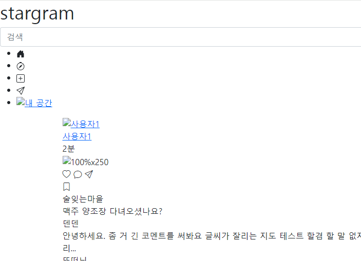
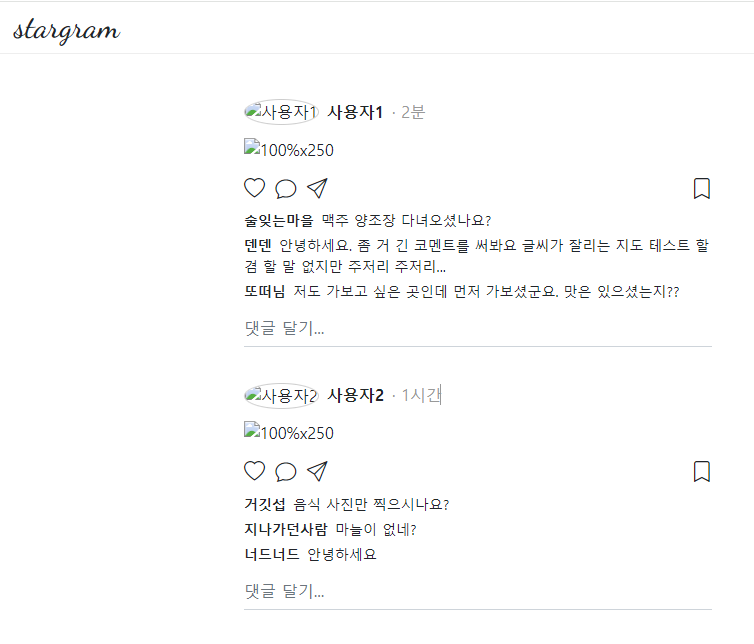
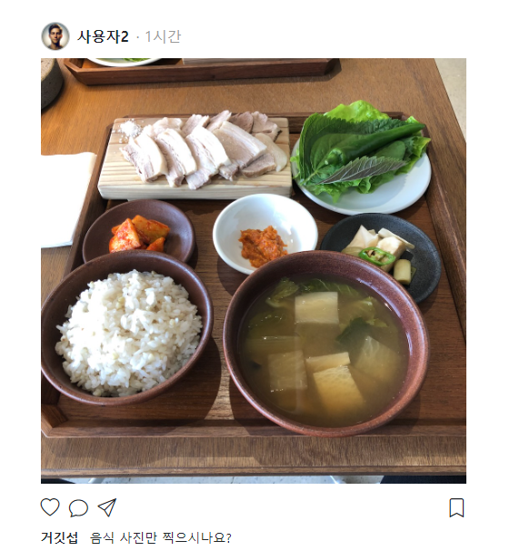

- 참고 유튜브(flask+htmx): https://www.youtube.com/watch?v=O2Xd6DmcB9g&list=WL&index=8&t=1842s

### html to templates / css, js, images to static

1. data폴더에 있는 `기본템플릿` picstragram.zip을 풀어서,
    1. `html`: templates > picstragram폴더를 만들어 index.html, user.html, me.html을 넣는다.
    2. `css`: static > css폴더를 만들어 style.css를 넣는다.
    3. `images`: static > images폴더를 만들어서, 이미지파일들을 넣는다.

### route + url_for로 static 연동시키기

1. index.html를 뿌려줄 route를 만든다.
    ```python
    ############
    # picstragram templates
    ############
    @app.get("/picstragram/", response_class=HTMLResponse)
    async def pic_index(
            request: Request,
            hx_request: Optional[str] = Header(None),
    ):
        context = {'request': request}
        return templates.TemplateResponse("picstragram/index.html", context)
    ```

    - 하지만, css, images가 연동되지 않아 깨진다.
      


2. **달라진 css경로, image경로를 `jinja2 {{ url_for('static', path='하위폴더/파일이름') }}`로 연동시켜줘야한다.**
    ```html
    {#<link rel="stylesheet" href="style.css" />#}
    <link rel="stylesheet" href="{{ url_for('static', path='css/style.css') }}" />
    ```
   

   - 이미지 파일들도 url_for('static',path='')로 변경해준다.
       ```html
       {#<a href="user.html"></a>#}
       <a href="user.html"></a>
       ```
       ```html      
       {##}
       
       ```
     


3. user.html과 me.html을 `route를 만들어 render`하고 마찬가지 `url_for로 연동` 작업을 해준다.
    - route를 만들고, render해본 뒤, css, images를 url_for로 연동시켜준다.
    - **작업하면서, index.html과 공통부분은 base.html로 빠진다고 생각한다.**

4. me.html
    - nav-top은 다름, nav-bottom은 같음.
    - 프로필 편집 modal이 필요할 듯
    - 사용자 설명 field 추가 요망
    - 팔로우 table 및 CRUD 요망  like likes(create or delete 기능)
    - statistics에서 게시물 종류를 판단해야할 듯

5. user.html
    - 내가 아닌 특정 유저에 대한 페이지(유저 클릭시)
    - route의 endpoint를 /users/{}의 path로 바꿔야함. 현재는 그냥 /users로 되어있음.
    - nav-top은 다름, nav-bottom은 같음.

### index, me, users.html을 바탕으로 base.html 추출하기

1. index.html을 복사해서 `_page_base.html`를 만든다.
2. htmx를 대비하여 각 도메인(페이지)별로 폴더를 만든다.
    - home / user(me+user)
2. body태그 안에서, `공통되는 부분`은 `include`할 `_page_xxx.html`로 뺄 준비를 한다.
    - header.nav-bottom태그를 `_page_nav_bottom.html`로 빼고, include시킨다.
        - include 경로는 `templates폴더를 현재폴더로서` 다 적어줘야한다.?
3. 구조는 반복되나 `내용만 공통이 아닌 부분`은 block을 씌우고, `초기내용으로서 기본적으로 있어야한다면` block 내부에 작성을 해놓는다.
    - block을 씌우면, 자식입장에서 추가된다면, super를 써서 추가만 하면 된다.
    - header의 style.css  / body 끝부분의 script태그 속 js는 `extrastyle`, `script` block으로 씌워놓고, 필요시 덮어사용한다.
4. 이번참에 html전체도 block으로 걸어준다.
   - _page_base.html
       ```html
       
       <!DOCTYPE html>
       <html lang="en">
       <head>
           <meta charset="UTF-8"/>
           <meta name="viewport" content="width=device-width, initial-scale=1.0"/>
           <!-- Bootstrap 5 -->
           <link href="https://cdn.jsdelivr.net/npm/bootstrap@5.1.3/dist/css/bootstrap.min.css" rel="stylesheet"
                 integrity="sha384-1BmE4kWBq78iYhFldvKuhfTAU6auU8tT94WrHftjDbrCEXSU1oBoqyl2QvZ6jIW3"
                 crossorigin="anonymous"/>
           <link rel="stylesheet" href="https://cdn.jsdelivr.net/npm/bootstrap-icons@1.10.5/font/bootstrap-icons.min.css"/>
           <!-- Bootstrap 5 -->
           <!-- Google Fonts -->
           <link rel="preconnect" href="https://fonts.googleapis.com">
           <link rel="preconnect" href="https://fonts.gstatic.com" crossorigin>
           <link href="https://fonts.googleapis.com/css2?family=Dancing+Script:wght@600&display=swap" rel="stylesheet">
           <!-- Google Fonts -->
           {#<link rel="stylesheet" href="style.css" />#}
           
               <link rel="stylesheet" href="{{ url_for('static', path='css/style.css') }}"/>
           
           <title>stargram Clone</title>
       </head>
       <body>
    
       
           <header class="nav-top">
               <div class="wrapper">
                   <h1 class="logo">Picstragram</h1>
                   <div class="form-group search">
                       <input type="search" class="form-control" id="seach" placeholder="검색">
                   </div>
               </div>
           </header>
       
    
       
    
       
    
       {# 공통 #}
       
           <script src="https://cdn.jsdelivr.net/npm/bootstrap@5.1.3/dist/js/bootstrap.bundle.min.js"
                   integrity="sha384-ka7Sk0Gln4gmtz2MlQnikT1wXgYsOg+OMhuP+IlRH9sENBO0LRn5q+8nbTov4+1p"
                   crossorigin="anonymous"></script>
       
       </body>
       </html>
       
    
       ```
  
   - index.html
       ```html
       
    
       
           <div class="preview-container">
           </div>
           <div class="preview-container">
           </div>
       
       ```
     

5. me.html과 user.html에도 같은 처리를 해준다. 
    - base를 상속하되, 여기선 nav-top 내용이 달라지니 기존의 코드로 block을 덮어쓰기 하면 된다.
