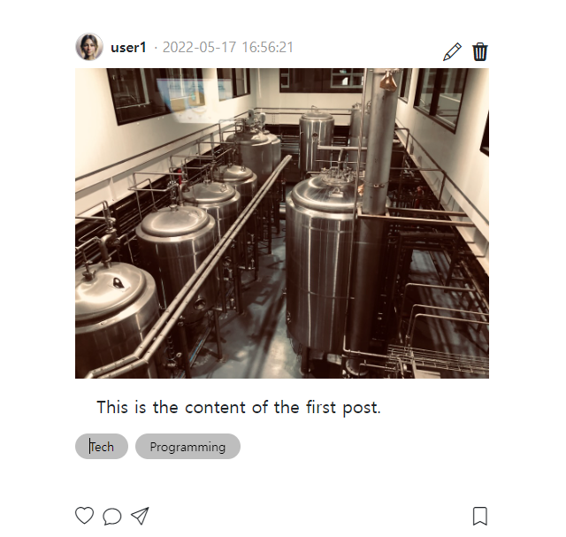

- 참고 유튜브(flask+htmx): https://www.youtube.com/watch?v=O2Xd6DmcB9g&list=WL&index=8&t=1842s
### posts를 백엔드에서 받아와 반복문 처리
1. home/index.html + route에서 posts를 던지고, 템플릿 위쪽에서 {{posts}}만 찍어본다.
    ```html
    
        {{ posts }}
        <div class="preview-container">
            <article class="post">
                <div class="header">
    ```
    ```python
    @app.get("/picstragram/", response_class=HTMLResponse)
    async def pic_index(
            request: Request,
            hx_request: Optional[str] = Header(None),
    ):
        posts = get_posts(with_user=True, with_tags=True, with_likes=True, with_comments=True)
        context = {
            'request': request,
            'posts': posts,
        }
        return templates.TemplateResponse("picstragram/home/index.html", context)
    ```
    

    - post.xxx로 각 정적인 값들을 대체하고 post.comments, post.tags 다시 순회하면서 댓글까지 처리한다?!
    - 추가로 post.content 및 tag를 위한 태그 추가 
    - 추가로 .post > .header 에 `.header-icons` 추가하여, edit/delete버튼을 넣었는데
        - **ms-auto로 오른쪽으로 붙이고, 내부에서 `gap: 0 0.5em`의 gap을 이용한 좌우 벌리기를 하였다.**
    ```css
    .post .header .header-icons {
        display: flex;
        margin-top: 0.5em;
        font-size: 1.3em;
        
        margin-left: auto;
        gap: 0 0.5em;
    }
    ```    
    ```html
    
        <div class="preview-container">
            <article class="post">
                <div class="header">
                    <a href="{{ url_for('pic_users') }}">
                        
                    </a>
                    <a href="{{ url_for('pic_users') }}">
                        <div class="name">{{ post.user.username }}</div>
                    </a>
                    <div class="time">{{ post.updated_at }}</div>
                    {# https://icons.getbootstrap.com/?q= #}
                    <div class="header-icons">
                        <i class="bi bi-pencil"></i>
                        <i class="bi bi-trash3-fill"></i>
                    </div>
                </div>
                <div class="contents">
                    
                    {# 추가 텍스트 post.content + tag #}
                    <p class="fs-5 mt-3 mb-10 px-4 font1">{{ post.content }}</p>
                    <div class="d-flex align-items-center gap-2 text-sm mb-5 flex-wrap">
                        
                            <a href="{{ url_for('pic_get_tag', tag_id=tag.id) }} "
                               class="btn btn-sm rounded-pill border-0 px-3 py-1"
                               style="background-color: #bebebe; color: black; transition: background-color 0.3s, color 0.3s;" onmouseover="this.style.backgroundColor='black'; this.style.color='white';" onmouseout="this.style.backgroundColor='#bebebe'; this.style.color='black';"
                            >
                                {{ tag.name }}
                            </a>
                        
                    </div>
                </div>
                <div class="icons">
                    <div class="icons-left">
                        <i class="bi bi-heart"></i>
                        <i class="bi bi-chat"></i>
                        <i class="bi bi-send"></i>
                    </div>
                    <div class="icons-right">
                        <i class="bi bi-bookmark"></i>
                    </div>
                </div>
                <div class="comments">
                    
                        <div class="comment">
                            <div class="name">{{ comment.user.username }}</div>
                            <div class="comment">{{ comment.text }}</div>
                        </div>
                    
                </div>
                <div class="add-comment">
                    <input type="text" class="form-control" id="comment" placeholder="댓글 달기...">
                </div>
            </article>
        </div>
    
    ```
    


2. updated_at이 string으로 자동표현되지만, filter를 이용해서 처리한다.
    - sqlalchemy_2022 프로젝트를 참고해서 가져옴

### jinja2 filter 추가
1. `templatefilers`폴더를 root에 패키지로 만들고, `date.py`륾 만든다.
2. 아래와 같이 jinja filter를 정의한다.
    - **jinja filter는 함수로 정의하되, `첫번째 인자`가 `{{  | 필터 }}`의 값으로 들어온다고 생각하고 처리후 return해주면 된다.**
    ```python
    import datetime
    
    
    def feed_time(feed_datetime: datetime, is_feed: bool = True):
        weekdays = ['월', '화', '수', '목', '금', '토', '일']
        wd = weekdays[feed_datetime.weekday()]
        # ymd_format = "%Y.%m.%d %H:%M({})".format(wd)
        ymd_format = "%Y.%m.%d %H:%M".format(wd)
    
        # is_feed형태일 때, k = 1 이라면 -> k일 이상부터는, 년월일, 그전에는 피드시간(yyyy.mm.dd h:m)
        # => k는 삭제함.
        if not is_feed:
            formatted = feed_datetime.strftime(ymd_format.encode('unicode-escape').decode()).encode().decode(
                'unicode-escape')
        else:
            current_time = datetime.datetime.now()
            ## total 초로 바꾼다.
            total_seconds = int((current_time - feed_datetime).total_seconds())
            ## 어느 단위에 걸리는지 확인한다.
            periods = [
                ('year', inf, '년 전'),  # new) 비교후 걸리면, 이전 것으로 하는데, 맨 마지막을 가장 큰 것을 해놓고, 무조건 걸리게.
                ('year', 60 * 60 * 24 * 365, '년 전'),
                ('week', 60 * 60 * 24 * 7, '주 전'),
                ('day', 60 * 60 * 24, '일 전'),
                ('hour', 60 * 60, '시간 전'),
                ('minute', 60, '분 전'),
                ('second', 1, '초 전'),
            ]
            prev_unit = 0
            prev_ment = '방금 전'
    
            for period, unit, ment in reversed(periods):
                ## new) 업뎃한 prev_unit가 가장 큰 unit인 경우, 또다른 종착역으로서 더이상 업뎃 로직X 종착역 -> 업뎃판단이 아니라 바로 년단위로 처리
                if total_seconds <= unit:
                    # (1) 큰 것부터 보면서 잘라먹고 나머지 다시 처리하는 식이 아니라
                    # 작은단위부터 보고 그것을 못 넘어선 경우, 그 직전단위 prev_unit로 처리해야한다.
                    # , 해당단위보다 클 경우, (ex> 61초 -> 1초보다, 60(1분)보단 큰데 60*60(1시간보단)작다  => 60,60직전의 1분으로처리되어야한다)
                    #    나머지하위단위들을 total_seconds에 업뎃해서 재할당한다. -> 버린다.
    
                    # (3) 1초보다 작아서, prev 0으로 나누는 경우는 그냥 방금전
                    if not prev_unit:
                        value = ''
                    else:
                        value, _ = divmod(total_seconds, prev_unit)
                    # (2) 몫 + 멘트를 챙긴다
                    formatted = str(value) + prev_ment
                    # (3) [k][일] 이상 지나간, 그냥 년월일로 하자
    
                    # late_unit = 60 * 60 * 24
                    # if prev_unit == late_unit and value >= k:
                    #### new2) k일 이상지나면 X -> 10년이상되면,yyyy.mm.dd로 / 아니라면 is_feed인 이상, x년 전, 방금 전
                    year = periods[1][1]
                    if total_seconds > 10 * year and value >= k:
                        formatted = feed_datetime.strftime(ymd_format.encode('unicode-escape').decode()).encode().decode(
                            'unicode-escape')
                    break
                else:
                    ## 현재단위보다 크면, 다음단위로 넘어가되 prev업뎃
                    prev_unit = unit
                    prev_ment = ment
    
        return formatted
    
    
    if __name__ == "__main__":
        from utils import D
    
        print(feed_time(datetime.datetime.now() - datetime.timedelta(seconds=62), is_feed=False))
        # D유틸을 이용해 utc(한국-9시간)기준으로 now -> -9시간은 기본으로
        print(feed_time(D.datetime(diff_hours=9, diff_seconds=-62), is_feed=False))
    
        print(feed_time(datetime.datetime.now() - datetime.timedelta(seconds=119), k=8))
        # D유틸을 이용해 utc(한국-9시간)기준으로 now -> -9시간은 기본으로
        print(feed_time(D.datetime(diff_hours=9, diff_seconds=-119), k=8))
    
        # is_feed=False
        # 2023.12.26 22:20
        # 2023.12.26 22:22
    
        # is_feed=True + k=8일이상부터는 yyyy.mm.dd
        # 1분 전
        # 방금 전
    
    ```
   
3. 패키지에서 `from .date import feed_time`을 해주고, main.py에서 import후, templates객체에 필터로서 추가한다.
    ```python
    from templatefilters import feed_time
    
    # template filter 추가
    templates.env.filters['feed_time'] = feed_time
    ```
   
4. index.html의 post 순회 중에 적용한다.
    ```html
    
    <div class="time">{{ post.updated_at | feed_time }}</div>
    
    ```
    

### json에 image_url필드 추가 후, static폴더 연동하여, 고정이미지를 대체
1. json 데이터에 user, post에 image_url필드를 추가한다(nullable필드라서 값이 없었음)
    - **이 때, 경로는 `연동되는 폴더(ex> 'static', 'uploads')`에서부터 url_for('연동폴더', path=)로 대체될 것이므로, `연동폴더 이후의 path경로`를 입력시켜줘야한다.**
    - 만약, "image_url": "static/images/xxx.png"로 적었다면, url_for('static', path=post.image_url)의 결과는 `/static/static/images/xxx.png`가 되어버린다.
    ```json
    {
      "users": [
        {
          "id": 1,
          "username": "user1",
          "created_at": "2018-05-17 16:56:21",
          "updated_at": "2018-05-17 16:56:21",
          "image_url": "images/user1.png"
        },
        {
          "id": 2,
          "username": "user2",
          "created_at": "2019-05-17 16:56:21",
          "updated_at": "2019-05-17 16:56:21",
          "image_url": "images/user2.png"
        }
      ],
      "posts": [
        {
          "id": 1,
          "title": "First Post",
          "content": "This is the content of the first post.",
          "created_at": "2022-05-17 16:56:21",
          "updated_at": "2022-05-17 16:56:21",
          "user_id": 1,
          "image_url": "images/post-0001.jpeg"
        },
        {
          "id": 2,
          "title": "Second Post",
          "content": "Another post for testing.",
          "created_at": "2023-05-17 16:56:21",
          "updated_at": "2023-05-17 16:56:21",
          "user_id": 2,
          "image_url": "images/post-0002.jpeg"
        }
      ],
    ```
   

2. 고정된 img태그 src을 `url_for('static', path= 도메인.image_url)`로 변경해준다.
    ```html
    {##}
    
    ```
    ```html
    {##}
    
    ```
   

3. `uploads`폴더를 root에 만들고 따로 연동시킨다. static은 구성할때 고정된 컨텐츠만 담는다.
    - **StaticFiles()를 통해 uploads폴더를 mount하여 연동추가한다.**
        ```python
        app.mount('/uploads', StaticFiles(directory='uploads'), name='uploads')
        ```
      
4. **기존 `static/images`데이터들을 `uploads/images`로 옮기고 user와 post의 image_url을 연동시키는 `url_for를 'static' -> 'uploads'로 변경`한다.**
    ```html
    {##}
    
    ```
    ```html
    {##}
    
    ```

