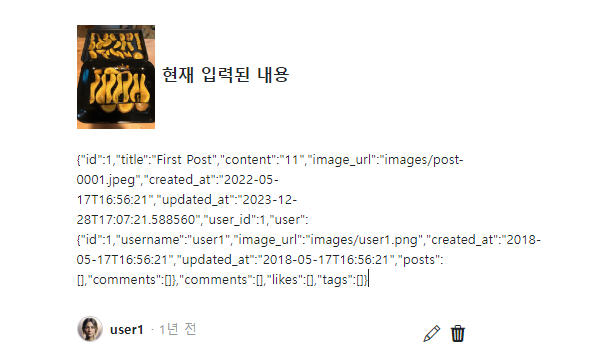

- 참고 유튜브(flask+htmx): https://www.youtube.com/watch?v=O2Xd6DmcB9g&list=WL&index=8&t=1842s
- 참고 깃허브(fastapi + htmx + pydantic): https://github.dev/sammyrulez/htmx-fastapi/blob/main/templates/owner_form.html

### post 제자리 edit용 html만들기
1. post 1개를 jinja 반복문 위에 복사해서, input이 들어간 post 1개를 만든다.
    - posts반복문 밖이므로, 고정된 이미지+데이터로 바꿔서 사용한다.
    - **이 때, `이미지를 w20%h20%`로 줄이고 + 옆에는 현재내용을 배치해놓는다.**
    - textarea input submit 등 `form 내부요소` 사용해서 디자인을 미리 해놓는다.
        - form은 나중에 달고
        - form요소는 일단 `.form-control`을 사용해주자.
        - 수정은 post.content만 할 예정이다. textarea + rows="2"정도로 만들어준다.
        - `수정`과 `취소` button을 개설해놓는다.
    ```html
    <div class="preview-container">
        <article class="post">
            <div class="contents">
                <div class="d-flex align-items-center mb-4">
                    
                    <h5 class="fs-7 fw-bold">현재 입력된 내용</h5>
                </div>
                <textarea rows="2" class="form-control mt-3 mb-4 px-2"
                          name="content"
                          placeholder="수정할 내용 입력"></textarea>
                <div class="d-flex align-items-center gap-2 text-sm mb-5 flex-wrap justify-content-center">
                    <button type="submit" class="btn btn-sm btn-dark rounded-pill px-3 py-1">수정</button>
                    <button class="btn btn-sm btn-outline-secondary rounded-pill px-3 py-1">취소</button>
                </div>
            </div>
        </article>
    </div>
    ```
    

### htmx와 edit용 form만들기 
1. base에 `htmx`를 붙인다.
    - 2번재 것은, 나중에 사용할 oob처리를 위함.
    ```html
    <script src="https://unpkg.com/htmx.org@1.6.1"
        integrity="sha384-tvG/2mnCFmGQzYC1Oh3qxQ7CkQ9kMzYjWZSNtrRZygHPDDqottzEJsqS4oUVodhW" crossorigin="anonymous">
    </script>
    <script>
        htmx.config.useTemplateFragments = true; // table row 조작을 위한 설정
        // 없으면 htmx-swap 에러가 남 : htmx.org@1.6.1:1 Uncaught TypeError: e.querySelectorAll is not a function
    </script>
    ```
   
2. 데이터를 보낼 input/submit요소들 바깥에 `form태그 + hx-메서드=""`로 form action+method를 대체한 태그를 작성한다.
    ```html
    <form hx-put="{{ url_for('pic_update_post', post_id=1) }}">
        <textarea rows="2" class="form-control mt-3 mb-4 px-2"
                  name="content"
                  placeholder="수정할 내용 입력"></textarea>
        <div class="d-flex align-items-center gap-2 text-sm mb-5 flex-wrap justify-content-center">
            <button type="submit" class="btn btn-sm btn-dark rounded-pill px-3 py-1">수정</button>
            <button class="btn btn-sm btn-outline-secondary rounded-pill px-3 py-1">취소</button>
        </div>
    </form>
    ```
   
3. 해당 route에 데이터를 보내는데, `422 에러(input validation에러)`가 뜬다.
    - **swagger docs가 보내는 것은 `json`만 보냈었고**
    - **`pydantic은 json만 허용`하여 검증 후 변환한다.**
    - **하지만, `form태그는 form데이터(await request.body or Body(...) or 개별필드:type = Form(...) in route`를 보내며, pydantic은 json외에 받질 못한다.**

### form를 fastapi router에서 받는 3가지 방법 - bytes(2) or 개별필드
- 참고: [json vs form 받기](https://stackoverflow.com/questions/71650452/use-fastapi-to-parse-incoming-post-request-from-slack/71650857#71650857)
- 참고2: [json? Checker등 여러가지 방법](https://stackoverflow.com/questions/65504438/how-to-add-both-file-and-json-body-in-a-fastapi-post-request/70640522#70640522) 
    - pydantic v2에서 쓰는 방법도 있음.
- 참고3: [form with fileupload(개별로 받아야할 듯)](https://stackoverflow.com/questions/65504438/how-to-add-both-file-and-json-body-in-a-fastapi-post-request/70640522#70640522)
- 요약: await request.body or Body(...) or 개별필드:type = Form(...)

1. (pydantic schema X)(bytes타입-decoding필요) route 기본 파라미터인 request를 await를 이용하여 `await request.body()`로 받을 수 있다.
    - 사용할일 없을 듯.
    ```python
    request_body = await request.body()
    # b'content=%20%20%20%20%20%20%20%20%20%20%20%20%20%20%20%20%20%20%20%2011'
    ```
   
2. (pydantic schema X)(bytes타입-decoding필요) type없이(넣으면 에러) `body:bytes=Body(...)`로 통째로 받기
    - **추후 이방법은 인젝션 class or function의 인자로 사용하여, bytes -> json -> schema(\*\*json) -> model_dump() : 검증 + dict로 변환 로직에 사용되기도 한다.**
    ```python
    @app.put("/posts/{post_id}", response_model=Union[PostSchema, str])
    async def pic_update_post(
            request: Request,
            post_id: int,
            body:bytes = Body(...),
    ):
        print(f"body >> {body}")
        # body >> b'content=11'
    ```
3. (pydantic schema X)(변환된 필드값) 모든필드에 대하여 `필드명: 필드type = Form(...)`을 이용하여 개별필드를 받을 수 있다.
    - **file type input이 포함된 경우, 이렇게 받아야할 듯하다. -> [참고](https://stackoverflow.com/questions/65504438/how-to-add-both-file-and-json-body-in-a-fastapi-post-request/70640522#70640522)**
    ```python
    @app.put("/posts/{post_id}", response_model=Union[PostSchema, str])
    async def pic_update_post(
            request: Request,
            post_id: int,
            content: str = Form(...)
    ):
        ...
        # content >>  11
    ```
   
### form을 Pydantic Schema로 받는 2가지 방법

- 일단 update용 content만 보내는 UpdateReq  Schea를 먼저 정의해준다.
    ```python
    class UpdatePostReq(BaseModel):
        content: str    
    ```

#### 의존성: bytes -> split -> json dict -> schema(\*\*json dict) -> .model_dump()로 검증+dict로 변환 with errors
##### 템플릿용 closure 함수 의존성(form_to) -> data(dict)_and_errors -> errors


- fastApiProject 참고

1. schemas/utils.py를 만들고, 내부에 **Depends()에 넣을 시, 받은 schema를 내부에서 사용하여, call될 수 있는 inner function을 가진 closure function `form_to_data_and_errros`를 정의한다.**

    ```python
    from fastapi import Body
    from pydantic import BaseModel
    
    
    def form_to(schema: BaseModel):
        # 바깥 function의 인자는 내부function에서 사용할 예정
        def bytes_body_to_dict_by_schema(body: bytes = Body(...)):
            # 로직 -> 최종 반환될 결과물 반환
            return
    
        return bytes_body_to_schema # call될 inner function 반환
    
    ```
   
2. bytes를 decode + & split 한 뒤, 다시 한번 =로 split하여, dict에 쌓아서 반환해보기
    ```python
    def form_to(schema: BaseModel):
        # 바깥 function의 인자는 내부function에서 사용할 예정
        def bytes_body_to_dict_by_schema(body: bytes = Body(...)):
            # 로직 -> 최종 반환될 결과물 반환
            # 1) bytes를 utf-8로 decode(inplace) 후 연결자 &로 split한 것들을 순회하며, '='로 다시split후 dict에 쌓기
            json_dict = dict()
            for param in body.decode('utf-8').split('&'):
                key, value = param.split('=')
                json_dict[key] = value
    
            return json_dict
    
        return bytes_body_to_schema  # call될 inner function 반환
    
    ```
    ```python
    @app.put("/posts/{post_id}", response_model=Union[PostSchema, str])
    async def pic_update_post(
            request: Request,
            post_id: int,
            data_and_errors=Depends(form_to(UpdatePostReq))
    ):
        print(f"data_and_errors >> {data_and_errors}")
        # data_and_errors >> {'content': '11'}
    ```
3. **하지만 아직 schema를 거치지 않아서, `검증 + dict로 변환이 안된 상태`다.**
    - **아래 코드주석처럼, data(`dict`)와 errors_info(string - 에러없다면 `''`)를 튜플로 모두 전해준다.**
    ```python
    def form_to(schema: BaseModel):
        # 바깥 function의 인자는 내부function에서 사용할 예정
        def bytes_body_to_dict_by_schema(body: bytes = Body(...)):
            # 로직 -> 최종 반환될 결과물 반환
            # 1) bytes를 utf-8로 decode(inplace) 후 연결자 &로 split한 것들을 순회하며, '='로 다시split후 dict에 쌓기
            json_dict = dict()
            for param in body.decode('utf-8').split('&'):
                key, value = param.split('=')
                json_dict[key] = value
    
            # 2) data dict로 변환(model_dump) 및 변환과정에 error가 발생한다면 list에 모았다가 string으로 concat
            data = dict()
            errors = []  # 에러항목마다 dict로 채워서, dict list가 됨.
            error_str = None
            try:
                # TODO; file input들은 배제하여 만들어보자.(test)
                data = schema(**json_dict).model_dump(exclude=['file', 'files'])
            except ValidationError as e:
                # 2-1) 에러가 나면, e.json()으로 string으로 만들 수 있다.
                error_str = e.json()
    
            # 2-2) 에러가 발생했다면, 다시 json을 dict로 load한다.
            # -> 만약 에러가 json이 아니라면, [필드의 부재 에러]가 발생했을 때라고 한다.
            # -> 내가 dict로 만들어서 기본 에러를 errors list에 넣는다.
            if error_str is not None:
                try:
                    errors = json.loads(error_str)
                except Exception as e:
                    errors = [
                        {"loc": "non_field"},
                        {"msg": "Unknown error"}
                    ]
    
            # 3. 템플릿에서 errors를 순회하여 뿌려주기 위해, 미리 li태그를 달아놓고 string으로 concat한다.
            # 
            #     <li><b>{{ error.loc[0] }}</b>: {{ error.msg }}</li>
            # 
            error_infos = ""
            for error in errors:
                error_info = "<li>"
    
                # 만약, "loc"[0]이 "__root__"의 에러라면, "msg"만 담고, 그외에는 "loc"[0]번째 + "msg"를 섞어준다.
                # # [{'type': 'missing', 'loc': ['loop_index'], 'msg': 'Field required', 'input': {'user_id': '3', 'calendar_id': '20'}, 'url': 'https://errors.pydantic.dev/2.3/v/missing'}]
                loc = error.get('loc')[0]
                msg = error.get('msg')
                if loc == "__root__":
                    error_info += f"{msg}"
                else:
                    error_info += f"{loc}: {msg}"
    
                error_info += "</li>"
    
            # data(dict)가 있을지, error_infos(string) 모르니 튜플로 둘다 넘겨준다.
            return data, error_infos
    
        return bytes_body_to_dict_by_schema  # call될 inner function 반환
    ```
    ```python
    @app.put("/posts/{post_id}", response_model=Union[PostSchema, str])
    async def pic_update_post(
            request: Request,
            post_id: int,
            data_and_errors=Depends(form_to(UpdatePostReq))
    ):
        # request_body = await request.body()
        # b'content=%20%20%20%20%20%20%20%20%20%20%20%20%20%20%20%20%20%20%20%2011'
    
        print(f"data_and_error_info >> {data_and_error_info}")
        # data_and_error_info >> ({'content': '11'}, '')
    ```
   
4. **앞으로 tuple로 받아주고, `error_infos(string-li태그모음)가 있는지 항상 검사`한 뒤, redirect시켜줘야한다.**
    ```python
    @app.put("/posts/{post_id}", response_model=Union[PostSchema, str])
    async def pic_update_post(
            request: Request,
            post_id: int,
            response: Response,
            data_and_infos=Depends(form_to(UpdatePostReq))
    ):
    
        data, error_infos = data_and_infos
        # print(f"data >> {data}")
        # data >> {'content': '11'}
    
        if len(error_infos) > 0:
            # error_endpoint = request.url_for('errors', status_code=400)
            # error_endpoint = error_endpoint.include_query_params(message=error_infos)
            # return redirect(error_endpoint, is_htmx=is_htmx)
            response.status_code = 400
            return error_infos
    ```
   

##### API용 class call 의존성(FormTo) -> schema 반환 + 검증/변환에러시 422
1. 위의 로직에서
    - `템플릿용 error_info를 포함한 튜플데이터 반환`이 아니라 422 에러를 발생
    - 바깥함수에서 필요인자 + `inner function 비호출 반환으로 의존성주입` -> class생성자에서 필요인자 + `__call__을 정의하여 인젝션 내부에서 호출되는 의존성 주입`

    ```python
    class FormTo:
        def __init__(self, schema: BaseModel) -> None:
            self.schema = schema
    
        def __call__(self, body: bytes = Body(...)):
    
            # 로직 -> 최종 반환될 결과물 반환
            # 1) bytes를 utf-8로 decode(inplace) 후 연결자 &로 split한 것들을 순회하며, '='로 다시split후 dict에 쌓기Z
    
            json_dict = dict()
            for param in body.decode('utf-8').split('&'):
                key, value = param.split('=')
                json_dict[key] = value
    
            try:
                # return self.schema(**json_dict).model_dump(exclude=['file', 'files'])
                return self.schema(**json_dict)
    
            except ValidationError as e:
                raise HTTPException(
                    detail=jsonable_encoder(e.errors()),
                    status_code=status.HTTP_422_UNPROCESSABLE_ENTITY,
                )
    ```
    ```python
    @app.put("/posts/{post_id}", response_model=Union[PostSchema, str])
    async def pic_update_post(
            request: Request,
            post_id: int,
            response: Response,
            # data_and_infos=Depends(form_to(UpdatePostReq))
            update_post_req: UpdatePostReq = Depends(FormTo(UpdatePostReq))
    ):
        print(f"update_post_req >> {update_post_req}")
        # update_post_req >> content='11'
    ```
   


2. **이제 update용 데이터를 `schema`가 아닌 `model_dump`를 거친 `dict`로 받아서, `순회하여 schema에 포함된 데이터만 입력되도록` 처리하자.**
    ```python
    class FormTo:
    
        def __call__(self, body: bytes = Body(...)):
    
            # 로직 -> 최종 반환될 결과물 반환
            # 1) bytes를 utf-8로 decode(inplace) 후 연결자 &로 split한 것들을 순회하며, '='로 다시split후 dict에 쌓기
            json_dict = dict()
            for param in body.decode('utf-8').split('&'):
                key, value = param.split('=')
                json_dict[key] = value
    
            try:
                # return self.schema(**json_dict)
                return self.schema(**json_dict).model_dump(exclude=['file', 'files'])
    
    ```
    ```python
    @app.put("/posts/{post_id}", response_model=Union[PostSchema, str])
    async def pic_update_post(
            request: Request,
            post_id: int,
            response: Response,
            # update_post_req: UpdatePostReq = Depends(FormTo(UpdatePostReq))
            data: dict = Depends(FormTo(UpdatePostReq))
    ):
        # print(f"update_post_req >> {update_post_req}")
        # update_post_req >> content='11'
        print(f"data >> {data}")
        # data >> {'content': '11'}
    ```
   
3. crud에서도 schema가 아닌 dict를 받아 처리되도록 변경한다.
    - user_id 검사도, 로그인 처리로 넘긴다.
    ```python
    # def update_post(post_id: int, post_schema: PostSchema):
    def update_post(post_id: int, data: dict):
        # new) many생성시 one존재여부 검사 필수 -> 없으면 404 에러
        # user = get_user(data.user_id)
        # if not user:
        #     raise Exception(f"해당 user(id={post_schema.user_id})가 존재하지 않습니다.")
    
        post = get_post(post_id)
        if not post:
            raise Exception(f"해당 post(id={post_id})가 존재하지 않습니다.")
    
        # -> 지금은 업데이트 허용 필드를 직접 할당함.
        # data = post_schema.model_dump()
        # post.update(data)
        # post.title = post_schema.title
        # post.content = post_schema.content
        # if post_schema.image_url:
        #     post.image_url = post_schema.image_url
        
        for key, value in data.items():
            setattr(post, key, value)
            
        # 서버 부여
        post.updated_at = datetime.datetime.now()
    
        return post
    ```
    ```python
    @app.put("/posts/{post_id}", response_model=Union[PostSchema, str])
    async def pic_update_post(
            request: Request,
            post_id: int,
            response: Response,
            data: dict = Depends(FormTo(UpdatePostReq))
    ):
        try:
            post = update_post(post_id, data)
            return post
    
        except Exception as e:
            response.status_code = 400
            return f"Post 수정에 실패했습니다.: {e}"
    ```
    


###### hx-ext="json-enc"를 이용하여, 애초에 front에서 form데이터를 json으로 보내는 방법(file input이 없을 경우 편하게)
- **`file input이 없을 때 편하게 사용해야할 듯`**
- [install page](https://htmx.org/extensions/json-enc/) 설명은 거의 없음.
- 적용 프로젝트(fastapi + htmx + pydantic):
    - json-enc js로 직접 빼서 static으로 넣음.
    - oauth.js도 포함됨. 참고할 듯.

1. base에 json-enc 를 추가 한다.
    ```html
    <script src="https://unpkg.com/htmx.org/dist/ext/json-enc.js"></script>
    ```
   

2. **form태그에 `hx-ext='json-enc'`를 추가해서 보내면, Body(...) 나 개별 Form(...)으로 받아야하는 form데이터가 아닌 `json`으로 가서 `pydantic schema`로 바로 받을 수 있게 된다.**
    ```html
    <form hx-put="{{ url_for('pic_update_post', post_id=1) }}"
          hx-ext='json-enc'
    >
    ```
   

3. route에서는 json을 검증/변환하는 schema로 받아서, 내부에서 model_dump()로 dict로 변환한다.
    ```python
    @app.put("/posts/{post_id}", response_model=Union[PostSchema, str])
    async def pic_update_post(
            request: Request,
            post_id: int,
            response: Response,
            updated_post_req: UpdatePostReq, # hx-exc="json-enc"로 오는 form
            # data: dict = Depends(FormTo(UpdatePostReq)), # 순수 form
    ):
        data = updated_post_req.model_dump()
        print(f"data >> {data}")
        # data >> {'content': '11'}
    ```
