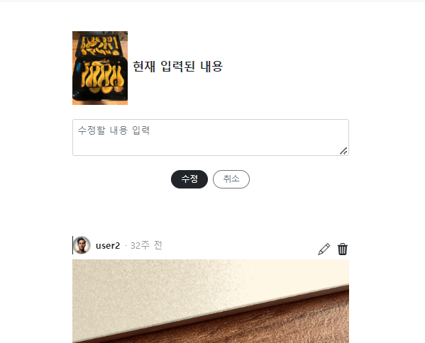
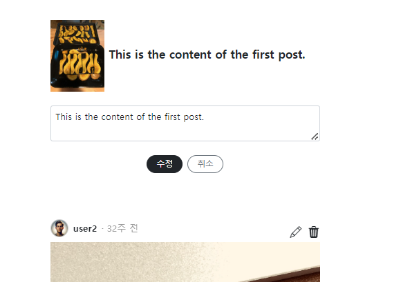

- 참고 유튜브(flask+htmx): https://www.youtube.com/watch?v=O2Xd6DmcB9g&list=WL&index=8&t=1842s
    - 참고 깃허브(fastapi + htmx + pydantic): https://github.dev/sammyrulez/htmx-fastapi/blob/main/templates/owner_form.html

### htmx는 hx-요청 전에, 고정데이터template + hx route부터 만들기

#### edit_form.html를 partials로 + 화면요청용 hx_get_route 만들기

1. 아직 고정 데이터지만, htmx응답으로 보내기 위해, post/`partials`/edit_form.html으로 뺀다.
    2. 이제 edit_form.html를 렌더해줄 hx_get_route를 만든다.
        - 굳이 htmx 처리용일필요가 없다 단순 화면만 렌더링한다.
        - **post_id가 path로 오면, 조회해서 edit_form을 채워줄 준비를 한다.**
        - edit form을 채울 현재 post를 조회해서 같이 넘겨준다.
        ```python
        @app.get("/posts/{post_id}/edit_form/", response_class=HTMLResponse)
        async def pic_hx_get_edit_form(
                request: Request,
                post_id: int,
        ):
            post = get_post(post_id, with_user=True)
            context = {
                'request': request,
                'post': post,
            }
            return templates.TemplateResponse("picstragram/post/partials/edit_form.html", context)
     
        ```
    3. for post in posts에서 `edit버튼`에 `자신의{{post.id}}와 함께 hx-get요청`을 걸어, edit form을 가져오게 한다.
        - **이 때, `hx-get은 i태그에 a태그를 입혀서` 하되, `hx-target은 최상위 container`에 건다.**
        - **`최상위태그에 걸어서 hx-target="this"`를 걸고 hx-swap 기본옵션도 넣어준다.**
        ```html
     
        
            
                <div class="container" hx-target="this" hx-swap="outerHTML">
                    <article class="post">
                        <div class="header">
                            <div class="header-icons">
                                <a hx-get="{{ url_for('pic_hx_get_edit_form', post_id= post.id ) }}" style="cursor: pointer;">
                                    <i class="bi bi-pencil"></i>
                                </a>
                                <i class="bi bi-trash3-fill"></i>
                            </div>
                        </div>
                    </article>
                </div>
            
        
        ```
       

#### partials의 고정데이터를 route에서 넘겨준 데이터로 교체

4. 이제 route에서 넘겨준 post데이터를 이용해, edit_form.html의 고정데이터를 동적데이터로 바꿔준다.
    ```html
        <div class="container">
            <article class="post">
                <div class="contents">
                    <div class="d-flex align-items-center mb-4">
                        
                        <h5 class="fs-7 fw-bold">{{ post.content }}</h5>
                    </div>
                    <form hx-put="{{ url_for('pic_update_post', post_id=post.id) }}"
                          hx-ext='json-enc'
                    >
                        <textarea rows="2" class="form-control mt-3 mb-4 px-2"
                                  name="content"
                                  placeholder="수정할 내용 입력">{{ post.content }}</textarea>
                        <div class="d-flex align-items-center gap-2 text-sm mb-5 flex-wrap justify-content-center">
                            <button type="submit" class="btn btn-sm btn-dark rounded-pill px-3 py-1">수정</button>
                            <button class="btn btn-sm btn-outline-secondary rounded-pill px-3 py-1">취소</button>
                        </div>
                    </form>
                </div>
            </article>
        </div>
    ```
   

### 수정은 updated_post로 + 취소는 기존 post로 -> 둘다 1개짜리 post.html 렌더 + 반복문은 include 처리

1. post1개 부분을 post/post.html로 뺀다.
    - 내부에서 for post in posts의 post를 사용하고 있지만,
    - 현재 자리든 / 수정form 수정or취소든 post 변수는 항시 던져주고 있을 것이다.
    - **원래 home/index.html에 있던 반복문 내부 자리에서는 `include '경로/post.html'`로 반복되게 한다.**
    ```html
    
        
            
        
    ```

    2. 이제 수정 요청 route에서는 `hx_request`일 경우, 수정된 post데이터를 post.html의 context로 넣어 렌더링한다.
        - **`hx_request: Optional[str] = Header(None)`를 파라미터로 활용해서, htmx요청을 확인할 수 있다.**
        ```python
        @app.put("/posts/{post_id}", response_model=Union[PostSchema, str])
        async def pic_update_post(
                request: Request,
                post_id: int,
                response: Response,
                updated_post_req: UpdatePostReq,  # hx-exc="json-enc"로 오는 form
                # data: dict = Depends(FormTo(UpdatePostReq)), # 순수 form
                hx_request: Optional[str] = Header(None)
        ):
            data = updated_post_req.model_dump()
     
            try:
                post = update_post(post_id, data)
            except Exception as e:
                response.status_code = 400
                return f"Post 수정에 실패했습니다.: {e}"
     
            if hx_request:
                context = {
                    'request': request,
                    'post': post,
                }
                return templates.TemplateResponse("picstragram/post/post.html", context)
     
            return post
        ```

    3. 이 때, post 1개를 반환하더라도, 원래 데이터와 동일해야하므로 with옵션으로 다시 조회해서 반환한다.
        ```python
        try:
            update_post(post_id, data)
        except Exception as e:
            response.status_code = 400
            return f"Post 수정에 실패했습니다.: {e}"
     
        post = get_post(post_id, with_user=True, with_comments=True, with_likes=True, with_tags=True)
        ```
    4. post.html에서 추가로 수정됨을 표시한다.
        ```html
        <div class="time">{{ post.updated_at | feed_time }} (수정됨)
        ```

    5. edit_form.html에서도 `hx-target="this"`를 container에 걸어서, 최상위 태그가 hx-swap되게 한다.
        ```html
        <div class="container" hx-target="this" hx-swap="outerHTML">
        ```

### 취소는 현재 post 1개 그대로 반환하는 처리를 [개별조회 get_route]에서 hx_request확인하여 반환하자.

```python
@app.get("/posts/{post_id}", response_model=Union[PostSchema, str])
async def pic_get_post(
        request: Request,
        post_id: int,
        response: Response,
        hx_request: Optional[str] = Header(None)
):
    post = get_post(post_id, with_user=True, with_comments=True, with_likes=True, with_tags=True)

    # edit_form 취소시 개별조회 post를, html과 함께  반환
    if hx_request:
        context = {
            'request': request,
            'post': post,
        }
        return templates.TemplateResponse("picstragram/post/post.html", context)

    if post is None:
        response.status_code = 404
        return "Post 정보가 없습니다."

    return post
```

- 이 때, **edit_form.html에서 `수정`버튼은, submit을 수행하는데 반해 `취소`버튼은 `hx-get`을 요청하되 `hx-target`이 이미 수정버튼시 최상위태그에 달아났기 때문에, 그대로
  적용된다.**
    - **hx-요청이 여러개로서 `현재 partials가 여러hx-요청에 응답`해야할 땐, hx-요청은 각 요청버튼에 / hx-target은 최상위태그에 1개를 유지해서 처리되게 한다.**

```html

<div class="d-flex align-items-center gap-2 text-sm mb-5 flex-wrap justify-content-center">
    <button type="submit" class="btn btn-sm btn-dark rounded-pill px-3 py-1">수정</button>
    <button class="btn btn-sm btn-outline-secondary rounded-pill px-3 py-1"
            hx-get="{{ url_for('pic_get_post', post_id=post.id) }}"
    >취소
    </button>
</div>
```

### 제자리 삭제는 edit_form 최상위 hx-target에  _empty.html를 던져주면 된다.

1. 삭제 route에서, hx_request를 활용하여, hx-요청인 경우, **빈 `_empty.html`를 생성하여 반환**해서 삭제가 완료되어 화면에서 사라지게 한다.
    ```python
    @app.delete("/posts/{post_id}", )
    async def pic_delete_post(
            request: Request,
            post_id: int,
            response: Response,
            hx_request: Optional[str] = Header(None)
    ):
        try:
            delete_post(post_id)
        except Exception as e:
            response.status_code = 400
            return f"Post 삭제에 실패했습니다.: {e}"
    
        # post 삭제시 빈 html를 반환하여 삭제 처리
        if hx_request:
            context = {
                'request': request
            }
            return templates.TemplateResponse("picstragram/empty.html", context)
    
        return "Post 삭제에 성공했습니다."
    ```

2. **삭제의 경우, post.html에서 쓰레기통 아이콘에 a태그를 준 뒤, `hx-confirm=""`을 추가하여 확인받고 삭제하게 한다.**
    ```html
    <div class="header-icons">
        <a hx-get="{{ url_for('pic_hx_get_edit_form', post_id= post.id ) }}" style="cursor: pointer;">
            <i class="bi bi-pencil"></i>
        </a>
        <a hx-delete="{{ url_for('pic_delete_post', post_id= post.id ) }}"
           hx-confirm="정말 삭제하시겠습니까?"
           style="cursor: pointer;"
        >
            <i class="bi bi-trash3-fill"></i>
        </a>
    </div>
    ```


3. **제자리 edit에 대해 `swap transitions`를 걸 수 있다.**
    - **[문서](https://htmx.org/examples/animations/)**
    1. **style태그로 `.htmx-swapping`을 포함하여 opacity + transition을 설정한ㄷ 뒤**
        - 나는 적용시킨 모든 것에 걸려고 앞에 구체적인 태그나 클래스 없이 바로 base.html에 정의함.
        - **예제는 css도 1s -> swap:1s인데, 나는 둘다 .5s로 맞췄다.**
    ```html
    <!-- htmx -->
    <script src="https://unpkg.com/htmx.org@1.6.1"
            integrity="sha384-tvG/2mnCFmGQzYC1Oh3qxQ7CkQ9kMzYjWZSNtrRZygHPDDqottzEJsqS4oUVodhW"
            crossorigin="anonymous">
    </script>
    <script>
        htmx.config.useTemplateFragments = true; // table row 조작을 위한 설정
        // 없으면 htmx-swap 에러가 남 : htmx.org@1.6.1:1 Uncaught TypeError: e.querySelectorAll is not a function
    </script>
    <script src="https://unpkg.com/htmx.org/dist/ext/json-enc.js"></script>
    <!-- hx-swap에 swap:1s 를 달면, transition이 적용되도록-->
    <style>
        .htmx-swapping {
            opacity: 0;
            transition: opacity .5s ease-out;
        }
    </style>
    ```
2. hx-swap="종류 swap:1s" 형태로 `swap:Xs`를 걸면, 자동으로 적용된다.
    - post.html의 최상위태그 + edit_form.html의 최상위태그의 hx-swap에 모두 적용시켜줬따.
    ```html
    <div class="container" hx-target="this" hx-swap="outerHTML swap:.5s">
    ```
    ```html
    <div class="container" hx-target="this" hx-swap="outerHTML swap:.5s">
    ```