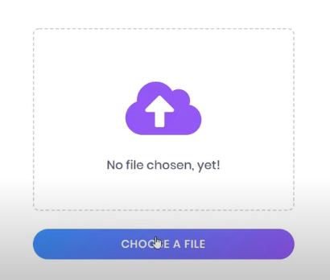
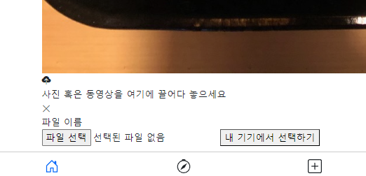
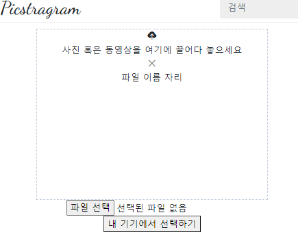
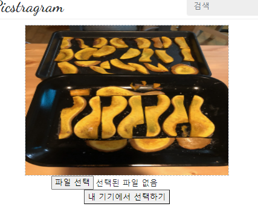
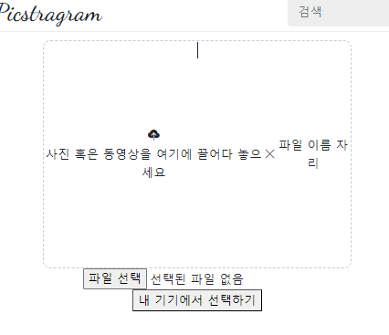
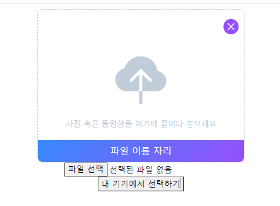
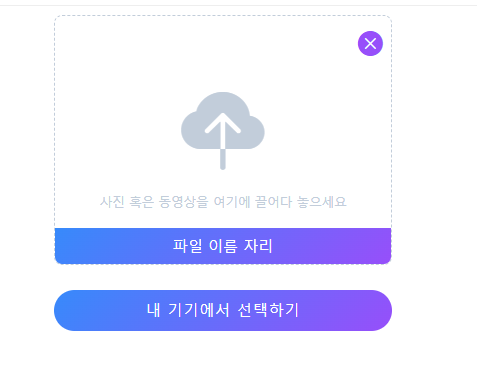
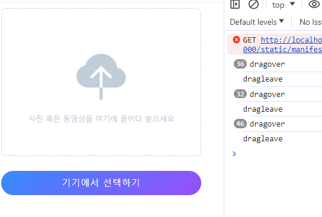
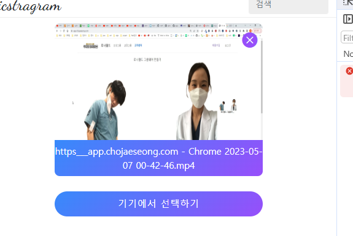
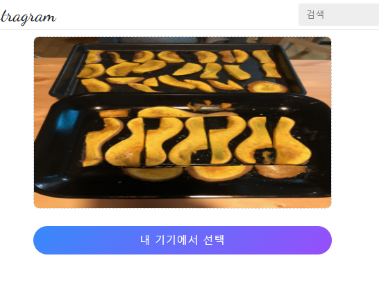

- 장고+modal+htmx 참고 유튜브: https://www.youtube.com/watch?v=3dyQigrEj8A&list=PLh3mlyFFKnrmo-BsEAUtfc9eazfswjvAc
- 로그인 참고 깃허브(fastapi + htmx + pydantic): https://github.dev/sammyrulez/htmx-fastapi/blob/main/templates/owner_form.html
- tagify 정리
  블로그: https://inpa.tistory.com/entry/Tagify-%F0%9F%93%9A-%ED%95%B4%EC%8B%9C-%ED%83%9C%EA%B7%B8tag-%EC%9E%85%EB%A0%A5%EC%9D%84-%EC%9D%B4%EC%81%98%EA%B2%8C-%EA%B0%84%ED%8E%B8%ED%9E%88-%EA%B5%AC%ED%98%84-%EC%82%AC%EC%9A%A9%EB%B2%95

- preview image upload(18분): https://www.youtube.com/watch?v=AYjOyQhZiK0&t=949s
    - php multiple + progress(21분)대박: https://www.youtube.com/watch?v=lniUevJnEa4
    - multiple file uploads(30분): https://www.youtube.com/watch?v=_xDCVt1F6O0&t=979s

- dropzone 정리
  -
  블로그: https://inpa.tistory.com/entry/Dropzone-%F0%9F%93%9A-%EC%9D%B4%EB%AF%B8%EC%A7%80-%ED%8C%8C%EC%9D%BC-%EC%97%85%EB%A1%9C%EB%93%9C-%EB%93%9C%EB%9E%98%EA%B7%B8-%EC%95%A4-%EB%93%9C%EB%A1%AD-%EB%9D%BC%EC%9D%B4%EB%B8%8C%EB%9F%AC%EB%A6%AC-%EC%82%AC%EC%9A%A9%EB%B2%95
    - 추후 적용할 때, 미리 업로드 안시키려면, `autoProcessQueue: false,`는 나와있는데, `autoQueue: true`는 켜져있어야 init 에서 건 submit 이벤트가 작동함.

### modal body에 올릴 create_form.html부터 먼저 만든다.

1. 원래는 modal 전, modal에 올릴 페이지를 먼저 xxx.html로 미리 만들어져있어야한다.
2. post/`_field_preview_input.html`을 먼저 만들고, base에 적용되기 위해 `extends` + `content block`내부에 해당 내용을 작성한다.
3. test get route를 만들어 화면을 관찰한다.

```html

 test 




```

```python
@app.get("/test", )
async def test(
        request: Request,
        response: Response,
):
    context = {'request': request}
    return templates.TemplateResponse("picstragram/post/_field_preview_input.html", context)
```

#### preview image upload

- 예상 이미지
  

1. 필요한 요소들을 미리 다 나열해놓는다.
    - .container
        1. .wrapper
            - .image > img
            - .content
                - .icon>i.bi.bi-x (업로드 아이콘)
                - .text{사진과 동영상을 여기에 끌어다 놓으세요}
            - div#cancel-btn > i.bi.bi-x (삭제 아이콘)
            - div.file-name{파일 이름}
        2. input#default-btn[type="file"]
        3. button#custom-btn{내 기기에서 선택}

    ```
    .container>.wrapper+input#default-btn[type="file"]+button#custom-btn{내 기기에서 선택하기}
    ```
    ```html
    
     test 
    
    
        <div class="preview-container">
            <div class="wrapper">
                
            </div>
            <input type="file" id="default-btn">
            <button id="custom-btn">내 기기에서 선택하기</button>
        </div>
    
    ```

2. .wrapper안에, 공간은 div.class로, 작동요소들은 태그#id로 채워준다.
    ```html
    <div class="wrapper">
        (.image>img)+(.content>.icon+.text)+(div#cancel-btn+.file-name{파일 이름})
    </div>
    ```

3. img태그에는 예시이미지를 + 아이콘이 필요한 자리에는 bi 아이콘을 채워준다.
    ```html
    <div class="wrapper">
        <div class="image">
            
        </div>
        <div class="content">
            <div class="icon"><i class="bi bi-cloud-upload-fill"></i></div>
            <div class="text">사진 혹은 동영상을 여기에 끌어다 놓으세요</div>
        </div>
        <div id="cancel-btn"><i class="bi bi-x-circle-fill"></i></div>
        <div class="file-name">파일 이름 자리</div>
    </div>
    ```
   

    - 너무 큰 원본이미지의 img태그는 주석처리하고 css를 적용한다.
4. container의 크기를 4:3정도로 주고, wrapper를 dashed한 border를 w100에 h만 좀 더 작게 준다.
    ```html
    
    <style>
        .preview-container {
            width: 430px;
            height: 350px;
        }
    
        .preview-container .wrapper {
            width: 100%;
            height: 300px;
            border: 2px dashed #c2cdda;
            background: #fff;
        }
    </style>
    ```
   
5. 드래그영역 .wrapper가 모서리를 둥글게 하되, .image가 100%로 채울 예정이므로, overflow-hidden도 같이 준다.
    ```css
    .preview-container .wrapper {
        width: 100%;
        height: 300px;
        border: 2px dashed #c2cdda;
        background: #fff;
    
        border-radius: 10px;
        overflow: hidden;
    }
    ```

6. dashed wrapper에 자식들인 .image공간 및 .content 내부요소들을 가운데 정렬하기 위해 d-flex 수평/수직 가운데정렬한다.
    ```html
    <div class="wrapper d-flex justify-content-center align-items-center">
    ```

7. .wrapper내부를 .image공간을 꽉 채우기 위해 `.wrapper에는 postition-relative`를 자식 `.image`에는 `position-absolute + w100 h100`로
   wrapper를 떠서 채우고
    - 더 자식인 `img`도 떠있는 부모 .image를 `w100 w100 object-fit-cover`로 채운다.
    ```html
    
    <div class="wrapper d-flex justify-content-center align-items-center position-relative">
        <div class="image position-absolute w-100 h-100">
            
    ```
   
    - .content를 컨트롤하기 위해 **img태그를 다시 주석처리한다.**
      

8. 이제 .icon공간의 i태그를  `i태그의 부모인 .icon공간`에서 `font-size, font-weight, color`로 styling한다.
    - 참고로 `X 취소실행하는 i태그`는 div.icon공간이 아니라, `div#cancel-btn공간`으로 만들었으며, 2개가 크기나 여러가지가 다르다.
        - relative였던 .wrapper의 우측상단으로 보내기 위해 position-absolute를 준다.
    - 참고메세지 .text가 있고,
    - 파일이름이 추후 hover하면 나올 예정이다.
        - .wrapper의 아래쪽에서 붙이기 위해 `position-absolute` + bottom 0` +  `w-100`로 가고. padding으로 상하간격을 준다.
        - background를 linear-gradient로 준다.
    ```css
    .wrapper .icon {
        font-size: 100px;
        color: #c2cdda;
    }
    
    .wrapper #cancel-btn {
        position: absolute;
        top: 10px;
        right: 10px;
    
        font-size: 30px;
        font-weight: bolder;
        color: #9658fe;
        cursor: pointer;
    }
    
    .wrapper .text {
        font-size: 15px;
        font-weight: 500;
        color: #c2cdda;
    }
    
    .wrapper .file-name {
        position: absolute;
        bottom: 0;
    
        width: 100%;
        background: linear-gradient(135deg, #3a8ffe 0%, #9658fe 100%);
    
        color: #fff;
        font-size: 18px;
        padding: 8px 0;
    }
    ```
   

9. **실제 input태그인 `input#default-btn`은 `hidden`속성으로 사실상 숨겨놓고 처리한다.**
    - **`input#default-btn`의 input태그 대신, `button#custom-btn`의 button태그로 커스텀한다.**
    - custom input인 button태그를 css로 꾸밀 때는
        - `mt-30px`로 위쪽여백을 주고
        - 현재 .container를 `w-100`으로 채우고, `height는 50px로 고정`한다.
        - display: block으로 다른요소가 못끼게 만들고
        - `border+outline(클릭시 나오는창):none + border-radius + color/fs/fw + letter-spacing + text-transform:uppercase; + cursor:pointer + background:linear-gradient`
          의 조합으로 꾸며준다.
    ```html
    <input type="file" id="default-btn" hidden>
    ```
    ```css
    .preview-container #custom-btn {
        margin-top: 30px;
        width: 100%;
        height: 50px;
        display: block;
    
        border: none;
        
        border-radius: 25px;
        color: #fff;
        font-size: 18px;
        font-weight: 500;
        letter-spacing: 1px;
        text-transform: uppercase;
    
        cursor: pointer;
        background: linear-gradient(135deg, #3a8ffe 0%, #9658fe 100%);
    }
    ```
   

10. 이제 취소버튼과 파일이름을 boostrap(!important)가 아닌 css로 `display:none`으로 주고, js를 이용해서 그림이 입력됬을 때 처리되도록 해야한다.
    ```css
            .wrapper #cancel-btn {
    
        display: none;
    }
    
    .wrapper .file-name {
    
        display: none;
    }
    ```
    - 먼저, 2개의 버튼을 script태그안에서 querySelector로 잡고
    - 커스텀 버튼태그에 onclick=""을 걸어서, defaultBtn이 click되게 한다.
    ```html
    <button id="custom-btn" onclick="defaultBtnActive()">기기에서 선택하기</button>
    
    <script>
        const defaultBtn = document.querySelector("#default-btn");
        const customBtn = document.querySelector("#custom-btn");
    
        function defaultBtnActive() {
            defaultBtn.click();
        }
    
    </script>
    ```
    - **커스텀버튼을 클릭해서, hidden된 input태그가 클릭되는지 확인한다.**

11. 커스텀button -> 디폴트input에 파일입력시 `chnage`이벤트가 발생하는데, 프리뷰img태그를 셀렉해놓고, input태그의 file정보를 src로 입력시킨다.
    - 쿼리셀렉터로 찾기 위해 `id="preview-img"`를 주고, 주석을 일단 풀어준다.
        - static 고정이미지의 `src=""`를 비워두면, 그림상자가 뜨는데 alt=""를 빈값을 줘서 안나오게 한다.
        - **나의 경우, 계속 떠서 `d-none`을 `css로 지정` 해두고, input태그 change -> file가져와서 입력시 display:block으로 바꿔줄 생각이다.**
        - **bootstrap d-none은 내부 disploy:none`!important`로서 javascript로 style.display에 줘도 안변하게 된다.**
          ```css
          .wrapper #preview-img {
                display: none;
            }
          ```
    - `defaultBtn.addEventListener("change", function () {}`로 change이벤트를 걸어줘서 내부에
    - this = input태그 .files[0]으로 입력된 파일 1번째를 가져온 뒤, new FileReader객체 생성 -> .onload 리스너 걸어주기
        - onload리스너에서는 1) reader객체의 결과물을 img태그.src에 넣고, 2)img태그를 보이게 하기
    ```js
            defaultBtn.addEventListener("change", function () {
        const file = this.files[0];
    
        if (file) {
            const reader = new FileReader();
            reader.onload = function () {
                const result = reader.result;
                previewImg.src = result;
                previewImg.style.display = "block";
            }
            reader.readAsDataURL(file);
        }
    });
    ```
    

12. 이제 input태그의 file에 대해, filename을 꺼내서 filenameDiv에 `.textContent`로 넣어줘야한다.
    - 일단 file-name div의 `display:none css를 주석풀고`, file의 이름을 넣어준다.
    - **input태그.onload에서 `this.value`가 파일의 전체경로를 의미한다.**
    - div태그.textContent로 string을 넣어줄 수 있다.
    ```js
    const filenameDiv = document.querySelector(".file-name");
    
    defaultBtn.addEventListener("change", function () {
        const file = this.files[0];
        
        //...
    
        const fileName = this.value;
        if (fileName) {
            filenameDiv.textContent = fileName;
            filenameDiv.style.display = "block";
        }
    });
    
    ```
    

13. 약속된 정규표현식을 이용해, filename의 전체경로 -> 맨 마지막 파일명만 추출하자.
    ```js
    let regExp = /[0-9a-zA-Z가-힣\^\&\'\@\{\}\[\]\,\$\=\!\-\#\(\)\.\%\+\~\_ ]+$/;
    //...
    filenameDiv.textContent = fileName.match(regExp);
    ```
    
    - 다시 file-name과 취소버튼을 display:none; css를 주고 hover시 나타나게 해야한다.

14. **일단 취소버튼 + filename의 `부모인 .wrapper`가 `file입력된상태 == .active추가`를 만들어주고**
    - `.부모.active:hover`일 때의 `취소버튼`의 display:block + 색변화
    - `.부모.active:hover`일 때의 `파일네임`의 display:block을 걸어준다.
    - **즉, 부모.acitve + 부모:hover시, 자식의 css변화를 만들어낸다.**
        - .active여부는 file입력시, 부모에 줘서, 자식들에게 개별로 안줘도 되게 한다.
        - **active에 의해 여러개가 바뀔땐, 부모에 active를 주고, `부모.active 자식`으로 처리하고**
        - **active+hover에 의해 여러개가 바뀔땐, 부모에 .active:hover를 , `부모.active:hover 자식`으로 처리하고**
    - 추가로 dashed를 사라지게 file업로드되서 .active가 붙으면 .wrapper에 `border:none;`이 되게 한다.
    - **이 때, .wrapper는 너무 많이 걸려서 `.preview-wrapper`로 이름 변경함.**
    ```css
    .preview-wrapper.active {
        border: none;
    }
    
    .preview-wrapper.active #cancel-btn {
        display: block;
    }
    
    .preview-wrapper.active .file-name {
        display: block;
    }
    ```
    ```js
    const previewWrapperDiv = document.querySelector(".preview-wrapper");
    
    defaultBtn.addEventListener("change", function () {
    
        if (file) {
            //...
            previewWrapperDiv.classList.add("active");
    
        }
    )
    ```
    

15. 파일을 올리면 나타나는게 아니라 추가조건으로 `.preview-wrapper`가 :hover됬을 때로 조건을 추가한다.
    - 취소버튼은, 부모의 .active:hover와 상관없이, 자신만의 hover를 추가해서, 색도 바뀌게 한다.

    ```css
    .preview-wrapper.active:hover #cancel-btn {
        display: block;
    }
    
    .preview-wrapper #cancel-btn:hover {
        color: #d74f73;
    }
    
    .preview-wrapper.active:hover .file-name {
        display: block;
    }
    ```
    
    


16. **이제 취소버튼 클릭시, `부모.wrapper`의 `.active`를 제거해, `자식들 display가 모두 사라지게` 만든다.**
    - 부모 조건하의 css는 부모조건이 사라지면 다 함께 사라지므로, 조건하에 display:block을 줬었다.
    - **파일입력되는 js순간에, 취소버튼에 클릭리스너가 달리게 한다.**
        - prewiew img태그는 src를 제거하고, display도 none으로 준다.
        - .wrapper는 .active 클래스를 classList에서 제거한다.
    ```js
    const cancelBtn = document.querySelector("#cancel-btn");
    
    defaultBtn.addEventListener("change", function () {
    
        const file = this.files[0];
    
        if (file) {
            //...
            cancelBtn.addEventListener("click", function () {
                previewImg.src = "";
                previewImg.style.display = "none";
    
                previewWrapperDiv.classList.remove("active");
            });
    
            reader.readAsDataURL(file);
    
        }
    ```

17. **같은 파일을 취소삭제하면 안올라가는데, 아무래도input태그 똑같은 파일이 들어가 있어서 그런 것 같다.**
    - input태그 초기화는  `.value="";`로만 들어있는 file을 초기화할 수 있다.
    ```js
    cancelBtn.addEventListener("click", function () {
        previewImg.src = "";
        previewImg.style.display = "none";
    
        previewWrapperDiv.classList.remove("active");
    
        defaultBtn.value = ""; // input[type="file"] 속 file 초기화
    });
    ```

#### drag & drop 적용하기

- [참고 유튜브](https://www.youtube.com/watch?v=lniUevJnEa4): 멀티파일이지만 참고해서 1개만 적용

1. preview-wrapper를 drag-area로서 생각하고, `"dragover"` 이벤트리스너를 달아준다.
    - 어떤 파일을 drag한상태로 놓지않았을 때 계속 적용된다.
    - 놓으면, drop이벤트가 발생하며 이미지가 자동으로 새창에 뜨게 되는 상태
    ```js
    previewWrapperDiv.addEventListener("dragover", function (e) {
        console.log("dragover")
    });
    
    ```
    - 클릭된 상태로 해당영역에 들어오면 "dragover", 빠지면 "dragleave"가 발생한다. 같이 걸어준다.
        - dragleave는 1번만 발생한다.
    ```js
    previewWrapperDiv.addEventListener("dragleave", function (e) {
        console.log("dragleave")
    });
    ```
   
2. **file onload됬을때 / 취소버튼을 누를 때처럼, wrapper의 `.active`를 drapover/drapleave에 추가/삭제해줘서, 대쉬가 사라지게 한다.**
    ```js
    // drag & drop
    previewWrapperDiv.addEventListener("dragover", function (e) {
        previewWrapperDiv.classList.add("active");
    });
    
    previewWrapperDiv.addEventListener("dragleave", function (e) {
        previewWrapperDiv.classList.remove("active");
    });
    
    ```


3. 이제 drop에 대한 이벤트도 만드는데, **dragover + drop 모두 e.prevent~ 를 해줘야 기본작동을 제거할 수 있다**
    - dragover의 기본동작: 계속 요청함
    - drop의 기본동작: 이미지를 새창에 띄움
    - **둘다 event를 통재하기 위해 e를 파라미터로 받아줘서 내부에서 사용**
    ```js
    // drag over/leave & drop
    previewWrapperDiv.addEventListener("dragover", function (e) {
        e.preventDefault();
        previewWrapperDiv.classList.add("active");
    });
    
    previewWrapperDiv.addEventListener("dragleave", function (e) {
        previewWrapperDiv.classList.remove("active");
    });
    
    previewWrapperDiv.addEventListener("drop", function (e) {
        e.preventDefault();
    });
    ```

4. 이제 drop에서 file정보를 받아처리해야한다.
    - **`e.dataTransfer.files[0]`으로 첫번째 file을 받아낼 수 있다. 하지만 인덱싱 전에 검사한다.**
    ```js
    // drop
    previewWrapperDiv.addEventListener("drop", function (e) {
        e.preventDefault();
    
        // drop시에도 파일을 처리
        const files = e.dataTransfer.files;
        if (files.length > 0) {
            const file = files[0];
    
            console.log(file)
        }
    });
    
    ```

5. **이제 `defaultBtn.addEventListener("change", ~)`의 `const file = this.files[0];`이후 처리와 동일하므로 중복된 코드를 함수로 빼서 처리하게 한다.**
    - input태그(defatultBtn)에 있던 `this`.value로 filename을 추출하는 것을 file객체.name으로 바꾼다?!
    ```js
    function setFileToPreview(file) {
    
        if (file) {
    
            const reader = new FileReader();
            reader.onload = function () {
                const result = reader.result;
                previewImg.src = result;
                previewImg.style.display = "block";
    
                previewWrapperDiv.classList.add("active");
    
            }
    
            cancelBtn.addEventListener("click", function () {
                previewImg.src = "";
                previewImg.style.display = "none";
    
                previewWrapperDiv.classList.remove("active");
    
                defaultBtn.value = ""; // input[type="file"] 속 file 초기화
            });
    
            reader.readAsDataURL(file);
        }
    
        // const fileName = this.value;
        const fileName = file.name;
        if (fileName) {
            filenameDiv.textContent = fileName.match(regExp);
        }
    }
    
    ```
    ```js
    defaultBtn.addEventListener("change", function () {
        const file = this.files[0];
    
        // 공통메서드로 추출
        setFileToPreview(file);
    });
    ```
    ```js
    // drop
    previewWrapperDiv.addEventListener("drop", function (e) {
        e.preventDefault();
    
        // drop시에도 파일을 처리
        const files = e.dataTransfer.files;
        if (files.length > 0) {
            const file = files[0];
    
            setFileToPreview(file);
        }
    });
    
    ```

#### 검증 추가

- [참고 유튜브의 블로그](https://www.slidesmaker.me/blog/upload-multiple-files-using-drag-and-drop-html-css-javascript)

1. file type이 이미지 or 동영상인지 확인하기
    - file.type을 split해서 첫번재것만 확인한다. 아니라면 alert를 띄운다.
    - **이후, `setFiletoPreview(file)` 내부에서 `if(file)`의 조건에서 validateFileType도 동시에 만족해야 진행되도록 한다.**
    ```js
    function isValidFileType(file) {
        var splitType = file.type.split('/')[0]
        // if(type == 'application/pdf' || splitType == 'image' || splitType == 'video'){
        if( splitType == 'image' || splitType == 'video'){
            return true
        }
        alert('사진 혹은 동영상 파일만 업로드 가능합니다.');
        return false
    }
    
    function setFileToPreview(file) {
        if (file && isValidFileType(file)) {
    ```

#### 동영상이라면, thumbnail을 추출해서 보여주기

- chatgpt를 활용 & [블로그 검색](https://claver-pickle.tistory.com/50)을 통해
- **그래도 고용량 동영상은 timeout나서 추출안되는 것 같다.**

1. **video태그`.preload="auto"`로 재생가능한 상태로 만들어놓고, `canplay` 이벤트 리스너를 걸어, `canvas태그에 그려, 추출한다.`**
    - loaded , loadedmetadata도 가능하다고 하는데, 로드가 오래걸릴시 추출이 안된다.
    ```js
    // 비디오에서 이미지추출 by video태그 preload + canplay -> canvas태그 -> previewImg
    function setVideoThumbnailToPreview(videoDataURL) {
        // 1) 비디오 태그를 생성해놓고, src입력 + 음소거 + 재생가능상태로 만든다.
        const video = document.createElement('video');
        video.src = videoDataURL;
        video.muted = true;
        video.preload = "auto"; // 필수) 전체load대신, 재생가능 상태로 만들어서 on canplay 이벤트가 가능해짐.
    
    
        // 2) 재생가능시 이벤트리스너를 걸어서, canvas태그를 만들어, 이미지를 그린다.
        //    그린 이미지를 previewImg에 넣고 + FileReader가 읽은 URL를 revoke시킨다.
        video.addEventListener('canplay', function () {
            const canvas = document.createElement('canvas');
            const context = canvas.getContext('2d');
    
            canvas.width = video.videoWidth;
            canvas.height = video.videoHeight;
    
            // Draw the first frame of the video on the canvas
            context.drawImage(video, 0, 0, canvas.width, canvas.height);
    
            // Convert the canvas content to a data URL (thumbnail)
            const thumbnailDataURL = canvas.toDataURL();
    
            // Set the thumbnail as the source of the preview image
            previewImg.src = thumbnailDataURL;
            previewImg.style.display = "block";
            previewWrapperDiv.classList.add("active");
    
            // canvas 삭제
            canvas.remove();
    
            // Clean up resources + video 삭제
            URL.revokeObjectURL(video.src);
            video.remove();
        });
    }
    
    function setFileToPreview(file) {
        if (file && isValidFileType(file)) {
    
            const reader = new FileReader();
    
            reader.onload = function () {
                let result = reader.result;
    
                if (file.type.startsWith('video')) {
                    setVideoThumbnailToPreview(result);
                } else {
                    previewImg.src = result;
                    previewImg.style.display = "block";
                    previewWrapperDiv.classList.add("active");
                }
            }
    
    ```
   

#### 파일 사이즈 및 갯수 검증

1. 이미지는 `10MB`, 동영상은 `500MB` - 300MB까지는 thumbnail 추출확인함.으로 제한한다.
    - isValidSize(file)을 통해, file.size를 검증하고 실패시alert+ return false를 한다.
    - isValidFileType(file)과 같이 사용하여 early return하고, 2가지 메서드에 적용한다.
    ```js
    const MAX_IMAGE_SIZE_MB = 10;
    const MAX_VIDEO_SIZE_MB = 500;
     
    function isValidFileSize(file) {
        const fileSizeMB = file.size / (1024 * 1024); // Convert to megabytes
        if (file.type.startsWith('image/') && fileSizeMB > MAX_IMAGE_SIZE_MB) {
            alert(`이미지는 ${MAX_IMAGE_SIZE_MB}MB 이하의 파일을 업로드 해주세요`);
            return false;
     
        } else if (file.type.startsWith('video/') && fileSizeMB > MAX_VIDEO_SIZE_MB) {
            alert(`비디오는 ${MAX_VIDEO_SIZE_MB}MB 이하의 파일을 업로드 해주세요`);
            return false;
        }
     
        return true;
    }
    ```
   
2. input태그.change이벤트 + drop이벤트에 모두 동일하게 걸어준다.
    ```js
    defaultBtn.addEventListener("change", function () {
        const files = this.files;
        if (files.length <= 0 ) {
            return;
        }
        const file = files[0];
        // type & size 검증. 만약 유효하지 않으면 alert + return false;
        if (!(isValidFileType(file) && isValidFileSize(file))) {
            return;
        }
    
        // 공통메서드로 추출
        setFileToPreview(file);
    });
    ```
    ```js
    // drop
    previewWrapperDiv.addEventListener("drop", function (e) {
        e.preventDefault();
        // drop시에도 파일을 처리
        const files = e.dataTransfer.files;
    
        if (files.length <= 0 ) {
            return;
        }
        const file = files[0];
    
        // type & size 검증. 만약 유효하지 않으면 alert + return false;
        if (!(isValidFileType(file) && isValidFileSize(file))) {
            return;
        }
    
        // 공통메서드로 추출
        setFileToPreview(file);
    });
    ```
   


#### macro로 만들어서, 재활용 가능하도록
1. templates > `macros` > `_forms.html`을 만든다.
    - html명은 import에만 사용될 예정이므로 넓게 만들고, `alias.내부 macro명()`으로 사용될 것이다.
    - .container부터 시작하는 file input전체를 macro로 정의한다.
    - **``** 으로 시작하고, **``**로 끝난다.
    - **필수 변경사항들인 `width, height, main_color, input태그의 name, required여부`를 kwargs파라미터로 받고싶지만, macro는 args밖에 못받는다.**
      - 이 때, width, height는 단위까지 같이줘서 %와 px 모두 활용가능하게 한다. 
    - **대신, macro(인자1=, 인자2=)로 사용하며 -> macro내부에서 `kwargs`의 dict변수로 사용하면 된다.**
    - **`set`을 활용하여, 파라미터에서 못주는 기본값을 kwargs.get()과 연계해서 사용한다.**
    ```html
    
        {% set main_color = kwargs.get('main_color', 'linear-gradient(135deg, #3a8ffe 0%, #9658fe 100%)') %}
        
        
    
        
        
        <!-- 내용 -->
    
    ```

2. 이제 실제 create_form.html을 만들어서, block내부에서 macro를 keyword와 같이 사용해서 적용시킨다.
    ```python
    @app.get("/test",)
    async def test(
            request: Request,
            response: Response,
    ):
        context = {'request': request}
        return templates.TemplateResponse("picstragram/post/create_form.html", context)
    ```
    - macro html을 import하고 `as _form`의 alise로 받아서 `alias.매크로명(kwarg들을 입력)`해서 사용한다
    ```html
    
    
    
     test 
    
        {{ _form.preview_input(width='100%') }}
    
    
    
    ```
   

3. **form필드는 `edit`를 고려해서 `name`뿐만 아니라 `value`가 들어가야하고, img태그도 있는 경우 `src`도 같이 입력해줘야할 것이다.**
    - 추가로 `label`도 던져준다. 여기서의 label읜 custom-btn의 text를 의미한다.
    - 외부에서 keyword입력 -> macro는 파라미터X 내부에서 kwargs로 사용
    - previewImg도 `수정이라서 src가 존재`시에는 display가 나오도록 해줘야한다.
    ```html
    
    
    <input type="file" id="default-btn" name="{{ name }}" hidden {{ required }} value="{{ value }}">
    <button id="custom-btn" onclick="defaultBtnActive()">{{ label }}</button>
    ```
    ```css
    .preview-wrapper #preview-img {
        display: {{ 'block' if src else 'none'}};
    }
    ```
    ```html
    
    
    
     test 
    
        {{ _form.preview_input(
            width='100%',
            label='내 기기에서 선택',
            name='file',
            value='',
            src=request.url_for("uploads", path="images/post-0001.jpeg")
            ) }}
    
    
    ```
    