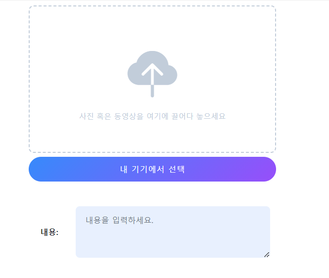
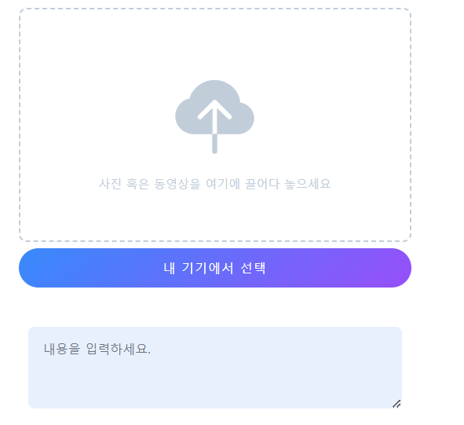
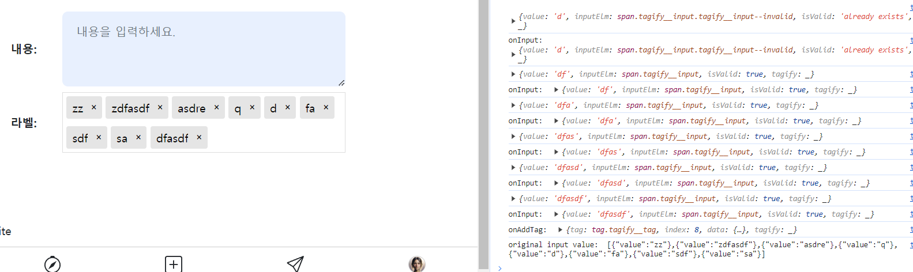
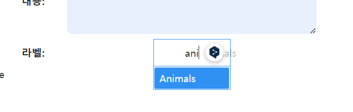

- 장고+modal+htmx 참고 유튜브: https://www.youtube.com/watch?v=3dyQigrEj8A&list=PLh3mlyFFKnrmo-BsEAUtfc9eazfswjvAc
- 로그인 참고 깃허브(fastapi + htmx + pydantic): https://github.dev/sammyrulez/htmx-fastapi/blob/main/templates/owner_form.html
- tagify 정리
  블로그: https://inpa.tistory.com/entry/Tagify-%F0%9F%93%9A-%ED%95%B4%EC%8B%9C-%ED%83%9C%EA%B7%B8tag-%EC%9E%85%EB%A0%A5%EC%9D%84-%EC%9D%B4%EC%81%98%EA%B2%8C-%EA%B0%84%ED%8E%B8%ED%9E%88-%EA%B5%AC%ED%98%84-%EC%82%AC%EC%9A%A9%EB%B2%95

### textarea 작성하기

- create_form.html에서 작성해서, 작성이 완료되면, macro로 옮기자.

1. **preview_input도 같이, `외부에 form > .container`가 있다고 생각하고 `div.자신-container`를 정의한 뒤
    - **`width/height`를 css로 입력가능하도록 정의한다.**
    - **이 때 외부 container에 대해 `mx-auto`로 가운데 위치하게 하고**
    - **`text-center`로 form요소들을 가운데 위치하게 한 뒤, 각 form요소들을 `w:100%;max-width: 통일px`로 같은 위치에 놓이게 하자.**
    - 기본적인 mb를 위해 `.form-group`을 입력하고,
    - **2컬럼으로 들어갈 거라 `.row`을 준 뒤, `label과 input(textarea)를 col-로 나눠서 준다`.**
        - 2:10으로 준 뒤, md부터 label을 나타나게 했다.
    - **label도 가운데 정렬이 되기 위해, 부모인 .body-container를 `.display:flex;lign-items:center;`를 css로 준다.**
    - input태그류들은 기본적으로 `.form-control`을 줘서, css가 적용되게 한다.
    ```css
    .form-control {
        display: block;
        width: 100%;
        padding: 0.375rem 0.75rem;
        font-size: 1rem;
        font-weight: 400;
        line-height: 1.5;
        color: #212529;
        background-color: #fff;
        background-clip: padding-box;
        border: 1px solid #ced4da;
        -webkit-appearance: none;
        -moz-appearance: none;
        appearance: none;
        border-radius: 0.25rem;
        transition: border-color .15s ease-in-out,box-shadow .15s ease-in-out;
    }
    ```
    ```html
    <style>
        .body-container {
            width: 100%;
            max-width: 500px;
            display: flex;
            align-items: center;
        }
    
        .body-container textarea {
            border-radius: 0.5rem;
            padding: 1rem 1.2rem;
            margin: 0.5rem 0;
            background-color: #e8f0fe;
            border: #e8f0fe;
            resize: vertical;
        }
    </style>
    <div class="body-container mx-auto text-center form-group row">
        <label class="d-none d-md-inline col-md-2 col-form-label fw-bold">
            내용:
        </label>
        <div class="col-md-10">
            <textarea rows="3" cols="5"
                      class="form-control"
                      placeholder="내용을 입력하세요."
            ></textarea>
        </div>
    </div>
    ```
   
   

2. macro화 시켜준다.
    ```html
    
        
        {% set width = kwargs.get('width', '100%;max-width: 500px;') %}
    
        
        
        
        
        
    
        
        
    
                    <style>
                    .body-container {
                        width: {{ width }};
                        display: flex;
                        align-items: center;
                    }
    
                    .body-container textarea {
                        border-radius: 0.5rem;
                        padding: 1rem 1.2rem;
                        margin: 0.5rem 0;
                        background-color: {{ bg_color }};
                        border: {{ bg_color }};
                        resize: vertical;
                    }
                </style>
                <div class="body-container mx-auto text-center form-group row">
                    <label class="d-none d-{{ two_col_size }}-inline col-{{ two_col_size }}-2 col-form-label fw-bold {{ label_class }}">
                        {{- label +': ' -}}
                    </label>
                    <div class="col-{{ two_col_size }}-10">
                        <textarea rows="3" cols="5"
                                  class="form-control {{ _class }}"
                                  name="{{ name }}"
                                  placeholder="{{label}}을 입력하세요."
                                  {{ required }}>
                        {{- value -}}</textarea>
                    </div>
                </div>
    
    
    
    ```

    ```html
    
    
    
     test 
    
        <form style="">
            <div class="container">
    
                {#        src=request.url_for("uploads", path="images/post-0001.jpeg"),#}
                {{ _form.preview_input(
                        width='100%;max-width:500px;',
                        label='내 기기에서 선택',
                        name='file',
                        value='',
                        _class='mb-5', btn_class='fs-6 mt-2'
                    ) }}
                {{ _form.two_col_textarea(
                        bg_color='#e8f0fe',
                        width='100%;max-width:500px;',
                        label='내용',
                        label_class='',
                        name='body',
                        value='',
                        _class='',
                        required=True,
                        two_col_size='md'
                    ) }}
            </div>
        </form>
    
    ```

### tagify
- 참고 블로그: https://inpa.tistory.com/entry/Tagify-%F0%9F%93%9A-%ED%95%B4%EC%8B%9C-%ED%83%9C%EA%B7%B8tag-%EC%9E%85%EB%A0%A5%EC%9D%84-%EC%9D%B4%EC%81%98%EA%B2%8C-%EA%B0%84%ED%8E%B8%ED%9E%88-%EA%B5%AC%ED%98%84-%EC%82%AC%EC%9A%A9%EB%B2%95
- 디자인 참고 페이지: https://awesomepixx.com/post/create/
- youtube 튜토리얼: https://www.youtube.com/watch?v=2J0C_x1cPB8
    - 추후 입력마다 서버에서 처리할거면 뒷부분 참고.
- fastapi geojson에 적용 github: https://github.com/jeankhawand/geojson-fastapi/blob/master/templates/index.html
- demo with code: https://www.mini-enjoy.com/tool/tagify/


1. body 끝에 js를 + header에 css를 추가해준다.
    - header는 extrastyle block에서 추가
    - js는 extra block에 추가한다. **둘다 현재페이지만 잠시 등장이므로 `super()`와 함께 활용한다.**
    - **js를 script block에 추가하면, 그 전에 tagify가 호출되므로 안된다. 같이 넣던지 여기의 경우  macro로 만들 것이기 때문에, scrip태그안에 같이 넣어준다.**
    ```html
    
        {{ super() }}
        <link href="https://unpkg.com/@yaireo/tagify/dist/tagify.css" rel="stylesheet" type="text/css"/>
    
    ```
2. 위에 만든 2칼럼 textarea의 코드를 참고해서, 2칼럼 form input에 대한 양식을 작성해놓는다.
    ```html
    
    <style>
        .xx-container {
            width: 100%;
            max-width: 500px;
            display: flex;
            align-items: center;
        }
    
        .xx-container xxx {
            width:100%;
        }
    </style>
    <div class="xx-container mx-auto text-center form-group row">
        <label class="d-none d-md-inline col-md-2 col-form-label fw-bold ">
            라벨:
        </label>
        <div class="col-md-10">
    
        </div>
    </div>
    ```

3. 참고 github를 보니, `type없는 name=""을 정한 input태그를 작성하고, js로 초기화 시켜준다."`
    - **대상이 정해지면, col에 100%로 들어가게 css를 완성시켜준다.

    ```css
    .xx-container input[name='tags'] {
        width: 100%;
    }
    ```
    
    ```html
    
    <div class="xx-container mx-auto text-center form-group row">
        <label class="d-none d-md-inline col-md-2 col-form-label fw-bold ">
            라벨:
        </label>
        <div class="col-md-10">
            <input name="tags">
        </div>
    </div>
    ```
   

4. script에서 tagify.js를 넣고, `그 아래` script태그에 input태그의 element를 잡고, Tagify를 초기화한다.
    - **add/remove/input/invalid 정도의 이벤트리스너를 달아준다. **
    ```html
    
    <script src="https://unpkg.com/@yaireo/tagify"></script>
    <script src="https://unpkg.com/@yaireo/tagify/dist/tagify.polyfills.min.js"></script>
    <script>
        let tagsInput = document.querySelector('input[name=tags]');
        let tagify = new Tagify(tagsInput, {
            
        });
    
        // Chainable event listeners
        tagify.on('add', onAddTag)
                .on('remove', onRemoveTag)
                .on('input', onInput)
                .on('invalid', onInvalidTag)
    
        // tag added callback
        function onAddTag(e) {
            console.log("onAddTag: ", e.detail);
            console.log("original input value: ", tagsInput.value)
            //tagify.off('add', onAddTag) // exmaple of removing a custom Tagify event
        }
    
        // tag remvoed callback
        function onRemoveTag(e) {
            console.log(e.detail);
            console.log("tagify instance value:", tagify.value)
        }
    
        // on character(s) added/removed (user is typing/deleting)
        function onInput(e) {
            console.log(e.detail);
            console.log("onInput: ", e.detail);
        }
    
        // invalid tag added callback
        function onInvalidTag(e) {
            console.log("onInvalidTag: ", e.detail);
        }
    </script>
    ```
    


5. **string array변수를 `whitelist`로 주고, 옵션에 whitelist: 에 넣어주고, `whitelist를 강제하면, 그것만 valid한것으로서 아니라면 자동 삭제 된다`**
    ```js
    let whitelist = ['Landscape', 'Animals', 'People', 'Urban', 'Black & White'];
    let tagify = new Tagify(tagsInput, {
        whitelist: whitelist,
        enforceWhitelist: true
       
    });
    ```
    
    
    - **Tags전체 리스트를 줘도 될 것 같다. `하지만, 나는 없는 태그도 만들어야하기 때문에 강제옵션은 제거한다.**


6. **form에서 전송할거면 `input태그에 hidden 속성`을 추가하라고 한다.**
    - 또한, view에서는 `readonly` 속성을 넣어서 나중에 view용으로 사용하면 될 듯하다?
    - **또한, 기본 input태그.value의 값이 [{"value":"1"},{"value":"2"},{"value":"3"},{"value":"4"}]`형태로 가기 때문에 `Schema의 name필드에 = Field(alias='value')`를 사용할 생각을 미리 해야한다.**
 
