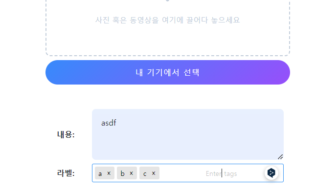

### shell plus에 Schema import 추가하기
```python
from shellplus import start_ipython, import_target, import_folder

import_target('/main.py', 'app')

import_target('schemas\picstagrams.py', '*')

start_ipython()

```
### pydantic
- **form data를 Body(...)로 한꺼번에 받는다면, `body:bytes`의 `'b가 붙고 쿼리스트링처럼 연결 + json.loads()필요`상태로 받는다.**
- **form data를 bytes가 아니라 `str or file형태로 json.loads()없이 개별+형변환` 받을라면 `as_form`을 구현**

1. post create_form에서 오는 tags를 위해 TagSchema외 Tag생성을 위한 `TagCreateReq`를 생성한다.
    ```python
    class TagCreateReq(BaseModel):
        # value: str
        name: str
    ```
   

2. 이 때, PostCreateReq에서는 List[TagCreateReq]로 들어와야한다.
    ```python
    class PostCreateReq(BaseModel):
        body: str
        tags: Optional[List[TagCreateReq]]    
    ```
   
3. 하지만 tags정보는 form내부에서 `&tags=[{"value":"1"},{"value":"2"},{"value":"3"},{"value":"4"}]`의 string array로 들어와서 List로 인식조차 안된다.
    - route에서 body:`bytes` Body(...)로 받아보고 확인한다.
    
    ```python
    @app.post("/test/post", )
    async def test_post(
            request: Request,
            response: Response,
            # body:str = Form(...)
            body:bytes = Body(...),
    ):
        print(f"body >> {body}")
        # body >> b'file=&body=asdf&tags=%5B%7B%22value%22%3A%22a%22%7D%2C%7B%22value%22%3A%22b%22%7D%2C%7B%22value%22%3A%22c%22%7D%5D'
    ```
4. form data를 bytes로 한번에 받는게 아니라 **`Form(..)`으로 맞게 `형변환 + url인코딩`까지해서 받는데**, **stirng array도 :`str`으로 받아야한다.**
    ```python
    @app.post("/test/post", )
    
    async def test_post(
            request: Request,
            response: Response,
            # content: bytes = Body(...),
            body: str = Form(...),
            tags: str = Form(...),
    ):
        print(f"body >> {body}")
        print(f"tags >> {tags}")
    # body >> asdf
    # tags >> [{"value":"ㅈ"},{"value":"ㅁ"},{"value":"ㅠ"}]
    ```

5. PostCreate의 form - name과 schema에서 content를 body로 잘못 오기했으니 수정한다.
    ```html
    {{ _form.inline_textarea(
            bg_color='#e8f0fe',
            width='100%;max-width:500px;',
            label='내용',
            label_class='',
            name='content',
            value='',
            _class='',
            required=True,
            two_col_size='md'
        ) }}
    ```
    ```python
    class PostCreateReq(BaseModel):
        content: str
        tags: str
    
    ```
    ```python
    @app.post("/test/post", )
    async def test_post(
            request: Request,
            response: Response,
            # body: bytes = Body(...),
            content: str = Form(...),
            tags: str = Form(...),
    ):
        print(f"content >> {content}")
        print(f"tags >> {tags}")
    # content >> a
    # tags >> [{"value":"a"},{"value":"b"},{"value":"c"}]
    ```
#### as_form: bytes타입의 전체가 아닌 str타입의 각 Form필드(to str) + File필드도 같이 처리하기 위한 @classmethod with Form(...), UploadFile(...)
1. 일단 bytes로 들어오는 것을 막기 위해서는 `Form(...)`을 활용하여 각 필드를 str로 받아야한다
    - **그 변환과정을 `route의 파라미터`가 아닌 `Schema 내부의 @cls method`로 정의한 뒤, `파라미터에 쓰기위한 의존성`로 간주하여, `파라미터 자리에 메소드호출하지않은체  Depends()에 주입`하여 사용한다.**
    - **라우터 파라미터에서 받는 것처럼, as_form의 파라미터에 입력한다.**
    ```python
    class PostCreateReq(BaseModel):
        content: str
        tags: str
    
        @classmethod
        def as_form(
                cls,
                content: str = Form(...),
                tags: str = Form(...)
        ):
            return cls(content=content, tags=tags)
    ```
   

2. route에서는 Schema.as_form의 clsmethod를 호출하지 않은체 Depends()에 넣어서 파라미터로 사용한다.
    ```python
    @app.post("/test/post", )
    async def test_post(
            request: Request,
            response: Response,
            # body: bytes = Body(...),
            # content: str = Form(...),
            # tags: str = Form(...),
            post_create_req: PostCreateReq = Depends(PostCreateReq.as_form),
    ):
        print(f"post_create_req >> {post_create_req}")
        # post_create_req >> content='a' tags='[{"value":"a"},{"value":"b"},{"value":"c"}]'
    ```
   
3. 여기서 문제는 tags가 `pydantic이 받아들일 수 있는 dict or list`가 아니라 `string array`라서, 
   - `json.loads()를 통해 python list로 미리 변형`해야만, `tags: Optional[List[TagCreateReq]]`형태로 받을 수 있게 된다.**

#### field_validator: input.value에 string array 등 데이터 변형을 위한 @field_validator + @classmethod

1. form에서 tagify에 name="tags"의 value가 string array `[{"value":"a"},{"value":"b"},{"value":"c"}]`로 들어오는데,
    - **pydantic의 `as_form`에서 cls()객체가 만들어지는 시점에는 `더이상 bytes가 아닌 str상태`로 들어오며** 
      - **as_form에서 `Form(...)으로 받은 순간`,`str`으로서 `array string을 직접 list로 변환`해줘야 원조 Schame에서 `List`[TagCreateReq]로 받을 수 있다.**
        - **array string을 python list로 변환하는 방법이 `json.loads()`다**
    - **이 때, `@field_validator('name명', mode="before")` + @classmethod로 `특정 name에 데이터에 대한 변환 메서드`를 정의해줄 수 있다.**
    ```python
    @field_validator('tags', mode="before")
    @classmethod
    def from_literal(cls, data: Any) -> Any:
        if isinstance(data, str):
            # data >> [{"value":"a"},{"value":"b"},{"value":"c"}]
            #  <class 'str'>
            converted_data = json.loads(data)
            # converted_data  >> [{'value': 'a'}, {'value': 'b'}, {'value': 'c'}]
            #  <class 'list'>
    
            return converted_data
    ```
   - **as_form -> tags:str = Form(...) -> schema `cls()로 가기전에 field_validator` -> schema cls()의 생성자로 들어감.**

2. **하지만 더 좋은 방법은, as_form에서 하나만 처리하면 된다.**
    - 만약, 1개의 데이터 -> 여러 파라미터로 처리해야하는 경우나 validation을 미리 하는 경우가 아니라면, field_validator를 굳이 안써도 된다.
    - **tags에 빈값 string -> None으로 전환될 수 있기 때문에 `if tags:`로 string이 존재할 때 변환한다.**
    ```python
    @classmethod
    def as_form(
            cls,
            content: str = Form(...),
            tags: str = Form(...)
    ):
        if tags:
            tags = json.loads(tags)
        return cls(content=content, tags=tags)
    ```

#### alias: front input.name변경을 위한 Field(alias=) 
1. 이제 front에서 보내주는 `[{'value': 'a'}, {'value': 'b'}, {'value': 'c'}]`를 tags: `List[TagCreateReq]`로 받을 때,
    - **object {`"value"`}값을 -> TagCreateReq에 맞게 {`"name"`}으로 바꿔줘야한다.**
    - **이것을 `value:str`으로 필드를 만드는 대신, `name: str = Field(alias='value')`를 통해 name="value"로 들어오는 input을 "name"으로 받을 수 있다.**
    ```python
    class TagCreateReq(BaseModel):
        # value: str
        name: str = Field(alias='value')
    ```
   
2. route에서 넘어오는 값이 아래와 같이 tags가 TagCrateReq의 list로 받아지게 된다.
    ```python
    # post_create_req  >> content='ㅁ' tags=[TagCreateReq(name='ㅁ'), TagCreateReq(name='ㅠ'), TagCreateReq(name='ㅊ')]
    ```
   

### Shellplus에서 테스트

- shell.py에 Schema를 import하고, 터미널에서 실행한다.
    ```python
    import_target('schemas\picstagrams.py', '*')
    
    start_ipython()
    
    # python ./shell.py
    ```


#### as_form이 아닌 일반 Schema의 테스트는 .parse_raw()에 string데이터를 넣는다.
- 대상
    ```python
    class TagCreateReq(BaseModel):
        # value (input[name=""]) -> name (Schmea-field)   
        name: str = Field(alias='value')
    ```
- **`parse_raw()`에 string데이터를 `{"value":"abc"}`형태의 `"value"`를 넣으면, Schema객체의 name필드에 들어가야한다**
    ```python
    TagCreateReq.parse_raw('{"value":"a"}')
    # TagCreateReq(name='a')
    ```


#### .as_form을 테스트하려면, cls(필드=)에 string을 넣는다.

```python
class PostCreateReq(BaseModel):
    content: str
    tags: Optional[List[TagCreateReq]]
```

```python

PostCreateReq.as_form(content="abc", tags='[{"value":"abc"}]')
# PostCreateReq(content='abc', tags=[TagCreateReq(name='abc')])

```