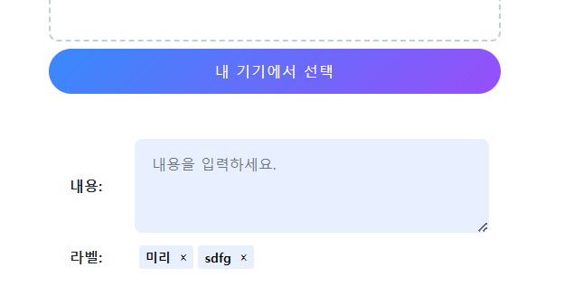
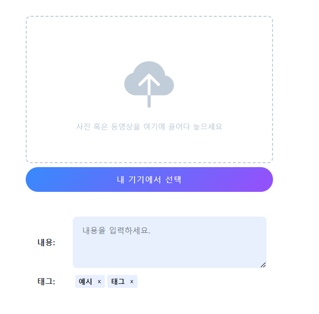

- 장고+modal+htmx 참고 유튜브: https://www.youtube.com/watch?v=3dyQigrEj8A&list=PLh3mlyFFKnrmo-BsEAUtfc9eazfswjvAc
- 로그인 참고 깃허브(fastapi + htmx + pydantic): https://github.dev/sammyrulez/htmx-fastapi/blob/main/templates/owner_form.html
- tagify 정리
  블로그: https://inpa.tistory.com/entry/Tagify-%F0%9F%93%9A-%ED%95%B4%EC%8B%9C-%ED%83%9C%EA%B7%B8tag-%EC%9E%85%EB%A0%A5%EC%9D%84-%EC%9D%B4%EC%81%98%EA%B2%8C-%EA%B0%84%ED%8E%B8%ED%9E%88-%EA%B5%AC%ED%98%84-%EC%82%AC%EC%9A%A9%EB%B2%95


1. input태그에 `.custom-tag`를 달고
    - border를 없애고
    - 글자를 굵게하고
    - tag배경색 -> border색 + 하버색을 변수로 동일하게 가져가고
    - 텍스트컬러 + remove btn배경컬러를 똑같이 주고
    - `--tag-inset-shadow-size`를 1.3em정도로 줘서, 줄긋기를 없앤다.
    ```css
    .custom-tags {
        border: none;
        font-weight: bold;
        --tag-bg: #e8f0fe;
        --tag-hover: var(--tag-bg);
        --tags-border-color: var(--tag-bg);
        --tag-text-color: black;
        --tag-remove-btn-bg--hover: black;
        --tag-inset-shadow-size: 1.3em;
    }
    ```
    - 이 때, **value=""에 `콤마로 연결된 값`을 미리 주면, 태그를 미리 입력할 수 있다.**
    ```html
    <input hidden name="tags"
           class="custom-tags form-control form-control-sm form-control-solid"
           placeholder="태그를 입력해주세요."
           value="미리, sdfg"
    >
    ```
   

2. **이 때, `미리 준 값은 value="콤마"`인데, tagify로 입력을 안했다면 `[{"value":"콤마"}]`형태가 아니라 value값이 그대로 넘어와서 json.loads()에러 난다.**
    - `| default('') | tojson` 태그를 이용해서 수정해놓고, whitelist로 다른이름으로 저장해놔야한다.
    - **tojson도 python obj -> string이기 때문에 javascript에서 쓸때는 `JSON.parse()로` 감싸줘야한다.**
    ```html
    <input hidden name="tags"
           class="custom-tags form-control form-control-sm form-control-solid"
           placeholder="태그를 입력해주세요."
           value="{{ default_tag_names | default('')}}"
    >
    
    ```
    ```
    let whitelist = JSON.parse({{ total_tag_names | default('[]')| tojson }});
    let tagify = new Tagify(tagsInput, {
        whitelist: whitelist,
    });
    ```

2. 매크로화한 뒤, 필요한 옵션들을 변수로 받는다.
    ```html
    
        
        
        {% set width = kwargs.get('width', '100%;max-width: 500px;') %}
    
        
        
        
        
        
    
        
        
    
    
                <style>
                    .tag-container {
                        width: {{ width }};
                        display: flex;
                        align-items: center;
                    }
    
                    .tag-container input[name='{{name}}'] {
                        width: 100%;
                    }
    
                    .custom-tags {
                        border: none;
                        font-weight: bold;
                        --tag-bg: {{ bg_color }};
                        --tag-hover: var(--tag-bg);
                        --tags-border-color: var(--tag-bg);
                        --tag-text-color: {{ text_color }};
                        --tag-remove-btn-bg--hover: var(--tag-text-color);
                        --tag-inset-shadow-size: 1.3em;
                    }
                </style>
    
                <div class="tag-container mx-auto text-center form-group row">
                    <label class="d-none d-{{ two_col_size }}-inline col-{{ two_col_size }}-2 col-form-label fw-bold {{ label_class }}">
                        {{- label +': ' -}}
                    </label>
                    <div class="col-{{ two_col_size }}-10">
                        <input hidden name="{{ name }}"
                               class="custom-tags form-control form-control-sm form-control-solid {{ _class }}"
                               placeholder="{{ label }}를 입력해주세요."
                               value="{{ default_tag_names | default('')}}"
                        >
                    </div>
                </div>
                <script src="https://unpkg.com/@yaireo/tagify"></script>
                <script src="https://unpkg.com/@yaireo/tagify/dist/tagify.polyfills.min.js"></script>
                <script>
                    let tagsInput = document.querySelector('input[name="{{name}}"]');
                    // init Tagify script on the above
                    //{#data = JSON.parse({{countries | tojson}})#}
                    let whitelist = JSON.parse({{ white_tag_names | default('[]')| tojson }});
                    let tagify = new Tagify(tagsInput, {
                        whitelist: whitelist,
                    });
    
                    // Chainable event listeners
                    tagify.on('add', onAddTag)
                        .on('remove', onRemoveTag)
                        .on('input', onInput)
                        .on('invalid', onInvalidTag)
    
                    // tag added callback
                    function onAddTag(e) {
                        console.log("onAddTag: ", e.detail);
                        console.log("original input value: ", tagsInput.value)
                        //tagify.off('add', onAddTag) // exmaple of removing a custom Tagify event
                    }
    
                    // tag remvoed callback
                    function onRemoveTag(e) {
                        console.log(e.detail);
                        console.log("tagify instance value:", tagify.value)
                    }
    
                    // on character(s) added/removed (user is typing/deleting)
                    function onInput(e) {
                        console.log(e.detail);
                        console.log("onInput: ", e.detail);
                    }
    
                    // invalid tag added callback
                    function onInvalidTag(e) {
                        console.log("onInvalidTag: ", e.detail);
                    }
                </script>
    
    
    ```
2. **`macro에서는 block사용 불가`라서 script태그로 header쪽 css부분에 해당하는 tagify.css를 제일먼저 같이 주기**
    ```html
    
    
    
    <link href="https://unpkg.com/@yaireo/tagify/dist/tagify.css" rel="stylesheet" type="text/css"/>
    <style>
    ```
3. 템플릿에서 사용하기
    ```html
    {{ _form.inline_tags(
            bg_color='#e8f0fe',
            text_color='black',
            width='100%;max-width:500px;',
            label='태그',
            label_class='',
            name='tags',
            default_tag_names='예시, 태그',
            white_tag_names='["예시", "태그"]',
            _class='',
            two_col_size='md'
        ) }}
    ```
   

### submit button

1. 일단 작성한다. view에서 tags를 바탕으로 작성하는데, 핵심은 버튼 2개라고 가정한다면
    - `container(d-flex for자식들) mx-auto + text-center(자신container의 부모에 대한가운데정렬)`상태에서
    - **자식들 버튼들의 간격을  `gap-x`로 2개의 버튼 사이를 벌린다.**
    - **버튼 2개든 1개든 그 위치를 버튼들의 부모인 container css에서 `justify-content: {{}}`의 변수로 설정하게 한다.**
    - 버튼(완료/취소)의 순서를 가지고 css를 주되, 취소버튼은 일정한 색으로 hover까지 주고, 완료버튼은 변수로 받는다.
    - **취소버튼 여부를 변수로 받는다. 취소버튼이 있다면 배경/글자색을 호버시 반대로 주고 + 배경이 채워질땐 border를 제거한다.**
    - **아직 매크로 외부이므로, `set`을 쓰되, kwargs.get() 없이 기본값으로서 미리 ``로 작성한다**

    ```html
    {%- set width = '100%;max-width: 500px;' -%}
    
    
    
    
    
    {%- set btn_bg_color = 'linear-gradient(135deg, #3a8ffe 0%, #9658fe 100%);' -%}
    
    
    
    
    
    
    
    
    <style>
        .submit-container {
            width: {{ width }};
            display: flex;
            align-items: center;
            justify-content: {{ justify_content }};
        }
    
        .submit-container > button {
            width: {{ btn_width }};
            height: {{ btn_height }};
            outline: none;
            font-size: 18px;
            font-weight: 500;
            letter-spacing: 1px;
            text-transform: uppercase;
            cursor: pointer;
    
            transition: background-color 0.2s, color 0.2s, border 0.2s;
        }
    
        .submit-container > button:nth-child(1) {
            border: none;
            background: {{ btn_bg_color }};
            color: {{ btn_font_color }};
        }
    
        .submit-container > button:nth-child(1):hover {
            background: #e8f0fe;
            color: black;
            font-weight: bold;
        }
    
        .submit-container > button:nth-child(2) {
            background: {{ cancel_btn_bg_color }};
            color: {{ cancel_btn_font_color }};
            border: 1px solid black;
        }
    
        .submit-container > button:nth-child(2):hover {
            border: none;
            background: {{ cancel_btn_font_color }};
            color: {{ cancel_btn_bg_color }};
        }
    </style>
    <div class="submit-container mx-auto text-center gap-{{ btn_gap }} text-sm">
        <button type="submit"
                class="btn btn-{{ btn_size }} rounded-pill px-3 py-1 {{ btn_class }}"
        >{{- btn_text -}}</button>
        
            <button type="button"
                    class="btn btn-{{ btn_size }} rounded-pill px-3 py-1 {{ btn_class }}"
            >{{- cancel_btn_text -}}</button>
        
    </div>
    ```


2. **set value에 kwargs.get('변수명','기본값')을 붙혀 매크로를 작성한다.**
    - 변수명도 따옴표를 붙혀서 string key로 가져와야한다.
    ```html
    {{ _form.submit_btn(width = '100%;max-width: 500px;',
            justify_content = 'end;',
            btn_width = 'auto;max-width: 200px;',
            btn_height = '50px;',
            btn_class =  'fs-6 mt-3',
            btn_size =  'sm',
            btn_bg_color = 'linear-gradient(135deg, #3a8ffe 0%, #9658fe 100%);',
            btn_text =  '게시하기',
            btn_font_color =  '#fff;',
            has_cancel_btn = True,
            btn_gap = '3',
            cancel_btn_text =  '취소',
            cancel_btn_bg_color = '#fff',
            cancel_btn_font_color = 'black'
            ) }}
    ```
