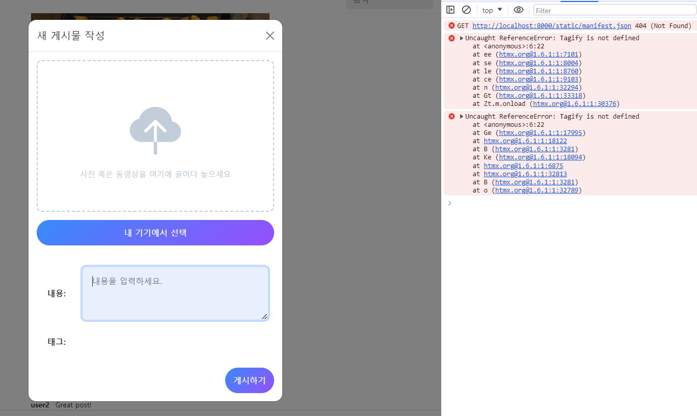
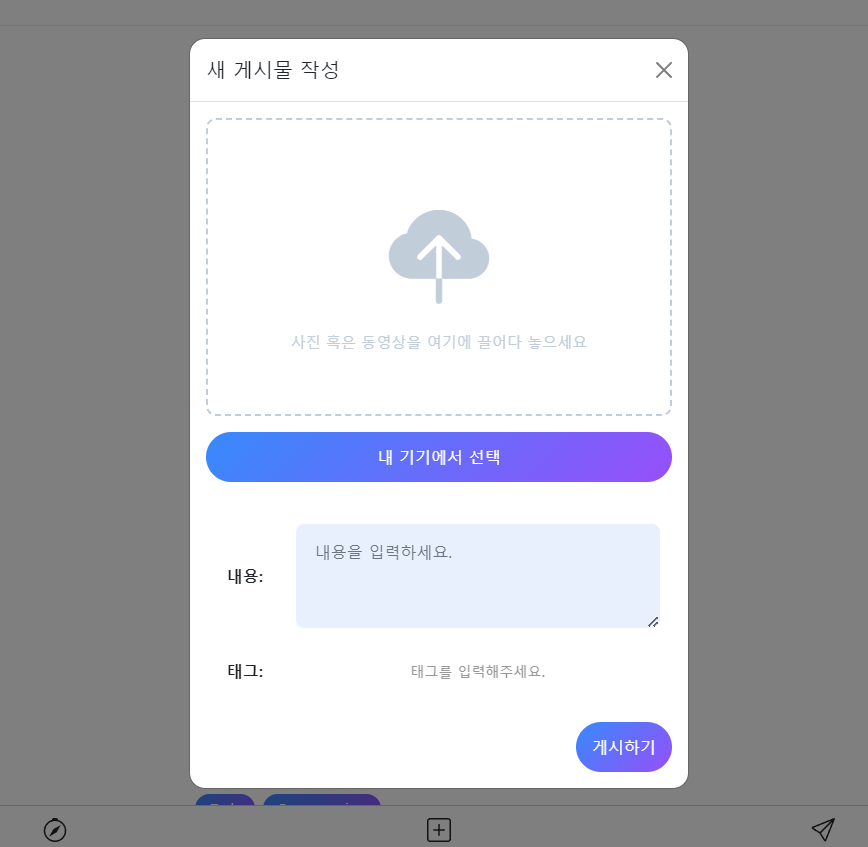

- 장고+modal+htmx 참고 유튜브: https://www.youtube.com/watch?v=3dyQigrEj8A&list=PLh3mlyFFKnrmo-BsEAUtfc9eazfswjvAc
- 로그인 참고 깃허브(fastapi + htmx + pydantic): https://github.dev/sammyrulez/htmx-fastapi/blob/main/templates/owner_form.html
- tagify 정리
  블로그: https://inpa.tistory.com/entry/Tagify-%F0%9F%93%9A-%ED%95%B4%EC%8B%9C-%ED%83%9C%EA%B7%B8tag-%EC%9E%85%EB%A0%A5%EC%9D%84-%EC%9D%B4%EC%81%98%EA%B2%8C-%EA%B0%84%ED%8E%B8%ED%9E%88-%EA%B5%AC%ED%98%84-%EC%82%AC%EC%9A%A9%EB%B2%95


#### boostrap5 modal to htmx modal

1. `_page_nav_bottom.html`에 있던 기본modal을 `_page_base.html`로 옮긴다.
    - body 내부 content block 아래 <-> script 위에 위치시키자.

2. 모달의 구조를 보면, 아래와 같이 `.modal.fade` > `.modal-dialog` > `.modal-content`로 구성되는데
    - **`.modal.fade` > `.modal-dialog` 는 base.html에 두고**
    - **`.modal-content`부터를 div대신 우리가 작성한 `form.html의 class에 추가할 것`이다.**
        ```html
        <div class="modal modal-blur fade" id="postModal" tabindex="-1" aria-labelledby="postModalLabel" aria-hidden="true">
            <div class="modal-dialog modal-dialog-centered">
                {# inject htmx here #}
                <!--<div class="modal-content">-->
        ```
    - **이 때, `div.modal-dialog가 hx-target`이 될 수 있게 `id=dialog`를 준다.**
        ```html
        <div class="modal-dialog modal-dialog-centered" id="dialog">
        ```
    - **base로부터 상속받는 행위를 멈추고, form태그에 `class="modal-content"`를 준다.**
        ```html
        <!-- post/creat_form.html-->
        
        {##}    
        {# test #}
        {##}
        
        
            <form class="modal-content"
                  action="{{ url_for('test_post') }}"
                  method="post"
                  enctype="multipart/form-data"
            >
        ```


3. boostrap modal의 구조에서 `.modal-content`아래에는
    - `.modal-header` + `.modal-body` + `.modal-footer`가 있다.
    - **`form.modal-content`로 시작하므로, 기존 form내용은 `div.modal-body`를 만들어서 씌운다.**
    - **`div.modal-header`도 따로 만들어서. 제목외 `닫기버튼`이 작동하도록 만들어준다.**
    - **div.modal-footer는 기존 xxx_form.html을 만들어서 제공한 것과 차이가 나기 때문에 생략한다.**
    ```html
    
    
    <!-- .modal-content  < (base) .modal-dialog < .modal  -->
    <form class="modal-content"
          action="{{ url_for('test_post') }}"
          method="post"
          enctype="multipart/form-data"
    >
        <!-- header -->
        <div class="modal-header">
            <h1 class="modal-title fs-5" id="modalLabel">새 게시물 작성</h1>
            <button type="button" class="btn-close" data-bs-dismiss="modal" aria-label="Close"></button>
        </div>
        <div class="modal-body">
            {#        src=request.url_for("uploads", path="images/post-0001.jpeg"),#}
            {{ _form.inline_preview_input(
                        width='100%;max-width:500px;',
                        label='내 기기에서 선택',
                        name='file',
                        value='',
                        _class='mb-5',
                        preview_div_class='',
                        content_div_class='',
                        btn_class='fs-6 mt-3',
                        btn_height="50px;",
                        btn_font_color="#fff;"
                    ) }}
    
    
            {{ _form.inline_textarea(
                        bg_color='#e8f0fe',
                        width='100%;max-width:500px;',
                        label='내용',
                        label_class='',
                        name='content',
                        value='',
                        _class='mb-3',
                        input_class='',
                        required=True,
                        two_col_size='md'
                    ) }}
    
            {#white_tag_names='["예시", "태그"]',#}
            {#default_tag_names='예시, 태그',#}
            {{ _form.inline_tags(
                        bg_color='#e8f0fe',
                        text_color='black',
                        width='100%;max-width:500px;',
                        label='태그',
                        label_class='',
                        name='tags',
                        default_tag_names='',
                        white_tag_names='["예시", "태그"]',
                        _class='mb-3',
                        input_class='',
                        two_col_size='md'
                    ) }}
    
    
            {{ _form.submit_btn(width = '100%;max-width: 500px;',
                        justify_content = 'end;',
                        btn_width = 'auto;max-width: 200px;',
                        btn_height = '50px;',
                        btn_class =  'fs-6 mt-3',
                        btn_size =  'sm',
                        btn_bg_color = 'linear-gradient(135deg, #3a8ffe 0%, #9658fe 100%);',
                        btn_text =  '게시하기',
                        btn_font_color =  '#fff;',
                        has_cancel_btn = True,
                        btn_gap = '3',
                        cancel_btn_text =  '취소',
                        cancel_btn_bg_color = '#fff',
                        cancel_btn_font_color = 'black'
                        ) }}
        </div>
    </form>
    ```


4. bs5 modal은 기본적으로 **`div.modal#id`를 버튼 속 `data-bs-modal="#id"`로 타겟팅하는데, 우리는 `div.modal-content`의 부모인 `div.dialog#id`를
   hx-taget으로 줄 것이다.**
    - 기존 타겟팅은 아래와 같다.
        ```html
        <li data-bs-toggle="modal" data-bs-target="#notsupportedModal">
            <svg xmlns="http://www.w3.org/2000/svg" width="16" height="16" fill="currentColor" class="bi bi-compass"
                 viewBox="0 0 16 16">
                <path d="M8 16.016a7.5 7.5 0 0 0 1.962-14.74A1 1 0 0 0 9 0H7a1 1 0 0 0-.962 1.276A7.5 7.5 0 0 0 8 16.016zm6.5-7.5a6.5 6.5 0 1 1-13 0 6.5 6.5 0 0 1 13 0z"/>
                <path d="m6.94 7.44 4.95-2.83-2.83 4.95-4.949 2.83 2.828-4.95z"/>
            </svg>
        </li>
        ```
    - **기본 `data-base-toggle`과 `data-bs-target`은 지우고, 버튼을 htmx로 바꿔준다.**
        ```html
        {#<li data-bs-toggle="modal" data-bs-target="#postModal">#}
        <li hx-get=""}}" hx-target="#dialog">
        ```


5. 이제 내부내용인 create_form.html을 내려줄 hx-get용 route를 만들고, hx-get에 입려해준다.
    ```python
    @app.get("/picstragram/form/posts/create", response_class=HTMLResponse)
    async def pic_hx_form_post_create(
            request: Request,
            hx_request: Optional[str] = Header(None),
    ):
        context = {
            'request': request,
        }
        return templates.TemplateResponse("picstragram/post/create_form.html", context)
    ```
    ```html
    {#<li data-bs-toggle="modal" data-bs-target="#postModal">#}
    <li hx-get="{{ url_for('pic_hx_form_post_create') }}" hx-target="#dialog">
    ```

6. `hx-target`인 #dialog의 `내부`로 create_form.html이 잘 나오는데
    - js가 깨지고
    - modal이 안보인다. **data-bs-toggle="modal"과 data-bs-target을="#modalId"를 안씀으로써 `직접 js로 modal을 띄우는 작업`을 홈페이지 보고 해야한다.**
    - modal > [Via Javascript](https://getbootstrap.com/docs/5.0/components/modal/#via-javascript)를 확인한다.
    - 이 때, document전체에 addEventListenr를 달아야하는데, htmx.on()을 통해 hx event에 대해 걸수 있다.


#### htmx event를 통한 bootstrap modal.show()

1. body 아래 js부분에 넣을  `hx_dialog.js`를 static/js에 만들고, base.html에 입력해준다.
    ```html
    
        <script src="https://cdn.jsdelivr.net/npm/bootstrap@5.1.3/dist/js/bootstrap.bundle.min.js"
                integrity="sha384-ka7Sk0Gln4gmtz2MlQnikT1wXgYsOg+OMhuP+IlRH9sENBO0LRn5q+8nbTov4+1p"
                crossorigin="anonymous">
        </script>
        <script src="{{ url_for('static', path='js/dialog.js') }}"></script>
    
    ```
2. 자동실행되는 function을 아래와 같이 만든다.
    ```js
    ;(function () {
        //...        
    })();
    ```

3. **base의 div.modal태그에 `id="modal"`를 주고, (functin(){})() 들어가기 전에 선택자를 잡아서 내부에서 사용한다.**
    ```html
    <div class="modal modal-blur fade" id="modal" tabindex="-1" aria-labelledby="modalLabel" aria-hidden="true">
    ```
    - 이 때, **부트스트랩.Modal() 객체**안에 선택자를 찾은 것을 넣어서 modal변수를 잡아준다.
    ```js
    var myModal = new bootstrap.Modal(document.getElementById('modal'));
    ```
   
4. htmx.on()을 사용하면 document.addEventListenr를 요약해서 사용할 수 있다.
    - **swap전체 이벤트 중, swap끝나고난뒤의 after이벤트를 `htmx:afterSwap`으로 잡을 수 있다.**
    - **이 때, function(evt)로 넘어오는 evnt에 대해 `evt.detail.target`의 `.id`가 modal안의 div.dialog#`dialog태그`의 dialog면, `modal의 swap이 끝난 후`로 생각하게 된다.**
    - 이 때 boostrap `modal객체.show()`를 해주면 된다.
    ```js
    var myModal = new bootstrap.Modal(document.getElementById('modal'));
    
    ;(function () {
        htmx.on('htmx:afterSwap', function (evt) {
            // swap되는 target부모가 dialog인 경우
            if (evt.detail.target.id === 'dialog') {
                myModal.show();
            }
        })
    })();
    
    ```
   
#### form macro안의 js는 htmx 렌더링시 제대로 작동안함 + 렌더링될 때 js변수도 다시 선언되어야하므로 let/const가 아닌 var로 바꿔야됨.ㄴ


1. htmx가 렌더링 될때 사용될 `의존성 있는 js css` script를 미리 `base or base상속 해당 페이지 상단`에 박아두어야한다.
    - **htmx 렌더링의 template에 script가 들어가면 인식이 안되더라. 편하려면 base에 박아두고, 아니라면, 렌더링 받는 페이지에 extrstyle에 박아둔다.**
    - _form 속 `` 내부에 넣었던 tagify js/css를 base에 미리 박아둔다.
    ```html
    # home/index.html
    
        <link href="https://unpkg.com/@yaireo/tagify/dist/tagify.css" rel="stylesheet" type="text/css"/>
        <script src="https://unpkg.com/@yaireo/tagify"></script>
        <script src="https://unpkg.com/@yaireo/tagify/dist/tagify.polyfills.min.js"></script>
    
    ```
   

2. 또한, script를 포함한 html 렌더링인 경우, const나 let변수를 제대로 인식이 안된다.
    - **form내부의 모든 javascript변수를 `var`로 변경해준다.**
    ```html
        <script>
            var previewWrapperDiv = document.querySelector(".preview-wrapper");
            var cancelBtn = document.querySelector("#cancel-btn");
            var defaultBtn = document.querySelector("#default-btn");
            var customBtn = document.querySelector("#custom-btn");
            var previewImg = document.querySelector("#preview-img");
            var filenameDiv = document.querySelector(".file-name");
            var regExp = /[0-9a-zA-Z가-힣\^\&\'\@\{\}\[\]\,\$\=\!\-\#\(\)\.\%\+\~\_ ]+$/;
    ```
   




#### 커스텀 파일 input <button>태그 누를시 -> 자동제출 + addEvent시 2번 입력받는 버그
1. `form안의 button태그가 default type="submit"`인 것 같다. `type="button"`으로 명시해줌으로써 해결됬다.
    ```html
    <button type="button" id="custom-btn" class="btn btn-sm {{ btn_class }}"
                    onclick="defaultBtnActive()">{{ label }}</button>
    ```


#### 취소버튼에 boostrap으로 모달끄는 기능 추가
1. 부트스트랩의 modal 닫기버튼은 **태그에 `data-bs-dismiss="modal"`을 추가**해주면 자동으로 작동한다.
    ```html
    <button type="button"
            class="btn btn-{{ btn_size }} rounded-pill border-0 px-3 py-1 {{ btn_class }}"
            data-bs-dismiss="modal"
    >{{- cancel_btn_text -}}</button>
    ``` 
   
