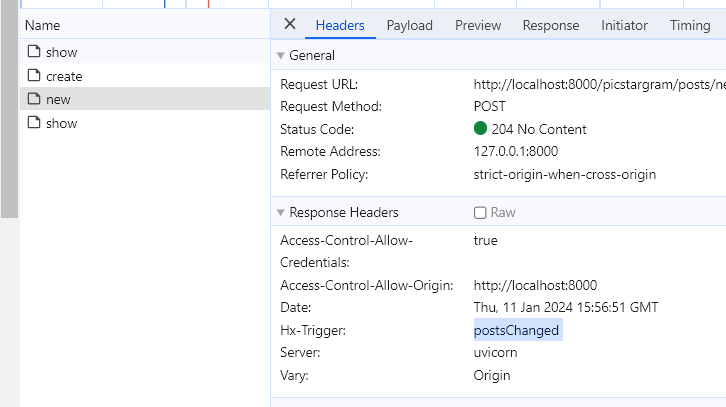
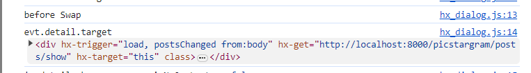
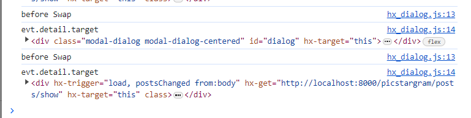
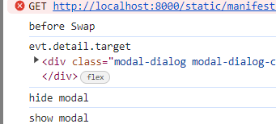
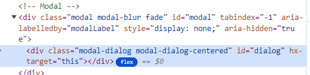

- 장고+modal+htmx 참고 유튜브: https://www.youtube.com/watch?v=3dyQigrEj8A&list=PLh3mlyFFKnrmo-BsEAUtfc9eazfswjvAc
    - load관련 참고
      github: https://github.com/bblanchon/django-htmx-modal-form/blob/bootstrap5/movie_collection/templates/index.html
- 로그인 참고 깃허브(fastapi + htmx + pydantic): https://github.dev/sammyrulez/htmx-fastapi/blob/main/templates/owner_form.html
- tagify 정리
  블로그: https://inpa.tistory.com/entry/Tagify-%F0%9F%93%9A-%ED%95%B4%EC%8B%9C-%ED%83%9C%EA%B7%B8tag-%EC%9E%85%EB%A0%A5%EC%9D%84-%EC%9D%B4%EC%81%98%EA%B2%8C-%EA%B0%84%ED%8E%B8%ED%9E%88-%EA%B5%AC%ED%98%84-%EC%82%AC%EC%9A%A9%EB%B2%95

### 데이터 넘겨주는 index route -> 데이터없이 html render + hx-trigger="load" + list view route로 분리

1. posts를 넘겨주던 route에서 html만 넘겨주도록 변경한다.
- 기존
    ```python
    @app.get("/picstargram/", response_class=HTMLResponse)
    async def pic_index(
            request: Request,
            # hx_request: Optional[str] = Header(None),
    ):
        posts = get_posts(with_user=True, with_tags=True, with_likes=True, with_comments=True)
     
        context = {
            'request': request,
            'posts': posts,
        }
        return templates.TemplateResponse("picstargram/home/index.html", context)
     
    ```

    - **변경 -> html렌더 + posts 전체 렌더 route 2개로 분리**

    ```python
    @app.get("/picstargram/", response_class=HTMLResponse)
    async def pic_index(
            request: Request,
            # hx_request: Optional[str] = Header(None),
    ):
        context = {
            'request': request,
        }
        return templates.TemplateResponse("picstargram/home/index.html", context)
     
     
    @app.get("/picstargram/posts/show", response_class=HTMLResponse)
    async def pic_hx_show_posts(
            request: Request,
            hx_request: Optional[str] = Header(None),
    ):
        posts = get_posts(with_user=True, with_tags=True, with_likes=True, with_comments=True)
     
        context = {
            'request': request,
            'posts': posts,
        }
        return templates.TemplateResponse("picstargram/post/partials/posts.html", context)
    ```

2. index.html에서는 아래와 같애 `for post in posts` + `include post_1개.html`의 구조에서

    - **`for post in posts + posts.html`로 posts를 요청하는 구조로 변경해야한다.**
    - **`부모태그에 hx-target="this" + hx-get="" hx-trigger="load"`를 통해, 직접 데이터를 요청한다.**
    - 기존
        ```html
        
            
                
            
        ```
    - 변경 : **부모가 없는 상태기 때문에 div를 하나 만들어서 hx를 넣어주자. 아직 load되서 hx요청되기 전의 부모(hx-target="this")의 자식들은 다 대체 될 것이니 loading을
      붙혀주자.**
        ```html
        <div hx-trigger="load" hx-get="{{ url_for('pic_hx_show_posts') }}" hx-target="this">
            <div class="container text-center">
                Loading...
            </div>
        </div>
        ```


3. 이제 들어갈 posts.html을 post/partials에 만들어준다.
   - **post.html내용 그대로를 `for post in posts`안에 넣어주면 되지만, `include`로 그대로 넣어줘도 된다.**
   - **이왕이면, 제자리 edit시 post.html을 구현해놨으니, include를 통해서 구현하자.**
      ```html
      # posts.html
    
      
          
      
      ```


### Create/Update Form 처리시, redirect -> NoContent로 응답하되 HX-trigger추가하여, load하던 부모에 trigger로 주기

1. post 생성 route의 response를 RedirectResponse -> 파라미터 response로 바꾼 뒤, 
    - `204 Nocontent 코드` + response.headers라는 dict에 `HX-Trigger`라는 Key로 `"postsChanged"`를 추가해준다.
    - 
    ```python
    # response = RedirectResponse('/picstargram/', status_code=302)
    response.status_code = 204
    response.headers["HX-Trigger"] = "postsChanged"
    return response
    ```
   
2. index.html에서 hx-trigger="load"에 `, postsChanged from:body`로 body에 달린 Hx-Trigger listener가 호출될시 작동해주도록 한다.
    - 콤마로 hx-trigger를 나열하고, **backend 204 + HX-Trigger로 올 땐, `from:body`로서, body에서부터 eventListener를 찾아 걸어준다.**
    ```html
    <div hx-trigger="load, postsChanged from:body"
         hx-get="{{ url_for('pic_hx_show_posts') }}"
         hx-target="this"
    >
    ```
3. **그대로 계속 HX-Trigger가 발동안한다. chrome network탭을 보니, request도 안간다.**
   - **htmx 렌더링 form은 일반 action으로 submit하면 request가 시작도 안된다.. route는 받는데, 크롬탭에서 인식X**
   - **hx-post요청으로 변환한다.**
    ```html
    <form class="modal-content"
              hx-trigger="submit"
              hx-post="{{ url_for('pic_new_post') }}"
              hx-encoding="multipart/form-data"
    >
    ```
  

### modal submit시 204 NoContent + HX-Trigger 이후 계속 떠있는 문제 해결
1. 취소버튼은 bootstrap의 data-bs-dismiss="modal"을, button[type="button"]에 달아준다고 했다.
    ```html
    
    <button type="button"
            class="btn btn-{{ btn_size }} rounded-pill border-0 px-3 py-1 {{ btn_class }}"
            data-bs-dismiss="modal"
    >{{- cancel_btn_text -}}
    </button>
    
    ```
   

2. submit을 했을 때도, `204 Content가 resopnse되는 htmx가 작동`하는데, **그때의 `e.detail.target`을 확인해본다.**
    ```js
    ;(function () {
    
        htmx.on("htmx:beforeSwap", function (evt) {
            // hx-target="this"(만) 명시된 요소들 + swap후 HX-Trigger에 의한 swap직전의 요소들도 순차적으로 다 잡히게 됨.
            // -> evt.detail.target.id를 확인하여  어떤 hx-target="this"인지 명시하여 처리한다.
            console.log('before Swap')
            console.log('evt.detail.target', evt.detail.target)
        })
    
    })();
    ```
    
    - **base.html에서 모달 작동의 hx-target인 `div.modal-dialog`에도 `hx-target="this"`를 적어주면, beforeSwap 이벤트를 확인할 때 같이 걸리게 된다.**
        - **하지만, HX-Trigger에 의한 새롭게 발생되는 swap event들도 순차적으로 다 잡힌다.**
    ```html
    {# 여기서 hx요청없이 hx-target="this"는 submit시 발생하는 204 evt(swap)시에 beforeSwap에 잡히도록 걸어주는 것으로 
       -> evt.detail.target.id가 "diaglog"까지 확인하여 modal.hide()시키기 위해. evt에 잡히도록 거는 것 #}
    <div class="modal-dialog modal-dialog-centered" id="dialog" hx-target="this">
    ```
    

3. 이제 e.detail.target의 id가 div.modal-dialog의 id인 `dialog`로 확정지어서, submit 성공으로 hx이벤트가 swap(204받기) 발생하기 전에 modal의 hide시켜준다.
    ```js
        htmx.on("htmx:beforeSwap", function (evt) {
            // hx-target="this"(만) 명시된 요소들 + swap후 HX-Trigger에 의한 swap직전의 요소들도 순차적으로 다 잡히게 됨.
        // -> evt.detail.target.id를 확인하여  어떤 hx-target="this"인지 명시하여 처리한다.
            console.log('before Swap')
            console.log('evt.detail.target', evt.detail.target)
    
            if (evt.detail.target.id === "dialog") {
                console.log('hide modal')
                myModal.hide();
            }
        })
    ```

    -  **modal이 submit 후, swap(204라 바뀌는 것은 없음) 전에, modal을 잘 닫는다.**

4. **하지만, `target.id === "dialog"`만 명시하면, `CUD submit`이 아닌 `afterSwap에서 모달을 띄우기` 전 항상 닫고 띄우게 된다.**
    - CUD submit가 아닌데, 모달을 띄우는 이벤트만 했는데, 단지 target이 dialog라는 이유로 매번 작동하게 된다.
    
    - **CUD로서, 204 response일 때만, modal hide시키도록 조건을 추가한다.**
    - 네트워크 response는 `evt.detail.target.xhr.response`로 확인하면 되고, 204는 비어있으니 `!`를 붙혀서 확정한다. 
    ```js
    const isNoContent = !evt.detail.xhr.response;
    if ((evt.detail.target.id === "dialog") && isNoContent) {
        console.log('hide modal')
        myModal.hide();
    }
    ```
   


#### modal hide이후, form내용도 지우기
1. boostrap [via javascript](https://getbootstrap.com/docs/5.1/components/modal/#via-javascript)의 Event부분을 보면
    - `hidden.bs.modal`는 css 등에 의해 완전히 hide됬을 때 촉발되는 event라고 나와있다.
    - **이 이벤트에 `htmx.on`으로 축약된 이름으로 리스너를 걸고, `modal이 아닌 #dialog 요소`를 찾아서 `자식에 해당하는 .innerHTML`에 빈 string을 넣어주면 된다.**
    ```js
    // modal이 닫힌 뒤, 안에 내용 지우기
    htmx.on("hidden.bs.modal", () => {
        //console.log('hidden.bs.modal')
        document.getElementById("dialog").innerHTML = ""
    })
    ```
    


#### CUD이후, 204응답이 아닌 경우도, [200라도 empty response면, swap 안일어나도록] 추가적 처리해주기
1. [htmx - event](https://htmx.org/events/) - beforeSwap - detail.shouldSwap 부분을 보면, 200 응답이 아닌 경우 swap이 일어나지 않도록 설정할 수 있다고 한다.
    - 204가 아니더라도, `201 + response가 비어있는 경우`도 처리가능하다.
    ```js
    // const isNoContent = !evt.detail.xhr.response;
    const noResponse = !evt.detail.xhr.response;
    if ((evt.detail.target.id === "dialog") && noResponse) {
        console.log('hide modal')
        myModal.hide();
        // 200응답이 아닌 경우 & response가 비어있는 경우 -> swap자체가 안일어나도록 ex> 204 NoContent or 201 + empty response 등..
        evt.detail.shouldSwap = false
    }
    ```