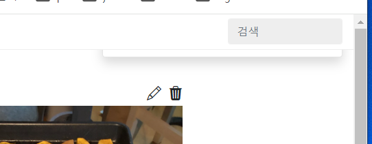
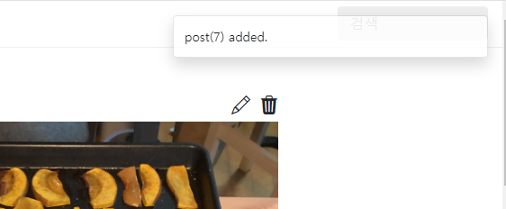

- 장고+modal+htmx 참고 유튜브: https://www.youtube.com/watch?v=pAtrj8A-Kl4&t=423s
    - github: https://github.com/bblanchon/django-htmx-modal-form/blob/bootstrap5/movie_collection/templates/index.html
    - 로그인 참고 깃허브(fastapi + htmx +
      pydantic): https://github.dev/sammyrulez/htmx-fastapi/blob/main/templates/owner_form.html

1. bootstrap 5에서 sample toast를 가져와, base.html에 추가한다.
    - **.bottom-0 -> `.top-0`로 변경하여, end-0과 함께 우측상단에 뜨게 한다.**
    - div#liveToast 내부에서 `.toast-header부분은 삭제`한다.
    - **id를 liveToast -> `toast`로 변경한다.**
    - **div.toast-body의 `id="toast-body"`를 추가하고 내부 text(value)는 삭제한다**
        - **modal(target -> 내부 swap html렌더링)과 달리, `직접 element.innerText = ""`로 텍스트만 넣어줘야하기 때문이다. **
    ```html
    <!-- toast -->
    <div class="position-fixed top-0 end-0 p-3" style="z-index: 11">
        <div id="toast" class="toast" role="alert" aria-live="assertive" aria-atomic="true">
            <div id="toast-body" class="toast-body">
  
            </div>
        </div>
    </div>
    ```

    - **.toast를 도구탭에서 클릭해보면 css가 아래와 같이 잡힌다. `.toast`가 `:not(.show)`로 showcss가 없으면 display: none;으로 설정된다.**
    ```css
    .toast:not(.show) {
        display: none;
    }
    ```


2. 아래와 같은 json으로 headers["HX-Trigger"]를 여러개 보낼 수 있다.
    ```json
    {
      "postsChanged": null,
      "showMessage": "post added."
    }
    ```
    - **`json.dumps()`안에 dict를 넣어서, 여러 정보를 1개의 string json으로 만들어서 내려보내면 된다.**
        - post정보를 f-string으로 넣어주기 위해, create_post()에서 생성된 post를 return해주고, 입력한다.
    ```python
    post = create_post(data)

    # 3) temaplate에서는 생성 성공시 list 화면으로 redirect한다. => htmx를 이용해 Nocontent + Hx-Trigger를 응답한다.
    response.status_code = status.HTTP_204_NO_CONTENT
    # response.headers["HX-Trigger"] = "postsChanged"
    response.headers["HX-Trigger"] = json.dumps({
        "postsChanged": None,
        "showMessage": f"post({post.id}) added."
    })
    ```


3. showMessage HX-Trigger에 대해 listener를 달아주기 위해 `hx_toast.js`를 생성하고 base의 body끝에 static을 올려준다.
    - boostrap 5 Toast > Methods부분을 참고해서 js로 instance를 만든다.
    ```html
    <script src="{{ url_for('static', path='js/hx_toast.js') }}"></script>
    ```
    ```js
    const myToast = new bootstrap.Toast(document.getElementById('toast'));
    console.log(myToast);
    ;(function(){
    
    })();
    ```


4. 미리 줬던 `#toast-body 요소`도 찾아놓고, `htmx.on`으로 HX-Trigger에 json으로 같이 왔던 `showMessage` trigger를 바로 건다.
    - json으로 한꺼번에 여러개 trigger를 걸어줬는데, `개별적으로 htmx.on`으로 인식 가능하다.
    - **modal에서는 `evt.detail.target`를 이용해, 여러 trigger중, `dialog`일 때를 if문으로 찾아서 걸었지만**
    - **toast의 `showMessage` trigger event는 `evt.detail.value`를 통해 `json의 key에 대한 value`를 뽑아올 수 있다.**
    ```js
    const myToast = new bootstrap.Toast(document.getElementById('toast'));
    const toastBody = document.getElementById('toast-body');
    ;(function(){
    
        htmx.on('showMessage', function (evt) {
            toastBody.innerHTML = evt.detail.value;
            myToast.show();
        });
    
    })();
    ```
   
    - toast가 작동하지만, top-0 / end-0이, 위쪽 메뉴에 겹쳐서 이상하게 나온다.
5. 현재 .nav-top의 z-index가 css로 1030의 z-index를 준 상태이므로, `z-index:1031;`을 style로 준다.
    ```html
    <div class="position-fixed top-0 end-0 p-3" style="z-index: 1031">
    ```
   