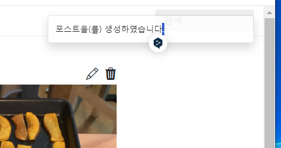
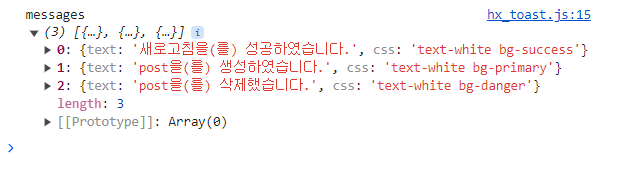
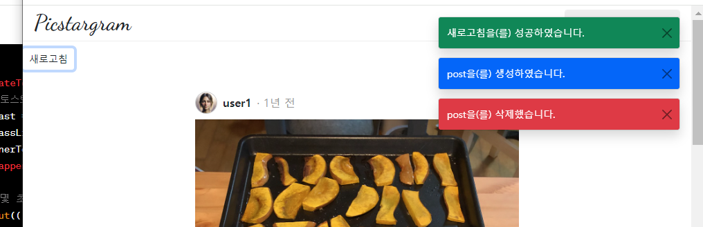

- 장고+modal+htmx 참고 유튜브2: https://www.youtube.com/watch?v=I5_g7XYyemQ
    - github: https://github.com/bblanchon/django-htmx-messages-framework/blob/hx-trigger/htmx_messages/templates/toasts.html
- 로그인 참고 깃허브(fastapi + htmx + pydantic): https://github.dev/sammyrulez/htmx-fastapi/blob/main/templates/owner_form.html
 


### enum을 통해 Message 구조화해서 생성하기
1. django - messages 대신, enum 여러개를 통해, 정해진 CRUD+FAIL에 대해, 자동으로 boostrap css를 만들게 하고
    - 여러 messages를 결국 route에서 json.dumps() 할테니, **json obj를 위한 `dict`로 반환하게 한다.**
    - MessageLevel.`DEBUG` = auto() -> MessageCss.`DEBUG` 자동 선택
    - Message.`CREATE` -> text 끝부분 생성 `을(를) 생성하였습니다`
    - Message.`CREATE`.메서드(주제:entity, message_level)을 받아서 최종 text와 css를 dict로 반환
    - enums/messages.py 를 생성하여 아래와 같이 구현한다.
    ```python
    class MessageLevel(Enum):
        DEBUG = auto()
        INFO = auto()
        SUCCESS = auto()
        WARNING = auto()
        ERROR = auto()
    
    
    class MessageCss(str, Enum):
        DEBUG = "bg-light"
        INFO = "text-white bg-primary"
        SUCCESS = "text-white bg-success"
        WARNING = "text-dark bg-warning"
        ERROR = "text-white bg-danger"
    
    
    class Message(str, Enum):
        CREATE = "을(를) 생성하였습니다."
        READ = "을(를) 읽었습니다."
        UPDATE = "을(를) 수정했습니다."
        DELETE = "을(를) 삭제했습니다."
        FAIL = "을(를) 실패하였습니다."
    
        def generate_text_and_css(self, entity, message_level):
            message_level_name = MessageLevel(message_level).name
            message_css = MessageCss[message_level_name].value
    
            postfix = self.value
            message_text = f"{entity}{postfix}"
    
            return message_text, message_css
    
        def write(
                self,
                entity: str,
                level: MessageLevel = MessageLevel.INFO
        ):
            """
            In [2]: Message.CREATE.write("포스트 생성", level=MessageLevel.ERROR)
            Out[2]: {'text': '포스트 생성을(를) 생성하였습니다.', 'css': 'text-white bg-danger'}
            """
            message_text, message_css = self.generate_text_and_css(entity, level)
    
            return {
                "text": message_text,
                "css": message_css
            }
    
    ```
    


2. test route에서, 여러 메세지를 만들어, `204 NoContent + messages`로 HX-Trigger하면서 enum으로 만든 여러 message를 css와 함께 만들어 response해본다
    ```python
    @app.get("/test", )
    async def test(
            request: Request,
            response: Response,
    ):
        context = {'request': request}
    
        messages = [
            Message.SUCCESS.write("새로고침", level=MessageLevel.SUCCESS),
            Message.CREATE.write("post", level=MessageLevel.INFO),
            Message.DELETE.write("post", level=MessageLevel.ERROR)
        ]
        response.status_code = status.HTTP_204_NO_CONTENT
        response.headers["HX-Trigger"] = json.dumps({
            "postsChanged": None,
            # "showMessage": Message.CREATE.write("포스트", level=MessageLevel.INFO)['text'],
            "messages": messages
        })
    
        return response
    ```

3. **HX-Trigger로 오는 것 중 `messages`에 대한 htmx.on을 걸어서, `evt.detail.value`로 해당 trigger의 value`dict list -> array obj`를 확인할 수 있다.**
    ```js
    htmx.on('messages', function (evt) {
        console.log('messages', evt.detail.value);
    })
    ```
   
4. base말고 home/index.html에 예시 새로고침 버튼을 만들어 test route를 호출하자.
    - 204응답에 trigger만 받아서, 작동하는지 확인한다.
    ```html
    
    
        <button class="btn btn-sm" hx-get="{{ url_for('test') }}">
            새로고침
        </button>
        <div hx-trigger="load, postsChanged from:body"
             hx-get="{{ url_for('pic_hx_show_posts') }}"
             hx-target="this"
        >
    ```
    


### boostrap 5 toast Stacking 코드 + 닫기버튼 추가하기
1. 문서에서 [toast Stacking](https://getbootstrap.com/docs/5.1/components/toasts/#stacking) 예제를 가져오고, 각 .toast-header는 제거한다.
    - **전에 코드에 비해, `div.toast-container`가 싸고 있는게 다르다.**
    - **이 때, 기존 toast의 가장 바깥에 있던 `position-fixed top-0 end-0 p-3` + `style="z-index:1031;"`은 추가로 붙혀줘야 보인다. position-fixed는 필수다!**
    ```html
        <!-- toast stacking -->
        <!-- <div class="toast-container">-->
        <div class="toast-container position-fixed top-0 end-0 p-3" style="z-index: 1031;">
            
            <div class="toast" role="alert" aria-live="assertive" aria-atomic="true">
                <div class="toast-body">
                    See? Just like this.
                </div>
            </div>
    
            <div class="toast" role="alert" aria-live="assertive" aria-atomic="true">
                <div class="toast-body">
                    Heads up, toasts will stack automatically
                </div>
            </div>
            
        </div>
    ```
    - **아래쪽 `Custom content`에 보면, div.d-flex로 .toast-body를 감싼 뒤, button with `data-bs-dismiss="toast"`를 통해, 토스트를 제거할 수 있다.**
    - **.toast-container안에 `1개의 div.toast`만 남기고, 추후 이 1개만 복사해서 사용할 예정이다.**
    ```html
    <!-- toast stacking -->
    <!-- <div class="toast-container">-->
        <div class="toast-container position-fixed top-0 end-0 p-3" style="z-index: 1031;">

        <div class="toast" role="alert" aria-live="assertive" aria-atomic="true">
            <div class="d-flex">
                <div class="toast-body">
                    See? Just like this.
                </div>
                <button type="button" class="btn-close me-2 m-auto" data-bs-dismiss="toast" aria-label="Close"></button>
            </div>
        </div>

    </div>
    ```
   

### data속성을 이용해, container(.toast-container)/template(.toast)/body(.toast-body) 쉽게 찾고 + 1개 남은 template(.toast)를 deep copy 후, 원본 삭제 후, text+css만 바꿔서 사용
1. .toast-container / .toast / .toast-body 에 `data-toast-`속성을 붙인다.
    - **container는 deepcopy후 생성된 .toast를 appendChilde() 하기 위해서 셀렉트 하기 위함이다.**

    ```html
    <!-- toast stacking -->
   <div data-toast-container class="toast-container position-fixed top-0 end-0 p-3" style="z-index: 1031;">
        <div data-toast-template class="toast" role="alert" aria-live="assertive" aria-atomic="true">
            <div class="d-flex">
                <div data-toast-body class="toast-body"></div>
                <button type="button" class="btn-close me-2 m-auto" data-bs-dismiss="toast" aria-label="Close"></button>
            </div>
        </div>
    </div>
    ```
   
2. 이제 `hx_toast.js`에서, data속성으로 container(append할 최종부모)와 template(복제당할 원본놈)을 querySelector(`"[속성]"`)으로 쉽게 찾는다.
    - 지금까지는 document.querySelect~ () 로 찾았지만, 
    - **`htmx.find()` or `htmx.find( el, )`로 바로 찾을 수 있다.**
    - `.cloneNode(true)`로 .toast의 template을 deepcopy한 뒤, **data속성은 삭제하고, 여러 작업을 한다**
    - **다 하고 message들을 `.forEach()`로 순회하고, 모든요소로 돌릴 function을 호출 없이 넣어준다.**
    ```js
    ;(function () {
        function createToast(message) {
            const element = htmx.find("[data-toast-template]").cloneNode(true);
    
            // 카피본에서는 data-toast-template 속성 삭제
            delete element.dataset.toastTemplate;
    
            // message.text / .css를 사용해서 템플릿 복사본에 입히기
            element.className += " " + message.css;
    
            // 템플릿 복사본 내에서 .toast-body를 data-toast-body 속성으로 찾아 텍스트 넣어주기
            htmx.find(element, "[data-toast-body]").innerText = message.text;
    
            // 컨테이너 찾아서 템플릿 복사본 넣어주기
            htmx.find("[data-toast-container]").appendChild(element);
    
            const toast = new bootstrap.Toast(element, {delay: 2000});
            // container에 넣은 뒤, boostrap Toast로 생성하여 show
            toast.show();
        }
        htmx.on('messages', function (evt) {
            evt.detail.value.forEach(createToast)
        });
    
    })();
    
    ```
    
    - **close버튼을 `.btn-close.white`를 추가해서 하얀색으로 만들어준다. 현재 문제는 메세지가 한꺼번에 동시에 뜸.**
    ```html
    <button type="button" class="btn-close btn-close-white me-2 m-auto" data-bs-dismiss="toast" aria-label="Close"></button>
    ```
   


3. 이제 hx_toast.js가 로드되는 접속시, template 아닌 것들이 안띄워지고 남아있다면, 다 띄워지게 코드를 걸어준다.
    ```js
    // template을 제외하고 안띄워진 것이 있다면, 시작시 띄우기
    htmx.findAll(".toast:not([data-toast-template])").forEach((element) => {
        const toast = new bootstrap.Toast(element, toastOptions)
        toast.show()
    });
    ```

### utils/https.py에 render메서드를 구현하여, 반복되는 HX-Trigger 삽입코드를 줄이기
1. 현재는 response객체마다 json.loads()로 매번 삽입해줘야한다.
   - render메서드를 구현하여 **template이 없을 때는 HTMLResponse가 아닌 일반 Response로 + hx_trigger를 dict로 따로 받도록 한다.**

    ```python
    # utils/https.py
    
    from starlette import status
    from starlette.responses import HTMLResponse, Response
    
    from main import templates
    
    
    def render(request, template_name="", context: dict = {}, status_code: int = 200, 
               cookies: dict = {},
               hx_trigger: str = None,
               # htmx 관련 response headers 추가. hx_target: str = None, hx_swap: str = None, hx_push_url: str = None,
               ):
        
        ctx = {
            'request': request,
            # 'user': request.state.user,
            **context
        }
    
        if template_name:
            t = templates.get_template(template_name)
            html_str = t.render(ctx)
            response = HTMLResponse(html_str, status_code=status_code)
        else:
            # render()사용시, template_name을 입력안했다면, 204 NoContent로 자동 응답하기
            response = Response(status_code=status.HTTP_204_NO_CONTENT)
    
        # htmx 관련 response headers에 HX-trigger 추가
        if hx_trigger:
            response.headers["HX-Trigger"] = hx_trigger
    
        # 기본 darkmode 및 cookie관련
        # response.set_cookie(key='darkmode', value=str(1))
        # if len(cookies.keys()) > 0:
            # set httponly cookies
            # for k, v in cookies.items():
            #     response.set_cookie(key=k, value=v, httponly=True)
    
        # delete coookies
        # for key in request.cookies.keys():
        #     response.delete_cookie(key)
    
        return response
    
    ```
   

2. **hx-trigger의 단수/복수 및 messages의 단수/복수를 고려해서, 처리되게 만든다.*
    - **hx-trigger는 list로 올 경우, True를 value로 넣은 dict -> json.dumps로 string으로 만든다.**
    - **messages는 단수(Message1개-dict)가 오면 front에는 복수를 고려해서 만들었기 떄문에, list로 감싸준다.**
    - **messages를 추가하기 위해선 기존 hx-triggers의 값을 `dict`로 변환시켜놓고, `messages라는 key로 dict에 입력`후, `다시 json.dumps`로 string화한다.**
    ```python
    def render(request, template_name="", context: dict = {}, status_code: int = 200, cookies: dict = {},
               hx_trigger: str | List[str] = None,
               messages: dict | List[dict] = None,
               ):
    
        # 추가context가 안들어오는 경우는 외부에서 안넣어줘도 된다.
        ctx = {
            'request': request,
            # 'user': request.state.user,
            **context
        }
    
        # template render가 아니면 일반Response로
        if template_name:
            t = templates.get_template(template_name)
            html_str = t.render(ctx)
            response = HTMLResponse(html_str, status_code=status_code)
        else:
            response = Response(status_code=status_code)
    
        # hx_trigger가 1개의 string -> 그냥 삽입 / 2개이상인 경우, dict comp를 통해 True를 value로 준 dict list로 만든 뒤 -> json.dumps()로 string화
        if hx_trigger:
            if isinstance(hx_trigger, str):
                response.headers["HX-Trigger"] = hx_trigger
            else:
                response.headers["HX-Trigger"] = json.dumps({trigger: True for trigger in hx_trigger})
    
        # messages를 삽입하려면, 기존 trigger들을 dict로 변환해야, message라는 또다른 HX-Trigger를 dict에 추가하여 -> 다시 json.dumps()로 string화
        # 1) 1개의 string  VS 2) 2개이상의 "{" json 시작  => 둘다 dict로 만들어야한다.
        # 3) 없는 경우 -> 빈 dict로 만들어야한다. -> .get( , {})로 해결
        # ==> 없는 경우 VS 있는 경우( 2개이상-명시쉬움 -> 나머지는 1개)형태로 조건문 순서를 설정한다.
        if messages:
            # 없는 경우 -> {}
            if hx_trigger := response.headers.get("HX-Trigger", {}):
                # 2개이상인 경우 -> json이라서 load하여 dict로 변환
                if hx_trigger.startswith("{"):
                    hx_trigger = json.loads(hx_trigger)
                # 있는데 & 2개이상이 아닌 경우 -> 1개인 경우 -> value에 True를 집어넣는 dict로 변환
                else:
                    hx_trigger = {hx_trigger: True}
    
            # messages 1개만 오는 경우는 dict라서, list로 변환하여 삽입
            hx_trigger["messages"] = [messages] if isinstance(messages, dict) else messages
    
            # hx_trigger와 통합된 HX-Trigger를 새롭게 집어넣는다.
            response.headers["HX-Trigger"] = json.dumps(hx_trigger)
    
        return response
    ```
   
4. route에서 사용한다.
    ```python
    @app.get("/test", )
    async def test(
            request: Request,
            response: Response,
    ):
        # context = {'request': request}
    
        # messages = [
        #     Message.SUCCESS.write("새로고침", level=MessageLevel.SUCCESS),
        #     Message.CREATE.write("post", level=MessageLevel.INFO),
        #     Message.DELETE.write("post", level=MessageLevel.ERROR)
        # ]
        # return render(request, context=context, status_code=status.HTTP_204_NO_CONTENT,
        return render(request, status_code=status.HTTP_204_NO_CONTENT,
                      # hx_trigger="postsChanged",
                      hx_trigger=["postsChanged"],
                      # messages=messages
                      messages=Message.SUCCESS.write("새로고침", level=MessageLevel.SUCCESS),
                      )
    ```