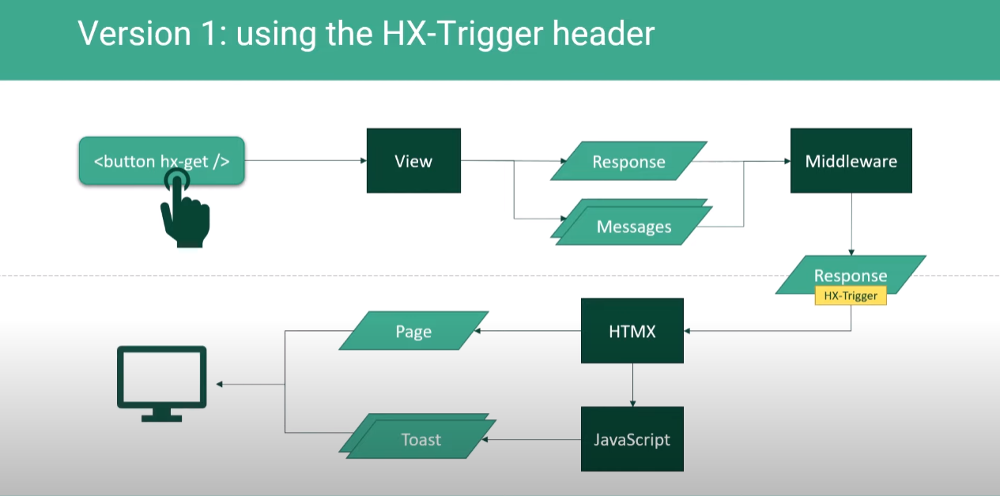
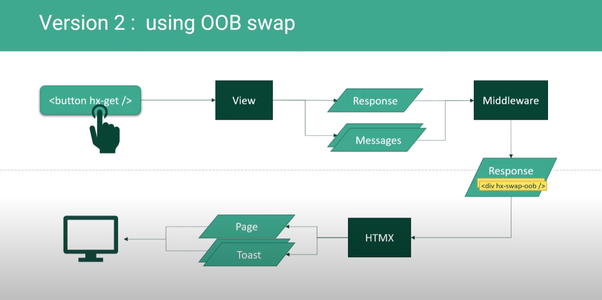
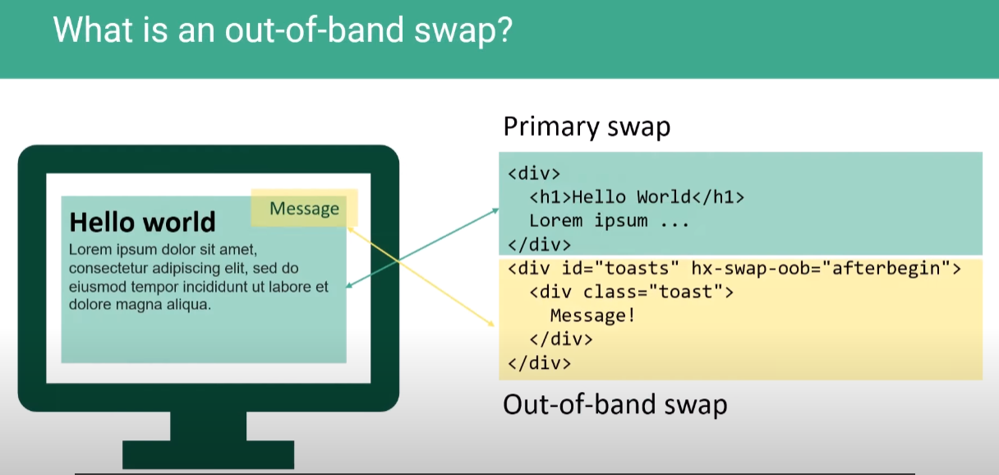

- 장고+toast+htmx 참고 유튜브: https://www.youtube.com/watch?v=dc4fhli61bQ
    - github: https://github.com/bblanchon/django-htmx-messages-framework/blob/hx-trigger/htmx_messages/templates/toasts.html
    - oob관련 modal바뀐 부분 등 정리: https://blog.benoitblanchon.fr/django-htmx-messages-framework-oob/ 
- 로그인 참고 깃허브(fastapi + htmx + pydantic): https://github.dev/sammyrulez/htmx-fastapi/blob/main/templates/owner_form.html

- 기존에는, hx-trigger -> htmx.on -> js로 템플릿html을 찾아 createToast를 통해 생성해서 붙혀줬다.
    
- messages가 있으면, hx-trigger대신, hx-swap-oob를 해주는 html을 response로 보내, 해당 타겟만 변하도록 하여 js를 제거한다.
    
- oob란, out-of-bound로서, 원래 hx-swap을 primary swap라고 한다면, 그것을 제외한 다른 target을 같이 swap해주는 것을 말한다.
    


1. 새로고침 버튼은 hx-target이 없는데, 이것은 스스로를 `hx-swap="this"` == `target="this" + swap ="innerHTML"`로 넣는 것과 마찬가지다.
    ```html
    <button class="btn btn-sm" hx-get="{{ url_for('test') }}">
        새로고침
    </button>
    ```
    - **새로고침버튼은 swap되면 안되니 `hx-swap="none"`을 통해 오로지 oob swap만 일어나게 한다.**
        - swap: `none`- Does not append content from response (`out of band items will still be processed`). 
    ```html
    <button class="btn btn-sm" hx-get="{{ url_for('test') }}" hx-swap="none">
        새로고침
    </button>
    ```
2. **확인 결과, response status_code를 `204 NoContent + 대신 hx-trigger에 postsChanged` 반환하는 상태면, htmlresponse가 없이 `primary swap을 skip` 뿐만 아니라 `oob도 skip`되므로 `oob가 있다면 204가 아닌 200으로 반환할 준비`를 해야한다.**
    - Unfortunately, `this “empty response” trick doesn’t work with OOB swaps` because the response is not empty anymore: it contains the toasts.
    - **즉, oob를 작동하게 하려면 `204가 아닌 응답`으로 내려보내줘야하고, 이로 인해 noResponse시 modal을 자동으로 닫던 코드가 문제가 생긴다. 이를 해결해야함.**
  ```python
  return render(request, status_code=status.HTTP_204_NO_CONTENT,
                # hx_trigger="postsChanged",
                hx_trigger=["postsChanged"],
                # messages=messages
                messages=Message.SUCCESS.write("새로고침", level=MessageLevel.SUCCESS),
                )
  ```

### data속성 템플릿 toast구조를 hx-swap-oob를 위한 _toasts.html로 변경
1. 기존 data속성을 포함한 .toast-container 구조에서 
    - **data속성을 다 제거**
    - **hx-swap-oob의 targe이 되는 `.toast-container`에 `id="toasts"`와 `hx-swap-oob="afterbegin"`으로 내부에 시작부터 쌓이도록 지정하고**
    - **template으로서, messages를 순회하여, .text와 .css를 변수로 사용해서 만들어놓고**
    - `_toasts.html`을 만든 뒤, **base.html에 include시킨다.**
        - swap되서 렌더링 되는 것들은 모두 추출하여 원래자리에 include
    ```html
    {#<!-- toast stacking -->
    <div data-toast-container class="toast-container position-fixed top-0 end-0 p-3" style="z-index: 1031;">
        <!-- template for deepcopy -->
        <div data-toast-template class="toast" role="alert" aria-live="assertive" aria-atomic="true">
            <div class="d-flex">
                <div data-toast-body class="toast-body"></div>
                <button type="button" class="btn-close btn-close-white me-2 m-auto" data-bs-dismiss="toast"
                        aria-label="Close"></button>
            </div>
        </div>
    </div>#}
    
    <!-- toasts stacking oob용 template -->
    
    ```
    ```html
    <div class="toast-container position-fixed top-0 end-0 p-3" style="z-index: 1031;"
         id="toasts" hx-swap-oob="afterbegin">
        
            <div class="toast align-items-center border-0 {{ message.css }}" role="alert" aria-live="assertive"
                 aria-atomic="true">
                <div class="d-flex">
                    <div class="toast-body">{{ message.text }}</div>
                    <button type="button" class="btn-close btn-close-white me-2 m-auto" data-bs-dismiss="toast"
                            aria-label="Close"></button>
                </div>
            </div>
        
    </div>
    ```
   

### render메서드에서 primary swap 템플릿외 messages를 oob swap로서 렌더링된 html에 concat해주기
1. template_name이 주어지면, get_template -> .render(context_dict)를 통해 완성된 `html_str`를 확보해놓고
    - **만약, primary swap될 요소가 없으면서, oob만 있는 경우(ex> 새로고침, CUD)에 대비해 `200이지만, noContent Trigger`를 보낼 준비를 한다.**
    ```python
    def render(request, template_name="", context: dict = {}, status_code: int = 200, cookies: dict = {},
               hx_trigger: dict | str | List[str] = None,
               messages: dict | List[dict] = None,
               oobs: List[tuple] = None
               ):
        # 추가context가 안들어오는 경우는 외부에서 안넣어줘도 된다.
        ctx = {
            'request': request,
            # 'user': request.state.user,
            **context
        }
    
        # template render + oob도 아니면, 일반Response + 204로
        html_str = ""
        if template_name:
            t = templates.get_template(template_name)
            html_str += t.render(ctx)
    
    ```
   
2. tempalte의 html_str과 별개로 **oob의 템플릿을 직접 붙이지말고, primary swap(html_str)에 concat해줄 template 렌더링 메서드를 `.render( dict대신 **kwarg)`를 사용하도록 메서드를 따로 만들어준다.**
    ```python
    def render_oob(template_name, *args, **kwargs: dict):
        t = templates.get_template(template_name)
        oob_html_str = t.render(*args, **kwargs)
        return oob_html_str
    ```
   

3. primary swap인 `html_str`과 별개로 `oob_html_str`을 _toast.html에 messsages데이터를 넣어서 추출해놓는다.
    - **이 때, html_str과 oob_html_str `모두 없을 때만 204 NoContent`로 나갈 예정이다.**
    - **`둘중에 1개라도 있으면`, 204로 나가면 swap이든, oob-swap이든 작동안하게 된다.**
        - **만약, `html_str`이 없으면 `HX-Trigger`에 `noContent`를 실어보내서, front에서 htmx.on으로 처리되도록 할 예정이다.**
    ```python
    
    # template render + oob도 아니면, 일반Response + 204로
    html_str = ""
    if template_name:
        t = templates.get_template(template_name)
        html_str += t.render(ctx)
    
    # messages 등 oob 처리
    # -> messages는 자주쓰이니 직접 편하게 입력하도록 oob template 경로를 적어서 반영해준다.
    oob_html_str = ""
    if messages:
        messages = [messages] if isinstance(messages, dict) else messages
        oob_html_str = render_oob('picstargram/_toasts.html', messages=messages)
    
    # oob까지 없어야 실제 204 No Content -> swap 발생 안됨.
    if not (html_str or oob_html_str):
        response = Response(status_code=status.HTTP_204_NO_CONTENT)
    # oob가 있다면, HTMLResponse + not 204로 나가야됨.
    else:
        total_html_str = '\n'.join([html_str, oob_html_str])
        response = HTMLResponse(total_html_str, status_code=status_code)
    ```
   
4. **이제, primary swap할 `html_str`이 없다면, `htmx.on`을 위한 `noContent`라는 HX-Trigger를 전달해준다.**
    - 실제 204 NoContent는 oob-swap을 발생안시키니, trigger로 대체한다.
    - **HX-Trigger에 `"noContent"`만 박는게 아니라, input에 따라 첨가해줘야하는 일도 있으니, `입력받는 hx_trigger`를 dict로 변환시켜준다.**
    ```python
    def convert_hx_trigger_to_dict(hx_trigger):
        if hx_trigger:
            # 2) dict로 json변화없이 들어왔다면 그대로 둔다.
            if isinstance(hx_trigger, dict):
                pass
            # 3) dict가 아니면 str or List[str]이다. list류일 때는, 개별 trigger를 :True를 집어넣은 [dict 1개에 여러 key:value]를 dicㅅ comp로 만든다.
            #    hx_trigger dict comp >> {'postsChanged': True, 'closeModal': True}
            elif isinstance(hx_trigger, (list, tuple)):
                hx_trigger = {trigger: True for trigger in hx_trigger}
            # 4) list, tuple이 아니면, str으로 이미 json화 되어있는데, 1개면 "postsChanged" 지만,
            # -> 2개이상이면, {"postsChanged": true, "closeModal": "true"}의 json화 된상태라 json.loads하여 dict로 변환한다.
            else:
                if hx_trigger.startswith("{"):
                    hx_trigger = json.loads(hx_trigger)
                else:
                    hx_trigger = {hx_trigger: True}
        # 1) trigger가 없는 경우, 빈 dict를 만들어서, noContent일 때 삽입되도록 한다.
        else:
            hx_trigger = {}
        return hx_trigger
    
    ```
    ```python
    hx_trigger: dict = convert_hx_trigger_to_dict(hx_trigger)
    if not html_str:
        hx_trigger['noContent'] = True
    response.headers['HX-Trigger'] = json.dumps(hx_trigger)
    ```
   

5. **이제 route에서 `render()`사용시, `messages가 포함`되면, 자동으로 oob_html_str을 만들어 `Response() + 204 Content` 대신 `HTMLResponse() + 204아닌코드 + "noContent" hx-trigger`가 전달된다.**
    ```python
    # return render(request, status_code=status.HTTP_204_NO_CONTENT,
    return render(request, "",
                  hx_trigger=["postsChanged"],
                  messages=[Message.CREATE.write("포스트", level=MessageLevel.INFO)]
                  )
    ```
   
6. **추가적으로 oobs를 입력할 수 있게 해준다.**
    - tuple로 `(template_name, 데이터 dict)`를 입력시켜서, 내부에서 oob_html_str을 만들게 한다.
    ```python
    # messages 등 oob 처리
    # -> messages는 자주쓰이니 직접 편하게 입력하도록 oob template 경로를 적어서 반영해준다.
    oob_html_str = ""
    if messages:
        messages = [messages] if isinstance(messages, dict) else messages
        oob_html_str = render_oob('picstargram/_toasts.html', messages=messages)
    
    if oobs:
        for t_name, t_context in oobs:
            oob_html_str += ('\n' if oob_html_str else '') + render_oob(t_name, **t_context)
    ```
    ```python
    # return templates.TemplateResponse("picstargram/post/partials/post.html", context)
    return render(
        request, 
        template_name="picstargram/post/partials/post.html", 
        context=context,
        # messages=[Message.UPDATE.write("post")],
        oobs=[
            ('picstargram/_toasts.html', dict(messages=[Message.UPDATE.write("post")])),
        ]
    )
    ```
   


### hx_toasts.js에서 oob-swap을 htmx.onLoad()로 인식하여 전에거 삭제 + 새로운 toasts 띄우기
1. oob-swap으로 messages들 데이터가 반영된 상태에서 `.toast-container`는 두고, `.toast`를 htmx.findAll()로 찾은 뒤
    - .forEach로 각 element를 돌면서
    - `new`를 getInstance()로 초기화된 여부를 확인한다 -> 초기화되었고 .show가 없어서 hidden되었다면 -> 폐기하고 제거한다.
    - 초기화안되어있다면 -> 초기화하고, .show()를 통해 띄운다.
    ```js
    
    ;(function () {
        const toastOptions = {delay: 2000};
        // for oob
        // onLoad는 init + swap + oob-swap 모두에서 인식되어 작동한다.
        htmx.onLoad(() => {
            // 1. oob-swap되어 렌더링된 .toast 엘리먼트들을 찾아서 순회
            htmx.findAll(".toast").forEach((element) => {
                // 2. new를 뺀 bootstrap.Toast의 .getInstance()를 사용하여, 해당 엘리먼트에 대한 boostrap toast 초기화가 되었는지 확인한다.
                //    1) 이미 초기화 & show가 꺼졌다면(hide) -> .dispose()로 bootstrap 폐기 + element.remove()로 제거한다.
                //    2) 초기화가 안되었다면 -> new bootstrap.Toast()로 초기화하고 show()한다.
                let toast = bootstrap.Toast.getInstance(element)
                const isHidden = !element.classList.contains("show");
                if (toast && isHidden) {
                    // boostrap 폐기
                    toast.dispose()
                    // Remove hidden toasts
                    element.remove()
                }
    
                // 3. 아직 초기화가 안되었다면, new bootstrap.Toast()로 초기화한 뒤, .show()를 통해 toast를 띄운다. 
                if (!toast) {
                    const toast = new bootstrap.Toast(element, toastOptions)
                    toast.show();
                }
            })
        })
    })();
    ```
   

### hx_dialog.js에서 더이상 noResponse확인이 아니라 HX-Trigger의 "noConent"를 인식하여 modal 닫기
1. **modal은 1개의 element고정으로서 -> boostrap객체도 1개로 `전역변수로 고정`해야, 각 htmx.on에서 재사용할 수 있다.**
    - boostrap modal객체 생성은 전역변수로 -> `리스너에서는 new없이 초기화된 객체 전역변수` or `getInstance`로 사용한다.
    ```js
    const modalElement = document.getElementById('modal');
    const modal = new bootstrap.Modal(modalElement);
    
    ;(function () {
        htmx.on('htmx:afterSwap', function (evt) {
            // hx-target="this"(만) 명시된 요소들 + swap후 HX-Trigger에 의한 swap직전의 요소들도 순차적으로 다 잡히게 됨.
            // -> evt.detail.target.id를 확인하여  어떤 hx-target="this"인지 명시하여 처리한다.
            if (evt.detail.target.id === 'dialog') {
                const currentModal = bootstrap.Modal.getInstance(modalElement)
                currentModal.show();
            }
        })
    
        htmx.on("noContent", (evt) => {
            // 1. modal이 초기화되어있고, show상태면 -> 닫기 처리
            const currentModal = bootstrap.Modal.getInstance(modalElement)
            if (currentModal && modalElement.classList.contains("show")) {
                currentModal.hide();
            }
    
            evt.detail.shouldSwap = false // 200이라도 swap안일어나게 만들기
        })
    
        // modal이 닫히는 event(hidden.bs.modal by modal.hide(); ) -> dialog의 내용 지우기
        htmx.on("hidden.bs.modal", () => {
            document.getElementById("dialog").innerHTML = ""
        })
    
    })();
    
    ```