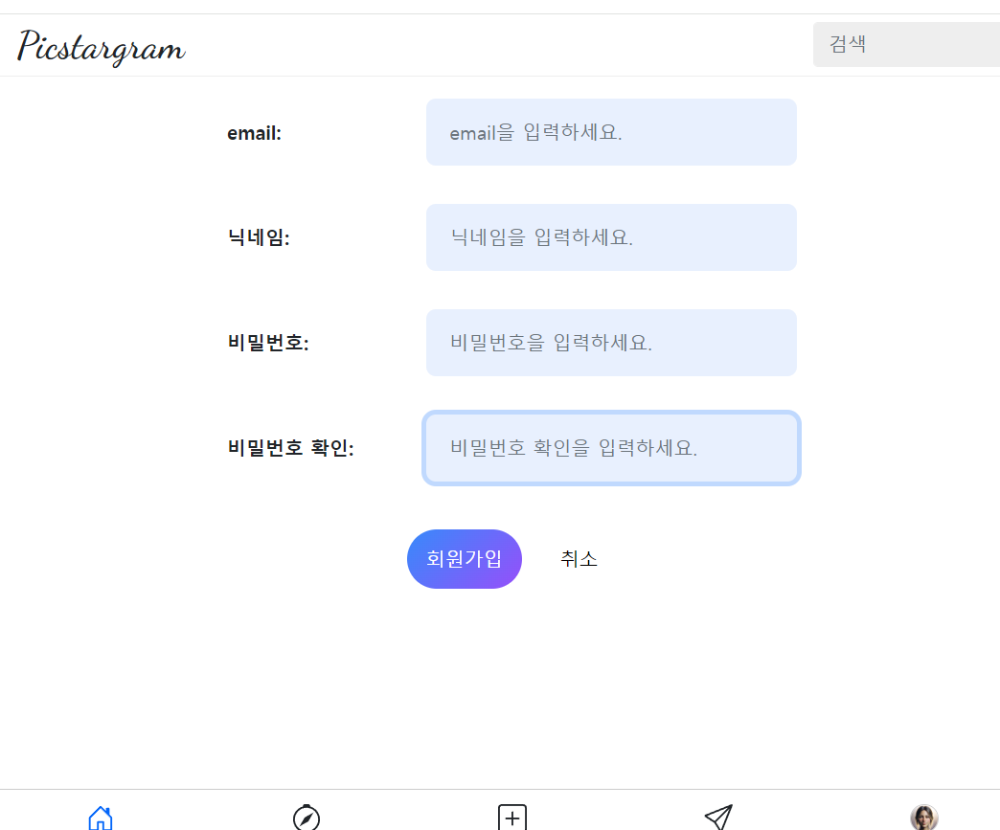
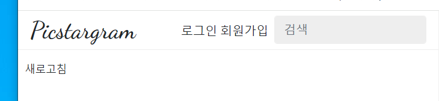
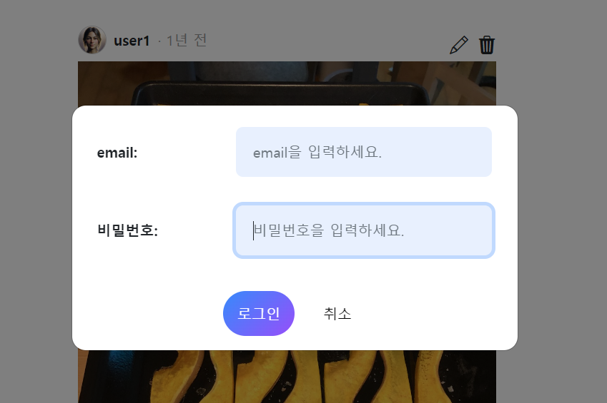

- 장고+toast+htmx 참고 유튜브: https://www.youtube.com/watch?v=dc4fhli61bQ
    -
    github: https://github.com/bblanchon/django-htmx-messages-framework/blob/hx-trigger/htmx_messages/templates/toasts.html
    - oob관련 modal바뀐 부분 등 정리: https://blog.benoitblanchon.fr/django-htmx-messages-framework-oob/
- 로그인 참고 깃허브(fastapi + htmx + pydantic): https://github.dev/sammyrulez/htmx-fastapi/blob/main/templates/owner_form.html


1. route를 만들고, register.html을 띄워놓는다.
    ```html
    @app.get("/register")
    async def pic_register(
    ):
        context = {
            'request': request,
        }
        return render(request, "picstargram/register.html", context)
    
    ```

2. register.html에서 base.html을 상속하고, form태그를 씌우고 내부에서 macro를 사용할 준비를 한다.
    ```html
    
    
    
    
    회원가입
    
        <form method="post" class="">
        </form>
    
    ```

### inline_textarea -> inline_input으로 복사 생성 후, type필드 추가로 받도록 + col 2|10에서 숫자로 받도록 + name을 xxx-container를 차지하도록

1. `macro/_form.html`에서 정의해준다.
    ```html
    
        
        {%- set width = kwargs.get('width', '100%;max-width: 500px;') -%}
        
        
        
        
        
        
        
        
        
        
    
        <style>
            .{{ name }}-container {
                width: {{ width }};
                display: flex;
                align-items: center;
            }
    
            .{{ name }}-container input[name="{{name}}"] {
                border-radius: 0.5rem;
                padding: 1rem 1.2rem;
                margin: 0.5rem 0;
                background-color: {{ bg_color }};
                border: {{ bg_color }};
                resize: vertical;
            }
        </style>
        <div class="{{ name }}-container mx-auto text-center form-group row {{ _class }}">
            <label class="d-none d-{{ two_col_size }}-inline col-{{ two_col_size }}-{{ left_col_size }} col-form-label fw-bold {{ label_class }} text-start">
                {{- label +': ' -}}
            </label>
            <div class="col-{{ two_col_size }}-{{ 12 - left_col_size }}">
                <input type="{{ type }}"
                       class="form-control {{ input_class }}"
                       name="{{ name }}"
                       placeholder="{{ label }}을 입력하세요."
                        {{ required }}
                       value="{{- value -}}">
            </div>
        </div>
    
    
    ```


2. 다른 macro요소들도
    1. name -> xxx-container 등의 고유css를 덮도록 수정해주자.
        - submit버튼은 name이 없으니 제외
    ```html
    <style>
        .{{ name }}-container {
    ```
    2. 2|10으로 나눴던 label + input col size를 `col-{{ two_col_size }}-{{ left_col_size }}` | `col-{{ two_col_size }}-{{ 12 - left_col_size }}`로 변경해주자. + label도 기본적으로 `text-start`를 줘서 좌측정렬되게 하자.
        - submit버튼 + preview_file_input 제외 
    ```html
    
    
    <label class="d-none d-{{ two_col_size }}-inline col-{{ two_col_size }}-{{ left_col_size }} col-form-label fw-bold {{ label_class }} text-start">
        {{- label +': ' -}}
    </label>
    <div class="col-{{ two_col_size }}-{{ 12 - left_col_size }}">
    ```
   
3. register.html에서 완성한다.
    - 비밀번호는 name을 password1, 2 + submit버튼까지 추가해서 만듦.
    - left_col_size를 4로 줘서 -> 4:8이 되게 한다.
    ```html
    
    
    
    
    회원가입
    
        <form method="post" class="">
    
            <!-- email -->
            {{ _form.inline_input(
                type="text",
                bg_color='#e8f0fe',
                width='100%;max-width:500px;',
                label='email',
                label_class='',
                name='email',
                value='',
                _class='mb-3',
                input_class='',
                required=True,
                two_col_size='sm',
                left_col_size='4'
            ) }}
            <!-- username -->
            {{ _form.inline_input(
                type="text",
                bg_color='#e8f0fe',
                width='100%;max-width:500px;',
                label='닉네임',
                label_class='',
                name='username',
                value='',
                _class='mb-3',
                input_class='',
                required=True,
                two_col_size='sm',
                left_col_size='4'
            ) }}
            <!-- password -->
            {{ _form.inline_input(
                type="password",
                bg_color='#e8f0fe',
                width='100%;max-width:500px;',
                label='비밀번호',
                label_class='',
                name='password1',
                value='',
                _class='mb-3',
                input_class='',
                required=True,
                two_col_size='sm',
                left_col_size='4'
            ) }}
    
            {{ _form.inline_input(
                type="password",
                bg_color='#e8f0fe',
                width='100%;max-width:500px;',
                label='비밀번호 확인',
                label_class='',
                name='password2',
                value='',
                _class='mb-3',
                input_class='',
                required=True,
                two_col_size='sm',
                left_col_size='4'
            ) }}
            
            <!-- submit -->
            {{ _form.submit_btn(width = '100%;max-width: 500px;',
                justify_content = 'center;',
                btn_width = 'auto;max-width: 200px;',
                btn_height = '50px;',
                btn_class =  'fs-6 mt-3',
                btn_size =  'sm',
                btn_bg_color = 'linear-gradient(135deg, #3a8ffe 0%, #9658fe 100%);',
                btn_text =  '회원가입',
                btn_font_color =  '#fff;',
                has_cancel_btn = True,
                btn_gap = '3',
                cancel_btn_text =  '취소',
                cancel_btn_bg_color = '#fff',
                cancel_btn_font_color = 'black'
                ) }}
    
        </form>
    
    
    ```
        


### login.html은 register.html을 복사해서
1. route
    ```python
    @app.get("/login")
    async def pic_login(
            request: Request,
            response: Response,
            hx_request: Optional[str] = Header(None)
    ):
        context = {
            'request': request,
        }
        return render(request, "picstargram/login.html", context)
    ```
   

2. login.html
    - 비밀번호 name을 password1,2 -> password로 처리
    ```html
    
    
    
    
    로그인
    
        <form method="post" class="">
            <!-- email -->
            {{ _form.inline_input(
                type="text",
                bg_color='#e8f0fe',
                width='100%;max-width:500px;',
                label='email',
                label_class='',
                name='email',
                value='',
                _class='mb-3',
                input_class='',
                required=True,
                two_col_size='sm',
                left_col_size='4'
            ) }}
    
            <!-- password -->
            {{ _form.inline_input(
                type="password",
                bg_color='#e8f0fe',
                width='100%;max-width:500px;',
                label='비밀번호',
                label_class='',
                name='password',
                value='',
                _class='mb-3',
                input_class='',
                required=True,
                two_col_size='sm',
                left_col_size='4'
            ) }}
    
    
            <!-- submit -->
            {{ _form.submit_btn(width = '100%;max-width: 500px;',
                justify_content = 'center;',
                btn_width = 'auto;max-width: 200px;',
                btn_height = '50px;',
                btn_class =  'fs-6 mt-3',
                btn_size =  'sm',
                btn_bg_color = 'linear-gradient(135deg, #3a8ffe 0%, #9658fe 100%);',
                btn_text =  '로그인',
                btn_font_color =  '#fff;',
                has_cancel_btn = True,
                btn_gap = '3',
                cancel_btn_text =  '취소',
                cancel_btn_bg_color = '#fff',
                cancel_btn_font_color = 'black'
                ) }}
    
        </form>
    
    
    ```
   

### register/login도 modal로 띄우기

#### 로그인/회원가입을 nav_top에 만들어주기
1. base에 포함된 아래 `_page_nav_bottom.html`의nav-bottom 메뉴는 로그인한 사람에게만 띄워질 예정이며, 검색 왼쪽에는 로그인/회원가입 or 로그아웃을 할 수 있게 한다.
    ```html
        
            
        
            
        
    
    ```
   

2. 이제 nav_top쪽에는 logo <-> 검색 사이에 새롭게 줘야한다.
    - w100이었던 logo를 `me-auto`로 주고
    - `ul.list-unstyled.m-0`를 줘서 **기본스타일 + 기본 아래마진을 제거한 ul태그를 만들고**
        - 자동으로 li의 점들이 사라짐
    - ul태그 요소를 `.list-inline`을 주면 되지만, 새로정렬도 하기 위해서 `.d-flex.algin-items-center`를 준다.
    - 각 요소 간격을 flex요소들로서 `gap`으로 반응형으로 준다.
    - 검색과의 간격을 me-2로 만들어준다.
    ```html
    <body>
    
        <header class="nav-top">
            <div class="wrapper">
                <h1 class="logo me-auto">Picstargram</h1>
                <ul class="list-unstyled m-0
                d-flex align-items-center gap-1 gap-md-3
                me-2"
                    style="height: 40px;"
                >
                    <li class=""><a href="">로그인</a></li>
                    <li class=""><a href="">회원가입</a></li>
                </ul>
                <div class="form-group search">
                    <input type="search" class="form-control" id="seach" placeholder="검색">
                </div>
            </div>
        </header>
    
    ```
    

#### 로그인/회원가입시 modal 띄우기
1. login.html과 register.html을 `user/partials`로 옮기고, 뒤에 `_form`을 달아준다.
    - 이후 create_form.html과 같이 base상속 + block content를 없애고 form태그를 hx로 만들어준다.
    - **form태그에는 `class="modal-content"`를 달아서 #dialog의 자식으로 들어갈 모달전체를 의미하게 한다.**
    - **submit버튼이 발동할 때, hx로 요청되도록 `hx-trigger="submit"`을 해준다.**
    - **form내부 내용은 `div.modal-body`로 씌워줘야한다.**
    ```html
    
        <form class="modal-content"
              hx-trigger="submit"
                {#hx-post="{{ url_for('pic_new_post') }}"#}
                {#hx-encoding="multipart/form-data"#}
        >
            <div class="modal-body">
                <!-- email -->
                {{ _form.inline_input(
    ```
    
    - **밋밋하면, .modal-header까지 만들어준다.**
    ```html
    
    
    
        <form class="modal-content"
              hx-trigger="submit"
                {#hx-post="{{ url_for('pic_new_post') }}"#}
                {#hx-encoding="multipart/form-data"#}
        >
            <!-- header -->
            <div class="modal-header">
                <h1 class="modal-title fs-5" id="modalLabel">로그인</h1>
                <button type="button" class="btn-close" data-bs-dismiss="modal" aria-label="Close"></button>
            </div>
            <div class="modal-body">
    ```
    - hx-post 등이나 이미지 파일 첨부여부는 route가 완성되면 작성한다.

2. register_form.html도 똑같이 작성해준다.

3. 기존 post create form route를 일반화하여 form_name을 파라미터로 받아서 if문으로 내부에서 걸어준다.
    ```python
    @app.get("/picstargram/form/posts/create", response_class=HTMLResponse)
    async def pic_hx_form_post_create(
            request: Request,
            hx_request: Optional[str] = Header(None),
    ):
        context = {
            'request': request,
        }
        return templates.TemplateResponse("picstargram/post/partials/create_form.html", context)
    
    @app.get("/picstargram/form/{form_name}", response_class=HTMLResponse)
    async def pic_hx_form(
            request: Request,
            form_name: str,
            hx_request: Optional[str] = Header(None),
    ):
        context = {
            'request': request,
        }
        if form_name == 'post_create':
            return templates.TemplateResponse("picstargram/post/partials/create_form.html", context)
        elif form_name == 'user_register':
            return templates.TemplateResponse("picstargram/user/partials/register_form.html", context)
        elif form_name == 'user_login':
            return templates.TemplateResponse("picstargram/user/partials/login_form.html", context)
        else:
            return ''
    ```
   

2. 기존에 nav_bottom에서 post 생성 modal을띄워주던 url_for링크를 `form_name='post_create'`로 path를 넣어준다.
    ```html
    {#<li hx-get="{{ url_for('pic_hx_form_post_create') }}" hx-target="#dialog">#}
    <li hx-get="{{ url_for('pic_hx_form', form_name='post_create') }}" hx-target="#dialog">
    ```
   
3. 이제 base의 로그인/로그아웃의 a태그를 hx로 모달내용을 채우면서 띄워지게 만들어준다.
    ```html
    <li class=""><a href="" hx-get="{{ url_for('pic_hx_form', form_name='user_login') }}" hx-target="#dialog">로그인</a></li>
    <li class=""><a href="" hx-get="{{ url_for('pic_hx_form', form_name='user_register') }}" hx-target="#dialog">회원가입</a></li>
    ```
   

### form종류를 path말고, query_params로 받아 처리하기
- 참고: https://github.dev/andyjud/backend-tutorial/

1. domain이 아니므로, path로 받는 것보다는 query_params로 받는 것이 더 적합하다.
    - path로 받으면, form_name이 없는 경우에 대한 처리가 필요하다.
    - query_params로 받으면, form_name이 없는 경우에 대한 처리가 필요없다.
    - **이 때, `?create-form`처럼 query_params를 value없이 입력시킨 것을 받으려면 `route Query(...)` 파라미터가 아니라 `request.query_params`를 route내부에서 사용해야한다**
    ```python
    # @app.get("/picstargram/form/{form_name}", response_class=HTMLResponse)
    @app.get("/picstargram/form", response_class=HTMLResponse)
    async def pic_hx_form(
            request: Request,
            # form_name: str,
            hx_request: Optional[str] = Header(None),
    ):
        context = {
            'request': request,
        }
    
        qp = request.query_params
        # qp  >> post-create=
    
        # if form_name == 'post_create':
        if any(name in qp for name in ['post-create', 'post_create']):
            return templates.TemplateResponse("picstargram/post/partials/create_form.html", context)
        # elif form_name == 'user_register':
        elif any(name in qp for name in ['user-register', 'user_register']):
            return templates.TemplateResponse("picstargram/user/partials/register_form.html", context)
        # elif form_name == 'user_login':
        elif any(name in qp for name in ['user-login', 'user_login']):
            return templates.TemplateResponse("picstargram/user/partials/login_form.html", context)
        else:
            return '준비되지 않은 modal입니다.'
    ```
   
2. 각 요청을 path로 준 form_name을  -> `?form_name`으로만 줄 수 있도록 변경한다.
    ```html
    <li>
        {#<a hx-get="{{ url_for('pic_hx_form', form_name='user_login') }} hx-target="#dialog">#}
        <a hx-get="{{ url_for('pic_hx_form') }}?user-login=true" hx-target="#dialog">
            로그인
        </a>
    </li>
    <li>
        {#<a hx-get="{{ url_for('pic_hx_form', form_name='user_register') }}" hx-target="#dialog">#}
        <a hx-get="{{ url_for('pic_hx_form') }}?user-register" hx-target="#dialog">
            회원가입
        </a>
    </li>
    ```
    ```html
    {#<li hx-get="{{ url_for('pic_hx_form', form_name='post_create') }}" hx-target="#dialog">#}
    <li hx-get="{{ url_for('pic_hx_form') }}?post-create" hx-target="#dialog">
    ```