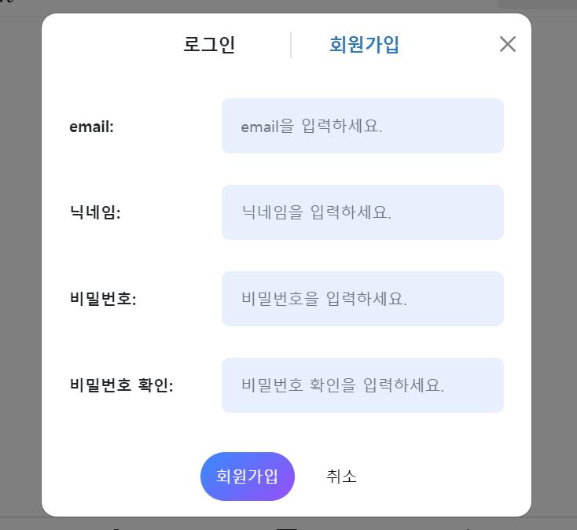

- 장고+toast+htmx 참고 유튜브: https://www.youtube.com/watch?v=dc4fhli61bQ
  -
  github: https://github.com/bblanchon/django-htmx-messages-framework/blob/hx-trigger/htmx_messages/templates/toasts.html
    - oob관련 modal바뀐 부분 등 정리: https://blog.benoitblanchon.fr/django-htmx-messages-framework-oob/
- 로그인 참고 깃허브(fastapi + htmx + pydantic): https://github.dev/sammyrulez/htmx-fastapi/blob/main/templates/owner_form.html

### [base].modal-dialog 내부에 들어가던 [form].modal-content 역시 hx요청을 받아주는 부모로

1. login_form.html과 register_form.html의 .modal-body를 채울 `login_or_register_form.html`을 만들고
2. 기존에는 `form.modal-content`로 시작했지만, **내부의 `.modal-header는 고정`되고 `.modal-body`만 내부내용을 바꿀 것이기 때문에**
    - form.modal-content -> div.modal-content로 태그를 바꿔주고
    - form태그를 .modal-body속 `_form(매크로).필드()`호출하는 부분을 감싸주도록 변경한다.
    ```html
    <div class="modal-content">
        <!-- header -->
        <div class="modal-header">
            <div class="modal-title fs-5" id="modalLabel">
            </div>
            <button type="button" class="btn-close" data-bs-dismiss="modal" aria-label="Close"></button>
        </div>
        <div class="modal-body">
            
        </div>
    </div>
    ```


3. 일관성을 위해 그동안 만들었던 `post/partials/create_form.html`외 `user/paritals/login+register_form.html`도 같은형태로 바꿔준다.
    - **form태그에 달려있던 .modal-content를 떼고, .modal-body내부에서 필드들을 감싸주며, div.modal-content를 맨 바깥에 씌운다**
    - 기존
    ```html
    <form class="modal-content"
              hx-trigger="submit"
              hx-post="{{ url_for('pic_new_post') }}"
              hx-encoding="multipart/form-data"
    >
        <!-- header -->
        <div class="modal-header">
            <h1 class="modal-title fs-5" id="modalLabel">새 게시물 작성</h1>
            <button type="button" class="btn-close" data-bs-dismiss="modal" aria-label="Close"></button>
        </div>
        <div class="modal-body">
    ```

    - 변경
    ```html
    <div class="modal-content">
        <!-- header -->
        <div class="modal-header">
            <h1 class="modal-title fs-5" id="modalLabel">새 게시물 작성</h1>
            <button type="button" class="btn-close" data-bs-dismiss="modal" aria-label="Close"></button>
        </div>
        <!-- body -->
        <div class="modal-body">
            <form hx-trigger="submit"
                  hx-post="{{ url_for('pic_new_post') }}"
                  hx-encoding="multipart/form-data"
            >
    ```


4. `login_or_register_form.html`의 .modal-header부분을 tab형태로 만들기 위해, `hwawei` 내 프로젝트를 참고해서 작성했다.
    - 깔끔하게 만들기 위해, .modal-header의 div태그에 `border-bottom-0`을 넣어준다.
    - 그리고 .modal-title을 가운데 정렬하기 위해, `.mx-auto` 및 `fw-bold`까지 넣어주면 **형제인 우측닫기 버튼을 공간을 제외하고 가운데 정렬되기 때문에**
    - 버튼 태그는 .modal-title과 별개로 .modal-header에 대한 `position-absolute`를 `end-0 me-2`으로 `부모에 대해 .modal-title과 별개로 독자적`으로
      오른쪽 끝으로 보내준다.
    ```html
    <div class="modal-content">
        <!-- header -->
        <div class="modal-header border-bottom-0">
            <h1 class="modal-title fs-5 fw-bold mx-auto" id="modalLabel">
                로그인 or 회원가입
            </h1>
            <button type="button" class="btn-close position-absolute end-0 me-2" data-bs-dismiss="modal" aria-label="Close"></button>
        </div>
    ```
    - 나머지 form들도 이렇게 적용해주자.

### .modal-body를 채울 tab 형태 만들기

- 참고: django-tailwind의 profile 부분: https://github.dev/andyjud/backend-tutorial/


1. .modal-title 내부를 span으로 구성된 tab으로 만들기 위해 `h1 -> div`태그로 변경하고, 로그인과 회원가입을 span태그로 작성한다.
    - **그리고 htmx요청으로 이루어질 곧인 `.modal-body`의 내부를 1번째 tab인 `login_form.html의 내용 중 .modal-body 내부`만 채워놓는다.**
    - **즉, form태그로 출발하는 field구성 부분이다.**
    - **각각을 `~form_login_part.html`, `~form_register_part.html`로 따로 빼두고, hx_form route에서 불러올 수 있게 한다.**
    ```python
    @app.get("/picstargram/form", response_class=HTMLResponse)
    async def pic_hx_form(
            request: Request,
            # form_name: str,
            hx_request: Optional[str] = Header(None),
    ):
        context = {
        'request': request,
        }   

        qp = request.query_params
        # ...
   
        elif any(name in qp for name in ['user-login-or-register', 'user_login_or_register']):
            return templates.TemplateResponse("picstargram/user/partials/login_or_register_form.html", context)
        elif any(name in qp for name in ['user-login-body', 'user_login_body']):
            return templates.TemplateResponse("picstargram/user/partials/login_or_register_form_login_part.html", context)
        elif any(name in qp for name in ['user-register-body', 'user_register_body']):
            return templates.TemplateResponse("picstargram/user/partials/login_or_register_form_register_part.html", context)
    
        else:
            return '준비되지 않은 modal입니다.'
    ```
    - 그리고 첫번째 부분을 include로 채워놓는다.
    ```html
    <div class="modal-title fs-5 fw-bold mx-auto" id="modalLabel">
      <span hx-get="{{ url_for('pic_hx_form') }}?user-login-body"
            hx-target=".modal-body">
          로그인
      </span>
        <span hx-get="{{ url_for('pic_hx_form') }}?user-register-body"
              hx-target=".modal-body">
          회원가입
      </span>
    </div>
    
    <!--...-->
    <div class="modal-body">
        
    </div>
    ```

2. **이제 각 span을 `inline -> 너비를 가지는 inline-block`으로 변경하고, `너비`를 줘서, `우측에 .border-start .border-2`를
   이용하여 `사이 가르기를 우측 span너비의 왼쪽 보더`로 작성한다**
    ```html
    <div class="modal-title fs-5 fw-bold mx-auto" id="modalLabel">
    <style>
        .modal .modal-content .modal-header .modal-title span {
            display: inline-block;
            width: 150px;
            text-align: center;
            font-size: 18px;
    
    </style>
        <span hx-get="{{ url_for('pic_hx_form') }}?user-login-body"
              hx-target=".modal-body"
        >
            로그인
        </span>
        <span hx-get="{{ url_for('pic_hx_form') }}?user-register-body"
              hx-target=".modal-body"
        >
            회원가입
        </span>
    </div>
    <button type="button" class="btn-close position-absolute end-0 me-2" data-bs-dismiss="modal"
            aria-label="Close"></button>
    ```

### hyperscript를 이용한 .selected 동적삽입 + rendering요소에 대해 fade-in 0->1 주기

1. hyperscript js코드를 base에 추가한다.
    ```html
    <!-- htmx -->
    <script src="https://unpkg.com/htmx.org@1.6.1"
            integrity="sha384-tvG/2mnCFmGQzYC1Oh3qxQ7CkQ9kMzYjWZSNtrRZygHPDDqottzEJsqS4oUVodhW"
            crossorigin="anonymous">
    </script>
    <!-- hyperscript for .selected -->
    <script src="https://unpkg.com/hyperscript.org@0.9.11"></script>
    ```

2. `첫번째 span`에만 `.selected`를 주고, span.selected가 된 경우에 글자색을 주도록 css를 작성한다.
    ```html
    
    <style>
        .modal .modal-content .modal-header .modal-title span.selected {
            color: #337ab7
        }
    </style>
    <span class="selected"
          hx-get="{{ url_for('pic_hx_form') }}?user-login-body"
          hx-target=".modal-body"
    >
                    로그인
    ```

3. **hx요청하는 span태그에 .selected를 추가하려면, `span태그의 부모태그인 .modal-title`태그에서 `_=""`형식으로 준다.**
    - `on` + 리스너인 `htmx:afterOnLoad`로서 요청으로 가져오면
    - `take .seleceted`로 selected class를 가지도록 해주는데
    - `for event.target`으로서 그 대상은 **`event를 발생시킨 span태그`**
    ```html
    
    <div class="modal-title fs-5 fw-bold mx-auto" id="modalLabel"
         _="on htmx:afterOnLoad take .selected for event.target"
    >
        <span class="selected"
              hx-get="{{ url_for('pic_hx_form') }}?user-login-body"
              hx-target=".modal-body"
        >
            로그인
        </span>
    ```
   

4. `hx-swap="방식 swap:.5s"`와 같이 htmx렌더링에 대한 transition은 **렌더링되는 partials에 추가**해줘야하는데
    - `_`의 hyperscript + `<fade-in>`태그를 이용해서,렌더링 되는 html을 감싸면, fadein이 적용된다.
    - fade-in태그는 bootstrap3라서 없는 것 같은데 `.opacity-0`로 시작해서 시작하게 한다. 지금은 없으니 style="opacity:0"으로 시작하게 한다
    - **`on` + `load`리스너로서 `렌더링 되는 내가 load`시 (<->hx 호출 시에는 부모에서 htmx:afterOnLoad)**
    - **`transition`을 `my` 내자신에게 거는데 `opacity to 1`까지 `over 0.2 seconds`로 0.2초 동안 변환되도록 한다.**
    - `login_or_register_form_login_part.html`과 `login_or_register_form_register_part.html` 둘다 form태그 바깥에 걸어준다.
    ```html
    
    {#        class="opacity-0"#}
    <fade-in style="opacity:0;"
             _="on load transition my opacity to 1 over 0.2 seconds">
        <form hx-trigger="submit"
                {#hx-post="{{ url_for('pic_new_post') }}"#}
                {#hx-encoding="multipart/form-data"#}
        >
    ```