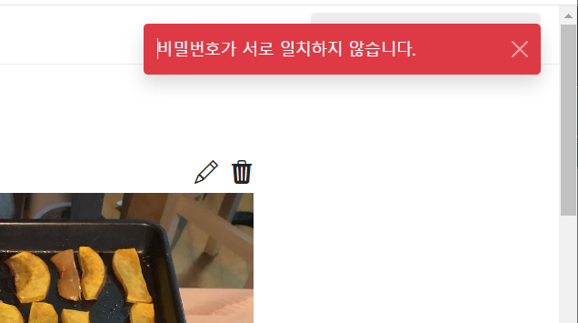

- cookie 인증 유튜브: https://www.youtube.com/watch?v=EO9XWml9Nt0 
- 로그인 참고 깃허브(fastapi + htmx + pydantic): https://github.dev/sammyrulez/htmx-fastapi/blob/main/templates/owner_form.html

### register 
#### schema

1. schema를 만든다.
    - 보통 유튜브에서는 OAuth2PasswordRequestForm을 사용하는데, 이것은 username과 password를 받는다.
    - 하지만 나는 `email`도 추가로 받아야하며, 추후에는 fastapi-users를 사용할 것이기 때문에 간단버전으로 직접 schema를 구현한다.
    - email필드만 as_form에서 `: EmailStr`으로 이메일 형식인지 검사한다.
    ```python
    class UserCreateReq(BaseModel):
        email: str
        username: str
        password1: str
        password2: str
    
        # fastapi-users
        # class BaseUserCreate(CreateUpdateDictModel):
        #     email: EmailStr
        #     password: str
        #     is_active: Optional[bool] = True
        #     is_superuser: Optional[bool] = False
        #     is_verified: Optional[bool] = False
    
        @classmethod
        def as_form(
                cls,
                email: EmailStr = Form(...), # TODO: 미들웨어에서 422에러가 템플릿에서 발생시 ..처리해주기..
                username: str = Form(...),
                password1: str = Form(...),
                password2: str = Form(...),
        ):
            # obj array [string] to dict list [python]
            # if tags:
            #     tags = json.loads(tags)
    
            return cls(email=email, username=username, password1=password1, password2=password2)
    ```
    - ImportError: email-validator is not installed, run `pip install pydantic[email]`
        - 해당 패키지를 설치히라고 에러가 뜸.


2. route에서 schema를 Depends(.as_form)으로 넣은 뒤, schema형으로 받아서, `내부에서는 .model_dump()의 dict`로 만들어서 써야한다.
    - 응답은 modal -> CRUD이므로 "noContent"가 들어가도록 render()에 빈 "" template을 넣어서 내부 html_str이 비도록 해주자.
    - 참고로, CRUD의 path방식을 template의 경우 new/show/edit/remove로 작명하자.
    ```python
    @app.post("/picstargram/users/new")
    async def pic_new_user(
            request: Request,
            response: Response,
            hx_request: Optional[str] = Header(None),
            user_create_req: UserCreateReq = Depends(UserCreateReq.as_form),
    ):
    
        data = user_create_req.model_dump()
        # data  >> {'email': 'tingstyle1@gmail.com', 'username': 'asdf', 'password1': '1234', 'password2': '1234'}
    
        context = {
            'request': request,
        }
        
        return render(request, "", context,
                      messages=[Message.CREATE.write('계정')]
                      )
    
    ```
   

#### route에서 검증 - 실패시 message로 알려주며 noContent로서 render(request, "", messages=[])
1. username으로 user를 가져오는 crud를 하나 작성하고, 존재하는지 검사한 뒤, 있으면 에러를 message로 내어준다.
    - 이 때, FAIL시 entity말고 직접 text를 풀로 작성하도록 로직을 조금 수정해준다.
    ```python
    def get_user_by_username(username: str, with_posts: bool = False, with_comments: bool = False):
        user = next((user for user in users if user.username == username), None)
        if not user:
            return None
    
        if with_posts:
            user.posts = [post for post in posts if post.user_id == user.id]
    
        if with_comments:
            user.comments = [comment for comment in comments if comment.user_id == user.id]
    
        return user
    ```
    ```python
    def write(
            self,
            entity: str,
            text:str = None,
            level: MessageLevel = MessageLevel.INFO
    ):
        message_text, message_css = self.generate_text_and_css(entity, level)
        if text:
            message_text = text

        return {
            "text": message_text,
            "css": message_css
        }
    ```
    ```python
    @app.post("/picstargram/users/new")
    async def pic_new_user(
            request: Request,
            response: Response,
            hx_request: Optional[str] = Header(None),
            user_create_req: UserCreateReq = Depends(UserCreateReq.as_form),
    ):
    
        data = user_create_req.model_dump()
        # data  >> {'email': 'tingstyle1@gmail.com', 'username': 'asdf', 'password1': '1234', 'password2': '1234'}
    
        # 검증1: 중복여부
        exists_user = get_user_by_username(data['username'])
        if exists_user:
            return render(request, "", messages=[Message.FAIL.write('회원', text='이미 존재하는 username입니다.')])
    
    ```
   
2. email 중복여부로 검사한다.
    - 하지만 json데이터에 email필드가 없기 때문에 추가해준다.
    ```json
    {
      "users": [
        {
          "id": 1,
          "email": "user1@gmail.com",
          "username": "user1",
          "created_at": "2018-05-17 16:56:21",
          "updated_at": "2018-05-17 16:56:21",
          "image_url": "images/user1.png"
        },
    ```
    - **데이터 필드가 추가되면, db model에 해당하는 Schema도 추가해줘야한다.**
    ```python
    class UserSchema(BaseModel):
        id: Optional[int] = None  # 서버부여 -> 존재는 해야함 but TODO: DB 개발되면, 예제 안뜨게 CreateSchema 분리하여 제거대상.
        email: str # 추가
        username: str
        #...
    ```
   

3. 비밀번호1,2가 다른지 확인한다.
    - **어차피 둘다 생성시 사용되지 않으니 `pop`으로 꺼내서, 비교하자.**
    ```python
        # 검증2: 비밀번호 2개 일치여부 (hashed_password가 생성시 필요하니, pop으로 꺼낸다?!)
        password1 = data.pop('password1')
        password2 = data.pop('password2')
        if password1 != password2:
            return render(request, "",
                          messages=[Message.FAIL.write('회원', text='비밀번호가 서로 다릅니다.', level=MessageLevel.ERROR)])
    ```
   

4. request 필드 확인이므로 `as_form에 넣고 -> Schema는 password`로 받기로 변경한 뒤,
    - 여기서 검증을 해주고 `HTTPException`으로 `422에러`를 발생시켜준다.
    - 이 때, headers로 noContent를 전달할 순 있으나, render가 아니므로 oob전달이 안되서 messages를 전달못함. 
    ```python
    class UserCreateReq(BaseModel):
        email: str
        username: str
        password: str
        @classmethod
        def as_form(
                cls,
                email: EmailStr = Form(...),
                # TODO: 미들웨어에서 422에러가 템플릿에서 발생시 .."noContent"를 HX-Trigger로 끼워서 응답해줘야, modal이 닫힘 + toast도 추가해야함.
                username: str = Form(...),
                password1: str = Form(...),
                password2: str = Form(...),
        ):
            if password1 != password2:
                raise HTTPException(
                    status_code=status.HTTP_422_UNPROCESSABLE_ENTITY,
                    detail="비밀번호가 서로 일치하지 않습니다.",
                )
    
            return cls(email=email, username=username, password=password1)
    ```

5. 이미지앱 프로젝트를 참고해서, password 검증의 여러가지를 추가해주자.
    - https://github.dev/riseryan89/imizi-api/blob/main/app/middlewares/access_control.py
    ```python
    @classmethod
    def as_form(
            cls,
            email: EmailStr = Form(...),
            # TODO: 미들웨어에서 422에러가 템플릿에서 발생시 .."noContent"를 HX-Trigger로 끼워서 응답해줘야, modal이 닫힘 + toast도 추가해야함.
            username: str = Form(...),
            password1: str = Form(...),
            password2: str = Form(...),
    ):
        # obj array [string] to dict list [python]
        # if tags:
        #     tags = json.loads(tags)
        if password1 != password2:
            raise HTTPException(
                status_code=status.HTTP_422_UNPROCESSABLE_ENTITY,
                detail="비밀번호가 서로 일치하지 않습니다.",
            )
        if 20 < len(password1) or len(password1) < 8:
            raise HTTPException(
                status_code=status.HTTP_422_UNPROCESSABLE_ENTITY,
                detail="패스워드의 길이는 8자 보다 길고 20자 보다 짧아야 합니다.",
            )
        
        if not any(char.isdigit() for char in password1):
            raise HTTPException(
                status_code=status.HTTP_422_UNPROCESSABLE_ENTITY,
                detail="패스워드에 최소한 1개 이상의 숫자가 포함되어야 합니다.",
            )
        if not any(char.isupper() for char in password1):
            raise HTTPException(
                status_code=status.HTTP_422_UNPROCESSABLE_ENTITY,
                detail="패스워드에 최소한 1개 이상의 대문자가 포함되어야 합니다.",
            )
        if not any(char.islower() for char in password1):
            raise HTTPException(
                status_code=status.HTTP_422_UNPROCESSABLE_ENTITY,
                detail="패스워드에 최소한 1개 이상의 소문자가 포함되어야 합니다.",
            )

        return cls(email=email, username=username, password=password1)
    
    ```
   
### pydantic의 HTTPException + 422에러는 미들웨어서 못잡는다. -> Schema에서 as_form검증시 일반 Exception을 내고 미들웨어에서 잡아 messages로 던지자.
1. **HTTPException은 `미들웨어를 거치지 않고` 바로 그 status_code로 응답을 내려버린다.**
    - **만약, 템플릿 에러로서, 미들웨어에서 잡아서, messages(oob)로 처리하려면, HTTPException이 아닌 `일반 Exception or CustomException`으로 내려보내야한다.**
    ```python
    class UserCreateReq(BaseModel):
        email: str
        username: str
        password: str
        
        @classmethod
        def as_form(
                cls,
                email: EmailStr = Form(...),
                # TODO: 미들웨어에서 422에러가 템플릿에서 발생시 .."noContent"를 HX-Trigger로 끼워서 응답해줘야, modal이 닫힘 + toast도 추가해야함.
                username: str = Form(...),
                password1: str = Form(...),
                password2: str = Form(...),
        ):
            if password1 != password2:
                raise Exception("비밀번호가 서로 일치하지 않습니다.")
            #...
    
            return cls(email=email, username=username, password=password1)
    ```
2. 이제 `middlewares` 패키지를 만들고 `access_control.py`에서 `BaseHTTPMiddleware`를 상속한 미들웨어를 정의한다.
    - **dispatch를 상속해서 추가작업후 `return await call_next(request)` or `raise e` 해주면 된다.**
    - 일단은 에러가 발생하면 무조건 render()로 message를 보내게 한다.
    - **이 때, HTTPException은 안잡힐 것이다.**
    ```python
    class AccessControl(BaseHTTPMiddleware):
        async def dispatch(self, request: Request, call_next: RequestResponseEndpoint) -> Response:
            ip = request.headers["x-forwarded-for"] if "x-forwarded-for" in request.headers.keys() else request.client.host
            request.state.ip = ip.split(",")[0] if "," in ip else ip
            try:
                return await call_next(request)
            except Exception as e:
                # raise e
                return render(request, "", messages=[Message.FAIL.write('', text=f'{str(e)}', level=MessageLevel.ERROR)])
    
    ```
   
2. 미들웨어를 app에 등록한다.
    - 등록 역순으로 실행되니 CORS보다는 위쪽에서 먼저 등록하여 나중에 실행되게 한다.
    ```python
    app.add_middleware(AccessControl)
    app.add_middleware(
        CORSMiddleware,
    ```

3. 이제 에러가 나면, 내부 "noContent"가 HX-Trigger로 추가되어, str(e)가 메세지로 찍히는지 확인한다.
    

4. modal이 안닫히면 좋겠지만, 키워드를 추가하여 render()시 내부 hx-trigger "noContent"를 주석처리하고 response해도, modal내용이 닫힌다.  
   - beforeSwap에서 `evt`는 swap을 막을 순 있지만, <-> noContent 트리거에 들어오는 `evt`는 element다.
     - 302로 내리고, beforeSwap에서 dialog를 안닫히도록 swap을 막으면 oob도 안일어난다.
     - noContent에서는  modal을 막을 방법이 response정보가 evt(form)에 없어서 못찾는다?!

5. 모든 에러를 messages로 던져지면 안된다. api 에러 등은 네트워크 에러로 잡혀야한다.
    - 내가 지정한 `TemplateException`만 render()로 메세지로 보내자.

### custom TemplateException in middleware

1. exceptions패키지를 만들고 template_exception.py을 만든다.

2. TemplateException은 Exception 상속과 동시에 eㄱ, status_code + message를 받게 만든다.
    - 경우의마다 쓸 자식들로서 InternalServerException, NotFoundException, BadRequestException을 만들되
    - **status_code는 기본 200으로 주자**
       - oob를 위해 허용되는 코드는 `200~ 399`이며, `204`는 제외된다.

    ```python
    from starlette import status
    
    
    class TemplateException(Exception):
        """
        oob message전달을 위해, 204를 제외한 200~399 까지 swap이 일어나는 코드로 반환한다.
        """
        status_code: int
        message: str
        ex: Exception
    
        def __init__(self, status_code: int = status.HTTP_200_OK, message: str = None, ex: Exception = None):
            if not (200 <= status_code < 400 or status_code != 204):
                raise Exception('템플릿 오류는 status_code가 200<= < 400 사이이며, 204 또한 제한됩니다.')
            self.status_code = status_code
            self.message = message
            self.ex = ex
    
    
    class InternalServerException(TemplateException):
        def __init__(
            self,
            message="서버 오류 입니다. 관리자에게 문의해주세요.",
            ex: Exception = None,
        ):
            super().__init__(
                message=message,
                ex=ex,
            )
    
    
    class NotFoundException(TemplateException):
        def __init__(
            self,
            message,
            ex: Exception = None,
        ):
            super().__init__(
                message=message,
                ex=ex,
            )
    
    
    class BadRequestException(TemplateException):
        def __init__(
            self,
            message,
            ex: Exception = None,
        ):
            super().__init__(
                message=message,
                ex=ex,
            )
    ```


3. 미들웨어에서, 에러를 잡을 때, template에서 직접 사용한 TemplateException만 render()로 oob전달하게 하고
    - 그외 api 등 서버 등의 기본 서버 문제는 `str(e)`를 message로 한 JSONResponse로 내려보내주자.
    ```python
    class AccessControl(BaseHTTPMiddleware):
        async def dispatch(self, request: Request, call_next: RequestResponseEndpoint) -> Response:
            ip = request.headers["x-forwarded-for"] if "x-forwarded-for" in request.headers.keys() else request.client.host
            request.state.ip = ip.split(",")[0] if "," in ip else ip
    
            try:
                response = await call_next(request)
                return response
            except Exception as e:
                # 템플릿 오류 -> oob render(status code 200<= <400 + 204제외만 oob swap)
                if isinstance(e, TemplateException):
                    return render(request, "",
                                  messages=[Message.FAIL.write('', text=f'{str(e)}', level=MessageLevel.ERROR)],
                                  )
                else:
                    # return JSONResponse({"message": "Internal Server Error"}, status_code=500)
                    return JSONResponse({"message": str(e)}, status_code=500)
    ```

4. 이제 oob messages로 반환할 에러들은 TemplateException의 자식예외로 발생시켜준다.
    ```python
    class UserCreateReq(BaseModel):
    
        email: str
        username: str
        password: str
        @classmethod
        def as_form(
                cls,
                email: EmailStr = Form(...),
                # TODO: 미들웨어에서 422에러가 템플릿에서 발생시 .."noContent"를 HX-Trigger로 끼워서 응답해줘야, modal이 닫힘 + toast도 추가해야함.
                username: str = Form(...),
                password1: str = Form(...),
                password2: str = Form(...),
        ):
            if password1 != password2:
                # raise Exception("비밀번호가 서로 일치하지 않습니다.")
                raise BadRequestException('비밀번호가 서로 일치하지 않습니다.')
            #...
    
    ```
5. 이제 register에서 검증을 통과하면 password필드로 들어오게 된다.
    ```python
    @app.post("/picstargram/users/new")
    async def pic_new_user(
            request: Request,
            response: Response,
            hx_request: Optional[str] = Header(None),
            user_create_req: UserCreateReq = Depends(UserCreateReq.as_form),
    ):
        data = user_create_req.model_dump()
    ```
   

6. **`에러 oob`만 던지는 템플릿 에외상황일 경우 `return 빈 render()`보다는 `raise 템플릿 에러`로 변경하자.**

    ```python
    @app.post("/picstargram/users/new")
    async def pic_new_user(
            request: Request,
            response: Response,
            hx_request: Optional[str] = Header(None),
            user_create_req: UserCreateReq = Depends(UserCreateReq.as_form),
    ):
        data = user_create_req.model_dump()
        # data  >> {'email': 'admin@gmail.com', 'username': 'user1', 'password': '321'}
    
    
        # 검증1: 중복여부(email, username)
        exists_email = get_user_by_email(data['email'])
        if exists_email:
            # return render(request, "", messages=[Message.FAIL.write('회원', text='이미 존재하는 email입니다.', level=MessageLevel.ERROR)])
            raise BadRequestException("이미 존재하는 email입니다")
        exists_username = get_user_by_username(data['username'])
        if exists_username:
            # return render(request, "",
            #               messages=[Message.FAIL.write('회원', text='이미 존재하는 username입니다.', level=MessageLevel.ERROR)])
            raise BadRequestException("이미 존재하는 username입니다.")
    ```
   

### EmailStr처럼 as_form 이전에 검증 -> middleware에 안잡히는 경우 -> app.exception_handler
```python
@app.exception_handler(RequestValidationError)
async def pydantic_422_exception_handler(request: Request, exc: RequestValidationError):
    """
    custom middleware에서 안잡히는 pydantic 422 입력에러 -> raise customerror -> middleware
    참고: https://stackoverflow.com/questions/58642528/displaying-of-fastapi-validation-errors-to-end-users
    """
    # return JSONResponse(
    #     status_code=status.HTTP_422_UNPROCESSABLE_ENTITY,
    #     content=jsonable_encoder({"detail": exc.errors(), "Error": "Name field is missing"}),
    # )
    # reformatted_message = defaultdict(list)
    reformatted_message = defaultdict(str)
    for pydantic_error in exc.errors():
        loc, msg = pydantic_error["loc"], pydantic_error["msg"]
        filtered_loc = loc[1:] if loc[0] in ("body", "query", "path") else loc
        field_string = ".".join(filtered_loc)  # nested fields with dot-notation
        # reformatted_message[field_string].append('<li>' + msg + '</li>')
        reformatted_message[field_string] += ('<li>' + msg + '</li>')

    print(f"reformatted_message  >> {reformatted_message}")
    # {'email': ['value is not a valid email address: The part after the @-sign contains invalid characters: "\\".']})
    # {'email': '<li>value is not a valid email address: The part after the @-sign contains invalid characters: "\\".</li'})

    raise BadRequestException(f'''
{", ".join(reformatted_message.keys())} 입력 에러(422)가 발생했습니다. 아래사항을 살펴주세요.<br/>
{"".join(reformatted_message.values())}
''')

```