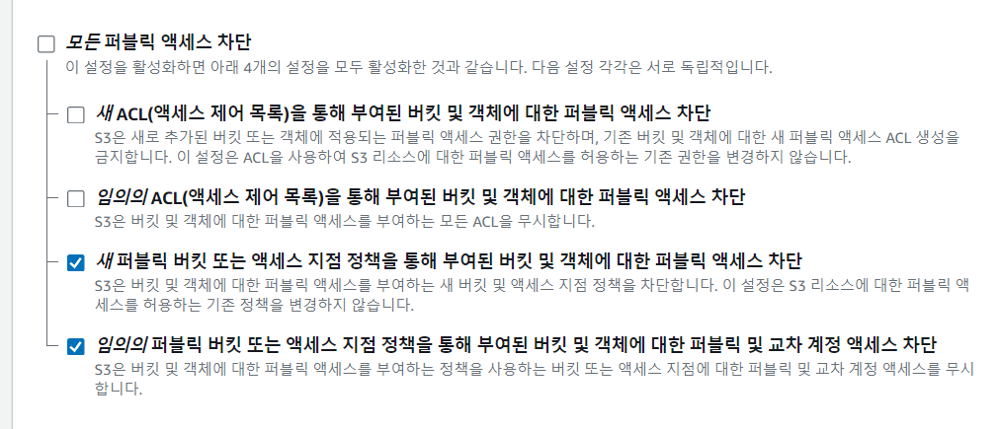

- cookie 인증 유튜브: https://www.youtube.com/watch?v=EO9XWml9Nt0
- 로그인 참고 깃허브(fastapi + htmx + pydantic): https://github.dev/sammyrulez/htmx-fastapi/blob/main/templates/owner_form.html

### 로그인 성공후 create_access_token by jwt

#### 기존 프로젝트의 create_access_token 속 jwt.encode/decode

1. fastapi-users
    - jwt 라이브러리로 encode/decode하되 알고리즘은 `HS256`을 고정적으로 사용한다.
    - **encode할 payload를 user객체만 받아서 -> `str(user.id)`를 `sub`로 + string list를 `aud`로 `payload`를 구성한다.**
    ```python
    import jwt
    
    JWT_ALGORITHM = "HS256"
    def generate_jwt(
        data: dict,
        secret: SecretType,
        lifetime_seconds: Optional[int] = None,
        algorithm: str = JWT_ALGORITHM,
    ) -> str:
        payload = data.copy()
        if lifetime_seconds:
            expire = datetime.utcnow() + timedelta(seconds=lifetime_seconds)
            payload["exp"] = expire
        return jwt.encode(payload, _get_secret_value(secret), algorithm=algorithm)
    
    
    def decode_jwt(
        encoded_jwt: str,
        secret: SecretType,
        audience: List[str],
        algorithms: List[str] = [JWT_ALGORITHM],
    ) -> Dict[str, Any]:
        return jwt.decode(
            encoded_jwt,
            _get_secret_value(secret),
            audience=audience,
            algorithms=algorithms,
        )
    
    ```
    - 이 때, sub에는 `user.id`를 str()해서, aud에는 고유값을 `fastapi-users:auth`등으로 구성된 string list를 jwt.encode() / .decode()에 넣는다.
    ```python
    class JWTStrategy(Strategy[models.UP, models.ID], Generic[models.UP, models.ID]):
    
        def __init__(
            self,
            secret: SecretType,
            lifetime_seconds: Optional[int],
            token_audience: List[str] = ["fastapi-users:auth"],
            algorithm: str = "HS256",
            public_key: Optional[SecretType] = None,
        ):
            # ...
   
        async def read_token(
            self, token: Optional[str], user_manager: BaseUserManager[models.UP, models.ID]
        ) -> Optional[models.UP]:
            if token is None:
                return None
    
            try:
                data = decode_jwt(
                    token, self.decode_key, self.token_audience, algorithms=[self.algorithm]
                )
                user_id = data.get("sub")
                if user_id is None:
                    return None
            except jwt.PyJWTError:
                return None
    
            try:
                parsed_id = user_manager.parse_id(user_id)
                return await user_manager.get(parsed_id)
            except (exceptions.UserNotExists, exceptions.InvalidID):
                return None
    
        async def write_token(self, user: models.UP) -> str:
            data = {"sub": str(user.id), "aud": self.token_audience}
            return generate_jwt(
                data, self.encode_key, self.lifetime_seconds, algorithm=self.algorithm
            )
    
    ```

2. 그외 payload에는 exp(ire), iat(issued at), nbf(not before), iss(issuer), jti(jwt id), aud(audience) 등을 넣을 수 있는데
    - sub는 subject로서, user의 unqiue한 값 (str(user.id) or user.email ) 등이 들어가는 것 같다.
    - 혹은 payload dict를 원하는 정보만 id, email, staff 등으로 만든 뒤 -> 메서드내에서 exp + iat + iss만 추가할 수 있다.
    - **완성된 값은 `"Bearer "`를 붙혀준다.**
    ```python
    class Users(Base):
        # ...
        def get_token(self):
            "TODO: sqlalchemy User 모델 이관"
            return {
                "access_token": "Bearer " + create_token(
                    data=dict(
                        sub=str(self.id),
                        username=self.username,
                        image_url=self.image_url,
                        #staff=self.is_admin),
                    ),
                    delta=settings.access_token_expire_minutes,
                ),
                "refresh_token": "Bearer " + create_token(
                    data=dict(sub=str(self.id)),
                    delta=settings.refresh_token_expire_minutes,
                ),
            }
    
    
    def create_token(data: dict, delta: int):
        conf = get_env()
        expire = datetime.utcnow() + timedelta(minutes=delta)
        payload = dict(exp=expire, **data)
        payload["iat"] = datetime.utcnow()
        payload["iss"] = "imizi api"
    
        return jwt.encode(payload, conf.JWT_SECRET_KEY, algorithm=conf.JWT_ALGORITHM)
    
    ```

3. 유튜브 cookie auth
    - sub에는 username + "role"에 is_Admin여부를 추가해서, 관리자인지를 확인할 수 있게 한다.
    ```python
    access_token_expires = timedelta(minutes=authSecurity.ACCESS_TOKEN_EXPIRE_MINUTES)
    access_token = authSecurity.create_access_token(
        data={"sub": user.username,"role":user.is_Admin}, expires_delta=access_token_expires
    )
    response = RedirectResponse(url="/index",status_code=status.HTTP_302_FOUND)
    
    # to save token in cookie
    response.set_cookie(key="access_token",value=f"Bearer {access_token}", httponly=True) 
    ```


4. backend-python cleancode 작성시엔
    - TokenCreator, TokenVerify 데코레이터를 정의해서 사용했다.
    - 자동으로 refresh된다.
    ```python
    import time
    import jwt
    from datetime import datetime, timedelta
    
    
    class TokenCreator:
        def __init__(self, token_key: str, exp_time_min: int, refresh_time_min: int):
            self.__TOKEN_KEY = token_key
            self.__EXP_TIME_MIN = exp_time_min
            self.__REFRESH_TIME_MIN = refresh_time_min
    
        def create(self, uid: int):
            """Return JWT
            :param - uid: user identify
            :return - string with token
            """
    
            return self.__encode_token(uid)
    
        def decode_token(self, token: str):
            """Decode token
            :param - stirng with token
            :return - string with token_information
            """
            token_information = jwt.decode(token, key=self.__TOKEN_KEY, algorithms="HS256")
    
            return token_information
    
        def refresh(self, token: str):
            """Function to create initial token when logging
            :parram - string with token
            :return - string with token
            """
            token_information = self.decode_token(token)
            token_uid = token_information["uid"]
            exp_time = token_information["exp"]
    
            if (exp_time - time.time()) / 60 < self.__REFRESH_TIME_MIN:
                # #If token refreshed in more than 15 minutes, new refresh
                return self.__encode_token(token_uid)
    
            return token
    
        def __encode_token(self, uid: int):
            """Encode and creating an jwt with payload
            :param - uid: user identify
            :return - string with token
            """
            token = jwt.encode(
                {
                    "exp": datetime.utcnow() + timedelta(minutes=self.__EXP_TIME_MIN),
                    "uid": uid,
                },
                key=self.__TOKEN_KEY,
                algorithm="HS256",
            )
    
            return token
    ```
    ```python
    from functools import wraps
    import jwt
    from flask import request, jsonify
    from .token_handler import token_creator
    
    
    def token_verify(function: callable) -> callable:
        """Checking the valid Token and refreshing it. If not valid, return
        Info and stopping client request
        :parram - http request.headers: (Username / Token)
        :return - Json with the corresponding information.
        """
    
        @wraps(function)
        def decorated(*args, **kwargs):
            raw_token = request.headers.get("Authorization")
            uid = request.headers.get("uid")
    
            # if not raw_token:
            if not raw_token or not uid:
                return jsonify({"error": "Bad Request"}), 400
    
            try:
                token = raw_token.split()[1]
                # token_information = jwt.decode(token, key='1234', algorithms='HS256')
                token_information = token_creator.decode_token(token)
                token_uid = token_information["uid"]
    
            except jwt.InvalidSignatureError:
                return jsonify({"error": "Invalid Token"}), 498
    
            except jwt.ExpiredSignatureError:
                return jsonify({"error": "Token is expired"}), 401
    
            except KeyError:
                return jsonify({"error": "Token is invalid"}), 401
    
            if int(token_uid) != int(uid):
                return jsonify({"error": "Unauthorized"}), 401
    
            next_token = token_creator.refresh(token)
            # route function
            # return function(*args, **kwargs)
            return function(next_token, *args, **kwargs)
    
        return decorated
    ```

    ```python
    @api_routes_bp.route("/secret", methods=["GET"])
    @token_verify
    def secret_route(token):
    
        return jsonify({"data": token}), 200
    
    
    @api_routes_bp.route("/auth", methods=["POST"])
    def authorize_user():
    
        token = token_creator.create(uid=12)
    
        return jsonify({"token": token}), 200
    ```


5. [blog](https://zambbon.tistory.com/entry/FastAPI-%ED%94%84%EB%A1%9C%EC%A0%9D%ED%8A%B8-%EC%A7%84%ED%96%89%EB%A1%9C%EA%B7%B8%EC%9D%B8-API-%EB%A7%8C%EB%93%A4%EA%B8%B0-90)
   에서는, oauth를 모방한 토큰발급route /token route를 만들고, /login route에서 await로 view function을 호출해서 처리했다.
    ```python
    @router.post("/", response_class=HTMLResponse)
    async def login(request: Request, db: Session = Depends(get_db)):
        try:
            form = LoginForm(request)
            await form.create_oauth_form()
            response = RedirectResponse(url="/todos", status_code=status.HTTP_302_FOUND)
    
            validate_user_cookie = await login_for_access_token(response=response, form_data=form, db=db)
    
            if not validate_user_cookie:
                msg = "Incorrect Username or Password"
                return templates.TemplateResponse("login.html", {"request": request, "msg": msg})
            return response
        except HTTPException:
            msg = "Unknown Error"
            return templates.TemplateResponse("login.html", {"request":request, "msg": msg})
    
    
    @router.post("/token")
    async def login_for_access_token(response: Response, form_data: OAuth2PasswordRequestForm = Depends(),
                                     db: Session = Depends(get_db)):
        user = authenticate_user(form_data.username, form_data.password, db)
        if not user:
            return False
        token = create_access_token(user.username,
                                    user.id,
                                    expires_delta = timedelta(minutes=60))
        response.set_cookie(key="access_token", value=token, httponly=True)
    
        return True
    ```

#### create_access_token 적용하기

1. 일단 user정보를 포함하여 access_token을 생성하도록 한다.
    - **fastapi-user : `user`객체를 받아, `"sub": str(user.id)`를 추가한다.**
    - **imiziapp: 외부에서user정보로 만든 `dict`를 받아, `refresh를 위한 "iat": .utcnow()` + `"iss": "발생앱이름"` + exp를 추가한다.**

```python
class JWTStrategy(Strategy[models.UP, models.ID], Generic[models.UP, models.ID]):

    def __init__(
            self,
            secret: SecretType,
            lifetime_seconds: Optional[int],
            token_audience: List[str] = ["fastapi-users:auth"],
            algorithm: str = "HS256",
            public_key: Optional[SecretType] = None,
    ):

    #...

    async def write_token(self, user: models.UP) -> str:
        data = {"sub": str(user.id), "aud": self.token_audience}
        return generate_jwt(
            data, self.encode_key, self.lifetime_seconds, algorithm=self.algorithm
        )
```

```python
import jwt

JWT_ALGORITHM = "HS256"


def generate_jwt(
        data: dict,
        secret: SecretType,
        lifetime_seconds: Optional[int] = None,
        algorithm: str = JWT_ALGORITHM,
) -> str:
    payload = data.copy()
    if lifetime_seconds:
        expire = datetime.utcnow() + timedelta(seconds=lifetime_seconds)
        payload["exp"] = expire
    return jwt.encode(payload, _get_secret_value(secret), algorithm=algorithm)

```

```python
def create_token(data: dict, delta: int):
    conf = get_env()
    expire = datetime.utcnow() + timedelta(minutes=delta)
    payload = dict(exp=expire, **data)
    payload["iat"] = datetime.utcnow()
    payload["iss"] = "imizi api"

    return jwt.encode(payload, conf.JWT_SECRET_KEY, algorithm=conf.JWT_ALGORITHM)


def decode_token(token: str):
    conf = get_env()
    try:
        payload = jwt.decode(token, conf.JWT_SECRET_KEY, algorithms=conf.JWT_ALGORITHM)
        return payload
    except jwt.ExpiredSignatureError:
        raise Exception("토큰이 만료되었습니다.")
    except jwt.InvalidTokenError:
        raise Exception("토큰이 유효하지 않습니다.")


class Users(Base):
    #...
    def token_refresh(self, refresh_token: str):
        refresh_payload = decode_token(refresh_token)
        now = int(datetime.utcnow().timestamp())
        if now - refresh_payload["iat"] < get_env().REFRESH_TOKEN_EXPIRE_MINUTES * 60 / 2:
            return {
                "access_token": create_token(
                    data=dict(id=self.id, email=self.email, staff=self.is_admin),
                    delta=get_env().ACCESS_TOKEN_EXPIRE_MINUTES,
                ),
                "refresh_token": refresh_token,
            }
        else:
            return self.get_token()

    def get_token(self):
        return {
            "access_token": create_token(
                data=dict(id=self.id, email=self.email, staff=self.is_admin),
                delta=get_env().ACCESS_TOKEN_EXPIRE_MINUTES,
            ),
            "refresh_token": create_token(
                data=dict(id=self.id),
                delta=get_env().REFRESH_TOKEN_EXPIRE_MINUTES,
            ),
        }
```

#### config.py by pydantic.BaseSettings

1. pydantic v2는 따로 없고 `pip install pydantic_settings`를 설치해야한다.
    - 문서: https://docs.pydantic.dev/latest/concepts/pydantic_settings/
    - 참고(v1버전0): https://github.dev/riseryan89/imizi-api/blob/main/app/config.py
    - **config도 `.model_dump()`를 이용할 수 있고, kwargs를 한꺼번에 받는 메서드에 `**settings.model_dump()`로 넣어줄 수 있다.**
2. root에 config.py를 만들어 BaseSettings를 상속한 Settings를 정의하고 BASE_DIR을 Path(__file__).parent로 만든다.
    ```python
    from pathlib import Path
    
    from pydantic_settings import BaseSettings
    
    
    class Settings(BaseSettings):
    
        base_dir: Path = Path(__file__).parent
    
    
    settings = Settings()
    ```
    ```python
    # shell.py
    import_target('/config.py', 'settings')
    
    # python shell.py
    In [1]: settings.model_dump()
    Out[1]: {'base_dir': WindowsPath('C:/Users/cho_desktop/PycharmProjects/htmx')}
    
    ```

3. 기본적으로 docker가 아닌 local(window-`windows` / mac-`darwin`)를 판단하는 `local_mode` 만들어준다.
    - **이제 access_token을 jwt로 만들기 위한 상수 4개도 추가해준다.**
    - 알고리즘/key/access, refresh token expire minutes
    ```python
    class Settings(BaseSettings):
    
        base_dir: Path = Path(__file__).parent
        local_mode: bool = (
            True if system().lower().startswith("darwin") or system().lower().startswith("windows") else False
        )
        
        JWT_ALGORITHM = "HS256"
        JWT_SECRET_KEY = "jwt-secret"
        ACCESS_TOKEN_EXPIRE_MINUTES = 60 * 24 * 1  # one day
        REFRESH_TOKEN_EXPIRE_MINUTES = 60 * 24 * 60  # sixty day
    
    
    settings = Settings()
    ```


4. secret을 .env파일에서 받기 위해 `.env를 만들고, .gitignore에 추가`한 뒤, settings 설정을 해준다.
    - **pydantic식으로 할당을 하지 않으면 자동으로 .env의 필드를 삽입해준다.**
    ```dotenv
    jwt_secret_key='secret'
    ```
    ```python
    class Settings(BaseSettings):
        model_config = SettingsConfigDict(env_file='.env', env_file_encoding='utf-8')
    
        jwt_algorithm: str = "HS256"
        jwt_secret_key: str
        #...
    ```

5. 이제 utils/auth.py에 PyJWT가 아닌  `python-jose`를 설치해서 jwt encode/decode한다.
    - fastapi공식문서에서 `python-jose`를 사용하고 있기 때문에, 이를 따른다.
        - But it was updated to use Python-jose instead as it provides all the features from PyJWT plus some extras that
          you might need later when building integrations with other tools.
    - `pip install python-jose`

6. create_token메서드는 외부에서 data를 직접 만들어주거나(imizi-app) or user객체를 집어넣는다.(fastapi-users)
    - **user만 집어넣지 못하는 이유는, refresh_token 발급시에는 `delta`라는 필수인자가 `다른값`이며, 내부 채워지는 데이터도 `id만 sub에`넣어주면 되기 때문이다.**
    - fastapi-users
    ```python
    async def write_token(self, user: models.UP) -> str:
        data = {"sub": str(user.id), "aud": self.token_audience}
        return generate_jwt(
            data, self.encode_key, self.lifetime_seconds, algorithm=self.algorithm
        )
    ```
    - imizi-app
    ```python
    def create_token(data: dict, delta: int):
        conf = get_env()
        expire = datetime.utcnow() + timedelta(minutes=delta)
        payload = dict(exp=expire, **data)
        payload["iat"] = datetime.utcnow()
        payload["iss"] = "imizi api"
    
        return jwt.encode(payload, conf.JWT_SECRET_KEY, algorithm=conf.JWT_ALGORITHM)
    
    class User(Base):
        # ...
        def get_token(self):
            return {
                "access_token": create_token(
                    data=dict(id=self.id, email=self.email, staff=self.is_admin),
                    delta=get_env().ACCESS_TOKEN_EXPIRE_MINUTES,
                ),
                "refresh_token": create_token(
                    data=dict(id=self.id),
                    delta=get_env().REFRESH_TOKEN_EXPIRE_MINUTES,
                ),
            }
    
    @user.post("/get-token", response_model=schemas.Token)
    async def get_token(data: schemas.UsersREQ, session: Session = Depends(db.session)):
        u = models.Users.get_by_email(session, data.email)
        if not u:
            raise ValueError("존재하지 않는 이메일입니다.")
        if not is_valid_password(data.pw, u.pw):
            raise ValueError("비밀번호가 일치하지 않습니다.")
        return u.get_token()
    ```
    - fastapiProject: UserToken(**user) -> model_dump() ->
    ```python
    
    token_data = UserToken.model_validate(user).model_dump(exclude={'hashed_password', 'marketing_agree'})
    token = await create_access_token(data=token_data)
    ```


7. create_token과 decode_token을 정의한다.
    - settings에 들어가도록 .env에 app_name을 넣어준다.
    - decode시 JWTError에 raise를 templateException을 넣어준다.
    ```python
    def create_token(data: dict, delta: int):
        """
        :data: key "sub" / value str(user.id)가 필수로 들어가야한다.
        :delta: 분 단위로 timedelta(minutes=)에 넣을 int를 입력.
                access_token과 refresh_token 값이 다름.
        """
        payload = data.copy()
    
        payload.update({
            "exp": datetime.utcnow() + timedelta(minutes=delta),
            "iat": datetime.utcnow(),  # for refresh
            "iss": settings.app_name,
        })
    
        return jwt.encode(payload, settings.jwt_secret_key, algorithm=settings.jwt_algorithm)
    
    
    def decode_token(token: str):
        """
        """
        token = token.replace("Bearer ", "")
        try:
            payload = jwt.decode(token, key=settings.jwt_secret_key, algorithms=settings.jwt_algorithm)
            return payload
        except ExpiredSignatureError:
            raise NotAuthorized("토큰이 만료되었습니다. 다시 로그인 해주세요.")
        except JWTError:
            raise NotAuthorized("토큰 정보가 정확하지 않습니다. 올바른 경로로 로그인 해주세요.")
    ```

    ```python
    class NotAuthorized(TemplateException):
        def __init__(
            self,
            message,
            ex: Exception = None,
        ):
            super().__init__(
                message=message,
                ex=ex,
            )
    ```

### API용으로 token발급하는 route를 추가
1. 현재 .as_form으로 받아야하는 상황 -> UserLoginReq객체로 변환해서 받은상태다.
    - token발급 route를 API용으로 만들어서, 내부에서 가져오는 식으로 oauth를 모방한다.
    - model_dump()없이, 바로 넘겨서 email/password 정보를 get_token route에 넘겨준다.

2. 먼저, UserSchema에 `get_token`메서드를 만들어서, user객체로 token정보를 얻게 한다.
    - sqlalchemy Users모델 이관 대상이다.
    - **payload를 외부에서 작성해주되, refresh_token에서는 sub만 만들어준다.**
    ```python
    def get_token(self):
        "TODO: sqlalchemy User 모델 이관"
        return {
            "access_token": create_token(
                data=dict(
                    sub=str(self.id), 
                    username=self.username,
                    image_url=self.image_url,
                    #staff=self.is_admin),
                ),
                delta=settings.access_token_expire_minutes,
            ),
            "refresh_token": create_token(
                data=dict(sub=str(self.id)),
                delta=settings.refresh_token_expire_minutes,
            ),
        }
    ```
   
3. route에서 2가지 토큰을 받아줄 Schema를 만든다.
    ```python
    class Token(BaseModel):
        access_token: str
        refresh_token: str = None
    
    class RefreshToken(BaseModel):
        refresh_token: str
    ```
   

4. pic_get_token route를 만든다.
    ```python
    @app.post("/picstargram/get-token", response_model=Token)
    async def pic_get_token(
            request: Request,
            user_login_req: UserLoginReq,
    ):
        data: dict = user_login_req.model_dump()
        
        # 로그인 검증: user존재여부 -> input pw VS 존재user의 hashed_pw verify
        user: UserSchema = get_user_by_email(data['email'])
        if not user:
            raise BadRequestException('가입되지 않은 email입니다.')
        if not verify_password(data['password'], user.hashed_password):
            raise BadRequestException('비밀번호가 일치하지 않습니다.')
    
        return user.get_token()
    ```
   
5. api route로서, /docs에서 test해본다.
    

6. **template login route에서 dump -> data -> 검증 부분을 주석처리하고, `pic_get_token` 라우터를 `await`를 통한 호출을 해서, Token reseponse를 받아온다.**
    - **추후 token발급 route -> await로 호출하는 template용 로그인 라우터를 반대방향으로 구현할 수 있을 것이다.**
    - as_form 구현 -> as_form으로 받은 뒤, await로 token라우터 호출
    - [참고 블로그](https://zambbon.tistory.com/entry/FastAPI-%ED%94%84%EB%A1%9C%EC%A0%9D%ED%8A%B8-%EC%A7%84%ED%96%89%EB%A1%9C%EA%B7%B8%EC%9D%B8-API-%EB%A7%8C%EB%93%A4%EA%B8%B0-90)
    ```python
    @app.post("/picstargram/users/login")
    async def pic_login_user(
            request: Request,
            response: Response,
            # hx_request: Optional[str] = Header(None),
            user_login_req: UserLoginReq = Depends(UserLoginReq.as_form),
    
    ):
        #### Schema Dump + 존재/비번검증 -> pic_get_token route로 이관 ####
        # data: dict = user_login_req.model_dump()
        # # 로그인 검증: user존재여부 -> input pw VS 존재user의 hashed_pw verify
        # user = get_user_by_email(data['email'])
        # if not user:
        #     raise BadRequestException('가입되지 않은 email입니다.')
        # if not verify_password(data['password'], user.hashed_password):
        #     raise BadRequestException('비밀번호가 일치하지 않습니다.')
        ####
    
        token: dict = await pic_get_token(request, user_login_req)
    
    
        context = {
            'request': request,
        }
    
        return render(request, "", context,
                      messages=[Message.CREATE.write(entity=f"유저", text="로그인에 성공했습니다.")]
                      )
    ```
   
7. 받은 token 2개를 cookie에 response에 집어넣어야한다.
    - httponly로만 들어가도록 cookies에 넣어준다.
    ```python
    def render(request, template_name="", context: dict = {}, status_code: int = 200,
               cookies: dict = None,
               delete_cookies: list = None,
               hx_trigger: dict | str | List[str] = None,
               messages: dict | List[dict] = None,
               oobs: List[tuple] = None,
               ):
        #...
        
        # 기본 darkmode 및 cookie관련
        response.set_cookie(key='darkmode', value=str(1))
    
        # set httponly cookies
        if cookies:
            for k, v in cookies.items():
                response.set_cookie(key=k, value=v, httponly=True)
    
        # delete coookies
        if delete_cookies:
            for key in delete_cookies:
                response.delete_cookie(key)
    
        return response
    ```

    ```python
    @app.post("/picstargram/users/login")
    async def pic_login_user(
            request: Request,
            response: Response,
            # hx_request: Optional[str] = Header(None),
            user_login_req: UserLoginReq = Depends(UserLoginReq.as_form),
    
    ):
        token: dict = await pic_get_token(request, user_login_req)
    
        context = {
            'request': request,
        }
    
        return render(request, "", context,
                      cookies=token,
                      messages=[Message.CREATE.write(entity=f"유저", text="로그인에 성공했습니다.")]
                      )
    ```
    