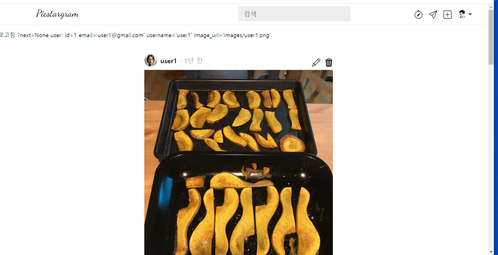
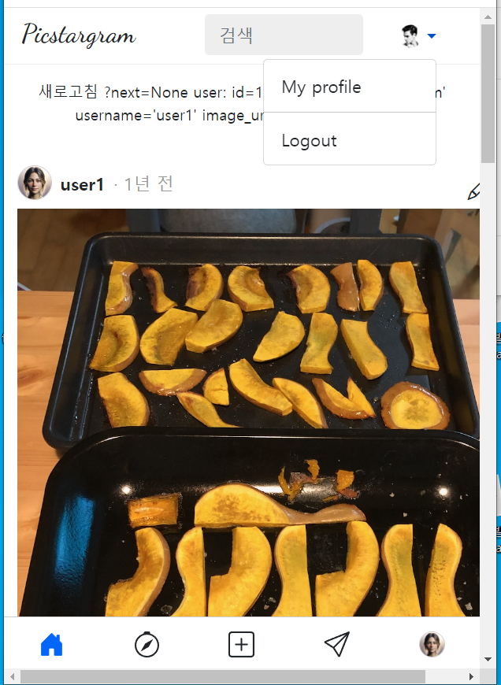

- cookie 인증 유튜브: https://www.youtube.com/watch?v=EO9XWml9Nt0
- 로그인 참고 깃허브(fastapi + htmx + pydantic): https://github.dev/sammyrulez/htmx-fastapi/blob/main/templates/owner_form.html

### nav-top 아바타 포함한 버튼으로 꾸며서 bottom과 매칭하기

1. 여기를 참고해서, data-toggle -> data-bs-toggle / fa -> bi 로 변경하여 수정해서 작성한다.
    ```html
    
    <header class="nav-top">
        <div class="wrapper row">
            <div class="col-1"></div>
            <div class="col-5">
                <a href="{{ url_for('pic_index') }}" class="logo me-auto">
                    Picstargram
                </a>
            </div>

            <div class="col-2">
                <div class="form-group search">
                    <input type="search" class="form-control" id="seach" placeholder="검색">
                </div>
            </div>
            <div class="col-3">
                <ul class="navbar-nav d-flex flex-row justify-contents-center align-items-center"
                    style="height: 40px;"
                >
                    <!-- Icons -->
                    
                        <!-- login or register -->
                        <li class="nav-item me-3 fs-5">
                            <a class="nav-link"
                               hx-get="{{ url_for('pic_hx_form') }}?user-login-or-register&next={{ request.query_params.get('next', '') }}"
                               hx-target="#dialog"
                            >
                                <i class="bi bi-door-open text-dark"></i>
                            </a>
                        </li>
                        
                    

                        <li class="nav-item me-3 fs-5">
                            <a class="nav-link" href="#">
                                <i class="bi bi-compass text-dark"></i>
                            </a>
                        </li>
                        <li class="nav-item me-3 fs-5">
                            <a class="nav-link" href="#">
                                <i class="bi bi-send text-dark"></i>
                            </a>
                        </li>
                        <li class="nav-item me-3 fs-5">
                            <a class="nav-link" href="#">
                                <i class="bi bi-plus-square text-dark"></i>
                            </a>
                        </li>
                        <!-- Avatar -->
                        <li class="nav-item dropdown">
                            <a
                                    class="nav-link dropdown-toggle d-flex align-items-center"
                                    data-toggle="dropdown"
                                    href="#"
                                    id="navbarDropdownMenuLink"
                                    role="button"
                                    data-bs-toggle="dropdown"
                                    aria-expanded="false"
                            >
                                
                            </a>
                            <ul class="dropdown-menu"
                                aria-labelledby="navbarDropdownMenuLink"
                            >
                                <li>
                                    <a class="fs-6 dropdown-item" href="#">My profile</a>
                                </li>
                                <li>
                                    <a class="fs-6 dropdown-item"
                                       hx-post="{{ url_for('pic_logout_user') }}">Logout</a>
                                </li>
                            </ul>
                        </li>
                    
                </ul>
            </div>
        </div>
    </header>
    
    ```


2. nav-bottom과 nav-top icon을 screen 크기에 맞게 나오게 한다.
    - lg부터 bottom none -> lg부터 top icon들 다 나오게
    - lg미만 bottom + top icon은 프로필만
    - lg미만 icon 사라진만큼 검색은 넓게
        - 1-5-`3`-전체(end정렬)
        - 0-5-`전체`-전체(end정렬)
    - nav-top도 .html로 빼서 include시킨다.
    ```html
    <header class="nav-top">
        <div class="wrapper row">
            <div class="d-none d-lg-block col-lg-1"></div>
            <div class="col-5">
                <a href="{{ url_for('pic_index') }}" class="logo me-auto">
                    Picstargram
                </a>
            </div>
    
            {#<div class="col-2">#}
            <div class="col-5 col-lg-3">
                <div class="form-group search">
                    <input type="search" class="form-control" id="seach" placeholder="검색">
                </div>
            </div>
            <div class="col">
                <ul class="navbar-nav d-flex flex-row justify-content-end align-items-center"
                    style="height: 40px;"
                >
                    <!-- Icons -->
                    
                        <!-- login or register -->
                        <li class="nav-item fs-5">
                            <a class="nav-link"
                               hx-get="{{ url_for('pic_hx_form') }}?user-login-or-register&next={{ request.query_params.get('next', '') }}"
                               hx-target="#dialog"
                            >
                                <i class="bi bi-door-open text-dark"></i>
                            </a>
                        </li>
    
                    
                        <li class="nav-item fs-5 d-none d-lg-block">
                            <a class="nav-link" href="#">
                                <i class="bi bi-compass text-dark"></i>
                            </a>
                        </li>
                        <li class="nav-item ms-3 fs-5 d-none d-lg-block">
                            <a class="nav-link" href="#">
                                <i class="bi bi-send text-dark"></i>
                            </a>
                        </li>
                        <li class="nav-item ms-3 fs-5 d-none d-lg-block">
                            <a class="nav-link" hx-get="{{ url_for('pic_hx_form') }}?post-create" hx-target="#dialog">
                                <i class="bi bi-plus-square text-dark"></i>
                            </a>
                        </li>
                        <!-- Avatar -->
                        <li class="nav-item ms-lg-3 dropdown">
                            <a
                                    class="nav-link dropdown-toggle d-flex align-items-center"
                                    data-toggle="dropdown"
                                    href="#"
                                    id="navbarDropdownMenuLink"
                                    role="button"
                                    data-bs-toggle="dropdown"
                                    aria-expanded="false"
                            >
                                
                            </a>
                            <ul class="dropdown-menu"
                                aria-labelledby="navbarDropdownMenuLink"
                            >
                                <li>
                                    <a class="fs-6 dropdown-item" href="#">My profile</a>
                                </li>
                                <li>
                                    <hr class="dropdown-divider">
                                </li>
                                <li>
                                    <a class="fs-6 dropdown-item"
                                       hx-post="{{ url_for('pic_logout_user') }}">Logout</a>
                                </li>
                            </ul>
                        </li>
                    
                </ul>
            </div>
        </div>
    </header>
    ```
   
   

### me.html 처리하기

1. route에서 `@login_required`를 통해 request.state.user가 채워짐을 확신해놓고, `render()`를 통해 request.state.user -> `user` 변수로 채워지도록
   렌더링한다.
    ```python
    @app.get("/picstargram/me/", response_class=HTMLResponse)
    @login_required
    async def pic_me(
            request: Request,
    ):
        context = {'request': request}
        # return templates.TemplateResponse("picstargram/user/me.html", context)
        return render(request, "picstargram/user/me.html", context=context)
    
    ```


2. nav_top을 채우는 새로운 내용에서 뒤로가기버튼은 `request.headers.get('Referer')`를 활용하여 직전 history 내용을 사용할 수 있게 한다.
    ```html
    
        <header class="nav-top">
            <a href="{{ request.headers.get('Referer') }}" class="back">
                <i class="bi bi-chevron-left"></i>
            </a>
            <div class="name">내 프로필</div>
        </header>
    
    ```
3. 그외에 `UserToken`내용(db 안들리고, jwt token에 심었던 내용)들로 채울 수 있는 부분은 `{{ user.필드명 }}`으로 채운다.

    ```html
    
    <div class="user-header">
        
        <div class="user-detail">
            <div class="user-name">
                <h2>{{ user.username }}</h2>
                <button type="button" class="btn btn-sm btn-more" data-bs-toggle="modal"
                        data-bs-target="#meModal"><i class="bi bi-three-dots" title="더보기"></i></button>
            </div>
            <div class="user-actions">
                <button type="button" class="btn btn-sm btn-action">프로필 편집</button>
            </div>
        </div>
    </div>
    <div class="user-description">{{ user.email}}</div>
    ```
   
    - **user.description필드가 추가로 필요하다.**


#### description 필드 추가 과정
1. json(dict 데이터)에 description을 추가한다.
    ```json
      "users": [
        {
          "id": 1,
          "email": "user1@gmail.com",
          "username": "user1",
          "description": "This is the description of user1.", 
          "hashed_password": "$2b$12$3T2KieEN5gZpNRyD8ni3c.FAQhEFzYbFKjG41NEeXpQ/Vt0nZML1u",
          "created_at": "2018-05-17 16:56:21",
          "updated_at": "2018-05-17 16:56:21",
          "image_url": "images/user1.png"
        },
    ```
   

2. 가입 form에 field로 추가한다.
    - 옵셔널이라서 required=False로 한다.
    ```html
       <!-- description -->
        {{ _form.inline_input(
                type="text",
                bg_color='#e8f0fe',
                width='100%;max-width:500px;',
                label='한 줄 소개',
                label_class='',
                name='description',
                value='',
                _class='mb-3',
                input_class='',
                required=False,
                two_col_size='sm',
                left_col_size='4'
            ) }}
    ```

3. req schema에 필드를 추가한다.
    ```python
    class UserCreateReq(BaseModel):
        email: str
        username: str
        description: Optional[str] = None
        password: str
    
        @classmethod
        def as_form(
                cls,
                email: EmailStr = Form(...),
                username: str = Form(...),
                description: str = Form(None),
                password1: str = Form(...),
                password2: str = Form(...),
        ):
            return cls(email=email, username=username, description=description, password=password1)
    
    ```
   
4. route -> crud함수 내부 UserSchema(db)의 필드로 추가한다.
    ```python
    class UserSchema(BaseModel):
        id: Optional[int] = None  # 서버부여 -> 존재는 해야함 but TODO: DB 개발되면, 예제 안뜨게 CreateSchema 분리하여 제거대상.
        email: str  # 추가
        hashed_password: str  # 추가
        username: str
        description: Optional[str] = None
        #...
    ```
   

5. UserSchema(db) -> UserToken에 담기려면 `get_token()`메서드에 access_token의 encode항목으로 추가한다.
    ```python
    def get_token(self):
        "TODO: sqlalchemy User 모델 이관"
        return {
            "access_token": "Bearer " + create_token(
                data=dict(
                    sub=str(self.id),
                    email=self.email,
                    username=self.username,
                    description=self.description,
    ```
   
6. refresh token시, 현재 유효한 refresh_token빼고 새로 access_token 발급할 때도
    ```python
    def refresh_token(self, refresh_token: str, iat: str):
        "TODO: sqlalchemy User 모델 이관"
        now = int(datetime.datetime.utcnow().timestamp())
        iat = int(iat)
    
        # refresh 발급기간이 만료기간(delta)의 1/2을 넘어선다면, refresh token도 같이 발급
        if now - iat >= settings.refresh_token_expire_minutes * 60 / 2:
            print(f"refresh의 1/2을 지나서, 둘다 재발급 ")
            return self.get_token() # refresh 절반이 지나면, 둘다 새로 발급
        # 아니라면, access_token만 재발급
        else:
            return {
                "access_token": "Bearer " + create_token(
                    data=dict(
                        sub=str(self.id),
                        email=self.email,
                        description=self.description,
    ```
   
7. decode -> request.state.user에 user객체 대신 들어갈 `UserToken`도 optional로 만들어준다.
    ```python
    class UserToken(BaseModel):
        # id: int
        id: int = Field(alias='sub')
        email: EmailStr
        description: Optional[str] = None
        #...
    ```