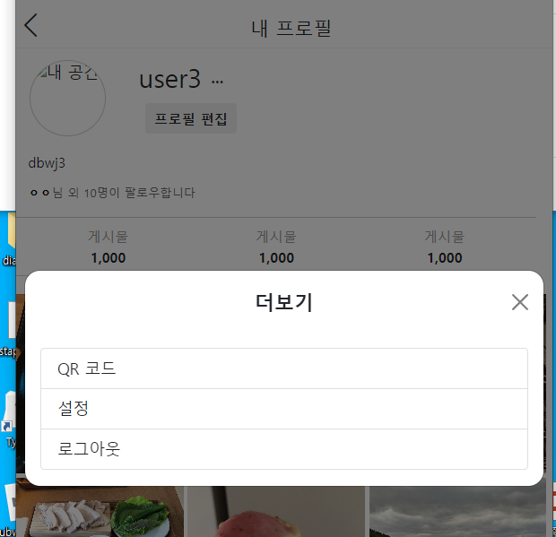

- cookie 인증 유튜브: https://www.youtube.com/watch?v=EO9XWml9Nt0
- 로그인 참고 깃허브(fastapi + htmx + pydantic): https://github.dev/sammyrulez/htmx-fastapi/blob/main/templates/owner_form.html

#### 더보기 modal을 base modal + hx_form route로

1. me.html에서 ul.list-group.menu로 만들어진 모달내용을 `base의 modal`에 내용을 전달하여 띄울 수 있도록, 
   - `더보기(bi-three-dots)` 클릭시 me.html의 modal이 아닌 hx_form route로 요청하여 받아오도록, `hx_form 라우터`로 `hx-get` 요청한다.
   - nav_bottom의 새 게시물 생성을 참고하여 요청한다.
    ```html
    {#<button type="button" class="btn btn-sm btn-more"
            data-bs-toggle="modal" data-bs-target="#meModal">
        <i class="bi bi-three-dots" title="더보기"></i>
    </button>#}
    <button type="button" class="btn btn-sm btn-more"
            hx-get="{{ url_for('pic_hx_form') }}?me-more" hx-target="#dialog"
    >
        <i class="bi bi-three-dots" title="더보기"></i>
    </button>
    ```
   
2. hx_form route에 `me-more`라는 query params의 key가 들어오면, 모달내용을 반환한다.
    ```python
    @app.get("/picstargram/form", response_class=HTMLResponse)
    async def pic_hx_form(
            request: Request,
            next_url: str = Query(None, alias='next')
    ):
        # htmx modal body반환인데, 내부 ?next=를 넘겨서, 로그인 form에서 next를 추출할 수 있게 한다
        request.query_params.__setattr__('next', next_url)
        context = {
            'request': request,
        }
    
        qp = request.query_params
   
        #...
   
        # User me
        elif any(name in qp for name in ['me-more', 'me_more']):
            return templates.TemplateResponse("picstargram/user/partials/me_more.html", context)
        
        else:
            return '준비되지 않은 modal입니다.'
    
    ```
   

3. user/partials/me_more.html에 list-group을 활용해서 정의한다.
    - header는 그대로 타이틀만 바꾸되, body만 form없이 작성한다.
    ```html
    <div class="modal-content">
        <!-- header -->
        <div class="modal-header border-bottom-0">
            <h1 class="modal-title fs-5 fw-bold mx-auto" id="modalLabel">
                더보기
            </h1>
            <button type="button" class="btn-close position-absolute end-0 me-2" data-bs-dismiss="modal" aria-label="Close"></button>
        </div>
        <!-- body -->
        <div class="modal-body">
           <ul class="list-group menu">
                <li class="list-group-item">QR 코드</li>
                <li class="list-group-item">설정</li>
                <li class="list-group-item">로그아웃</li>
            </ul>
        </div>
    </div>
    
    ```
   
    
    - 지금 개발가능한 로그아웃만 요청한다.
    - **`redirect()` 내부에서 hx-request시 HX_Redirect 요청으로 자동으로 수행된다.**
        ```html
        <!-- body -->
        <div class="modal-body">
           <ul class="list-group menu">
                <li class="list-group-item">QR 코드</li>
                <li class="list-group-item">설정</li>
                <li class="list-group-item"
                    hx-post="{{ url_for('pic_logout_user') }}"
                >
                    로그아웃
                </li>
            </ul>
        </div>
        ```
      


### 프로필 편집 클릭시 나올 edit_form 만들기
1. 클릭시 `hx-get="{{ url_for('pic_hx_form') }}?me-edit-form" hx-target="#dialog"`로 modal요청하기
    ```html
    
    <div class="user-actions">
        <button type="button" class="btn btn-sm btn-action"
                hx-get="{{ url_for('pic_hx_form') }}?me-edit" hx-target="#dialog"
        >
            프로필 편집
        </button>
    </div>
    ```
   
2. hx_form route에서 받아서 반환하게 하기
    ```python
    # User me
    elif any(name in qp for name in ['me-more', 'me_more']):
        return templates.TemplateResponse("picstargram/user/partials/me_more.html", context)
    elif any(name in qp for name in ['me-edit', 'me_edit']):
        return templates.TemplateResponse("picstargram/user/partials/me_edit_form.html", context)
    ```
   

3. register_form.html을 복사해서, `me_edit_form.html`을 만들어 띄워지나 확인하기


4. hx-요청보낼 route를 먼저 만들고
    ```python
    @app.get("/picstargram/users/edit", response_class=HTMLResponse)
    async def pic_hx_edit_user(
            request: Request,
            hx_request: Optional[str] = Header(None),
    ):
    
        context = {
            'request': request,
        }
        return templates.TemplateResponse("picstargram/post/partials/posts.html", context)
    
    ```
   
5. form에 해당 route로 요청하도록 하며 필요한 것만 남긴다
    - **추후 프로필편집도 올릴 것이므로, `hx-encoding="multipart/form-data"`도 붙혀준다.**
    ```html
    
    <div class="modal-content">
    
        <!-- header -->
        <div class="modal-header border-bottom-0">
            <h1 class="modal-title fs-5 fw-bold mx-auto" id="modalLabel">
                프로필 편집
            </h1>
            <button type="button" class="btn-close position-absolute end-0 me-2" data-bs-dismiss="modal"
                    aria-label="Close"></button>
        </div>
        <!-- body -->
        <div class="modal-body">
            <form hx-trigger="submit"
                  hx-post="{{ url_for('pic_hx_edit_user') }}"
                  hx-encoding="multipart/form-data"
            >
                <!-- username -->
                {{ _form.inline_input(
                type="text",
                bg_color='#e8f0fe',
                width='100%;max-width:500px;',
                label='닉네임',
                label_class='',
                name='username',
                value='',
                _class='mb-3',
                input_class='',
                required=True,
                two_col_size='sm',
                left_col_size='4'
            ) }}
                <!-- description -->
                {{ _form.inline_input(
                type="text",
                bg_color='#e8f0fe',
                width='100%;max-width:500px;',
                label='한 줄 소개',
                label_class='',
                name='description',
                value='',
                _class='mb-3',
                input_class='',
                required=False,
                two_col_size='sm',
                left_col_size='4'
            ) }}
    
    
                <!-- submit -->
                {{ _form.submit_btn(width = '100%;max-width: 500px;',
                justify_content = 'center;',
                btn_width = 'auto;max-width: 200px;',
                btn_height = '50px;',
                btn_class =  'fs-6 mt-3',
                btn_size =  'sm',
                btn_bg_color = 'linear-gradient(135deg, #3a8ffe 0%, #9658fe 100%);',
                btn_text =  '변경하기',
                btn_font_color =  '#fff;',
                has_cancel_btn = True,
                btn_gap = '3',
                cancel_btn_text =  '취소',
                cancel_btn_bg_color = '#fff',
                cancel_btn_font_color = 'black'
                ) }}
            </form>
        </div>
    </div>
    
    ```
   

6. 이제 `input[type="file"]`일 때