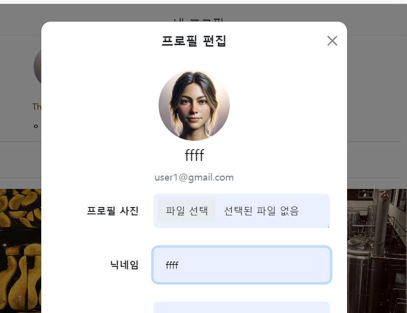

- cookie 인증 유튜브: https://www.youtube.com/watch?v=EO9XWml9Nt0
- 로그인 참고 깃허브(fastapi + htmx + pydantic): https://github.dev/sammyrulez/htmx-fastapi/blob/main/templates/owner_form.html
- 프로필 편집 미리보기 코드 참고: https://github.dev/tcxcx/django-webapp/tree/main/a_inbox/templates/a_inbox


### macro 요소 내에선 url_for나 user의 context를 사용못한다. 미리 넣어주기
1. form을 hx 렌더링할 때, 로그인한 경우 user가 들어가도록 render로 렌더링한다.
    ```python
    elif any(name in qp for name in ['me-edit', 'me_edit']):
        # context.update(user=request.state.user)
        # return templates.TemplateResponse("picstargram/user/partials/me_edit_form.html", context)
        return render(request, "picstargram/user/partials/me_edit_form.html", context)
    ```
   
2. form.html에서 user와 url_for()를 미리 사용해서 매크로 안에 넣어준다.
    - 매크로 안에서는 url_for()나 user를 쓸 수 없다.
    - **이 때, type="file" 대신 `type="avatar"`를 줘서, `내부에서 set type="file" + img태그`를 가지도록 조건문을 넣어줄 생각이다.**
    - **user정보를 쓸거면 `user=`도 미리 넣어줘야하고, `url_for()로 구성할거면, 매크로 밖에서 미리 사용`해서 넣어줘야한다.**
    - 이 때, 이미지가 없을 경우, default-user.png를 avatar_url로 넣어준다.
    ```html
    <!-- avatar -->
    {# user.username / user.email 을 사용함 #}
    {{ _form.inline_input(
        type="avatar",
        user=user,
        avatar_url=url_for('static', path=user.image_url) if user.image_url else url_for('static', path='images/default-user.png'),
        bg_color='#e8f0fe',
        width='100%;max-width:500px;',
        label='프로필 사진',
        label_class='',
        name='file',
        value='',
        _class='mb-3',
        input_class='',
        required=True,
        two_col_size='sm',
        left_col_size='4'
    ) }}
    ```
   
3. 이 참에, nav-top/bottom/me/post에도 `user.image_url`이 없는 경우,  `default avatar`가 걸리도록 조건문을 미리 넣어주자.
       - post.html
    ```html
    <a href="{{ url_for('pic_users') }}">
        
        
    </a>
    ```
    - nav-top.html
    ```html
    <a
            class="nav-link dropdown-toggle d-flex align-items-center"
            data-toggle="dropdown"
            href="#"
            id="navbarDropdownMenuLink"
            role="button"
            data-bs-toggle="dropdown"
            aria-expanded="false"
    > 
        
        
    </a>
    ```
    - nav-bottom.html
    ```html
    <a href="{{ url_for('pic_me') }}">
        
        
    </a>
    ```
    
    - me.html
    ```html
    
    <div class="user-header">
        
    ```


4. 매크로에 넣어준 user/avatar_url을 이용해서 아바타 미리보기 태그를 만든다.
    - d-flex를 flex-column 방향으로 새우면서, 동그라미 전체의 25% w/h
    - [여기](https://github.dev/tcxcx/django-webapp/tree/main/a_inbox/templates/a_inbox)를 bootstrap5로 고쳤다.
    ```html
    {# for avatar #}
    
    
    
    
    
    <div class="d-flex flex-column align-items-center justify-content-center">
        
        <div class="text-center w-100">
            <h3 id="username">{{ user.username }}</h3>
            <div class="text-muted mb-2 mt-1">{{ user.email }}</div>
        </div>
    </div>
    ```
   
5. 넣어준 이미지가 보이면, 이제 input[type="file"]을 js로 이미지 미리보기 처리를 해준다.
    - **이미 type은 "file"로 덮어썼으니 `user and avatar_url` 변수값을 확인해서 있으면, js로 미리보기 가능하게 해준다.**
    - 이미 고정된 코드라 딱히 뭘 할필요가 없다. id="avatar"의 img태그를 잡아서 처리한다.
    ```html
    
        <script>
           // This updates the avatar
            const fileInput = document.querySelector('input[type="file"]');
    
            fileInput.addEventListener('change', (event) => {
            const file = event.target.files[0];
            const image = document.querySelector('#avatar');
    
            if (file && file.type.includes('image')) {
                const url = URL.createObjectURL(file);
                image.src = url;
            }
            });
        </script>
    
    ```
   
6. username도 실시간으로 바꿔준다. `form속 input[name="username"]`을 input요소로
   - 아바타 태그의 `id="username"의 태그를 output요소`로 보여주도록 한다.
    ```js
    // This updates the username
    const usernameInput = document.querySelector('input[name="username"]');
    const usernameOutput = document.getElementById('username');
    
    usernameInput.addEventListener('input', (event) => {
        usernameOutput.innerText = event.target.value;
    });
    ```
    

7. 이참에 post 제자리 edit form도 미리보기형식으로 작성되도록 js코드를 달아준다.
    - modal에서는 input은 form 속 name 1개라서 querySelector로 1개로 단정했지만
    - **post_edit_form에서는 `post`가 여러개 나와있는 상황의 제자리 form이므로 `input도 id`로 찾게하고, 대신 `output의 단순id에 비해 _input_을 추가`함**
```html
<!-- post/partials/edit_form.html -->
<h5 class="fs-7 fw-bold" id="content_{{ post.id }}">{{ post.content }}</h5>
<!--...-->

<textarea rows="2" class="form-control mt-3 mb-4 px-2"
          name="content"
          id="content_input_{{ post.id }}"
          placeholder="수정할 내용 입력"
>{{ post.content }}</textarea>

<!--...-->
<script>
    // This updates the username
    const contentInput = document.getElementById('content_input_{{ post.id }}');
    const contentOutput = document.getElementById('content_{{ post.id }}');

    contentInput.addEventListener('input', (event) => {
        contentOutput.innerText = event.target.value;
    });
</script>
```
### value에 값을 넣는 edit_form
1. 이미 user를 넣어준 상태이므로, user.username과 user.description을 넣어준다.
    - **avatar file인풋에서는 이미 기존 것의 src가 들어각 없으면 default_user.png가 들어가도록 했으며, file value는 안주고 그대로 value=""를 유지한다**
    - 이 때, user.description 등의 string이 없는 None에 대해서는 기존 value=""의 `""`을 `else ""`로 반영해준다.
    ```html
    <!-- avatar -->
    avatar_url=url_for('static', path=user.image_url) if user.image_url else url_for('static', path='images/default-user.png'),
    
    <!-- username -->
    value= user.username if user.username else '',
    
    <!-- description -->
    value= user.description if user.description else '',
    
    ```
2.  **또한, edit를 일부는 안할 수 있으니 `required=False`로 모두 만들어준다.**
    ```html
    required=False,
    ```
    


