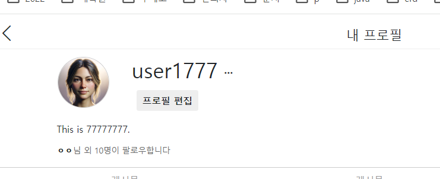

- cookie 인증 유튜브: https://www.youtube.com/watch?v=EO9XWml9Nt0
- 로그인 참고 깃허브(fastapi + htmx + pydantic): https://github.dev/sammyrulez/htmx-fastapi/blob/main/templates/owner_form.html
- ImageReq참고: https://github.dev/riseryan89/imizi-api/blob/main/app/middlewares/access_control.py

### update_user with update token

1. route에서 req스키마를 dump후 dict로 업데이트한다.
    - **이 때, 현재유저의 id가 필요하므로, request.state.user.id**를 사용한다.
    ```python
    @app.put("/picstargram/users/edit", response_class=HTMLResponse)
    async def pic_hx_edit_user(
            request: Request,
            user_edit_req: UserEditReq = Depends(UserEditReq.as_form)
    ):
        context = {
            'request': request,
        }
        data = user_edit_req.model_dump()
        user = request.state.user
        try:
            user = update_user(user.id, data)
        except:
            raise BadRequestException('유저 수정에 실패함.')
    ```
2. update_user(user_id, schema)에서 정보를 dict인 data로 바꾸고 `nullable한 input은 제외시키고 setattr()`로 업데이트한다.
    ```python
    def update_user(user_id: int, data: dict):
        user = get_user(user_id)
        if not user:
            raise Exception(f"해당 user(id={user_id})가 존재하지 않습니다.")
    
        for key, value in data.items():
            # create와 달리, nullable한 값을 가지고 오는 edit에서는 None을 제외하고 수정한다.
            if not value:
                continue
            # 하지만, input의 value를 image빼고는 미리 채워놨으니 상관없다?
            setattr(user, key, value)
    
        # 서버 부여
        user.updated_at = datetime.datetime.now()
    
        return user
    ```
    - **이 때, `.upload_image_req`정보가 있어도 UserSchema에 직접 넣으면 안되니, 외부에서 pop해둔다.**
    ```python
    @app.put("/picstargram/users/edit", response_class=HTMLResponse)
    async def pic_hx_edit_user(
            request: Request,
            user_edit_req: UserEditReq = Depends(UserEditReq.as_form)
    ):
    
        data = user_edit_req.model_dump()
        upload_image_req: UploadImageReq = data.pop('upload_image_req')
        
        user = request.state.user
        try:
            user = update_user(user.id, data)
            token = user.get_token()
        #...
    ```

   
3. **로그인에 성공해도, oob 등의 처리를 안해줘서, 바로 바뀌지 않는다.**
    - **하지만, 새로고침해도 안바귀는 이유는 `cookie에 박힌 옛날유저정보`에 의해 로그인한 유저를 구성하기 때문에**
    - **로그인 token을  request의 UserToken이 아니라, `update_user()`의 return으로 받은 `UserSchema`에서 `.get_token()`을 호출해서, render에 cookies=에 넣어서 쿠키도 업뎃해줘야한다.**
    - **유저정보가 바뀌면 cookies삭제뿐만 아니라, 업데이트도 해줘야함.**
    ```python
    @app.put("/picstargram/users/edit", response_class=HTMLResponse)
    async def pic_hx_edit_user(
            request: Request,
            user_edit_req: UserEditReq = Depends(UserEditReq.as_form)
    ):
        context = {
            'request': request,
        }
    
        data = user_edit_req.model_dump()
        user = request.state.user
        try:
            user = update_user(user.id, data)
            token = user.get_token()
        except:
            raise BadRequestException('유저 수정에 실패함.')
    
    
        if user_edit_req.upload_image_req:
            ...
    
        return render(request, "", context=context,
                      # hx_trigger=["postsChanged"],
                      cookies=token,
                      messages=[Message.UPDATE.write("프로필", level=MessageLevel.INFO)]
                      )
    
    ```
   
4. 이제 새로고침하면, 업데이트된  token으로 업데이트된 user정보가 template에서 사용된다.
    


### 새로고침없이 요소들 업뎃 with oob
- **중요) 다른 유저에 의해 중간에 변경될 수 있는, ex> group원 count 같은 것은 -> 따로 hx-조회  + hx-trigger에 의해 변경**
- **내 프로필같이, 나만에 의해 바뀌는 것은, 기존 템플릿 -> hx-swap-oob="true" + id를 추가하여, oob 추가로 return시 바뀌게**


1. me.html 내부에서 `user`변수를 받아 profile 처리하는 부분만 paritals/me_user_profile.html로 추출하고 include한다.
    ```html
    
        <div class=" detail">
            {# oob swap 대상 #}
            
    ```
   
2. `include로 추출`했다는 말은, `자기자신 swap`으로서, 가장 상단 태그에 `hx-swap-oob="outerHTML"`을 넣어준다.
    - 만약, 자식이라면, include의 부모태그에 hx-swap-oob="innerHTML" 등을 넣어줘야한다.
    ```html
    <!--picstargram/user/partials/me_user_profile.html-->
    <div class="container user" hx-swap-oob="outerHTML">
    ```
    - **이 때, id가 필요없어 보이지만, hx-swap-oob를 통째로 할 땐, `id=""`입력하지 않으면 콘솔에서 에러난다.**
    ```html
    <div class="container user" hx-swap-oob="outerHTML" id="user-profile" >
    ```
   

3. 이제 render시, oob를 render()에 추가해준다.
    - **이 때, 내부에서 url_for()를 쓰고 있는데, `request`가 없다고 에러나니, request와 user를 동시에 넣어준다.**
    ```python
    # ...
    return render(request, "", context=context,
              # hx_trigger=["postsChanged"],
              cookies=token,
              messages=[Message.UPDATE.write("프로필", level=MessageLevel.INFO)],
              oobs=[('picstargram/user/partials/me_user_profile.html', dict(request=request, user=user))],
              )
    ```
   

4. **어차피 oob에서 쓰는 context를 dict로 따로 넣어주는 것보다 `원래 context를 재활용`하도록 내부로직을 바꿔준다.**
    ```python
    def render(request, template_name="", context: dict = {}, status_code: int = 200,
    
               # oobs: List[tuple] = None,
               oobs: List[str] = None,
               ):
        #...
        # if oobs:
        #     for t_name, t_context in oobs:
        #         oob_html_str += ('\n' if oob_html_str else '') + render_oob(t_name, **t_context)
        if oobs:
            for t_name in oobs:
                    oob_html_str += ('\n' if oob_html_str else '') + render_oob(t_name, **ctx)
    ```
    ```python
    return render(request, "", context=context,
                  # hx_trigger=["postsChanged"],
                  cookies=token,
                  messages=[Message.UPDATE.write("프로필", level=MessageLevel.INFO)],
                  # oobs=[('picstargram/user/partials/me_user_profile.html', dict(request=request, user=user))],
                  oobs=[('picstargram/user/partials/me_user_profile.html')],
                  )
    
    ```
