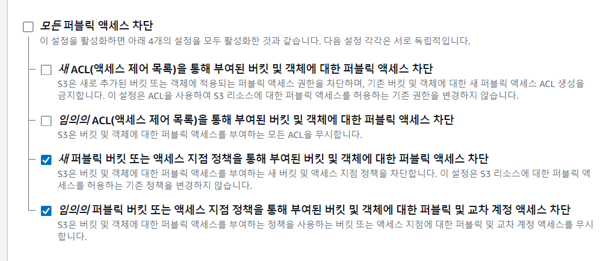
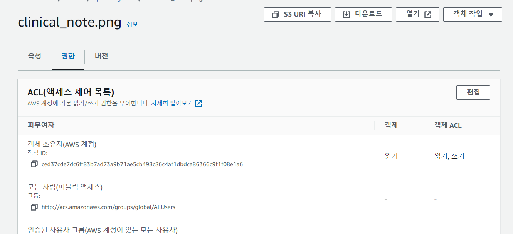
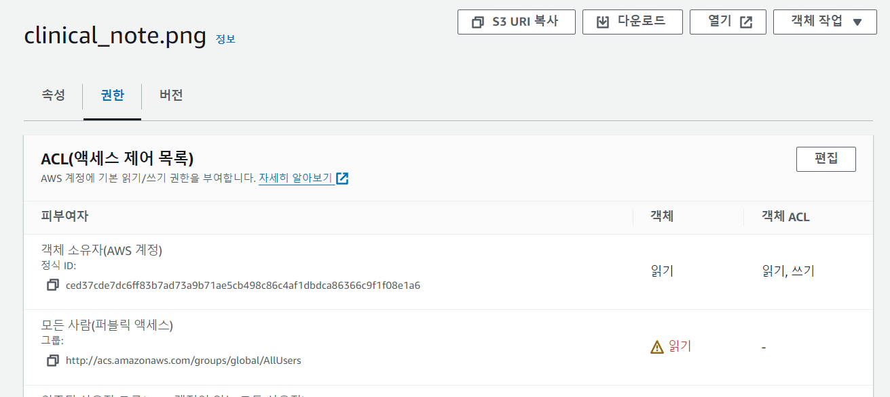
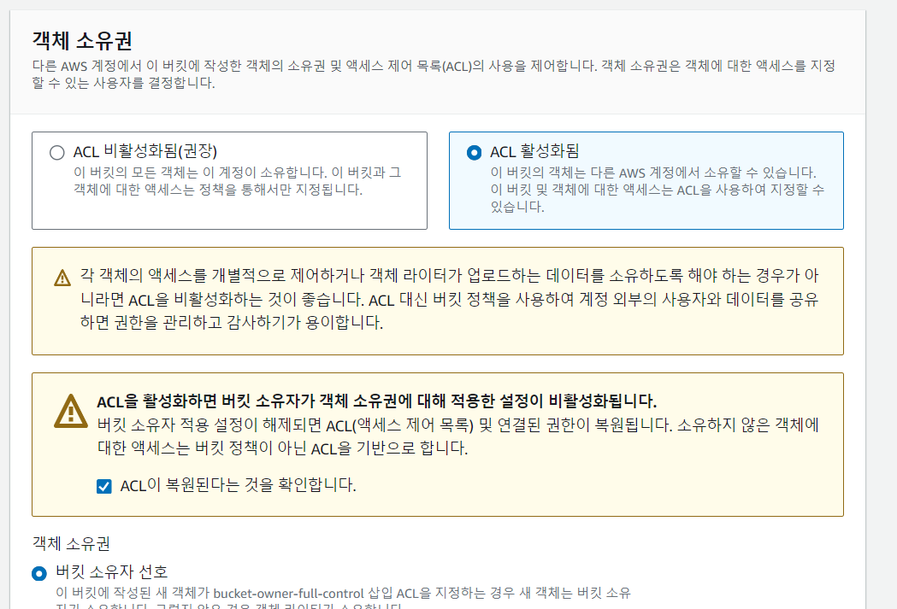

- cookie 인증 유튜브: https://www.youtube.com/watch?v=EO9XWml9Nt0
- 로그인 참고 깃허브(fastapi + htmx + pydantic): https://github.dev/sammyrulez/htmx-fastapi/blob/main/templates/owner_form.html
- ImageReq참고: https://github.dev/riseryan89/imizi-api/blob/main/app/middlewares/access_control.py
- aws s3세팅 참고: https://www.youtube.com/watch?v=uqxBsCKW6Gs
- aws s3 풀세팅 참고 블로그: spring이지만 풀 튜토리얼: https://earth-95.tistory.com/117
- **진짜배기 세팅: https://wooogy-egg.tistory.com/77**

### IAM 유저 등록 후 AWS CLI로 접근하기

#### IAM 유저 및 유저그룹 생성

1. 루트사용자 로그인

2. 액세스 관리 > `사용자 그룹`을 프로젝트명으로 등록
    - 지금 생성안하더라도 사용자 생성시, 그룹에 추가 과정에서 추가하게 됨.
    - `Administrators`: 모든 권한을 가지는 그룹으로 임시 생성
    - **추후, 프론트 <-> 백엔드 등의 그룹을 나눈다면, 권한별로
      지정해야한다: [참고](https://weekwith.tistory.com/entry/Nextjs-AWS-S3%EB%A5%BC-%ED%86%B5%ED%95%9C-%EC%A0%95%EC%A0%81-%EC%9B%B9-%EC%82%AC%EC%9D%B4%ED%8A%B8-%EB%B0%B0%ED%8F%AC-%EB%B0%8F-GitHub-Actions%E1%84%85%E1%85%B3%E1%86%AF-%E1%84%90%E1%85%A9%E1%86%BC%E1%84%92%E1%85%A1%E1%86%AB-CICD)
      **

3. 액세스 관리 > `사용자` 생성을 `프로젝트명_admin`으로 생성 + `AdministratorAccess`으로 모든 권한 부여
    - `picstargram_admin`
        - **우리는 access key만 발급받아 사용할 예정이니, 콘솔 사용용 계정은 안만들어도 된다.**
        - 하지만, `AWS Management Console에 대한 사용자 액세스 권한 제공`을 받아 접속 가능하게 하는데,
            - `Identity Center에서 사용자 지정 - 권장`가 아닌, 2번째 옵션인 `IAM 사용자를 생성하고 싶음`으로 바로 생성하며 직접 비밀번호 입력을 했다.
            - 다음 로그인시 비밀번호 설정도 체크해제 해서 1개만 사용하도록 함.

4. 우리의 목적인 **생성된 유저 클릭 > 보안 자격 증명 탭 > `액세스 키 만들기`로 들어가서 > `CLI`를 클릭한다** 
    - 액세스 키 검색(발급된 화면)을 띄운 상태에서 AWS CLI를 다운받아 설치한다.

### AWS CLI

- 참고 유튜브: https://www.youtube.com/watch?v=LeAUpLwACfU

1. AWS Configure
    - 리눅스: `~/.aws/credentials`
    - 윈도우: `C:\Users\유저명\.aws\credentials`
        - `%UserProfile%\.aws\credentials`: access/secrect key가 저장된 파일
        - `%UserProfile%\.aws\config`: region/output이 저장된 파일
        - **터미널에선 안먹고, 실행에서 파일을 직접 확인할 때 씀. 터미널에서는 `명령어 ~/.aws/credentials`로 쓴다.**

2. 터미널을 열고 **aws configure를 바로 입력하지말고, default등 기존 configure를 확인한다.**
    - aws cli 윈도우 명령어 참고: https://inpa.tistory.com/entry/AWS-%F0%9F%93%9A-AWS-CLI-%EC%84%A4%EC%B9%98-%EC%82%AC%EC%9A%A9%EB%B2%95-%EC%89%BD%EA%B3%A0-%EB%B9%A0%EB%A5%B4%EA%B2%8C#%EC%9C%88%EB%8F%84%EC%9A%B0_windows
    - **`aws configure list-profiles` or cat ~/.aws/credentials or cat ~/.aws/config로 [default]외 다른 것도 있는지 확인한다.**
        - **aws configure list는 default에 대한 설정밖에 안나오니, `aws configure list-profiles`로 확인해야한다.**

3. 나의 경우, 이미 default 설정이 있어서 `--profile`을 붙힌 `aws configure`를 사용한다.
    - `aws configure --profile {프로젝트명}`
    - **region: `ap-northeast-2` 를 직접 지정해줘야 한국이다.**
    - **format: `json`으로 입력해준다.**
    - **1차적으로 `cat ~\.aws\credentials`으로 default외 추가되었는지 확인한다.**
    - **이미 존재할 것 같으면, `aws configure list --profile {프로젝트명}`로 확인한다.**

4. 참고) AWS_PROFILE 
    - `export AWS_PROFILE={프로젝트명}`으로 설정하면, `aws s3 ls`같은 명령어를 사용할 때, `--profile`을 붙히지 않아도 된다.
    - **윈도우는 `set AWS_PROFILE={프로젝트명}`으로 설정한다.**
    - 나는 생략함.

### AWS S3
1. **객체url로 public하게 조회하는 것은 `*전체대상으로 GetObject를 주는 버킷정책` or `서드파티에서 --acl public-read 업로드`로 하는 방법 2가지 중 택1해야한다.**
    - acl옵션을 선택적으로 줄때만 조회되게 할 수 있으니 현재는 이 방법을 선택해본다.
    
2. 업로드(PutObject), 다운로드(GetObject), 삭제(DeleteOBject)는 버킷정책으로 특정 IAM계정에 줘도 되지만,
   - 이미 위에서 `S3FullAccess를 포함하는 권한을 부여받은 IAM계정`으로 만든 accesskey를 사용하므로, 버킷정책은 필요없다.
   - IAM 권한 > 버킷정책 > ACL

3. CRUD는 이미 IAM계정 accesskey == aws cli == 서드파티가 권한을 가지므로, 퍼블릭에 대한 설정만 `ACL`을 통해 해줄 것이다.

#### 버킷 생성 및 acl 설정
1. aws cli로 버킷 생성
    ```shell
    aws s3 mb s3://{버킷명(전체유저중복안됨.)}
    ```
    - 콘솔에서는 `버킷 및 객체가 퍼블릭이 아님`
2. aws로 읽기에 대한 ACL을 지정해서 업로드
    ```shell
    aws s3 cp .\auth_group.png s3://picstargram-01
    # upload: .\auth_group.png to s3://picstargram-01/auth_group.png
    aws s3 cp .\clinical_note.png s3://picstargram-01 --acl public-read
    # upload failed: .\clinical_note.png to s3://picstargram-01/clinical_note.png An error occurred (AccessControlListNotSupported) when calling the PutObject operation: The bucket does not allow ACLs
    ```
    - **--acl옵션을 주고 업로드하면 거절된다. 이는 퍼블릭액세스가 차단된 기본상태라서 그렇다.**

3. 퍼블릭액세스차단 - acl관련 옵션1,2번 해제
    - 콘솔에서 버킷 > 권한탭 > 퍼블릭액세스차단 중 `1번/2번옵션을 차단해제`한다.
    
    - **1번옵션 해제: acl public옵션을 들고 업로드하는 것을 허용한다.**
        - 더이상 AccessControlListNotSupported이 안뜬다.
    - **2번옵션 해제: acl public옵션을 가진 업로드객체가 정상작동하게 한다.**
        - 차단해제 안하면, acl public옵션을 주더라도, 콘솔에서 객체를 열어보면 public-read로 되어있지 않다.
            - 2번째 옵션을 차단한 경우
                
            - 2번째 옵션을 차단해제한 경우
                

4. **그래도 업로드가 안되는데, 이는 `ACL사용이 기본적으로 비활성화`된 상태기 때문이다.**
    - 업로드/업로드된객체활용이 문제가 아니라, 애초에 허용을 안한상태다.
    - **권한 > `객체소유권` 편집 > `ACL활성화`를 통해, ACL자체를 활성화해놔야한다.**
        
    - 이제 acl옵션으로 업로드할 수 있게 된다.

5. 콘솔에서 업로드된 2개의 객체의 url을 통해 접속해보면 `public-read`로 업로드된 것만 조회가 가능하다.


#### 만약, acl을 사용안하고, 특정bucket을 전체공개로 하려면
1. 객체소유권 acl비활성화
2. 퍼블릭액세스차단 1,2번 acl옵션 차단
3. 버킷정책을 통해, (특정버킷속 폴더에 대해) 대상(priciple)을 `*`으로 해서`GetObject`를 허용한다
    - 참고: https://wooogy-egg.tistory.com/77


### AWS 명령어 모음
```shell
%UserProfile%\.aws\credentials
%UserProfile%\.aws\config

aws configure list-profiles

# 등록
aws configure --profile {프로젝트명} # ap-northeast-2 # json
# 재사용시
set AWS_PROFILE={프로젝트명}

cat ~\.aws\credentials


# S3
aws s3 ls --profile {프로필명}
aws s3 mb s3://{버킷명}
aws s3 ls --profile {프로필명}


aws s3 cp {파일경로} s3://{버킷명}
aws s3 cp {파일경로} s3://{버킷명}/{폴더명} --acl public-read
```