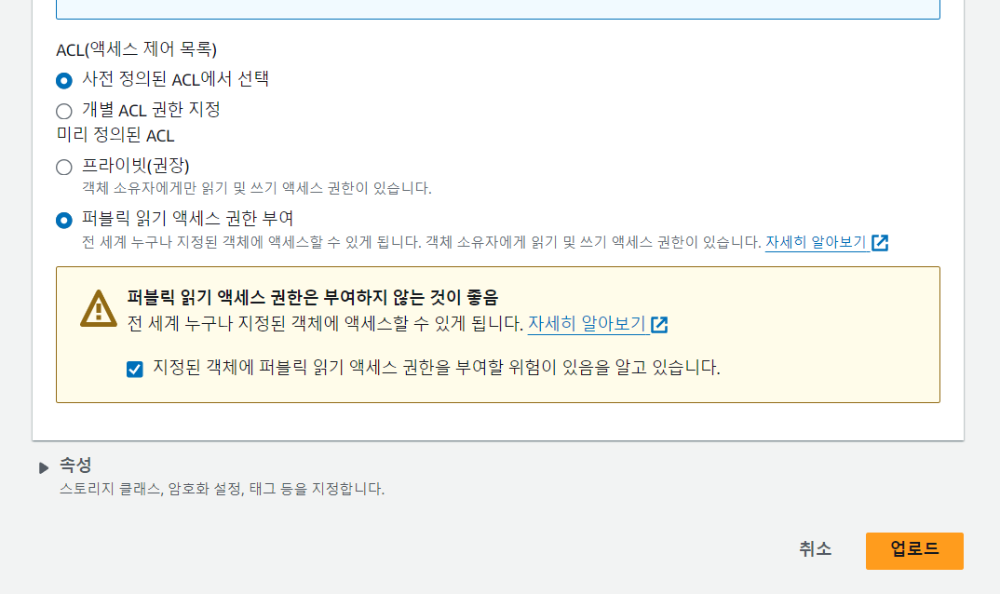

- cookie 인증 유튜브: https://www.youtube.com/watch?v=EO9XWml9Nt0
- 로그인 참고 깃허브(fastapi + htmx + pydantic): https://github.dev/sammyrulez/htmx-fastapi/blob/main/templates/owner_form.html
- ImageReq참고: https://github.dev/riseryan89/imizi-api/blob/main/app/middlewares/access_control.py
- **진짜배기 s3 세팅: https://wooogy-egg.tistory.com/77**
- **post개발 이후, s3 다운로드 참고 github: https://github.com/jrdeveloper124/file-transfer/blob/main/main.py#L30**
    - 유튜브: https://www.youtube.com/watch?v=mNwO_z6faAw
- **s3 boto3 드릴 블로그**: https://dschloe.github.io/aws/04_s3/s3_basic/
- **boto3 client말고 session으로 메서드들 정리 튜토리얼: https://thecodinginterface.com/blog/aws-s3-python-boto3/**


### s3_image_upload 유틸 메서드 생성하기

1. 환경변수에 region, bucket_name외 `aws configure`에 있던 IAM access/secret key 추가하기
    ```shell
    cat ~\.aws\credentials
    ```
    ```dotenv
    # for aws s3
    aws_region="ap-northeast-2"
    aws_bucket_name="picstargram"
    aws_access_key_id = 
    aws_secret_access_key = 
    ```
2. config.py에 추가해서 받아주기
    ```python
    class Settings(BaseSettings):
        # ...
        aws_bucket_name: str
        aws_region: str
        aws_access_key_id: str
        aws_secret_access_key: str
    ```
3. boto3 설치하기
    ```shell
    pip install boto3
    ```
3. to_s3_upload_data_per_size를 순회하며, image객체 -> buffer with WEBP로 .save() -> buffer.getvalue()를 boto3.client()를 이용해 업로드
    - ACL 옵션에 `public-read`를 주고 `client객체.put_object()`를 이용해 업로드한다.
    - 업로드 수행 후, for db인 s3_url_per_size를 출력해서 객체url로 public-read가 되는지 확인한다.
    ```python
    for size, data in to_s3_upload_data_per_size.items():
        image_obj = data['image_obj']
        image_group_name = data['image_group_name']
        image_file_name = data['image_file_name']
    
    
        buffered = BytesIO()
        image_obj.save(buffered, format="WEBP")
        s3.put_object(
            Bucket=settings.aws_bucket_name,
            Key=f"{image_group_name}/{image_file_name}",
            Body=buffered.getvalue(),
            ACL="public-read",
            ContentType="image/webp",
        )
    
    print(f"s3_urls_per_size  >> {s3_urls_per_size}")
    ```

4. 1개의 파일씩 업로드 가능하도록 s3객체 생성을 for문안에 넣어서, 메서드로 추출한다.
    - 업로드 완료시 정해지는 `객체url`을 만들어서 return해주는 것을 추가한다.
    ```python
    async def s3_image_upload(image_file_name, image_group_name, image_obj):
        s3 = boto3.client(
            "s3",
            aws_access_key_id=settings.aws_access_key_id,
            aws_secret_access_key=settings.aws_secret_access_key,
            region_name=settings.aws_region
        )
        
        buffered = BytesIO()
        image_obj.save(buffered, format="WEBP")
        
        s3.put_object(
            Bucket=settings.aws_bucket_name,
            Key=f"{image_group_name}/{image_file_name}",
            Body=buffered.getvalue(),
            ACL="public-read",
            ContentType="image/webp",
        )
   
        return f"https://{settings.aws_bucket_name}.s3.{settings.aws_region}.amazonaws.com/{image_group_name}/{image_file_name}"
    ```   
    ```python
    for size, data in to_s3_upload_data_per_size.items():
        image_obj = data['image_obj']
        image_group_name = data['image_group_name']
        image_file_name = data['image_file_name']
    
        await s3_image_upload(image_file_name, image_group_name, image_obj)
    
    print(f"s3_urls_per_size  >> {s3_urls_per_size}")
    ```


5. background에 넣어서 한꺼번에 넣어주기 위해, 메서드로 dict 순회를 묶어준다.
    ```python
    async def background_s3_image_data_upload(to_s3_upload_data_per_size):
        for size, data in to_s3_upload_data_per_size.items():
            image_obj = data['image_obj']
            image_group_name = data['image_group_name']
            image_file_name = data['image_file_name']
    
            await s3_image_upload(image_file_name, image_group_name, image_obj)
    ```
    ```python
    await background_s3_image_data_upload(to_s3_upload_data_per_size)

    print(f"s3_urls_per_size  >> {s3_urls_per_size}")
    ```

### background task 연쇄적으로 넣어주기

1. fastapi의 bg_task: BackgroundTasks를 주입하여, .add_task로 메서드를 백그라운드 처리해준다.
    ```python
    @app.post('/uploader')
    async def pic_uploader(
            request: Request,
            bg_task: BackgroundTasks,
            upload_image_req: UploadImageReq,
    ):
        # ...
        # await background_s3_image_data_upload(to_s3_upload_data_per_size)
        bg_task.add_task(background_s3_image_data_upload, to_s3_upload_data_per_size)
    
        print(f"s3_urls_per_size  >> {s3_urls_per_size}")
    ```

2. **문제는 프로필 수정 route에서 업로드 라우트를 호출하고 있기 때문에, 여기에서도 주입 -> 인자로 입력해준다**
    ```python
    @app.put("/picstargram/users/edit", response_class=HTMLResponse)
    async def pic_hx_edit_user(
            request: Request,
            bg_task: BackgroundTasks,
            user_edit_req: UserEditReq = Depends(UserEditReq.as_form)
    ):
        # ...
        if upload_image_req:
            # pop해놓은 dict를 다시 Schema로 감싸서 보내기
            print(await pic_uploader(request, bg_task, UploadImageReq(**upload_image_req)))
        # ...
    ```

### uploader route는 api용으로서, response Schema 만들어 완성하기

1. 추후 user의 many에 해당하는 > images모델객체에 대한 Schema로서, ImageInfoSchemas로 만든다.
    - `image_url_data`는 s3_urls_per_size값으로서 DB json필드 -> 여기선 `dict`로 받는다.
    ```python
    class ImageInfoSchema(BaseModel):
        # 서버부여 -> 존재는 해야함 but TODO: DB 개발되면, 예제 안뜨게 CreateSchema 분리하여 제거대상.
        id: Optional[int] = None
        created_at: Optional[datetime.datetime] = None
        updated_at: Optional[datetime.datetime] = None
    
        image_group_name: str
        file_name: str
        file_extension: str
        uuid: str
        total_file_size: int
        image_url_data: dict
    
        user_id: int # user에 대한 many
        # user: Optional[UserSchema] = None # many to one인데 할일 없어서 생략
    ```


2. crud.py에 schema 생성 메서드를 정의하기 위해, data dict를 마련한다.
    ```python
    image_info_data = {
        'user_id': request.state.user.id,
    
        'image_group_name': image_group_name,
        'file_name': image_file_name,
        'file_extension': image_extension,
        'uuid': uuid,
        'total_file_size': total_file_size,
        'image_url_data': s3_urls_per_size,
    }
    
    create_image_info(image_info_data)
    ```
3. ~~user_id가 항상 필요하므로, @login_required도 붙혀준다~~ **로그인 login_required는 파라미터 처리시, 의존성을 처리못해주기 때문에, 일단 보류한다.**
    ```python
    @app.put("/picstargram/users/edit", response_class=HTMLResponse)
    # @login_required
    async def pic_hx_edit_user(
        #...
            
    @app.post('/uploader')
    # @login_required
    async def pic_uploader(
        #...
    ```

4. crud.py에 create_image_info 메서드를 만들어서, 전역 list에 넣을준비한다.
    ```python
    def create_image_info(data: dict):
   
        try:
    
            image_info = ImageInfoSchema(**data)
    
            # id + created_at, updated_at 서버 부여
            image_info.id = find_max_id(image_infos) + 1
            image_info.created_at = image_info.updated_at = datetime.datetime.now()
            image_infos.append(image_info)
    
            return image_info
    
        except Exception as e:
             raise e
    
    ```

5. 현재 존재하지 않는 데이터 전역변수 image_infos 를 정의한다.
    - cruds.py
    ```python
    users, comments, posts, likes, tags, post_tags = [], [], [], [], [], []
    # 이미지
    image_infos = []
    ```
    - main.py에서 import
    ```python
    from crud.picstargrams import users, posts, comments, get_users, get_user, create_user, update_user, delete_user, \
        get_posts, get_post, create_post, update_post, delete_post, get_comment, get_comments, create_comment, \
        update_comment, delete_comment, likes, tags, post_tags, create_like, delete_like, get_tags, get_tag, create_tag, \
        update_tag, delete_tag, get_user_by_username, get_user_by_email, \
        image_infos
    ```

#### user의 many로서, user관점의 one처리해주기

1. create many시 one을 검사한다.
    ```python
    def create_image_info(data: dict):
        # many생성시 one존재여부 검사 필수 -> 없으면 404 에러
        user_id = data.get('user_id')
        user = get_user(user_id)
        if not user:
            raise Exception(f"해당 user(id={user_id})가 존재하지 않습니다.")
    
        
        try:
            image_info = ImageInfoSchema(**data)
    ```

2. get one시 many 포함여부를 추가한다.
    - get_user_by_xxx() 메서드들 모두 추가해준다.
    ```python
    def get_user(user_id: int,
                 with_posts: bool = False,
                 with_comments: bool = False,
                 with_image_infos: bool = False,
                 ):
        #...
           
        if with_image_infos:
            user.image_infos = [image_info for image_info in image_infos if image_info.user_id == user.id]
   
        return user
    ```

3. get one list(get_users)에도 many 포함여부를 추가해준다.
    ```python
    def get_users(with_posts: bool = False, with_comments: bool = False, with_image_infos: bool = False):
        #...    
       if with_image_infos:
            for user in users:
                user.image_infos = [image_info for image_info in image_infos if image_info.user_id == user.id]
    
        return users
    ```

4. delete one시, `global`로 전역 데이터변수를 가져와 `필터링 재할당`으로 `삭제`해준다.
    ```python
    def delete_user(user_id: int):
        #...
        global posts, comments, image_infos
    
        # Delete associated image_infos
        # TODO: s3삭제로직도 미리삭제하도록 추가해야함.
        image_infos = [image_info for image_info in image_infos if image_info.user_id != user_id]
    ```

5. 이제 uploader route의 response_model(not class, api는 db모델이나 schema model객체를 반환)을 ImageInfoSchema로 지정해준다.
    ```python
    @app.post('/uploader', response_model=ImageInfoSchema)
    async def pic_uploader(
    ```
    ```python
    @app.put("/picstargram/users/edit", response_class=HTMLResponse)
    async def pic_hx_edit_user(
            request: Request,
            bg_task: BackgroundTasks,
            user_edit_req: UserEditReq = Depends(UserEditReq.as_form)
    ):
        # ...
        if upload_image_req:
                # pop해놓은 dict를 다시 Schema로 감싸서 보내기
                image_info = await pic_uploader(request, bg_task, UploadImageReq(**upload_image_req))
    ```

6. image_info에서 thumbnail만 받아서 update_user()에 들어갈 data dict에 `image_url`을 업데이트해준다.

### front에서 default_user만 static 그외에는, user.image_url로
1. include되었던, `me_user_profile.html`의 img태그의 src에 들어가는 avatar_url을 수정해준다.
    - static uploads폴더 -> 그냥 url
    ```html
    
    ```
2. 마찬가지로 edit_form의 이미지도 변경해준다.
    ```html
    avatar_url=user.image_url if user.image_url else url_for('static', path='images/default-user.png'),
    ```
   
3. 마찬가지로, nav-top, bottom도 수정해준다.
    ```html
    
    ```
    ```html
    
    ```

4. **반복되는 post.html은, 로그인한 user가 아니라 post.user기준으로 바꾼다.**
    ```html
    
    ```
   
### data json의 초기데이터의 이미지를 s3 버킷/init/폴더에 올려두고 변경해주기
1. s3에 init폴더를 만들어서, static/images 이미지들을 올려둔다.
    - 파일들 전체 드래그 이후, 업로드 직전에 아래와 같이 `퍼블릭 읽기 권한 추가` 설정해준다.
    

2. 초기데이터의 image_url들을 다 바꿔준다.
    - 일단은 users만 바꿔준다. post는 그 때 가서 처리?!
    ```json
    "users": [
        {
          "id": 1,
          "email": "user1@gmail.com",
          "username": "user1",
          "description": "This is the description of user1.",
          "hashed_password": "$2b$12$3T2KieEN5gZpNRyD8ni3c.FAQhEFzYbFKjG41NEeXpQ/Vt0nZML1u",
          "created_at": "2018-05-17 16:56:21",
          "updated_at": "2018-05-17 16:56:21",
          "image_url": "https://picstargram.s3.ap-northeast-2.amazonaws.com/init/user1.png"
        },
        {
          "id": 2,
          "email": "user2@gmail.com",
          "hashed_password": "$2b$12$5AFZVL.yRMmNJeSPjFV9KOJ1T95tt/MxhaswTT0of0j4fuSbcVemS/Vt0nZML1u",
          "username": "user2",
          "description": "This is the description of user2.",
          "created_at": "2019-05-17 16:56:21",
          "updated_at": "2019-05-17 16:56:21",
          "image_url": "https://picstargram.s3.ap-northeast-2.amazonaws.com/init/user2.png"
        }
      ],
    ```
### 백그라운드처리 -> template에서 thumbnail표기 안됨 -> thumbnail 업로드는 동기적 처리
1. 모두` background처리하면, 사실상 결과값을 받아오려면 폴링`들으로 물어봐야한다.
    - **그래서 `thumbnail 1개만 나머지는 bg처리` or 프로필 사진일때만 이렇게 처리하도록 한다.**
    ```python
        # s3_upload
        # 1) thumbnail은 응답에서 바로보여지기 하기위해 [순차적] not bg_task by pop
        #    - 템플릿에 보여줄 thumbnail만 백그라운드 안통하고 동기처리 for template
        thumbnail_data = to_s3_upload_data_per_size.pop('thumbnail')
        _thumbnail_url = await s3_image_upload(
            thumbnail_data['image_file_name'],
            thumbnail_data['image_group_name'],
            thumbnail_data['image_obj']
        )
        # 2) thumbnail 제외하고는 bg_task로 [백그라운드] 처리로 넘기기
        bg_task.add_task(background_s3_image_data_upload, to_s3_upload_data_per_size)
    ```
   
2. route에서 생성하는 변수는 `혹시 route param`으로 받을 수 있을지 위쪽으로 빼놓기
    ```python
    @app.post('/uploader', response_model=ImageInfoSchema)
    async def pic_uploader(
            request: Request,
            bg_task: BackgroundTasks,
            upload_image_req: UploadImageReq,
    ):
        uuid = str(uuid4())  # for s3 file_name
        thumbnail_size = (200, 200)  # 원본대신 정사각 thumbnail 
        image_convert_sizes = [512, 1024, 1920]  # 이것보다 width가 크면 ratio유지 resize 
    
        data = upload_image_req.model_dump()
        image_group_name = data['image_group_name']
        # TODO: for db -> 추후 다운로드시 이 이름을 사용
        image_file_name = data['image_file_name']
        image_bytes = data['image_bytes']
    ```
   
3. 이미지 에러날 수 있는 곳 1곳 땜빵하기
    ```python
    try:
        image_size, image_extension = await get_image_size_and_ext(image_bytes)
    except Exception as e:
        # .svg도 통과안된다. 에러난다면, Image객체로 못받아들이는 것들
        # raise BadRequestException(str(e))
        raise BadRequestException('유효하지 않은 이미지입니다. 다른 확장자의 이미지를 업로드 해주세요.')
    ```
   
### image_group_name은 route외부에서 queryparam으로 결정하도록 위임하기
1. route에서 query params 변수로 넣어주고, UploadImageReq에서 뺀 값은 없애주기
    ```python
    @app.post('/uploader', response_model=ImageInfoSchema)
    async def pic_uploader(
            request: Request,
            bg_task: BackgroundTasks,
            upload_image_req: UploadImageReq,
            image_group_name: str,
    ):
        uuid = str(uuid4())  # for s3 file_name
        thumbnail_size = (200, 200)  # 원본대신 정사각 thumbnail
        image_convert_sizes = [512, 1024, 1920]  # 이것보다 width가 크면 ratio유지 resize
    
        data = upload_image_req.model_dump()
        # image_group_name = data['image_group_name']
        # TODO: for db -> 추후 다운로드시 이 이름을 사용
        image_file_name = data['image_file_name']
        image_bytes = data['image_bytes']
        #...
    ```
   
2. schema에서 필드 빼주기
    ```python
    class UploadImageReq(BaseModel):
        image_bytes: bytes
        image_file_name: str
        # image_group_name: str
    
        @classmethod
        async def as_form(
                cls,
                # 이미지 업로드 관련
                file: Union[UploadFile, None] = None,
                file_name: str = Form(None, alias='fileName'),
                # image_group_name: str = Form(None, alias='imageGroupName'),
        ):
            if file:
                image_bytes: bytes = await file.read()
                # file_name 과 image_group_name는 안들어오면 기본값 (file객체.filename / '미분류')을 준다
                image_file_name: str = file_name if file_name else file.filename
                # image_group_name: str = image_group_name if image_group_name else '미분류'
                return cls(
                    image_bytes=image_bytes,
                    image_file_name=image_file_name,
                    # image_group_name=image_group_name,
                )
            # 다른 schema의 as_form에서 Depends()로 사용될 때, file이 없으면 None으로 들어가게 한다.
            return None
    ```
3. route요청하는 부분에서 image_group_name을 직접 넣어주기
    ```python
    @app.put("/picstargram/users/edit", response_class=HTMLResponse)
    @login_required
    async def pic_hx_edit_user(
            request: Request,
            bg_task: BackgroundTasks,
            user_edit_req: UserEditReq = Depends(UserEditReq.as_form)
    ):
        data = user_edit_req.model_dump()
    
        upload_image_req: dict = data.pop('upload_image_req')
    
        user = request.state.user
    
        if upload_image_req:
            # pop해놓은 dict를 다시 Schema로 감싸서 보내기
            image_info: ImageInfoSchema = await pic_uploader(
                request, 
                bg_task, 
                UploadImageReq(**upload_image_req),
                image_group_name='user_profile'
            )
            
            thumbnail_url = image_info.image_url_data['thumbnail']
            data['image_url'] = thumbnail_url
    ```
   
4. utils/auth.py에서 verify_password에 의한 raise도 Template에러로 정의
    ```python
    def verify_password(plain_password, hashed_password):
        try:
            return pwd_context.verify(plain_password, hashed_password)
        except Exception as e:
            raise BadRequestException('유효하지 않은 비밀번호가 저장되었습니다 관리자에게 문의하세요.')```
    ```
### AWS 명령어 모음
```shell
%UserProfile%\.aws\credentials
%UserProfile%\.aws\config

aws configure list-profiles

# 등록
aws configure --profile {프로젝트명} # ap-northeast-2 # json
# 재사용시
set AWS_PROFILE={프로젝트명}

cat ~\.aws\credentials


# S3
aws s3 ls --profile {프로필명}
aws s3 mb s3://{버킷명}
aws s3 ls --profile {프로필명}


aws s3 cp {파일경로} s3://{버킷명}
aws s3 cp {파일경로} s3://{버킷명}/{폴더명} --acl public-read
```

