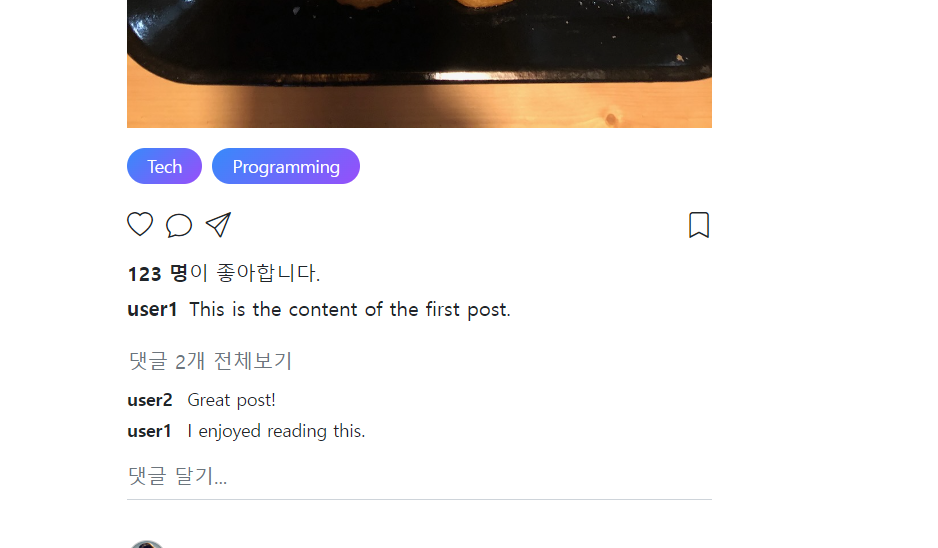
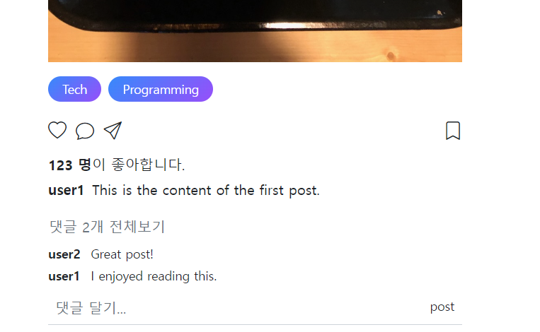
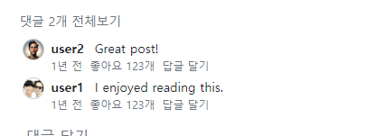
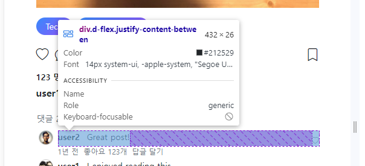
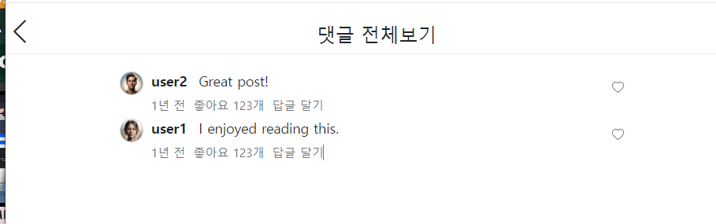
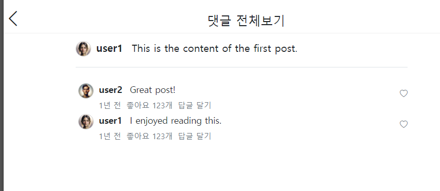
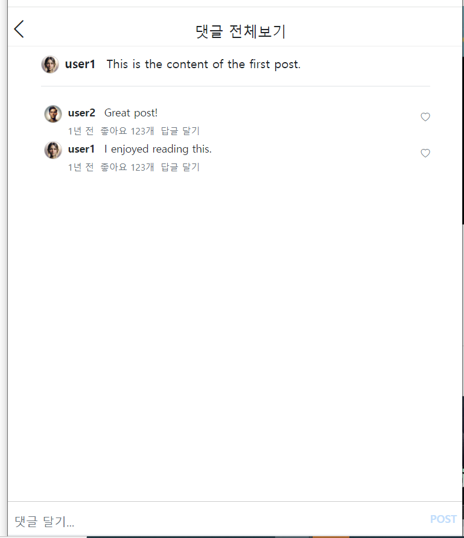
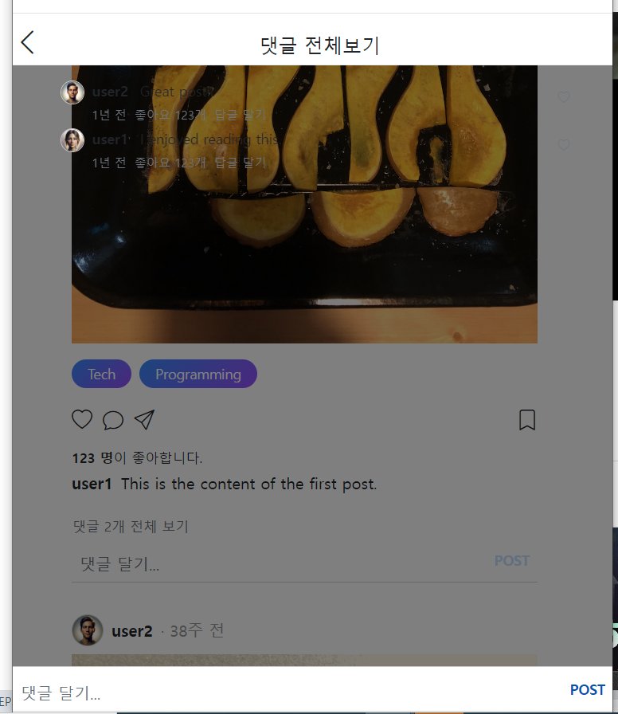
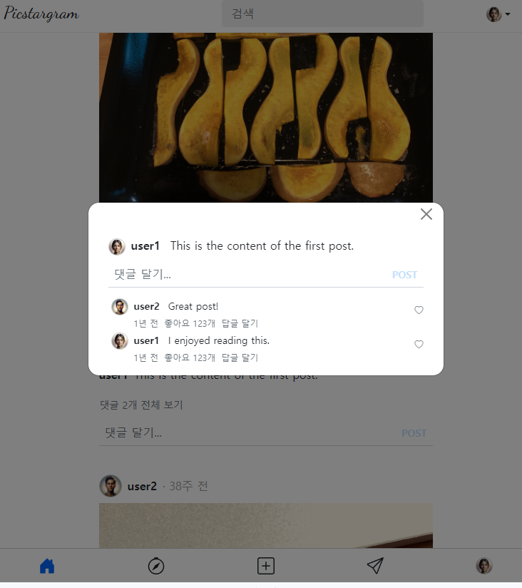

- cookie 인증 유튜브: https://www.youtube.com/watch?v=EO9XWml9Nt0
- 로그인 참고 깃허브(fastapi + htmx + pydantic): https://github.dev/sammyrulez/htmx-fastapi/blob/main/templates/owner_form.html
- ImageReq참고: https://github.dev/riseryan89/imizi-api/blob/main/app/middlewares/access_control.py
- **진짜배기 s3 세팅: https://wooogy-egg.tistory.com/77**
- **post개발 이후, s3 다운로드 참고 github: https://github.com/jrdeveloper124/file-transfer/blob/main/main.py#L30**
    - 유튜브: https://www.youtube.com/watch?v=mNwO_z6faAw
- **s3 boto3 드릴 블로그**: https://dschloe.github.io/aws/04_s3/s3_basic/
- **boto3 client말고 session으로 메서드들 정리 튜토리얼: https://thecodinginterface.com/blog/aws-s3-python-boto3/**

- bootstrap + github 인스타클론 참고:
    - 유튜브: https://www.youtube.com/watch?v=ZCvKlyAkjik
    - github: https://github.com/codingvenue/instagram-hompage-clone-bootstrap/blob/master/index.html

### post.html 속 content / comment 디자인 변경

1. `| length ` 필터 + `set`으로 comment를 count해서 comments가 있을 때, comments를 보여주도록 함
    - 최근 댓글 2개만 보여줄 미리보기로서 예정
    ```html
    {# 좋아요 / 작성자 + 컨텐츠 #}
    <div class="pt-2 text-sm">
        <div class="d-block my-1"><strong>{{ 123 }} 명</strong>이 좋아합니다.</div>
        <div class="d-flex flex-row gap-2">
            <strong class="d-inline">{{ post.user.username }}</strong>
            <p class="d-inline">{{ post.content }}</p>
        </div>
        
        
        <button class="btn p-0">
            <span class="text-muted">댓글 {{ comments_count }}개 전체보기</span>
        </button>
        
    </div>

    {# 댓글 최대 2개만 #}
    
    <div class="comments">
        
            <div class="comment">
                <div class="name">{{ comment.user.username }}</div>
                <div class="comment">{{ comment.text }}</div>
            </div>
        
    </div>
    
    ```
   
    - 아직 댓글보기 클릭시 페이지는 구현x

2. 댓글 입력창 디자인에 form만들고, `게시` 버튼도 추가하기
    - input을 싸고 있는 div -> form으로 바꾼다.
    - input에 .w-100을 주고, 형제로서 button을 추가한다.(현재 버튼은 내려간 상태)
    - **게시 버튼을 absolute로 만들기 위해, `w-100 input의 부모`에 relative를 만들어줘야한다. 하지만 form에 달지말고, div로 씌우자.**
    - 게시버튼은 `position-absolute end-0`을 줬다.
        - 그러나 `.form-control`에 flex가 들어가 있어서, 게시버튼이 한줄로 올라면 `d-inline`을 추가해줬다.
    - **add-comment는 pt를 주는데,. 이것도 div에 준다**
    ```html
    {# 댓글 추가 form #}
    <div class="position-relative add-comment">
        <form class="d-flex align-items-center">
            <input type="text"
                   class="form-control w-100 px-2 d-inline"
                   style="box-shadow: none;border-color: #ced4da;"
                   placeholder="댓글 달기..."
            >
            <button class="btn btn-sm position-absolute end-0 top-0 bottom-0
                            btn-primary btn-post text-uppercase"
            >
                post
            </button>
        </form>
    </div>
    ```
   

#### bootstrap btn-x에 btn-custom추가하여 커스텀 디자인 적용시키기

3. 버튼 개별디자인은 `.btn-post`를 넣고 정의해준다.
    - 그전에 `.btn-primary`를 먼저줘서, `bootstrap 기본기능`을 이용한 `focus/hover도 활용`하도록 한다.

    1. 하버전, `bg-color`를 투명색 + 글자색인 `color` 연한 파란색으로 주도록 만들고, fw도 준다.
    2. 하버시는 `.btn-post:focus, .btn-post:hover`를 동시에 정의해준다. hover시 진한파란색을 준다.
    3. 추가로 버튼 `클릭시 생기는 outline은 box-shadow:none으로 제거`했다.
    ```css
    .btn-post {
    background-color: transparent;
    border: 0;
    color: #c4dffd;

    font-weight: 600;
    }
   
    .btn-post:focus,
    .btn-post:hover {
        background-color: transparent!important;
        color: #0056b3;
        box-shadow:none!important;
    }
    ```

4. form도 클릭시, outline 생기는것도 style로 임시로 제거해줬다.
    ```html
    <input type="text"
           class="form-control w-100 px-2 d-inline"
           style="box-shadow: none;border-color: #ced4da;"
           placeholder="댓글 달기..."
    >
    ```


5. fs-6, fs-7을 정의해서, 좋아요 갯수, 댓글개수에 적용해준다.
    ```css
    .fs-6 {
        font-size: .85rem!important;
    }
    
    .fs-7 {
        font-size: .75rem!important;
    }
    ```
    ```html
    <div class="d-block my-1 fs-6">
        <strong>{{ 123 }} 명</strong>이 좋아합니다.
    </div>
    
        <button class="btn p-0">
            <span class="text-muted fs-6">댓글 {{ comments_count }}개 전체보기</span>
        </button>
    
    ```

### 댓글에 프로필 넣어주기

1. post의 profile을 보니, .post .profile을 정의해놨는데, 그것을 참고해서 `.comments .profile`을 정의해서 사용되도록 한다.
    - 부모가 block이었는데 주석처리해서 flex로 세로정렬되게 할 예정이다.
    ```css
    .post .comment {
        padding: 0 0;
        /*display: block;*/
    }
    
    .post .comment .profile {
        width: 24px;
        height: 24px;
        border: 1px solid #ccc;
        border-radius: 50%;
    }
    ```
2. a태그에 d-inline을 주고, 아바타/이름/댓글 내용이 inline으로 들어가게 한다.
    - 댓글들은 살짝 들어가도록 ps-1을 .commennts에 추가했다.
    ```html
    {# 댓글 최대 2개만 #}
    
        <div class="comments ps-1">
            
                <div class="comment d-flex align-items-center">
                    <div class="d-inline me-1">
                        <a href="{{ url_for('pic_users') }}">
                            
                            
                        </a>
                    </div>
                    <div class="name">{{ comment.user.username }}</div>
                    <div class="comment">{{ comment.text }}</div>
                </div>
            
        </div>
    
    ```

3. 이제 avatar와 별개로, 이름+text의 세로 형제로 시간/좋아요/답글달기를 달아준다.
    ```html
    
    <div class="d-flex flex-column">
        <div>
            <div class="name">{{ comment.user.username }}</div>
            <div class="comment">{{ comment.text }}</div>
        </div>
        <div class="d-flex gap-2 fs-7">
            <div class="text-muted">
                {{ comment.created_at | feed_time }}
            </div>
            <span href="#" class="text-muted">좋아요 {{ 123 }}개</span>
            <a href="#" class="text-decoration-none text-muted">
                답글 달기
            </a>
        </div>
    </div>
    ```
   


4. 이제 댓글 좋아요버튼을 `name+text`를 먼저 묶고, `부모를 between`으로 줘서 bi bi-header 아이콘을 넣는다.
    ```html
    
    <div class="d-flex justify-content-between">
        <div>
            <div class="name">{{ comment.user.username }}</div>
            <div class="comment">{{ comment.text }}</div>
        </div>
        <div class="pt-2 fs-7">
            <a href="#" class="text-decoration-none text-muted">
                <i class="bi bi-heart"></i>
            </a>
        </div>
    </div>
    ```
   

### 댓글 전체보기 페이지

1. user.html을 복사해서, post/comments.html을 만들고 nav-top을 변경한다
    ```html
     {{ super() }} 
    댓글 전체보기
    
    
        <header class="nav-top">
            <a href="{{ request.headers.get('Referer') }}" class="back">
                <i class="bi bi-chevron-left"></i>
            </a>
            <div class="name">댓글 전체보기</div>
        </header>
    
    
    
    ```


2. 렌더링하기 위해, route를 만든다.
    - post하위라서 `/post/{post_id}`로 path로 부모entity id를 받아서 보여주도록 한다.
    ```python
    @app.get("/picstargram/post/{post_id}/comments", response_class=HTMLResponse)
    async def pic_show_comments(
            request: Request,
            post_id: int,
            hx_request: Optional[str] = Header(None),
    ):
        # posts = get_posts(with_user=True, with_tags=True, with_likes=True, with_comments=True)
        comments = get_comments(post_id, with_user=True)
    
        context = {
            'request': request,
            'comments': comments,
        }
        return render(request, "picstargram/post/comments.html", context=context)
    ```

3. 댓글 전체보기 클릭을 a태그로 만들어서 넘어가게 한다.
    ```html
    
    <button class="btn p-0">
        <a href="{{ url_for('pic_show_comments', post_id= post.id )  }}"
           class="text-decoration-none text-muted fs-6">댓글 {{ comments_count }}개 전체 보기</a>
    </button>
    ```


4. post.html 속 코멘트 디자인을 post/partials/comments_div.html로 묶고, 재활용 할 준비를 한다.
    - **이 때, 내부에서 post.comments를 순회하니, `set comments`로 빼놓고 comments로 사용하도록 변경한다.**
    ```html
    
    
    
    {# 댓글 최대 2개만 #}
    
        
    
    ```
    ```html
    <div class="comments ps-1">
        
            <div class="comment d-flex ">
                <div class="d-inline me-2">
                    <a href="{{ url_for('pic_users') }}">
                        
                        
                    </a>
                </div>
                <div class="d-flex flex-column w-100">
                    <div class="d-flex justify-content-between">
                        <div>
                            <div class="name">{{ comment.user.username }}</div>
                            <div class="comment">{{ comment.text }}</div>
                        </div>
                        <div class="pt-2 fs-7">
                            <a href="#" class="text-decoration-none text-muted">
                                <i class="bi bi-heart"></i>
                            </a>
                        </div>
                    </div>
                    <div class="d-flex gap-2 fs-7">
                        <div class="text-muted">
                            {{ comment.created_at | feed_time }}
                        </div>
                        <span href="#" class="text-muted">좋아요 {{ 123 }}개</span>
                        <a href="#" class="text-decoration-none text-muted">
                            답글 달기
                        </a>
                    </div>
                </div>
            </div>
        
    </div>
    ```


5. .post .comment/.comments로 이어진 것들이 많아서, .post하위가 아니라 독립적으로 줘서, include된 html도 모양이 적응되게 변경한다.
    ```css
    
    /*.post .comments {*/
    .comments {
        padding-top: 0.5em;
        font-size: 14px;
        display: flex;
        flex-direction: column;
        gap: 4px;
    }
    
    
    /*.post .comment {*/
    .comment {
        padding: 0 0;
        /*display: block;*/
    }
    
    /*.post .comment .profile {*/
    .comment .profile {
        width: 24px;
        height: 24px;
        border: 1px solid #ccc;
        border-radius: 50%;
    }
    
    
    /*.post .comment .name {*/
    .comment .name {
        padding-right: 0.5em;
        font-weight: bold;
        display: inline;
    }
    
    /*.post .comment .comment {*/
    .comment .comment {
        display: inline;
    }
    ```


6. 원래 comment가 container내부에서 적용됬다. comments.html에 div.container를 씌워주고, _div는 그대로 둔다.
    - comments.html
    ```html
    
        <div class="container">
            
        </div>
    
    ```
   

7. 기존 2개까지만 순회하던 것을 풀어준다.
    ```html
    <div class="comments ps-1">
    {##}
    
    ```


8. comments route 에서, 글의 작성가 코멘트들만 따로 추출해서 미리 표기하게 한다.
    - get_comments_by_post_author()메서드를 만든다. 일단 해당 post에 대한 comments 중에 post author가 작성한 코멘트를 찾아야한다.
    ```python
    def get_comments_by_post_author(post_id: int):
        # new) path로 부모가 올 경우, 존재검사 -> CUD가 아니므로, raise 대신 []로 처리
        post = get_post(post_id, with_user=True)
        if not post:
            return []
    
        author = post.user
        return [
            get_comment(comment.id, with_user=True) for comment in comments
            if comment.post_id == post.id and comment.user_id == author.id
        ]
    
    ```
    - route에서 `author_comments` 변수를 추가해서, comments.html에 넘겨준다.
    ```python
    @app.get("/picstargram/post/{post_id}/comments", response_class=HTMLResponse)
    async def pic_show_comments(
            request: Request,
            post_id: int,
            hx_request: Optional[str] = Header(None),
    ):
        
        author_comments = get_comments_by_post_author(post_id)
        
        comments = get_comments(post_id, with_user=True)
    
        context = {
            'request': request,
            'author_comments': author_comments,
            'comments': comments,
        }
        return render(request, "picstargram/post/comments.html", context=context)
    
    
    ```


9. 이제 author_comments와 <-> comments를 따로 순회하니 comments변수 순회묶음이 아니라, 각 comment별로 처리될 수 있게
    - comment_div.html를 개별 추출하여 include한다
    ```html
    {{ author_comments }}
    <div class="comments ps-1">
        
            
        
    </div>
    ```

10. comments_div.html를 제거하고, comments.html 페이지에서 author_comments와 comment를 따로 순회한다.
    - **순회시, comment_div가 `comment` 변수를 인식하므로 for `comment` in 의 `for 변수는 comment로 동일`하다.**
    ```html
    
        <div class="container">
            {##}
            {# 글 작성자 댓글 #}
            <div class="comments ps-1">
                
                    
                
            </div>
            {# 전체 댓글 #}
            <div class="comments ps-1">
                
                    
                
            </div>
        </div>
    
    ```

11. 알고봤떠니, 맨위에 오는 것이 작성자의 댓글이 아니라, post의 내용이었다.ㅠ
    - author_comment대신 post를 찾아서 같이 던져준다.
    - view에서는 comment의 avatar 등의 `css스타일을 재활용`할 수 있게 `.comment .d-flex`의 div만 감싸줘서 복사해서 사용한다.
    - **hr은 class border + opacity class로 지정해서 꾸밀 수 있다.**
      ```python
      # author_comments = get_comments_by_post_author(post_id)
      post = get_post(post_id, with_user=True)
      ```
      ```html
      
         <div class="container">

             {# 글 내용 #}
             <div class="comment d-flex">
                 <div class="d-inline me-2">
                     <a href="{{ url_for('pic_users') }}">
                         
                         
                     </a>
                 </div>
                 <div class="d-flex flex-column w-100">
                     <div class="d-flex justify-content-between">
                         <div>
                             <div class="name">{{ post.user.username }}</div>
                             <div class="comment">{{ post.content }}</div>
                         </div>
                     </div>
                 </div>
             </div>

             <hr class="border border-muted border-1 opacity-50">
        ```
    

12. post.html에 있는 댓글 추가 form도 include시키도록 하자.
    ```html
    {# 댓글 추가 form #}
    
    ```

13. **`.nav-bottom`의 css를 그대로 활용해서, header태그를 만들고, 그안에 댓글추가form 입력해서 comments.html페이지의 block을 채워보자.**
    - 일단 base에 없는 nav_bottom block을 만들어준다.
    ```html
    
        
            
        
        
    
    ```
    - comments.html에 nav_bottom block을 댓글추가form으로 채운다.
    ```html
    
        <header class="nav-bottom">
            
        </header>
    
    ```

    


14. 페이지가 완성되었는데, 이제 모달로 띄워보도록 하자.

### 댓글보기 modal로 페이지 띄우기

1. **모달로 띄우려면 프론트에서 `hx-target="#dialog" hx-swap="innerHTML"`로 `hx-get`을 호출하여 hx_dialog.js에 정의한 htmx.on afterSwap 후 target.id == dialog를
   감지해서 toast를 modal을. show()해준다**
    - post.html을 수정해준다.
    - **다른 호출에서는 hx-swap을 안넣어줘도 #dialog 자식으로 들어가는데, 여기서는.. innerHTML 명시를 넣어줘야, dialog 자식으로서 내용을 제대로 채운다.**
        ```html
        {#<a href="{{ url_for('pic_show_comments', post_id= post.id )  }}" #}
        <a hx-get="{{ url_for('pic_hx_show_comments', post_id= post.id ) }}"
           hx-target="#dialog"
           class="text-decoration-none text-muted fs-6">
            댓글 {{ comments_count }}개 전체 보기
        </a>
         
        ```
    
2. **서버에서는 hx_show_comments라는 route를 만들어서, 기존페이지인 comments.html을 임시 렌더링해준다.**
    ```python
    @app.get("/picstargram/post/{post_id}/comments", response_class=HTMLResponse)
    # async def pic_show_comments(
    async def pic_hx_show_comments(
            request: Request,
            post_id: int,
            hx_request: Optional[str] = Header(None),
    ):
    
        post = get_post(post_id, with_user=True)
    
        comments = get_comments(post_id, with_user=True)
    
        context = {
            'request': request,
            'post': post,
            'comments': comments,
        }
        return render(request, "picstargram/post/comments.html", context=context)
    
    
    ```
   

3. **모달을 띄우려면, 백엔드에서는 html내부 modal을 채우는 양식이 필요하다.**
    ```html
    <div class="modal-content">
        <!-- header -->
        <div class="modal-header border-bottom-0">
            <h1 class="modal-title fs-5 fw-bold mx-auto" id="modalLabel">
                새 게시물 작성
            </h1>
            <button type="button" class="btn-close position-absolute end-0 me-2" data-bs-dismiss="modal" aria-label="Close"></button>
        </div>
        <!-- body -->
        <div class="modal-body">
        </div>
    </div>
    ```
    - **comments.html의 페이지 대신 `partials/comments_modal_content.html`로 복사해서 만들어 양식을 채워준다.**
    - 글내용 > hr삭제 + 댓글달기 form > 전체댓글 순으로 넣어준다.
    ```html
    <div class="modal-content">
        <!-- header -->
        <div class="modal-header border-bottom-0">
            <h1 class="modal-title fs-5 fw-bold mx-auto" id="modalLabel">
                댓글 전체보기
            </h1>
            <button type="button" class="btn-close position-absolute end-0 me-2" data-bs-dismiss="modal"
                    aria-label="Close"></button>
        </div>
        <!-- body -->
        <div class="modal-body">
    
            <div class="container">
                {# 글 내용 #}
                <div class="comment d-flex">
                    <div class="d-inline me-2">
                        <a href="{{ url_for('pic_users') }}">
                            
                            
                        </a>
                    </div>
                    <div class="d-flex flex-column w-100">
                        <div class="d-flex justify-content-between">
                            <div>
                                <div class="name">{{ post.user.username }}</div>
                                <div class="comment">{{ post.content }}</div>
                            </div>
                        </div>
                    </div>
                </div>
                
                {# 댓글 작성 폼 #}
                
            
                {# 전체 댓글 #}
                <div class="comments ps-1">
                    
                        
                    
                </div>
            </div>
        </div>
    </div>
    ```
    