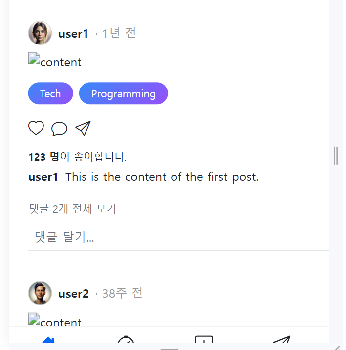
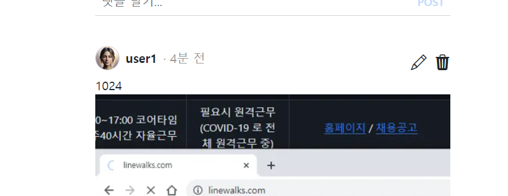

- cookie 인증 유튜브: https://www.youtube.com/watch?v=EO9XWml9Nt0
- 로그인 참고 깃허브(fastapi + htmx + pydantic): https://github.dev/sammyrulez/htmx-fastapi/blob/main/templates/owner_form.html
- ImageReq참고: https://github.dev/riseryan89/imizi-api/blob/main/app/middlewares/access_control.py
- **진짜배기 s3 세팅: https://wooogy-egg.tistory.com/77**
- **post개발 이후, s3 다운로드 참고 github: https://github.com/jrdeveloper124/file-transfer/blob/main/main.py#L30**
    - 유튜브: https://www.youtube.com/watch?v=mNwO_z6faAw
- **s3 boto3 드릴 블로그**: https://dschloe.github.io/aws/04_s3/s3_basic/
- **boto3 client말고 session으로 메서드들 정리 튜토리얼: https://thecodinginterface.com/blog/aws-s3-python-boto3/**

- bootstrap + github 인스타클론 참고:
    - 유튜브: https://www.youtube.com/watch?v=ZCvKlyAkjik
    - github: https://github.com/codingvenue/instagram-hompage-clone-bootstrap/blob/master/index.html

### post create route에 프로필편집 참고하여 file upload 적용하기

#### front form 확인

1. form에는 `hx-encoding="multipart/form-data"`가 달렸는지 확인하고
2. `UploadImageReq` Schema에 맞게 front의 form을 확인한다.
    ```python
    class UploadImageReq(BaseModel):
        image_bytes: bytes
        image_file_name: str
   
        @classmethod
        async def as_form(
                cls,
                file: Union[UploadFile, None] = None,
                file_name: str = Form(None, alias='fileName'),
    
        ):
            # ...
    ```
    - **이미지 input 필드의 name이 `file`인지 확인한다.**
    - **따로 filename처리가 있다면, hidden속성을 가진 `fileName` input필드를 추가해서 보낼 수 있도록 한다.**
    ```html
     <div class="file-name">파일 이름 자리</div>
    <input type="text" id="file-name-input" name="fileName" hidden value="">
    ```
    ```js
    var filenameDiv = document.querySelector(".file-name");
    var filenameInput = document.querySelector("#file-name-input");

        var fileName = file.name;
        if (fileName) {
            const convertedFileName = fileName.match(regExp);
            filenameDiv.textContent = convertedFileName;
            filenameInput.value = convertedFileName;
        }
    ```

#### schema

1. create_tag시 Schema(\*\*dict)시 서버부여 필드(id, created_at)가 에러나는데, 아래와 같이` = None`까지 채워줘야한다.
    ```python
    class TagSchema(BaseModel):
        id: Optional[int] = None
        name: str
        created_at: Optional[datetime.datetime] = None # 서버부여 -> 존재는 해야함 but TODO: DB 개발되면, 예제 안뜨게 CreateSchema 분리하여 제거대상.
        updated_at: Optional[datetime.datetime] = None
    
        posts: Optional[List[PostSchema]] = []  # tag.posts 해당 tag에 속한 글들
    
    ```

2. PostCreateReq as_form `upload_image_req: Optional[UploadImageReq] = Depends(UploadImageReq.as_form)`를 추가한다.
    - 이후 `upload_image_req: Optional[UploadImageReq] = None`를 필드로 추가한다.
    ```python
    class PostCreateReq(BaseModel):
        content: str
        
        tags: Optional[List[TagCreateReq]]
    
        upload_image_req: Optional[UploadImageReq] = None
    
        @classmethod
        def as_form(
                cls,
                content: str = Form(...),
                tags: str = Form(None),
                
                upload_image_req: Optional[UploadImageReq] = Depends(UploadImageReq.as_form),
        ):
            # obj array [string] to dict list [python]
            if tags:
                tags = json.loads(tags)
    
            return cls(content=content, tags=tags,
                       
                       upload_image_req=upload_image_req,
                       )
    ```

#### route에서 처리

1. `@login_required`를 달아서, 내부에서 user를 쓸 수 있게 한다.
    - **이 때, 내부에서 route처리하는 필드양식이 정해져있기 때문에**
    - **기존의 `UploadFile` 의존성이 있으면 에러난다. + `response: Response`도 에러난다.**
    - **의존성을 다 빼고 추가해야할 것은, `bg_task: BackgroundTasks`로 upload router에 넘겨줄 준비를 한다.**
    ```python
    @app.post("/picstargram/posts/new", response_class=HTMLResponse)
    @login_required
    async def pic_new_post(
            request: Request,
            bg_task: BackgroundTasks,
            post_create_req=Depends(PostCreateReq.as_form),
    ):
        # ...
    ```

2. post_creat_req의 schema의 dump한 data dict에서 optional인 upload_iamge_schema를 `pop`으로 빼낸 뒤
    - 존재 하면, upload api에 던져준다.
    - thumbnail_url을 받아서 data dict에 추가해준다.
    - user.id도 추가해준다.
    ```python
    @app.post("/picstargram/posts/new", response_class=HTMLResponse)
    @login_required
    async def pic_new_post(
            request: Request,
            bg_task: BackgroundTasks,
            post_create_req=Depends(PostCreateReq.as_form),
    ):
        try:
            # 1) form데이터는 crud하기 전에 dict로 만들어야한다.
            data = post_create_req.model_dump()
    
            # 2) post와 상관없은 optional image 업로드 schema를 pop으로 빼놓는다.
            upload_image_req: dict = data.pop('upload_image_req')
            # 3) image 업로드 scheema가 존재하면, 다시 Schema로 만들어서 upload API로 보낸다.
            # -> image_group_name은 호출하는 곳(post, user_profile)에 따라 다르게 보낸다.
            # -> 응답으로 온 정보 중 bg_task가 아닌 순차적 처리된 thumbnail은 바로 꺼내서 url을
            #    post용 data에 필드명(image_url)로 넣어준다.
            if upload_image_req:
                image_info: ImageInfoSchema = await pic_uploader(
                    request,
                    bg_task,
                    UploadImageReq(**upload_image_req),
                    image_group_name='post'
                )
    
                thumbnail_url = image_info.image_url_data['thumbnail']
                data['image_url'] = thumbnail_url
    
            # 4) 로그인된 유저의 id도 넣어준다.
            data['user_id'] = request.state.user.id
    
            post = create_post(data)
        except:
            raise BadRequestException('유저 수정에 실패함.')
    
        return render(request, "",
                      hx_trigger=["postsChanged"],
                      messages=[Message.CREATE.write("포스트", level=MessageLevel.INFO)]
                      )
    ```
   

#### render되는 html에서 static uploads폴더 aws url 처리 -> json init 처리
1. front에서 uploads 폴더에서 가져오는 것을, aws s3 url로 바꿔준다.
    ```html
    
    <div class="contents">
        
        {#src="{{ url_for('uploads', path=post.image_url) }}"#}
        
        
    ```

    


2. uploads폴더에서 가져오는 post.image_url이 아니게 되므로, 다 에러뜬다.
    
    - s3 picstargram 버킷  /init에 올려둔 post 파일들을 json에 url로 바꿔준다.
    ```json
    "posts": [
        {
          "id": 1,
          "title": "First Post",
          "content": "This is the content of the first post.",
          "created_at": "2022-05-17 16:56:21",
          "updated_at": "2022-05-17 16:56:21",
          "user_id": 1,
          "image_url": "https://picstargram.s3.ap-northeast-2.amazonaws.com/init/post-0001.jpeg"
        },
        {
          "id": 2,
          "title": "Second Post",
          "content": "Another post for testing.",
          "created_at": "2023-05-17 16:56:21",
          "updated_at": "2023-05-17 16:56:21",
          "user_id": 2,
          "image_url": "https://picstargram.s3.ap-northeast-2.amazonaws.com/init/post-0002.jpeg"
        }
      ],
    ```
   
#### img태그 수정 
1. img태그가 500이하면, 다 안채운다
    - **`img-fluid` css는 `max-width:100%; height:auto`로서, w-100옵션은 없다**
    - **width자체는 정의해줘야한다.**
        - 여기서는 w100으로 채워야한다.
```html

```

### upload api의 thumbnail_size default=200에 키워드로 받기
1. api에서 thumbnail_size를 키워드로서 `default있는 optional`로 받게 한다
    ```python
    @app.post('/uploader', response_model=ImageInfoSchema)
    async def pic_uploader(
            request: Request,
            bg_task: BackgroundTasks,
            upload_image_req: UploadImageReq,
            image_group_name: str,
            thumbnail_size: int = 200,
    ):
        uuid = str(uuid4())  # for s3 file_name
        thumbnail_size = (thumbnail_size, thumbnail_size)  # 원본대신 정사각 thumbnail
    
    ```
   
2. post생성 route에서는 500을 thumbnail_size로 지정해준다.
    ```python
        if upload_image_req:
            image_info: ImageInfoSchema = await pic_uploader(
                request,
                bg_task,
                UploadImageReq(**upload_image_req),
                image_group_name='post',
                thumbnail_size=500,
            )
    
    ```

### image_info schema에 max_size필드 추가
1. image_info schema에 max_size 추가. **thumbnail or 512, 1024, 1960이 올 수 있으니 `Unino[str, int]`로 타입을 준다.**
    ```python
    class ImageInfoSchema(BaseModel):
        image_url_data: Dict[str, str]
        #...
        max_size: Union[str, int] # 'thumbnail' or 512 or 1024 or 1920
    ```
   
2. upload api에서 convert_size를 순회하며, 만들 때, tuple이 된 thumbnail_size를 **`가변변수 max_size=thumbnail_size[0]`로 두고**
    - **조건만족시마다 max_size를 업뎃시키며, ImageInfoSchema를 생성하는 dict에 추가해준다.**
    ```python
        # max_size 판별용 변수
        max_size = thumbnail_size[0]
    
        for convert_size in image_convert_sizes:
            # 원본 width가 정해진 size보다 클 때만, ratio resize 후 추가됨.
            # -> 512보다 작으면 only thumbnail만 추가된다.
            if image_size[0] > convert_size:
                resized_image, resized_file_size = await resize_and_get_image_obj_and_file_size(
                    image_bytes,
                    convert_size
                )
    
                # 조건을 만족하는 경우마다 max_size 갱신
                max_size = convert_size
    
                image_objs_per_size[convert_size] = resized_image
                total_file_size += resized_file_size
   
        # max size 판단
        if max_size == thumbnail_size[0]:
            max_size = 'thumbnail'
   
        #...
        image_info_data = {
            'user_id': request.state.user.id,
    
            'image_group_name': image_group_name,
            'file_name': image_file_name,
            'file_extension': image_extension,
            'uuid': uuid,
            'total_file_size': total_file_size,
            'image_url_data': s3_urls_per_size,
    
            'max_size': max_size
        }
    
    ```
###  post가 1:1로서 가지도록 넣어주기
1. route에서, upload_image_req가 존재할 경우시  data에 `image_info`도 추가로 넣어준다.
    ```python
    @login_required
    async def pic_new_post(
            request: Request,
            bg_task: BackgroundTasks,
            post_create_req=Depends(PostCreateReq.as_form),
    ):
        try:
            #...
            if upload_image_req:
                image_info: ImageInfoSchema = await pic_uploader(
                    request,
                    bg_task,
                    UploadImageReq(**upload_image_req),
                    image_group_name='post',
                    thumbnail_size=500,
                )
    
                thumbnail_url = image_info.image_url_data['thumbnail']
                data['image_url'] = thumbnail_url
    
                # 5) post에 대한 1:1 image_info schema를 추가해준다.
                # -> image_info.image_url_data[ size ] 를 뽑아내기 위함.
                data['image_info'] = image_info
    ```

2. front에서 한번 `post.image_info`가 있을 때 `.max_size`를 찍어본다.
    ```html
     {{ post.image_info.max_size }}
    
    ```
    
    

