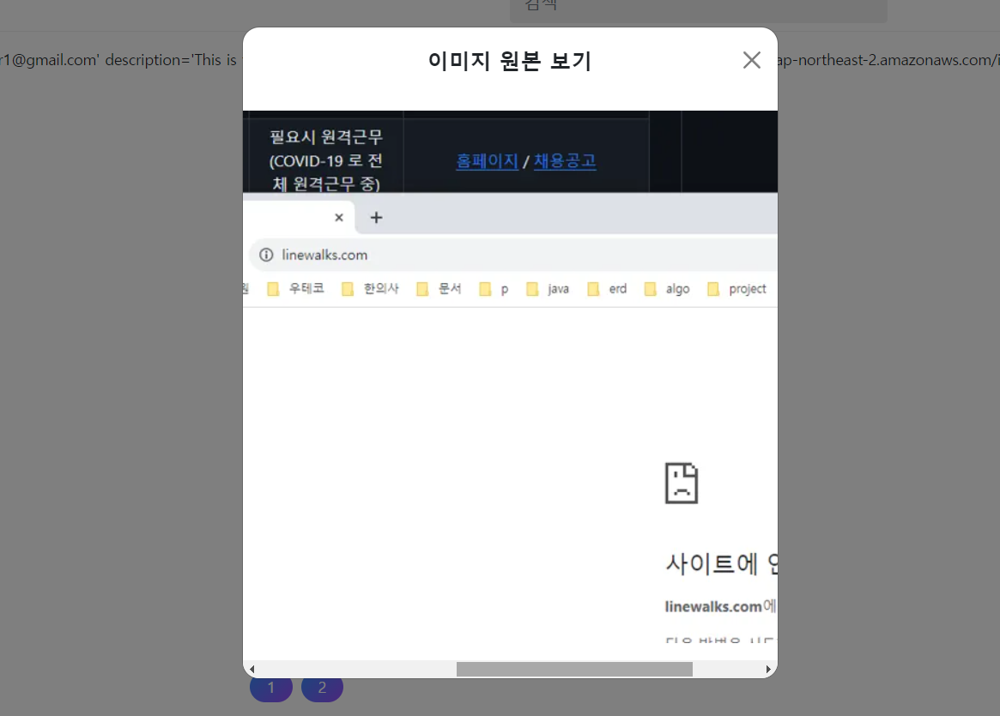
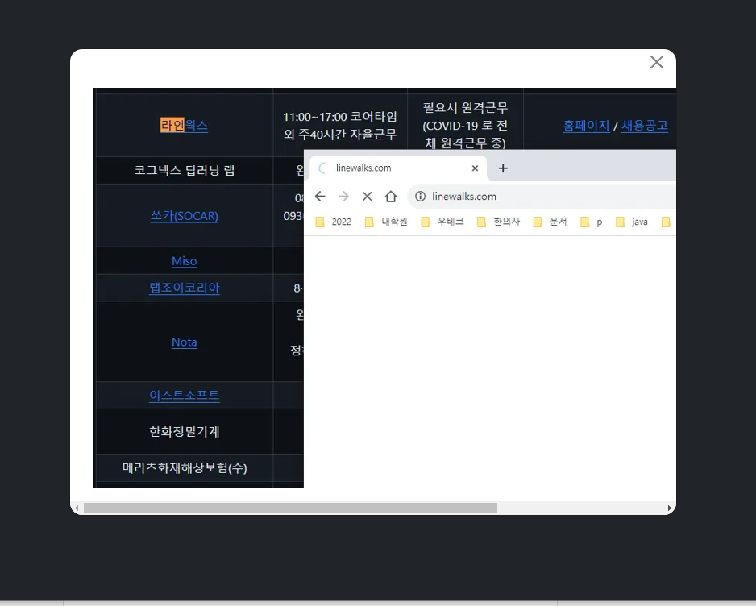
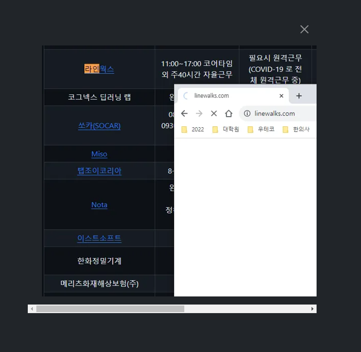

- cookie 인증 유튜브: https://www.youtube.com/watch?v=EO9XWml9Nt0
- 로그인 참고 깃허브(fastapi + htmx + pydantic): https://github.dev/sammyrulez/htmx-fastapi/blob/main/templates/owner_form.html
- ImageReq참고: https://github.dev/riseryan89/imizi-api/blob/main/app/middlewares/access_control.py
- **진짜배기 s3 세팅: https://wooogy-egg.tistory.com/77**
- **post개발 이후, s3 다운로드 참고 github: https://github.com/jrdeveloper124/file-transfer/blob/main/main.py#L30**
    - 유튜브: https://www.youtube.com/watch?v=mNwO_z6faAw
- **s3 boto3 드릴 블로그**: https://dschloe.github.io/aws/04_s3/s3_basic/
- **boto3 client말고 session으로 메서드들 정리 튜토리얼: https://thecodinginterface.com/blog/aws-s3-python-boto3/**

- bootstrap + github 인스타클론 참고:
    - 유튜브: https://www.youtube.com/watch?v=ZCvKlyAkjik
    - github: https://github.com/codingvenue/instagram-hompage-clone-bootstrap/blob/master/index.html

### post 역순으로 + image_url필드명 바꾸기

1. 일단 post show 요청시, 역순으로 들어오게 한다. 아직 페이지네이션은x
    ```python
    @app.get("/picstargram/posts/show", response_class=HTMLResponse)
    async def pic_hx_show_posts(
            request: Request,
            hx_request: Optional[str] = Header(None),
    ):
        posts = get_posts(with_user=True, with_tags=True, with_likes=True, with_comments=True)
        posts = reversed(posts)
        # ...
    ```

#### post든, user든 image_url필드 -> thumbnail_url, profile_url로 바꾸기

1. json에서 바꾸기
    ```json
      "users": [
        {
          "id": 1,
          "email": "user1@gmail.com",
          "username": "user1",
          "description": "This is the description of user1.",
          "hashed_password": "$2b$12$3T2KieEN5gZpNRyD8ni3c.FAQhEFzYbFKjG41NEeXpQ/Vt0nZML1u",
          "created_at": "2018-05-17 16:56:21",
          "updated_at": "2018-05-17 16:56:21",
          "profile_url": "https://picstargram.s3.ap-northeast-2.amazonaws.com/init/user1.png"
        },
        {
      ],
      "posts": [
        {
          "id": 1,
          "title": "First Post",
          "content": "This is the content of the first post.",
          "created_at": "2022-05-17 16:56:21",
          "updated_at": "2022-05-17 16:56:21",
          "user_id": 1,
          "thumbnail_url": "https://picstargram.s3.ap-northeast-2.amazonaws.com/init/post-0001.jpeg"
        },
    ```

2. schema에서 바꾸기
    ```python
    class PostSchema(BaseModel):
        id: Optional[int] = None
        # title: str
        content: str
        image_url: Optional[str] = None
        thumbnail_url: Optional[str] = None
        # ...
    ```   
    ```python
    class UserSchema(BaseModel):
        id: Optional[int] = None  # 서버부여 -> 존재는 해야함 but TODO: DB 개발되면, 예제 안뜨게 CreateSchema 분리하여 제거대상.
        email: str  # 추가
        hashed_password: str  # 추가
        username: str
        description: Optional[str] = None
        # image_url: Optional[str] = None
        profile_url: Optional[str] = None
        # ...
    ```

3. 각 create route에서 필드명 바꿔주기
    ```python
    @app.post("/picstargram/posts/new", response_class=HTMLResponse)
    @login_required
    async def pic_new_post(
            request: Request,
            bg_task: BackgroundTasks,
            post_create_req=Depends(PostCreateReq.as_form),
    ):
        try:
            # ...
            
            if upload_image_req:
                image_info: ImageInfoSchema = await pic_uploader(
                    request,
                    bg_task,
                    UploadImageReq(**upload_image_req),
                    image_group_name='post',
                    thumbnail_size=500,
                )
            
                thumbnail_url = image_info.image_url_data['thumbnail']
                # data['image_url'] = thumbnail_url
                data['thumbnail_url'] = thumbnail_url
    ```
    ```python
    @app.put("/picstargram/users/edit", response_class=HTMLResponse)
    @login_required
    async def pic_hx_edit_user(
            request: Request,
            bg_task: BackgroundTasks,
            user_edit_req: UserEditReq = Depends(UserEditReq.as_form)
    ):
        # ...
        upload_image_req: dict = data.pop('upload_image_req')
        if upload_image_req:
            # pop해놓은 dict를 다시 Schema로 감싸서 보내기
            image_info: ImageInfoSchema = await pic_uploader(
                request,
                bg_task,
                UploadImageReq(**upload_image_req),
                image_group_name='user_profile'
            )
    
            thumbnail_url = image_info.image_url_data['thumbnail']
            data['image_url'] = thumbnail_url
            data['profile_url'] = thumbnail_url
    ```


4. 프론트에서 post.image_url / user.profile_url -> thumbnail_url로 바꾸기
    - 전체찾기에서 `.image_url`에 걸리는 html들을 다 수정해준다.
    - nav_bottom / nav_top / comment_div / comment_content_modal
    - post / edit_form 등

```html

```

#### UserToken schema 및 token속 encode시 필드명도 바꿔줘야한다.

```python
class UserSchema(BaseModel):
    # ... 
    def get_token(self):
        "TODO: sqlalchemy User 모델 이관"
        return {
            "access_token": "Bearer " + create_token(
                data=dict(
                    sub=str(self.id),
                    email=self.email,
                    username=self.username,
                    description=self.description,
                    # image_url=self.image_url,
                    profile_url=self.profile_url,

    def refresh_token(self, refresh_token: str, iat: str):
        # ...
        else:
        return {
            "access_token": "Bearer " + create_token(
                data=dict(
                    sub=str(self.id),
                    email=self.email,
                    description=self.description,
                    username=self.username,
                    # image_url=self.image_url,
                    profile_url=self.profile_url,
```

```python
class UserToken(BaseModel):
    # ...
    # image_url: Optional[str] = None
    profile_url: Optional[str] = None
```

### post의 imageInfo를 조회할 수 있게 schema + 필드 + 예제데이터 만들기

1. schema에 1:1 이지만 Optional로 one객체를 만들어준다.
    ```python
    class PostSchema(BaseModel):
        # ...
        image_info: Optional['ImageInfoSchema'] = None
    
    
    class UserSchema(BaseModel):
        # ...
        image_info: Optional['ImageInfoSchema'] = None
    
    ```


2. 각 new_post / edit_user route에서 schema객체에 image_info를 할당해준다.
    ```python
    if upload_image_req:
        image_info: ImageInfoSchema = await pic_uploader(
            request,
            bg_task,
            UploadImageReq(**upload_image_req),
            image_group_name='post',
            thumbnail_size=500,
        )
    
        thumbnail_url = image_info.image_url_data['thumbnail']
        # data['image_url'] = thumbnail_url
        data['thumbnail_url'] = thumbnail_url
    
        # 5) post에 대한 1:1 image_info schema를 추가해준다.
        # -> image_info.image_url_data[ size ] 를 뽑아내기 위함.
        data['image_info'] = image_info
    ```
    ```python
    if upload_image_req:
        # pop해놓은 dict를 다시 Schema로 감싸서 보내기
        image_info: ImageInfoSchema = await pic_uploader(
            request,
            bg_task,
            UploadImageReq(**upload_image_req),
            image_group_name='user_profile'
        )
    
        thumbnail_url = image_info.image_url_data['thumbnail']
        data['profile_url'] = thumbnail_url
        data['image_info'] = image_info
    ```

3. imageinfoSchmea를 참고해서, json에 예시데이터 필드에 `image_info`를 dict로 넣어주기
    - max_size는 `thumbnail`로 되도록하고, image_url_data에 `thumbnail`만 넣어준다.
    ```json
      "users": [
        {
          "id": 1,
          "email": "user1@gmail.com",
          "username": "user1",
          "description": "This is the description of user1.",
          "hashed_password": "$2b$12$3T2KieEN5gZpNRyD8ni3c.FAQhEFzYbFKjG41NEeXpQ/Vt0nZML1u",
          "created_at": "2018-05-17 16:56:21",
          "updated_at": "2018-05-17 16:56:21",
          "profile_url": "https://picstargram.s3.ap-northeast-2.amazonaws.com/init/user1.png",
          "image_info" : {
            "id": 1,
            "created_at": "2018-05-17 16:56:21",
            "updated_at": "2018-05-17 16:56:21",
    
            "image_group_name": "profile",
            "file_name": "user1",
            "file_extension": "png",
            "uuid": "a5fc19f0-ebb8-43dd-ad75-514f12b61543",
            "total_file_size": "123456",
    
            "max_size" : "thumbnail",
            "image_url_data": {
              "thumbnail": "https://picstargram.s3.ap-northeast-2.amazonaws.com/init/user1.png"
            },
    
            "user_id": 1
          }
    ```
    ```json         
     "posts": [
        {
          "id": 1,
          "title": "First Post",
          "content": "This is the content of the first post.",
          "created_at": "2022-05-17 16:56:21",
          "updated_at": "2022-05-17 16:56:21",
          "user_id": 1,
          "thumbnail_url": "https://picstargram.s3.ap-northeast-2.amazonaws.com/init/post-0001.jpeg",
          "image_info" : {
            "id": 3,
            "created_at": "2018-05-17 16:56:21",
            "updated_at": "2018-05-17 16:56:21",
    
            "image_group_name": "profile",
            "file_name": "post1",
            "file_extension": "png",
            "uuid": "a5fc19f0-ebb8-43dd-ad75-514f12b61543",
            "total_file_size": "123456",
    
            "max_size" : "thumbnail",
            "image_url_data": {
              "thumbnail": "https://picstargram.s3.ap-northeast-2.amazonaws.com/init/post-0001.jpeg"
            },
            "user_id": 1
          }
        },
    ```

### modal 링크는 post.image_info.max_size가 thumbnail이 아닌 경우에만 클릭해서 원본보기

1. post.html에서 max_size가 `thumbnail`이 아닐 경우, a태그에 싼 img태그로 보여주기
    - 띄울 때, max_size의 url을 바로던지는게 아니라 post정보를 넣어서, 내부정보도 활용할 수 있게 한다.
    ```html
    
        {# max_size가 thumbnail이 아닌 경우 -> modal 띄우는 a태그에 감싸서 #}
        
            <a hx-get="{{ url_for('pic_hx_show_post_image', post_id=post.id) }}"
               hx-target="#dialog"
               hx-swap="innerHTML"
               style="cursor: pointer;"
            >
                
            </a>
        {# max_size가 thumbnail 경우 #}
        
            
        
    
    ```


2. route를 만들어준다.
    - post에서 max_size의 이미지 url를 가져와 render시 context로 건네준다.
    ```python
    @app.get("/picstargram/posts/{post_id}/image", response_class=HTMLResponse)
    async def pic_hx_show_post_image(
            request: Request,
            post_id: int,
    ):
        post = get_post(post_id)
        max_size = post.image_info.max_size
        
        max_size_image_url = post.image_info.image_url_data[max_size]
    
        context = dict(
            url=max_size_image_url,
        )
        return render(request, "picstargram/post/partials/post_image_modal_content.html", context=context)
    ```

3. modal양식에 맞춘 렌더링 html을 만든다.
    - post/partials/post_image_modal_content.html
    ```html
    <div class="modal-content">
        <!-- header -->
        <div class="modal-header border-bottom-0">
            <h1 class="modal-title fs-5 fw-bold mx-auto" id="modalLabel">
                이미지 원본 보기
            </h1>
            <button type="button" class="btn-close position-absolute end-0 me-2" data-bs-dismiss="modal"
                    aria-label="Close"></button>
        </div>
        <!-- body -->
        <div class="modal-body">
            <div class="container" >
                
            </div>
        </div>
    </div>
    
    ```


4. **문제는, `div.modal-dialog` 태그에 작은것 `.modal-sm` or 크기조절없이 둔 `기본크기`에서는 이미지 width를 제대로 표현못한다.**
    - **참고로, base.html의 `div.modal-dialog`에 `.modal-dialog-scrollable`을 붙혀줘야, 기본dialog크기를 넘어설 때, 스크롤이 생긴다.**
    ```html
    <div class="modal modal-blur fade" id="modal" tabindex="-1" aria-labelledby="modalLabel" aria-hidden="true">
        <div class="modal-dialog modal-dialog-centered modal-dialog-scrollable"
             id="dialog" hx-target="this"
        >
    ```
   

    - **image용 modal을 따로 base에 만들어서, 배경은 더 검은색 + `기본dialog`크기가 아닌 `max-width:max-content`로 가져가도록 해준다?!**
    - **만약, 지금 모달을 이렇게 바꾸면, 안에 내용물의 크기를 엉켜버린다?!**

### media용 모달 만들어주기

- max-contnent 참고:https://stackoverflow.com/questions/72803938/how-can-i-make-a-bootstrap-5-modal-fit-image-content

1. base.html의 modal 템플릿에, `.modal`의 `id="mediaModal"`, `.modal-dialog`의 `id="mediaDialog"`로 변경한다.

```html
    <!-- Media Modal(max-width: max-content) -->
<div class="modal modal-blur fade" id="mediaModal" tabindex="-1" aria-labelledby="modalLabel" aria-hidden="true">
    <div class="modal-dialog modal-dialog-centered modal-dialog-scrollable"
         id="mediaDialog" hx-target="this"
    >
```

2. hx_dialog.js에 새로운 element, 리스너 등 정의해주기
    ```js
    const mediaModalElement = document.getElementById('mediaModal');
    const mediaModal = new bootstrap.Modal(mediaModalElement);
    
    
    htmx.on('htmx:afterSwap', function (evt) {
    
        if (evt.detail.target.id === 'mediaDialog') {
            const currentModal = bootstrap.Modal.getInstance(mediaModalElement)
            currentModal.show();
        }
        
    })
    
    htmx.on("noContent", (evt) => {
    
        const currentMediaModal = bootstrap.Modal.getInstance(mediaModalElement)
        if (currentMediaModal && mediaModalElement.classList.contains("show")) {
            currentMediaModal.hide();
        }
    }
    
    htmx.on("hidden.bs.modal", () => {
        document.getElementById("dialog").innerHTML = ""
        document.getElementById("mediaDialog").innerHTML = ""
    })
    ```

3. post.html에서 이미지클릭시 `hx-target을 #mediaDialog`로 주기
    ```html
    <div class="contents">
        
            {# max_size가 thumbnail이 아닌 경우 -> modal 띄우는 a태그에 감싸서 #}
            
                <a hx-get="{{ url_for('pic_hx_show_post_image', post_id=post.id) }}"
                   hx-target="#mediaDialog"
                   hx-swap="innerHTML"
                   style="cursor: pointer;"
                >
    ```

#### 이미지용 dialog로서, dialog의 max-width / modal의 배경색 변경하기

1. .modal-dialog태그에 `max-width:max-content`를 추가하여, **안에 내용물을 최대한 보여주면서 + scroll되게하기**
    ```html
    <div class="modal-dialog modal-dialog-centered modal-dialog-scrollable"
         id="mediaDialog" hx-target="this" style="max-width: max-content!important;"
    >
    ```


2. **modal배경색은 `div.modal`에서 바꿔주기 -> 나는 `.bg-dark`를 추가**
    ```html
    <!-- Media Modal(max-width: max-content) -->
    <div class="modal modal-blur fade bg-dark" id="mediaModal" tabindex="-1" aria-labelledby="modalLabel" aria-hidden="true">
        <div class="modal-dialog modal-dialog-centered modal-dialog-scrollable"
             id="mediaDialog" hx-target="this" style="max-width: max-content!important;"
        >
            {# inject htmx here #}
        </div>
    </div>
    ```
   

3. **modal내용물 배경색은 render되는 `div.modal-content`의 배경이 한꺼번에 결정하고 있다.**
    - modal의 `.bg-dark`와 동일하게 준다.
    - 이 때, border가 있으니 `.border-0 .rounder-0`도 같이줘서, modal의 배경색과 일치 + 스크롤시 round적용안되게 만든다.
    ```html
    <div class="modal-content bg-dark border-0 rounded-0" style="max-width: {{ max_size }}px;">
        <!-- header -->
        <div class="modal-header border-bottom-0">
    ```


4. **클로즈버튼은, .modal-header속에 있는데 `.btn-close-white`를 줘서 밝은색 닫기버튼으로 만든다.**
    - 내부에서는 background:url()로 이미지가 들어가는데 css로 바꿀수 있다.
    ```html
    <div class="modal-header border-bottom-0">
        <button type="button"
                        class="btn-close position-absolute end-0 me-2 btn-close-white"
                        data-bs-dismiss="modal"
                        aria-label="Close">
                </button>
    ```
   


5. 모든 미디어에 다 쓸 수 있으니, html파일명에서 post_image를 뺀 `image_modal_content.html`로 바꾸고, picstargram/partials로 이동시킨다.
    ```python
    return render(request, "picstargram/partials/image_modal_content.html", context=context)
    ```

### image_url_data + picture태그 속 xx이하 source / 그외 img태그를 이용하여 반응형 이미지 모달로 만들기

-

참고: https://stackoverflow.com/questions/66980918/bootstrap-5-display-different-responsive-images-for-different-breakpoint

1. **route에서는 post.image_info에서 필요한 정보만 뽑아서 context로 넘겨준다.**
    1. `max_size` for source 들 끝나고 마지막 img태그
    2. `image_url_data` for .items()로 순회하며, `size, url`을 source와 img태그에
    3. `file_name` for alt
    ```python
    @app.get("/picstargram/posts/{post_id}/image", response_class=HTMLResponse)
    async def pic_hx_show_post_image(
            request: Request,
            post_id: int,
    ):
        post = get_post(post_id)
    
        context = dict(
            max_size=post.image_info.max_size,
            image_url_data=post.image_info.image_url_data,
            file_name=post.image_info.file_name,
        )
        return render(request, "picstargram/partials/image_modal_content.html", context=context)
    ```

2. .modal-content에선 배경 + border제거 + rounded제거 + max-width:max-content한 상태에서
    - .modal-header에는 타이틀인 .modal-header제거 + button은 색 변경된 상태다.
    - **.modal-body에서는, thumbnail은 건너뛴다(제외하고 보이기). `max_size`일땐 `source들 외 마지막태그로서 img태그`를 `.img-fluid.w-100`으로 준다.**
        - **그외에 size + url을 source태그에 media="(max-width: px)"에 넣어주면서 srcset으로 url지정**
    ```html
    <div class="modal-content bg-dark border-0 rounded-0" style="max-width: {{ max_size }}px;">
        <!-- header -->
        <div class="modal-header border-bottom-0">
            {#        <h1 class="modal-title fs-5 fw-bold mx-auto" id="modalLabel">#}
            {#            이미지 원본 보기#}
            {#        </h1>#}
            <button type="button"
                    class="btn-close position-absolute end-0 me-2 btn-close-white"
                    data-bs-dismiss="modal"
                    aria-label="Close">
            </button>
        </div>
        <!-- body -->
        <div class="modal-body">
            <picture>
                
                    
                        {# 1. thumbnail은 pass #}
                    
                        {# 2. 마지막크기는 img태그로 #}
                        
                    
                        {# 3. 그외에 size + url을 source태그에 media="(max-width: px)"에 넣어주면서 srcset으로 url지정 #}
                        <!-- show this up to size -->
                        <source media="(max-width: {{ size }}px)" srcset="{{ url }}">
                    
                
            </picture>
        </div>
    </div>
    ```