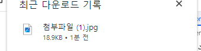
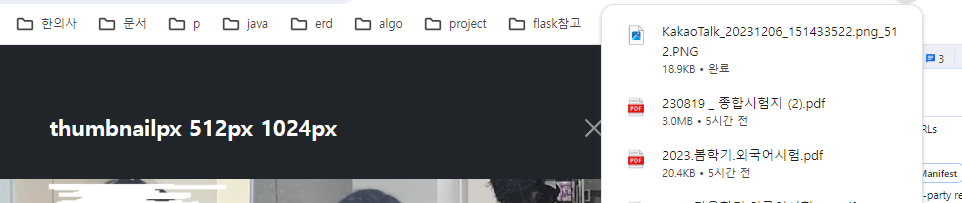

- cookie 인증 유튜브: https://www.youtube.com/watch?v=EO9XWml9Nt0
- 로그인 참고 깃허브(fastapi + htmx + pydantic): https://github.dev/sammyrulez/htmx-fastapi/blob/main/templates/owner_form.html
- ImageReq참고: https://github.dev/riseryan89/imizi-api/blob/main/app/middlewares/access_control.py
- **진짜배기 s3 세팅: https://wooogy-egg.tistory.com/77**
- **post개발 이후, s3 다운로드 참고 github: https://github.com/jrdeveloper124/file-transfer/blob/main/main.py#L30**
    - 유튜브: https://www.youtube.com/watch?v=mNwO_z6faAw
- **s3 boto3 드릴 블로그**: https://dschloe.github.io/aws/04_s3/s3_basic/
- **boto3 client말고 session으로 메서드들 정리 튜토리얼: https://thecodinginterface.com/blog/aws-s3-python-boto3/**

- bootstrap + github 인스타클론 참고:
    - 유튜브: https://www.youtube.com/watch?v=ZCvKlyAkjik
    - github: https://github.com/codingvenue/instagram-hompage-clone-bootstrap/blob/master/index.html

- fastapi+s3 download 참고 유튜브: https://www.youtube.com/watch?v=mNwO_z6faAw
- jinja2 지존 튜토리얼 블로그: https://ttl255.com/jinja2-tutorial-part-4-template-filters/

1. utils/image.py에 **아직 포맷변경은 생각하지말고, key(bucket이후 파일경로)를 받아서 `bytes`로 다운로드해주는 `s3_download`메서드를 정의한다.**
    - s3.get_object()의 `결과는 dict`이며, `'Body'` key는 StreamingBody라는 type이 있는데, `.read()`하면 bytes가 나온다.
    - bytes를 반환한다
    ```python
    async def s3_download(file_name: str) -> bytes:
        s3 = boto3.client(
            "s3",
            aws_access_key_id=settings.aws_access_key_id,
            aws_secret_access_key=settings.aws_secret_access_key,
            region_name=settings.aws_region
        )
    
        file_obj: dict = s3.get_object(
            Bucket=settings.aws_bucket_name,
            Key=file_name
        )
        # type(file_obj)  >> <class 'dict'>
        # type(file_obj['Body'])  >> <class 'botocore.response.StreamingBody'>
        # type(file_obj['Body']).read()  >> <class 'bytes'>
    
        # 파일명(key)가 s3에 존재하지 않을 때
        # -> botocore.errorfactory.NoSuchKey: An error occurred (NoSuchKey) when calling the GetObject operation: The specified key does not exist.
    
        file_content: bytes = file_obj['Body'].read()
    
        return file_content
    ```
   
2. download route를 만들되, `get`으로 만들어, querystring `?file_name=`으로 받아서 s3_download를 호출한다.
    ```python
    @app.get("/picstargram/download")
    async def pic_hx_download_image(
            request: Request,
            file_name: str,
    ):    
        file_content: bytes = await s3_download(file_name)
    
    ```
   
3. s3버킷 콘솔에서 key네임을 복사해서 `/picstargram/download?file_name=`에 붙혀서넣어서 출력해본다.
    - **만약, key네임을 잘못붙혀넣을 경우 발생되는 에러가 있는데, 임시로 에러처리해준다.**
    ```python
    @app.get("/picstargram/download")
    async def pic_hx_download(
            request: Request,
            file_name: str,
    ):
        try:
            buffer: bytes = await s3_download(file_name)
        except Exception as e:
            raise BadRequestException(f'해당 파일({file_name}) 다운로드에 실패했습니다.')
    ```
   
4. 유튜브를 참고해서, buffer(bytes)를 Response에 content=로, headers에는 첨부파일로서 다운로드되도록 해보자.
    - **content= 옵션에는 `bytes buffer`를 그대로 넣어주면 되고**
    - **headers=옵션에는 `Content-Disposition` key에 value를 `attachment; filename=`과, `Content-Type` key에는 `application/octet-stream`을 주면 된다.**
    - 이 때, **`한글이 포함된 파일명`은 headers 옵션에서 filename으로 바로 안들어가니 `filename*=UTF-8\'\'{}`안에 `urllib.parse.quote()`를 쳐서 보내면 된다.**
    ```python
    @app.get("/picstargram/download")
    async def pic_hx_download(
            request: Request,
            file_name: str,
    ):
        try:
            buffer: bytes = await s3_download(file_name)
        except Exception as e:
            raise BadRequestException(f'해당 파일({file_name}) 다운로드에 실패했습니다.')
    
        return Response(
            content=buffer,
            headers={
                'Content-Disposition': f'attachment; filename*=UTF-8\'\'{urllib.parse.quote(file_name)}',
                'Content-Type': 'application/octet-stream',
            }
      
    ```
   


### s3 다운로드할 원본파일명 + 확장자를 받아서 변환하여 다운로드
1. file_name은 view에서 `uuid`_`size`.`webp`형태로 보내줄 것인데, **다운로드 될 원본파일명 + 원본확장자는 없는 상황이라서 따로 받아야한다.**
    - s3 일반 다운로드가 아닌, s3_image_download route를 따로 만들자.
    - view에서 file_name외 원본파일명 + 원본확장자를 추가로 받자.
    ```python
    @app.get("/picstargram/image_download")
    async def pic_hx_image_download(
            request: Request,
            file_name: str,
            download_file_name: Union[str, None] = None,
            download_file_extension: Union[str, None] = 'png',
    ):
    
        try:
            buffer: bytes = await s3_download(file_name)
        except Exception as e:
            raise BadRequestException(f'해당 파일({file_name}) 다운로드에 실패했습니다.')
    
        # 따로 다운로드파일명이 안주어지면, bucket key(확장자 포함)로 대체
        if not download_file_name:
            download_file_name = file_name
        # 다운로드파일명이 따로오면, 다운로드 확장자와 합체
        else:
            download_file_name += '.' + download_file_extension
    
        return Response(
            content=buffer,
            headers={
                'Content-Disposition': f'attachment; filename*=UTF-8\'\'{urllib.parse.quote(download_file_name)}',
                'Content-Type': 'application/octet-stream',
            }
        )
    ```
2. 아래와 같이 querystring 을 추가하여, download_file_name과 download_file_extension을 추가하여 호출해보자
    - `http://localhost:8010/picstargram/download?file_name=post/f06bb30d-c640-41bc-b287-9b22111ac762_512.webp&download_file_name=첨부파일&download_file_extension=jpg`
    


3. 이제 view에서는 `pic_hx_image_download` 라우트를 호출해서 이미지를 다운받을 수 있도록
    - size들을 돌며, uuid_size.webp로 key명 -> route file_name을,
    - size들을 돌며, 원본파일명인 image_file_name -> route download_file_name을,
    - size들을 돌며, 원본파일명에 들어갈 선택된 size -> rotue file_size를,
    - size들을 돌며, 원본확장자인 image_file_extension -> route download_file_extension을 hx-get으로 보낼 수 있게 해야한다.
    - **이 때, 확인결과, view에서는 hx요청으로 다운로드요청을 보내면 안된다. `view-href` `route명-hx제거`로 변경**
    ```python
    @app.get("/picstargram/image_download")
    async def pic_image_download(
            request: Request,
            file_name: str,
            file_size: str,
            download_file_name: Union[str, None] = None,
            download_file_extension: Union[str, None] = 'png',
    ):
    
        try:
            buffer: bytes = await s3_download(file_name)
        except Exception as e:
            raise BadRequestException(f'해당 파일({file_name}) 다운로드에 실패했습니다.')
    
        # 따로 다운로드파일명이 안주어지면, bucket key(확장자 포함)로 대체
        if not download_file_name:
            download_file_name = file_name
   
        # 다운로드파일명이 따로오면, _ + 선택된size + . +  다운로드 확장자 로 합체
        else:
            download_file_name += '_' + file_size + '.' + download_file_extension
    
        return Response(
            content=buffer,
            headers={
                'Content-Disposition': f'attachment; filename*=UTF-8\'\'{urllib.parse.quote(download_file_name)}',
                'Content-Type': 'application/octet-stream',
            }
        )
    ```

4. view에서는 size를 돌 수 있는 image_data_url을 .items()로 돌면서, a태그를 구성해준다.
    - .modal-title에 넣어서 일단 다운로드 a태그를 만들어본다. 
    - **이 때. query_string은 `url_for().include_query_params()`로 포함시켜준다.**
    - **형변환은 `변수 | string`을 바로 써도 적용된다.**
    ```html
    <h1 class="modal-title fs-5 fw-bold mx-auto" id="modalLabel">
        
            <a href="{{ url_for('pic_hx_image_download').include_query_params(
                file_name=image_group_name + '/' + uuid + '_' + size | string  + '.webp', download_file_name=file_name, file_size=size, download_file_extension=download_file_extension
            ) }}"
                  class="text-white text-decoration-none"
            >
                {{ size }}px
            </a>
        
    </h1>
    ```
    

#### 문제점 수정
1. thumbnail pass하고, button에 다운로드 bi쓰기 
    - title대신, div.d-flex.mx-auto.gap-x로 간격 벌려주기
    ```html
    <div class="d-flex mx-auto gap-3" id="modalLabel">
        
            
                {# thumbnail pass #}
            
                <a href="{{ url_for('pic_image_download').include_query_params(
                    file_name=image_group_name + '/' + uuid + '_' + size | string  + '.webp',
                    download_file_name=file_name,
                    file_size=size,
                    download_file_extension=download_file_extension
                ) }}"
                >
                    <button class="btn btn-sm btn-outline-light rounded fs-7">
                       <i class="bi bi-file-earmark-arrow-down"></i> {{ size }}px
                    </button>
                </a>
            
        
    </div>
    ```
    

2. **애초에 image_info.file_name에 확장자가 이미 들어가있다.**
    - **pic_uploader  router에서,`rstrplit('.', 1)`으로  `최대 1개의 점`까지 떼어낸 파일명 확장자를 제거하자.**
    ```python
    @app.post('/uploader', response_model=ImageInfoSchema)
    async def pic_uploader(
            request: Request,
            bg_task: BackgroundTasks,
            upload_image_req: UploadImageReq,
            image_group_name: str,
            thumbnail_size: int = 200,
    ):
        uuid = str(uuid4())  # for s3 file_name
        thumbnail_size = (thumbnail_size, thumbnail_size)  # 원본대신 정사각 thumbnail
        image_convert_sizes = [512, 1024, 1920]  # 이것보다 width가 크면 ratio유지 resize
    
        data = upload_image_req.model_dump()
        # image_group_name = data['image_group_name']
        # for db -> download시 활용
        image_file_name = data['image_file_name']
        image_file_name = image_file_name.rsplit('.', 1)[0] # 최대 2개까지 .을 떼어낸 뒤, 맨 첫번째것만
        #...
    ```
   
3. modal에 post_image띄우는 route에서, 많은 정보를 넘겨줄거면 **차라리 image_info를 넘겨주는게 낫다?**
    - **schema를 넘겨주지말고 .model_dump()로 dict를 jinja에 넘겨주면, `.get()`이 아닌 `.key`로 접근가능하다.**
    ```python
    @app.get("/picstargram/posts/{post_id}/image", response_class=HTMLResponse)
    async def pic_hx_show_post_image(
            request: Request,
            post_id: int,
    ):
        post = get_post(post_id)
    
        image_info: ImageInfoSchema = post.image_info
    
    
        context = dict(
            image_info=image_info.model_dump(),
            # size별 이미지 source제공을 위한
            # max_size=image_info.max_size,
            # image_url_data=image_info.image_url_data,
            # file_name=image_info.file_name,
            # # 다운로드 링크 제공을 위한
            # image_group_name=image_info.image_group_name,
            # uuid=image_info.uuid,
            # download_file_extension=image_info.file_extension,
        )
        return render(request, "picstargram/partials/image_modal_content.html", context=context)
    ```
   

#### jinja2에서 reject필터 등으로 dict 다루기
1. image_info라는 dict에서, .image_url_data의 dict에서 .keys()를 하면 jinja2에서도 dict_keys[]로 반환된다.
    - **`| reject('연산자', '값')`를 이용해서 size key들 중 특정값을 필터링하고**
    - **`| list`로 list로 변환한다.**
    - size라서, 512, 1024, 1960 의 list를 `| sort`필터로 정렬한다.
2. **정렬된 size list변수에서 `[-1]`로 max_size를 얻어낸다.**
3. 그외에 그전에 쓰였던 변수들을 set으로 미리 받아놓는다.
    ```html
    
    
    
    
    
    
    
    ```
   
4. s3_key가 들어가야하는 file_name에 들어갈 변수를, sizes를 돌면서 미리 s3_key_name으로 만들어놓는다.
    ```html
    <div class="modal-header border-bottom-0">
        <div class="d-flex mx-auto gap-3" id="modalLabel">
            
                
                <a href="{{ url_for('pic_image_download').include_query_params(
                                file_name=s3_key_name,
                                file_size=size,
                                download_file_name=download_file_name,
                                download_file_extension=download_file_extension
                            ) }}"
                >
                    <button class="btn btn-sm btn-outline-light rounded fs-7">
                        <i class="bi bi-file-earmark-arrow-down"></i> {{ size }}px
                    </button>
                </a>
            
        </div>
        <button type="button"
                class="btn-close position-absolute end-0 me-2 btn-close-white"
                data-bs-dismiss="modal"
                aria-label="Close">
        </button>
    </div>
    ```
   
5. 밑에 부분도 thumbnail이 제거된 sizes로 돌고 -> image_url_data(dict) .get(size)로 url을 얻어오도록 단순화 시킨다.
    ```html
    <picture>
        
            
                {# 1. 마지막크기는 img태그로 #}
                
            
                {# 2. 그외에 size + url을 source태그에 media="(max-width: px)"에 넣어주면서 srcset으로 url지정 #}
                <!-- show this up to size -->
                <source media="(max-width: {{ size }}px)" srcset="{{ image_url_data.get(size) }}">
            
        
    </picture>
    ```


6. **추가로 route의 file_name 파라미터는 s3_key로 변경하자.** 
   - download_file_name과 _extension을 그냥 `.`으로 통합해서 `download_file_name`으로 set한 뒤, route에서도 1개의 변수로 보내고 싶었으나
   - **중간에 `_size`가 끼여야해서 다 따로 보내야한다.**
   - **route의 file_size -> download_file_size로 변경**
   ```python
    ```html
    
        
        <a href="{{ url_for('pic_image_download').include_query_params(
                    s3_key=s3_key,
                    
                    download_file_name=download_file_name,
                    download_file_size=size,
                    download_file_extension=download_file_extension
                ) }}"
        >
            <button class="btn btn-sm btn-outline-light rounded fs-7">
                <i class="bi bi-file-earmark-arrow-down"></i> {{ size }}px
            </button>
        </a>
    
    ```
    ```python
    @app.get("/picstargram/image_download")
    async def pic_image_download(
            request: Request,
            s3_key: str,
            
            download_file_size: str,
            download_file_name: Union[str, None] = None,
            download_file_extension: Union[str, None] = 'png',
    ):
    
        try:
            buffer: bytes = await s3_download(s3_key)
        except Exception as e:
            raise BadRequestException(f'해당 파일({s3_key}) 다운로드에 실패했습니다.')
    
        # 따로 다운로드파일명이 안주어지면, bucket key(확장자 포함)로 대체
        if not download_file_name:
            download_file_name = s3_key
    ```
   
### 파일명만 바꾸지말고, 실제 buffer도 format을 바꿔야한다.
1. bytes(buffer) -> BytesIO -> Image.open()으로 image객체를 만들고
2. `빈 BytesIO` -> image.객체.save( `빈 bytesIO`, format= )으로 inplace 변경한 뒤
3. `찬 BytesIO`.getvalue()로 bytes(buffer)를 얻는다.
4. **하고 나니, 용량이 엄청 커진다.(확장자만 달라지는거랑 다름). `utils.image.py`에 메서드를 정의해서 처리한다.**
    ```python
    try:
        buffer: bytes = await s3_download(s3_key)
    except Exception as e:
        raise BadRequestException(f'해당 파일({s3_key}) 다운로드에 실패했습니다.')
    
    # 따로 다운로드파일명이 안주어지면, bucket key(확장자 포함)로 대체
    if not download_file_name:
        download_file_name = s3_key
    
    # 다운로드파일명이 따로오면, _ + 선택된size + . +  다운로드 확장자 로 합체
    else:
        download_file_name += '_' + download_file_size + '.' + download_file_extension
   
    buffer = await convert_buffer_format(buffer, download_file_extension.lower())
    
    ```
    ```python
    async def convert_buffer_format(image_bytes: bytes, format_: str = 'png') -> bytes:
        current_image = Image.open(BytesIO(image_bytes))
    
        convert_buffered = BytesIO()
        current_image.save(convert_buffered, format=format_)
    
        return convert_buffered.getvalue()
    ```
   
### AWS 명령어 모음
```shell
%UserProfile%\.aws\credentials
%UserProfile%\.aws\config

aws configure list-profiles

# 등록
aws configure --profile {프로젝트명} # ap-northeast-2 # json
# 재사용시
set AWS_PROFILE={프로젝트명}

cat ~\.aws\credentials


# S3
aws s3 ls --profile {프로필명}
aws s3 mb s3://{버킷명}
aws s3 ls --profile {프로필명}


aws s3 cp {파일경로} s3://{버킷명}
aws s3 cp {파일경로} s3://{버킷명}/{폴더명} --acl public-read
```

#### IAM key 변경
1. root사용자 로그인 > IAM > 해당사용자 클릭 > `보안 자격 증명` 탭 > 액세스키
2. 기존 key `비활성화` 후 필요시 삭제 (있다가 cli에서 확인하고 비활성화하면 더 좋을 듯)
3. 새 액세스키 AWS CLI 선택하여 발급
4. 터미널 열어서 `AWS CLI`를 통해 해당프로젝트의 profile key들 덮어쓰기
    ```shell
    aws configure list-profiles # 현재 프로필들 확인
    cat ~\.aws\credentials # 현재 프로필들의 key설정값들 확인 (콘솔에서 비활성화시킨 것과 일치하는지)
    aws configure --picstargram # 특정프로필 key 덮어쓰기 with 콘솔
    ```
   
5. 프로젝트 .env의 `aws_access_key_id`와 `aws_secret_access_key`를 변경

   
