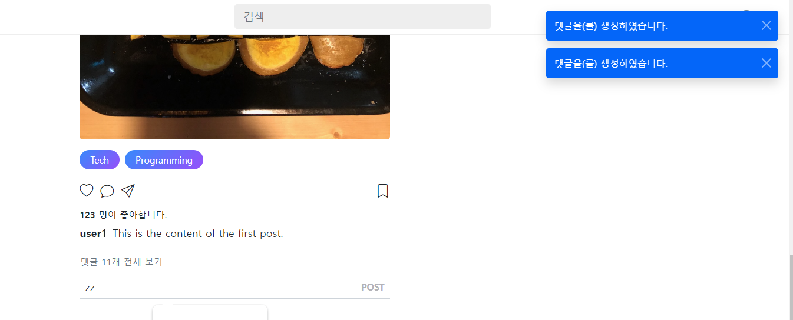
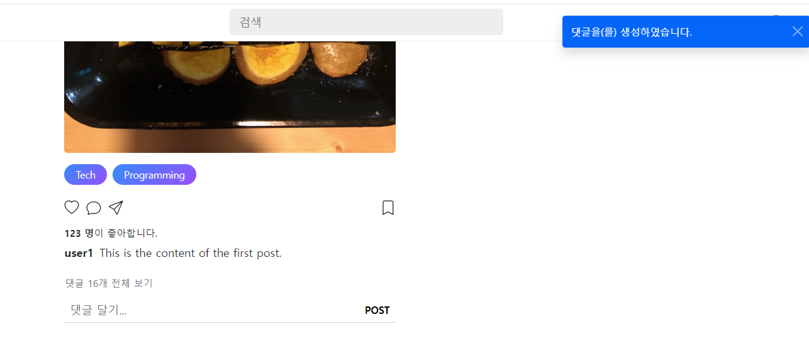
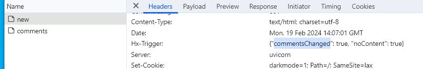
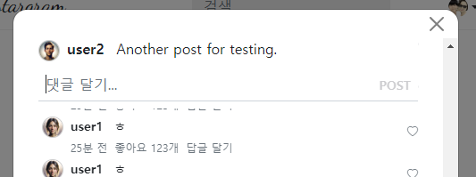

- cookie 인증 유튜브: https://www.youtube.com/watch?v=EO9XWml9Nt0
- 로그인 참고 깃허브(fastapi + htmx + pydantic): https://github.dev/sammyrulez/htmx-fastapi/blob/main/templates/owner_form.html
- ImageReq참고: https://github.dev/riseryan89/imizi-api/blob/main/app/middlewares/access_control.py
- **진짜배기 s3 세팅: https://wooogy-egg.tistory.com/77**
- **post개발 이후, s3 다운로드 참고 github: https://github.com/jrdeveloper124/file-transfer/blob/main/main.py#L30**
    - 유튜브: https://www.youtube.com/watch?v=mNwO_z6faAw
- **s3 boto3 드릴 블로그**: https://dschloe.github.io/aws/04_s3/s3_basic/
- **boto3 client말고 session으로 메서드들 정리 튜토리얼: https://thecodinginterface.com/blog/aws-s3-python-boto3/**

- bootstrap + github 인스타클론 참고:
    - 유튜브: https://www.youtube.com/watch?v=ZCvKlyAkjik
    - github: https://github.com/codingvenue/instagram-hompage-clone-bootstrap/blob/master/index.html
- django stream을 포함한 story : https://www.youtube.com/watch?v=5fG5xaIGzoI&list=WL&index=8&t=4s
- jinja2 지존 튜토리얼 블로그: https://ttl255.com/jinja2-tutorial-part-4-template-filters/


- comment: https://www.youtube.com/watch?v=T5Jfb_LkoV0&list=PL5E1F5cTSTtTAIw_lBp1hE8nAKfCXgUpW&index=14
- todo:
    - form validation: https://medium.com/@soverignchriss/asynchronous-form-field-validation-with-htmx-and-django-eb721165b5e8
    - 

1. view를 보고, CommentCreateReq + as_form을 post를 복사해서 준비한다.
    - 그동안 내용을 text 필드로 받았는데, json부터 post와 동일한 content로 바꿔주자.
    - json, CommentSchema, crud.py, comment_div.html
    - **content 필드만 보내게 된다.**
    ```python
    class CommentCreateReq(BaseModel):
        content: str
    
        @classmethod
        def as_form(
                cls,
                content: str = Form(...),
        ):
    
            return cls(content=content)
    ```
2. view인 `comment_create_form.html`의 보내는 name을 content로 넣어주자
    ```html
    <div class="position-relative add-comment pb-2">
        <form class="">
            <input type="text"
                   class="form-control w-100 px-2 d-inline"
                   style="box-shadow: none;border-color: #ced4da;"
                   placeholder="댓글 달기..."
                   name="content"
            >
            <button class="btn btn-sm position-absolute end-0 top-0 bottom-0
                           btn-dark btn-post text-uppercase"
            >
                post
            </button>
        </form>
    </div> 
    ```
3. action에 넣을 route를, new_post 라우트를 복사해서 new_comment route를 만들기
    - post_id를 받아야하므로 상위도메인 `posts/{post_id}/comments`로 만들어준다.
        - 나중에는 관계형으로서 post를 찾아서 넣어주기만 하면 된다?!
    - **받은 post_id와 user_id는 request에서 로그인된 유저정보(UserToken)에서 가져와서 data에 넣어준다.**

    ```python
    @app.post("/picstargram/posts/{post_id}/comments/new", response_class=HTMLResponse)
    @login_required
    async def pic_new_comment(
            request: Request,
            comment_create_req=Depends(CommentCreateReq.as_form),
    ):
        try:
            # 1) form데이터는 crud하기 전에 dict로 만들어야한다.
            data = comment_create_req.model_dump()
            
            data['post_id'] = post_id
            data['user_id'] = request.state.user.id
            # post_id = get_post(data['post_id'])
            
            comment = create_comment(data)
            
        except:
            raise BadRequestException('comment 생성에 실패함.')
    
        return render(request, "",
                      # hx_trigger=["postsChanged"],
                      messages=[Message.CREATE.write("댓글", level=MessageLevel.INFO)]
                      )
    ```
   
4. crud함수를 dict를 받아서 만들도록 해준다.
    - many 생성시 one의 id를 빼내서, 존재하는지 검사한다.
    - comment에서는 user_id, post_id 모두 one이라서 검사한다.
    ```python
    def create_comment(data: dict):
        # many생성시 one존재여부 검사 필수 -> 없으면 404 에러
        user_id = data.get('user_id')
        user = get_user(user_id)
        if not user:
            raise Exception(f"해당 user(id={user_id})가 존재하지 않습니다.")
    
        post_id = data.get('post_id')
        post = get_post(post_id)
        if not post:
            raise Exception(f"해당 post(id={post_id})가 존재하지 않습니다.")
    
        try:
            comment_schema = CommentSchema(**data)
            # id + created_at, updated_at 부여
            comment_schema.id = find_max_id(comments) + 1
            comment_schema.created_at = comment_schema.updated_at = datetime.datetime.now()
    
            comments.append(comment_schema)
    
        except Exception as e:
            raise e
    
        return comment_schema
    ```

#### modal이 아닌 곳에서 hx-crud는 hx-swap none
1. comment_create_form.html에서 hx-post를 해당 route로 던지는데, **`hx-swap="none"`으로 준다.** 
    - 새로고침처럼, **재자리에서 바뀌는 것이 없고, hx-trigger를 통해 다른 것 작동하게 한다**
    ```html
    <div class="position-relative add-comment pb-2">
        <form hx-post="{{ url_for('pic_new_comment', post_id=post.id) }}"
              hx-swap="none"
        >
            <input type="text"
                   class="form-control w-100 px-2 d-inline"
                   style="box-shadow: none;border-color: #ced4da;"
                   placeholder="댓글 달기..."
                   name="content"
            >
            <button class="btn btn-sm position-absolute end-0 top-0 bottom-0
                           btn-dark btn-post text-uppercase"
            >
                post
            </button>
        </form>
    </div>
    ```
   
2. **문제점은, form이 reset되지 않고 그대로 남아있다.**
    

#### 항상 떠있는 form의 submit후 초기화는 on htmx:afterRequest 후, reset() me로
1. **reset() 함수가 따로 정의되어있진 않다. 그냥 호출하면 된다.?!**
    ```html
    <form hx-post="{{ url_for('pic_new_comment', post_id=post.id) }}"
              hx-swap="none"
              _="on htmx:afterRequest reset() me"
        >
    ```
    


2. **엔터입력도 호출되게 하기 위해, `hx-trigger="submit"` 기본에 `, keyup[enterkey]`를 추가한다.**
    - 자동완성도 막아준다.
    ```html
    <form hx-post="{{ url_for('pic_new_comment', post_id=post.id) }}"
          hx-swap="none"
          _="on htmx:afterRequest reset() me"
          hx-trigger="submit, keyup[enterkey]"
            autocomplete="off"
    >
    ```
#### enter로도 submit되도록 hx-trigger 추가
```html
    <form hx-post="{{ url_for('pic_new_comment', post_id=post.id) }}"
          hx-swap="none"
          _="on htmx:afterRequest reset() me"
          hx-trigger="submit keyup[enterkey]"
          autocomplete="off"
    >
```
   
### value가 차야지 submit되도록 alpinejs 적용하기
1. base.html의 head태그에 alpinejs를 추가한다.
    ```html
    <!-- Alpine js -->
    <script
            src="https://cdn.jsdelivr.net/npm/alpinejs@3.x.x/dist/cdn.min.js"
            defer
    ></script>
    ```
2. x-data="{}"안에 변수를 빈값으로 초기화하고
    ```html
    <div x-data="{ content: '' }" class="position-relative add-comment pb-2">
        <form hx-post="{{ url_for('pic_new_comment', post_id=post.id) }}"
    ```
   
3. content가 없을 때 `!content`를 submit버튼의 disabled와 연동하는 `:disabled=`에 준다.
    ```html
    <button class="btn btn-sm position-absolute end-0 top-0 bottom-0
                   btn-dark btn-post text-uppercase"
            :disabled="!content"
    >
        post
    </button>
    ```
   
4. **disabled의 디자인인 `.btn-post[disabled]`를 평상시인 .btn-post와 동일하게 주고,**
    - **disabled가 사라진 상황인 `.btn-post`는 focus/hover와 동일하게로 변경한다**
    - 이 때, boder0과 fw는 같이 가져온다
    ```css
    .btn-post,
    .btn-post[disabled]
    {
        background-color: transparent;
        border: 0;
        /*color: #c4dffd;*/
        color: #b3b3b7;
    
        font-weight: 600;
    }
    ```
   
    ```css
    .btn-post[disabled]
    {
        background-color: transparent;
        /*border: 0;*/
        color: #b3b3b7;
    
        /*font-weight: 600;*/
    }
    
    .btn-post,
    .btn-post:focus,
    .btn-post:hover
    {
        background-color: transparent !important;
        border:0;
        color: #000000;
        font-weight: 600;
        box-shadow: none !important;
    }
    
    ```
    - **필요하다면, focus/hover는 색을 다르게 준다.**
    ```css
    .btn-post {
        background-color: transparent !important;
        border:0;
        color: #000000;
        font-weight: 600;
        box-shadow: none !important;
    }
    
    .btn-post[disabled]
    {
        background-color: transparent;
        color: #b3b3b7;
    }
    .btn-post:focus,
    .btn-post:hover
    {
        color: #395ac0;
    }
    ```
5. **이제 input필드의 value값과 content변수를 연동하는데**
    - **초기값 결정용 `:value` 대신, js상시 연동 `x-model="content"`과 함께**
    - **`content = $event.target.value`로 input의 value값을 content에 집어넣는 것에 대해**
    - **`x-on:input.debounce.300ms=""`으로 `input 이벤트가 300ms초동안 멈추면`처리**
    ```html
    <input type="text"
           class="form-control w-100 px-2 d-inline"
           style="box-shadow: none;border-color: #ced4da;"
           placeholder="댓글 달기..."
           name="content"
    
           x-model="content"
           x-on:input.debounce.300ms="content = $event.target.value"
    >
    ```
    - `x-on:input`: 입력 필드의 입력 이벤트를 감지합니다. 사용자가 입력할 때마다 실행됩니다.
    - **`.debounce.300ms`: 입력 이벤트를 감시하고, `사용자의 입력이 300밀리초 동안 멈추면 이벤트를 처리`합니다. 즉, 사용자가 입력을 멈추고 300밀리초 동안 다른 입력이 없으면 해당 이벤트를 실행합니다.**
    - "content = $event.target.value": 이벤트가 발생했을 때 실행될 JavaScript 코드입니다. 여기서는 입력된 값($event.target.value)을 content 변수에 할당합니다.


### post에서 댓글없으면, 댓글달기로 전환하고, 같은 modal띄우기
1. 댓글갯수에 따라 없으면 `댓글 달기`로 a태그로 바꿔서 보여준다.
    - **댓글달기 form은 더이상 post에서 보여주지 않는다.**
    ```html
     <button class="btn p-0">
            <a hx-get="{{ url_for('pic_hx_show_comments', post_id= post.id ) }}"
               hx-target="#dialog"
               hx-swap="innerHTML"
               class="text-decoration-none text-muted fs-6">
                
                    댓글 보기
                    {{ comments_count }}
                
                    댓글 달기
                
            </a>
        </button>
    {# 댓글 추가 form #}
    {##}
    
    ```
   
2. **댓글 갯수는, swap-oob를 위해 span태그에 넣고, `badge bg-xxx rounded-pill`로 뱃지카운터로 만들어준다.**
    ```html
     
        댓글 보기
        <span class="badge bg-secondary ">
            {{ comments_count }}
        </span>
    
        댓글 달기
    
    ```
   
### CRUD 후 실시간으로 변화하는 comments.html은 post hx-trigger에 의해
- post를 참고해서 만든다.

1. 전체댓글 부분의 내용물을 업데이트해야하므로, comments_modal_content.html의 comments를 순회하는 부분을 comments.html로 뺀다
    ```html
    
        
    
    ```
    ```html
    {# 전체 댓글 #}
    <div class="comments ps-1">
        
    </div>
    ```
   
2. home/index.html에서 trigger에 의해 post가 업데이트되는 코드를 참고해서, 
    - hx-trigger / hx-get / hx-target="this" / 내부 Loading... 대신 include로 시작 을, comments.html이 렌더링 될 부모에 작성해준다.
    - **context에 comments가 modal_content로 뿌려지는 상황이니 `load` + `Loading`은 안달고, custom trigger만 적용되게 하면 된다.**
3. **modal을 띄우는 route는 post도 같이 뿌려주므로, 이름을 show_comments -> `pic_hx_show_post_details` 로 먼저 변경한다**
    ```python
    @app.get("/picstargram/post/{post_id}/details", response_class=HTMLResponse)
    @login_required
    async def pic_hx_show_post_details(
            request: Request,
            post_id: int,
    ):
    ```
    ```html
    <button class="btn p-0">
            <a hx-get="{{ url_for('pic_hx_show_post_details', post_id= post.id ) }}"
               hx-target="#dialog"
               hx-swap="innerHTML"
               class="text-decoration-none text-muted fs-6">
                
                    댓글 보기
                    <span class="badge bg-light text-dark rounded-pill">
                        {{ comments_count }}
                    </span>
                
                    댓글 달기
                
            </a>
        </button>
    ```
4. 다시 comments를 뿌려주는 route로서 view에서 trigger에 의해서 변경되게 한다.
  ```html
  {# 전체 댓글 #}
  <div class="comments ps-1"
       hx-trigger="commentsChanged from:body"
       hx-get="{{ url_for('pic_hx_show_comments', post_id=post.id) }}"
       hx-target="innerHTML"
      
  </div>
  ```

5. 댓글을 include된 comments.html로 render하는 route를 만들어준다.
    - 여기선 post정보를 넘겨줄 필요없이 comments만 렌더링
    - **reversed로 넘겨줄 땐 `list()`로 감싸서 넘겨주자. include외부에서 순회는 괜찮지만, jinja2에서 직접 돌땐 reversed타입으로 안돌아간다.**
    ```python
    @app.get("/picstargram/posts/{post_id}/comments", response_class=HTMLResponse)
    async def pic_hx_show_comments(
            request: Request,
            post_id:int,
            hx_request: Optional[str] = Header(None),
    ):
        comments = get_comments(post_id, with_user=True)
        comments = list(reversed(comments))
    
        context = {
            'request': request,
            'comments': comments,
        }
    
        return render(request, "picstargram/post/partials/comments.html", context=context)
    
    ```
   
6. 이제 **form제출시, `hx-trigger`를 넣어서 댓글전체를 업데이트 + `modal안꺼지게`도 추가해줘야한다.**
    - 일단 new_comment를 생성할 때, hx-trigger로서 `commentsChanged`를 넣어준다.
    ```python
    @app.post("/picstargram/posts/{post_id}/comments/new", response_class=HTMLResponse)
    @login_required
    async def pic_new_comment(
            request: Request,
            post_id: int,
            comment_create_req=Depends(CommentCreateReq.as_form),
    ):
        #...
        return render(request, "",
                          hx_trigger=["commentsChanged"],
                          messages=[Message.CREATE.write("댓글", level=MessageLevel.INFO)]
                          )
    ```
    


### 댓글modal에서 댓글생성submit해도, modal이 안꺼지도록?

- **지금까지는 render("") -> `html_str` 빔 -> hx-trigger['noContent'] = True로 자동입력되어**
- **hx_dialog.js에서 noContent를 htmx.on()에서 인식해서 꺼졌다.**
- **hx-trigger에 `noContent=False`가 들어오면, 안꺼지도록 설정하자**

1. **댓글 생성 route에서 hx-trigger를 commentsChanged외 `noContent=False`를 줘서 모달이 꺼지지 안도록 한다.**
    - **이렇게만하면 modal이 유지된다.**
    ```python
    @app.post("/picstargram/posts/{post_id}/comments/new", response_class=HTMLResponse)
    @login_required
    async def pic_new_comment(
            request: Request,
            post_id: int,
            comment_create_req=Depends(CommentCreateReq.as_form),
    ):
        #...
        return render(request, "",
                      hx_trigger=dict(noContent=False, commentsChanged=True),
                      messages=[Message.CREATE.write("댓글", level=MessageLevel.INFO)]
                      )
    ```

2. **기존 render()메서드안에서는 `html_str가 None`일 때는, 자동으로 noContnet=True로 덮어쓰게 되어있는데**
    - **추가조건으로 `noContent=False가 아닐 때`의 조건을 추가하여, 렌더링html없으면서 + noContent=False가 아닐 때만 noContent=True가 덮어쓰도록 한다**
    ```python
    def render(request, template_name="", context: dict = {}, status_code: int = 200,
               cookies: dict = None,
               delete_cookies: list = None,
               hx_trigger: dict | str | List[str] = None,
               messages: dict | List[dict] = None,
               # oobs: List[tuple] = None,
               oobs: List[str] = None,
               ):
        
        #...
        
        # 모달을 안닫기 위한 noContent=False가 아닌지 확인하기
        no_content_false = hx_trigger.get('noContent', None) is False
    
        if not html_str and not no_content_false:
            hx_trigger['noContent'] = True
    ```

3. 그렇다면 `crud를 호출`하는 comment_create_form.html의 `hx-swap="none"이 필수`로 들어가있어야한다.
    ```html
    <div x-data="{ content: '' }" class="position-relative add-comment pb-2">
        <form hx-post="{{ url_for('pic_new_comment', post_id=post.id) }}"
              hx-swap="none"
              _="on htmx:afterRequest reset() me"
              hx-trigger="submit, keyup[enterkey]"
              autocomplete="off"
        >
    ```

4. hx_dialog.js에서는 `noContent` event에 대해 **evt.detail.value로 `hx-trigger의 key에 대한 value`를 확인할 수 있다.**
    - 확인해서 false면, modal을 안꺼지도록 한다.
    ```js
    htmx.on("noContent", (evt) => {
        // 모달 안꺼지도록 hx-swap="none"외 hx-trigger noContent=False를 줬다면, value를 확인해서 작동안하도록 한다.  
        if (!evt.detail.value) {
            return;
        }
    ```

### 댓글modal을 직접 닫아도, post.html의 댓글 갯수(comments_count)는 안변해있다?
- 여러사람이 동시에 바꿀 수 있으니, 이것도 hx-trigger로 처리되도록 해야한다.

1. post.html의 댓글갯수 부분을 comment_count.html로 뽑고, include시킨다.
    ```html
    <span class="badge bg-light text-dark rounded-pill">
        {{ comments_count }}
    </span>
    ```
    ```html
    
        댓글 보기
        
    
        댓글 달기
    
    ```
   
2. comments_count.html에서 hx-trigger가 적용되도록 한다.
    - post.id도 쓰고 있으니 `comments_count_with_post.html`로 변경한다.
    - **oob가 아니라, 자체적으로 호출할 것이므로, `hx-target="this"`에 hx-swap이 전체태그인 span으로 이루어질 것이니 `hx-swap="outerHTML"`도 포함시킨다.**
    ```html
    <span class="badge bg-light text-dark rounded-pill"
          hx-trigger="commentCountChanged from:body"
          hx-get="{{ url_for('pic_hx_show_comment_count', post_id=post.id) }}"
          hx-target="this"
          hx-swap="outerHTML"
    >
        {{ comments_count }}
    </span>
    ```

3. **route를 만들어준다. `이 때, noContent=False를 안주면 열여있던 댓글창이 닫혀버린다`**
    - **include에 사용되는 변수와 동일한 변수명들(comment_counts, post)로 context에 던져주자.**
    ```python
    @app.get("/picstargram/posts/{post_id}/comments-count", response_class=HTMLResponse)
    async def pic_hx_show_comments_count(
            request: Request,
            post_id: int,
            hx_request: Optional[str] = Header(None),
    ):
        post = get_post(post_id, with_user=True)
        comments = get_comments(post_id, with_user=True)
        comments_count = len(comments)
    
        context = {
            'request': request,
            'post': post,
            'comments_count': comments_count,
        }
    
        return render(request,
                      "picstargram/post/partials/comments_count_with_post.html",
                      context=context,
                      )
    ```
   
4. **참고: oob로 시도하려면, id가 필요하다. 동적인 id는 include시키면 인식을 못해 oob에러가 났다. 외부는 두고 내부내용만 include시키는 경우, oob해야할듯?**

#### commentsChanged와 달리, commentsCountChanged는 모든 post마다 있으니... 특정해야한다.?!
1. view에서 글마다 정해지는 post.id를 trigger이름에 기입해준다.
    ```html
    <span class="badge bg-light text-dark rounded-pill"
          hx-trigger="commentsCountChanged-{{ post.id }} from:body"
          hx-get="{{ url_for('pic_hx_show_comments_count', post_id=post.id) }}"
          hx-target="this"
          hx-swap="outerHTML"
    >
        {{ comments_count }}
    </span>
    ```
   
2. **route에서 hx-trigger를 response할 때, f-string을 이용해서 post별로 trigger가 작동하게 한다.**
    - 이 때, f스트링을 쓰려면, dict()에서 {}로 바꿔줘야한다.
    ```python
    return render(request, "",
                  hx_trigger={
                      'noContent': False, 'commentsChanged': True, f'commentsCountChanged-{post_id}': True,
                  },
                  messages=[Message.CREATE.write("댓글", level=MessageLevel.INFO)],
                  )
    ```


#### view 수정
1. post.html에서 댓글 달기 -> 보기가 commnetsCountChanged-post_id에 의해 업데이트되어야하므로, swap되는 html내부로 넣어야한다
    - **내부로 옮기는데, 맨 바깥이 댓글 text만 있으면 안되므로, span태그를 추가하고, hx관련 코드도 모두 옮겨야한다. 전체가 바뀌어야하므로**
    ```html
    <span hx-trigger="commentsCountChanged-{{ post.id }} from:body"
          hx-get="{{ url_for('pic_hx_show_comments_count', post_id=post.id) }}"
          hx-target="this"
          hx-swap="outerHTML"
    > 댓글
        
            보기 <span class="badge bg-light text-dark rounded-pill">{{ comments_count }}</span>
        
            달기
        
    </span>
    ```
   
2. **post내용+ 댓글추가form만 sticky로 처리하기 위해서**
    1. **2내용을 감싸는 div를 만들고, `position-sticky top-0 bg-xxx`를 준다. 배경을 안주면 아래내용들이 투명배경에 비친다**
    2. **modal-header부분의 button도 배경 `bg-xxx`를 줘서 absolute로 떠있던 header에도 안보이게 해야한다.**
    3. **sticky < container < .modal-body로서 `가장 부모태그인 .modal-body`에 `pt-0`을 줘서, 공백을 없앤다.**
    ```html
    <div class="modal-content">
        <!-- header -->
        <div class="modal-header border-bottom-0">
            {#<h1 class="modal-title fs-5 fw-bold mx-auto" id="modalLabel">
                댓글 전체보기
            </h1>#}
            <button type="button" class="btn-close position-absolute end-0 me-2 bg-white" data-bs-dismiss="modal"
                    aria-label="Close"></button>
        </div>
        <!-- body -->
        <div class="modal-body pt-0">
            <div class="container">
                <div class="position-sticky top-0 bg-white">
                    {# 글 내용 #}
    ```
    


### comment delete with hx-post  not delete
- **hx-delete -> @app.delete()가 있지만, `hx request, response, hx-trigger가 무시`되는 버그가 있다.**

1. 개별댓글view인 `comment_div.html`에서 if user and comment.user_id == user.id 일 때, post에서 썼던 휴지통 아이콘을 나타나게 한다.
    - **view변화없는 CRUD는 hx-swap="none"을 포함시켜준다.**
    ```html
    <div class="d-flex gap-2 fs-7">
        <div class="text-muted">
            {{ comment.created_at | feed_time }}
        </div>
        <span href="#" class="text-muted">좋아요 {{ 123 }}개</span>
        <a href="#" class="text-decoration-none text-muted">
            답글 달기
        </a>
        
            <a hx-delete="{{ url_for('pic_hx_delete_comment', comment_id= comment.id ) }}"
               hx-confirm="정말 삭제하시겠습니까?"
               hx-swap="none"
               style="cursor: pointer;"
                >
                <i class="bi bi-trash3-fill"></i>
            </a>
        
    </div>
    ```
   
2. pic_delete_comment route를 작성한다. post없이 comment의 id만 있으면 된다.
    - **hx-delete -> @app.delete()가 있지만, `hx request, response, hx-trigger가 무시`되는 버그가 있다.**
    - **내부에서 comment_id -> post -> post.id를 이용해서 특정post의 count갯수변화 trigger를 만들 때 사용한다.**
    - 모달이 닫히면 안되므로 noContent를 넣어주고, **댓글전체 변화 + 본문 댓글 갯수 변화 trigger도 넣어준다.**
    ```python
    @app.post("/comments/{comment_id}", response_class=HTMLResponse)
    @login_required
    async def pic_hx_delete_comment(
            request: Request,
            comment_id: int,
    ):
        
        # post가 필요없을 줄 알았는데, 어느 특정post의 댓글갯수를 update해야할지 trigger 시켜줘야한다
        comment = get_comment(comment_id)
        post_id = comment.post_id
        
        try:
            delete_comment(comment_id)
        except Exception as e:
            raise BadRequestException(f'Comment(id={comment_id})삭제에 실패했습니다.')
        
        
        # post삭제와 달리, modal에서 CRUD이므로, noContent가 발생하니, noContent=False로 modal안닫히게?
        return render(request,
                      "",
                      hx_trigger={
                          'noContent': False, 'commentsChanged': True, f'commentsCountChanged-{post_id}': True,
                      },
                      messages=[Message.DELETE.write("댓글", level=MessageLevel.INFO)],
                      )
    
    ```
### AWS 명령어 모음
```shell
%UserProfile%\.aws\credentials
%UserProfile%\.aws\config

aws configure list-profiles

# 등록
aws configure --profile {프로젝트명} # ap-northeast-2 # json
# 재사용시
set AWS_PROFILE={프로젝트명}

cat ~\.aws\credentials


# S3
aws s3 ls --profile {프로필명}
aws s3 mb s3://{버킷명}
aws s3 ls --profile {프로필명}


aws s3 cp {파일경로} s3://{버킷명}
aws s3 cp {파일경로} s3://{버킷명}/{폴더명} --acl public-read
```

#### IAM key 변경
1. root사용자 로그인 > IAM > 해당사용자 클릭 > `보안 자격 증명` 탭 > 액세스키
2. 기존 key `비활성화` 후 필요시 삭제 (있다가 cli에서 확인하고 비활성화하면 더 좋을 듯)
3. 새 액세스키 AWS CLI 선택하여 발급
4. 터미널 열어서 `AWS CLI`를 통해 해당프로젝트의 profile key들 덮어쓰기
    ```shell
    aws configure list-profiles # 현재 프로필들 확인
    cat ~\.aws\credentials # 현재 프로필들의 key설정값들 확인 (콘솔에서 비활성화시킨 것과 일치하는지)
    aws configure --picstargram # 특정프로필 key 덮어쓰기 with 콘솔
    ```
   
5. 프로젝트 .env의 `aws_access_key_id`와 `aws_secret_access_key`를 변경

   
