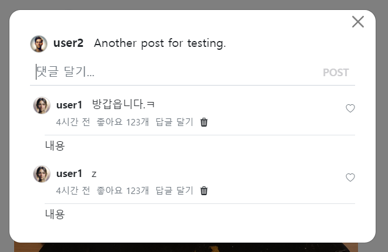
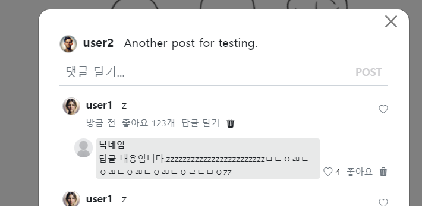

- cookie 인증 유튜브: https://www.youtube.com/watch?v=EO9XWml9Nt0
- 로그인 참고 깃허브(fastapi + htmx + pydantic): https://github.dev/sammyrulez/htmx-fastapi/blob/main/templates/owner_form.html
- ImageReq참고: https://github.dev/riseryan89/imizi-api/blob/main/app/middlewares/access_control.py
- **진짜배기 s3 세팅: https://wooogy-egg.tistory.com/77**
- **post개발 이후, s3 다운로드 참고 github: https://github.com/jrdeveloper124/file-transfer/blob/main/main.py#L30**
    - 유튜브: https://www.youtube.com/watch?v=mNwO_z6faAw
- **s3 boto3 드릴 블로그**: https://dschloe.github.io/aws/04_s3/s3_basic/
- **boto3 client말고 session으로 메서드들 정리 튜토리얼: https://thecodinginterface.com/blog/aws-s3-python-boto3/**

- bootstrap + github 인스타클론 참고:
    - 유튜브: https://www.youtube.com/watch?v=ZCvKlyAkjik
    - github: https://github.com/codingvenue/instagram-hompage-clone-bootstrap/blob/master/index.html
- django stream을 포함한 story : https://www.youtube.com/watch?v=5fG5xaIGzoI&list=WL&index=8&t=4s
- jinja2 지존 튜토리얼 블로그: https://ttl255.com/jinja2-tutorial-part-4-template-filters/


- todo:
    - form validation: https://medium.com/@soverignchriss/asynchronous-form-field-validation-with-htmx-and-django-eb721165b5e8
- comment: https://www.youtube.com/watch?v=T5Jfb_LkoV0&list=PL5E1F5cTSTtTAIw_lBp1hE8nAKfCXgUpW&index=14
- reply: https://github.dev/tcxcx/django-webapp/tree/main/a_inbox/templates/a_inbox

### reply view 
1. comment 1개인 comment_div.html 안에 만든다.
    - **ps-x 의 패딩으로 원래댓글과의 수준차이를 둔다.**
    ```html
    {# reply #}
    <div class="d-flex mt-1 mb-2 ps-3">
        {# 답글 내용 #}
        답글내용
    
        {# 답글 생성 form #}
    </div>
    
    ```
   

2. 답글 내용은 가로정렬은 between으로서 왼쪽에는 `답글 정보` vs 오른쪽에는 `좋아요/삭제`를 배치한다.
    - 이 때, `세로정렬은 end`로 두어, 세로가 짧은 좋아요/삭제는 아래에 박히도록 한다.
    - **댓글내용 시작부분에서 border-top을 준다. 이에 맞춰 w-100도 같이 넣어준다.**
    ```html
     {# 답글 내용 #}
    <div class="d-flex justify-content-between align-items-end py-1 border-top border-1 border-gray w-100">
        내용
    </div>
    ```
    

3. 답글정보 / 좋아요-삭제는 각각을 `d-flex`로 놓고, 답글좋아요는, `gap-x`을 줘서 각각이 벌려지게 하고, 수직 가운데 정렬한다.
    ```html
    {# 답글 내용 #}
    <div class="d-flex justify-content-between align-items-end py-1 border-top border-1 border-gray w-100">
        {# 답글 정보 #}
        <div class="d-flex">
    
        </div>
        {# 답글 좋아요/삭제 #}
        <div class="d-flex align-items-center gap-2">
            
        </div>
    
    </div>
    ```
   
4. 답글정보에 있는 `사진`, `닉네임|body`를 정의한다.
    - **사진은 a>img 태그에다가 img태그에는 `.object-fit-cover.rounded-circle.me-2`로 이미지자체에서 우측 닉네임|body와 간격을 미리 준다.**
        - **사진은 w/h를 직접 px로 지정해줘야한다.**
    - **닉네임|body는 새로로 연결되며, width를 auto로 만들기 위해 `.row.me-1 > .col-auto`안에다가 미리 우측 버튼들과의 간격을 두고**
        - **닉네임은 a`.d-block`>span으로 / body는 일반  div에 집어넣어놓는다. `d-block`으로 a태그는 닉네임이 한줄 다 차지하도록 만든다.**
    ```html
    {# 답글 정보 = 사진/ 닉넴|body #}
    <div class="d-flex fs-7">
        {# 사진 #}
        <a href="#">
            
        </a>
        {# 닉네임 | 내용 #}
        <div class="row me-1">
            <div class="col-auto">
                <a class="d-block text-decoration-none text-dark" href="#">
                    <span class="fw-bold"> 닉네임 </span>
                </a>
                <div > 답글 내용입니다.zzzzzzzzzzzzzzzzzzzzzzzzㅁㄴㅇㄻㄴㅇㄻㄴㅇㄻㄴㅇㄻㄴㅇㄹㄴㅁㅇzz</div>
            </div>
        </div>
    </div>
    ```
   
5. 답글 `좋아요/삭제`에서 좋아요는 `아이콘 + 좋아요갯수 / like버튼`과 `삭제`버튼으로 이루어져있다.
    - **아이콘+좋아요갯수는 `.d-flex.gap-1`으로 간격을 약간만 벌린다. 수직가운데정렬해준다.**
    - **좋아요버튼은 a태그로 만들어놓는다.**
    - **삭제는 a>i태그로 만든다.**
    ```html
    {# 답글 좋아요/삭제 #}
    <div class="d-flex align-items-center gap-2 fs-7">
        {# 좋아요 = 아이콘 + 좋아요갯수 / 좋아요버튼 #}
        <div class="d-flex align-items-center gap-1">
            <a href="#" class="text-decoration-none text-muted"
               style="cursor: pointer;"
            >
                <i class="bi bi-heart"></i>
            </a>
            <span> 4 </span>
        </div>
        <a href="#" class="text-decoration-none text-nowrap text-muted"
           style="cursor: pointer;"
        >
            좋아요
        </a>
    
        {# 삭제 #}
        <a href="#" class="text-decoration-none text-muted"
           style="cursor: pointer;"
        >
            <i class="bi bi-trash3-fill"></i>
        </a>
    </div>
    ```
   
6. 답글 디자인 수정
    - **`.col-auto`안에 닉넴 + 내용을 페이스북처럼 묶여있으니, `회색 배경 테두리`를 만들어준다. 기본패딩을 px-1로 덮어쓰고, 이미지에 me-1->me-3으로 더 벌려준다.**
    - **이때 5.1버전부터 출시된 `bg-색` 이후 `bg-opacity-10,25,50,75`를 활용하자.**
    ```html
    {# 닉네임 | 내용 #}
    <div class="row me-1">
        <div class="col-auto bg-dark bg-opacity-10 rounded-2 px-1">
            <a class="d-block text-decoration-none text-dark" href="#">
                <span class="fw-bold"> 닉네임 </span>
            </a>
            <div > 답글 내용입니다.zzzzzzzzzzzzzzzzzzzzzzzzㅁㄴㅇㄻㄴㅇㄻㄴㅇㄻㄴㅇㄻㄴㅇㄹㄴㅁㅇzz</div>
        </div>
    </div>
    ```
    - 답글내용 최상단태그의 부분의 border-top을 제거한다.
    ```html
    {# 답글 내용 #}
    <div class="d-flex justify-content-between align-items-end py-1 w-100">
    ```
    
    - **이 디자인으로 유지된다면, 답글달기는 작성자만 가능하도록 하면 될 듯 하다.**
### AWS 명령어 모음
```shell
%UserProfile%\.aws\credentials
%UserProfile%\.aws\config

aws configure list-profiles

# 등록
aws configure --profile {프로젝트명} # ap-northeast-2 # json
# 재사용시
set AWS_PROFILE={프로젝트명}

cat ~\.aws\credentials


# S3
aws s3 ls --profile {프로필명}
aws s3 mb s3://{버킷명}
aws s3 ls --profile {프로필명}


aws s3 cp {파일경로} s3://{버킷명}
aws s3 cp {파일경로} s3://{버킷명}/{폴더명} --acl public-read
```

#### IAM key 변경
1. root사용자 로그인 > IAM > 해당사용자 클릭 > `보안 자격 증명` 탭 > 액세스키
2. 기존 key `비활성화` 후 필요시 삭제 (있다가 cli에서 확인하고 비활성화하면 더 좋을 듯)
3. 새 액세스키 AWS CLI 선택하여 발급
4. 터미널 열어서 `AWS CLI`를 통해 해당프로젝트의 profile key들 덮어쓰기
    ```shell
    aws configure list-profiles # 현재 프로필들 확인
    cat ~\.aws\credentials # 현재 프로필들의 key설정값들 확인 (콘솔에서 비활성화시킨 것과 일치하는지)
    aws configure --picstargram # 특정프로필 key 덮어쓰기 with 콘솔
    ```
   
5. 프로젝트 .env의 `aws_access_key_id`와 `aws_secret_access_key`를 변경

   
