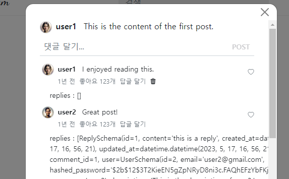
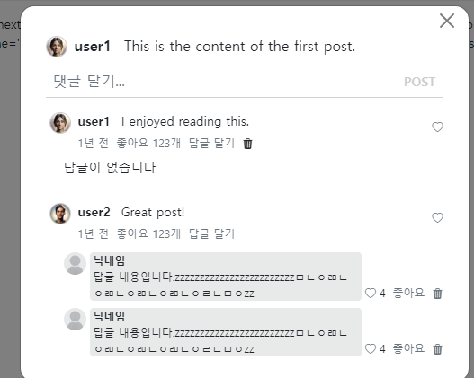
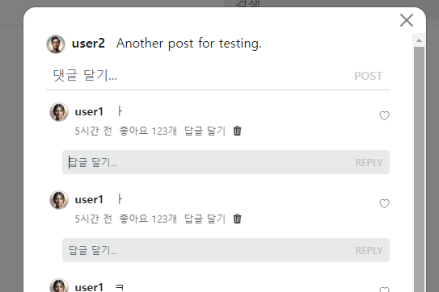

- cookie 인증 유튜브: https://www.youtube.com/watch?v=EO9XWml9Nt0
- 로그인 참고 깃허브(fastapi + htmx + pydantic): https://github.dev/sammyrulez/htmx-fastapi/blob/main/templates/owner_form.html
- ImageReq참고: https://github.dev/riseryan89/imizi-api/blob/main/app/middlewares/access_control.py
- **진짜배기 s3 세팅: https://wooogy-egg.tistory.com/77**
- **post개발 이후, s3 다운로드 참고 github: https://github.com/jrdeveloper124/file-transfer/blob/main/main.py#L30**
    - 유튜브: https://www.youtube.com/watch?v=mNwO_z6faAw
- **s3 boto3 드릴 블로그**: https://dschloe.github.io/aws/04_s3/s3_basic/
- **boto3 client말고 session으로 메서드들 정리 튜토리얼: https://thecodinginterface.com/blog/aws-s3-python-boto3/**

- bootstrap + github 인스타클론 참고:
    - 유튜브: https://www.youtube.com/watch?v=ZCvKlyAkjik
    - github: https://github.com/codingvenue/instagram-hompage-clone-bootstrap/blob/master/index.html
- django stream을 포함한 story : https://www.youtube.com/watch?v=5fG5xaIGzoI&list=WL&index=8&t=4s
- jinja2 지존 튜토리얼 블로그: https://ttl255.com/jinja2-tutorial-part-4-template-filters/


- todo:
    - form validation: https://medium.com/@soverignchriss/asynchronous-form-field-validation-with-htmx-and-django-eb721165b5e8
- comment: https://www.youtube.com/watch?v=T5Jfb_LkoV0&list=PL5E1F5cTSTtTAIw_lBp1hE8nAKfCXgUpW&index=14
- reply: https://github.dev/tcxcx/django-webapp/tree/main/a_inbox/templates/a_inbox

### replies 순회하며 html 조각 쪼갠 뒤 -> 개별 reply에 변수 넣기
1. **일단 `comment.replies`를 순회하며 reply영역이 들어가도록 만든다.**
    - **이 때, set을 이용해서 html파일명과 동일하도록 `replies`변수에 담아서 순회해보자.**
    ```html
    <!-- comment_div.html -->
    
    {# reply #}
    <div class="d-flex mt-1 mb-2 ps-3">
        
        replies : {{ replies }}
        
            {# 답글 내용 #}
    ```
    
2. comment_div.html에서 `replies`를 써서 순회하는 곳부터 `replies.html`로 추출후 include한다.
    - 일단, replies.html로 빼서, comment_div.html에서 include한다.
    ```html
    <div class="d-flex mt-1 mb-2 ps-3">
        
        
    </div>
    ```
   
3. replies -> reply로 순회하는 부분은 reply.html로 뺀다.
    - **이렇게 여러번 빼는 이유는 `replies.html`에서 count가 없으면 다르게 표기하기 위함?!**
    ```html
    
        
    
    ```
   
4. **이제 순회할 list의 count에 따라 다르게 표기하게 한다.**
    - comments를 따라했지만, 답글에서는 굳이 표시할 필요가 없다.
    ```html
    
        
            
        
    
        <p>답글이 없습니다</p>
    
    ```
    
    ```html
    {##}
    
        
    
    {##}
    {#    <p>답글이 없습니다</p>#}
    {##}    
    ```
   

5. 이제 reply.html의 예제데이터에 변수로 대체한다.
    ```html
    {# 사진 #}
    
    <a href="#">
        
    </a>
    ```
    ```html
    {# 닉네임 | 내용 #}
    <div class="row me-1">
        <div class="col-auto bg-dark bg-opacity-10 rounded-2 px-2 py-1">
            <a class="text-decoration-none text-dark" href="#">
                <span class="fw-bold"> {{ reply.user.username }} </span>
            </a>
            <div>
                {{ reply.content }}
            </div>
        </div>
    </div>
    ``` 
    ```html
    {# 삭제 #}
    
        <a href="#" class="text-decoration-none text-muted"
           style="cursor: pointer;"
        >
            <i class="bi bi-trash3-fill"></i>
        </a>
    
    ```
   

### create_reply_form in replies

#### bootstrap 고유 z-index 확인 후, position-sticky에 mdoal zindex +1 주고 + 배경도 주기
1. comment내부의 reply create_form 이 stick를 넘쳐흐르더라
    - bootstrap z-index 페이지에 가니 아래와 같이 변경할 수 없는 고유 z-index가 주어졌다.
    - **stick된 것의 z-index는 1020이다. `position-sticky`를 커스텀으로 줄 예정이니 `modal보다 +1 큰 1061`**
    ```scss
    $zindex-dropdown:                   1000;
    $zindex-sticky:                     1020;
    $zindex-fixed:                      1030;
    $zindex-modal-backdrop:             1040;
    $zindex-offcanvas:                  1050;
    $zindex-modal:                      1060;
    $zindex-popover:                    1070;
    $zindex-tooltip:                    1080;
    ```

2. **이 작업은, .modal-body > .container 에서 `글내용 + 댓글작성폼`을 감싸는 `.position-stick`에 bg-wthie + z-index:1061을 추가하는 작업이다.**
    ```html
        <!-- body -->
        <div class="modal-body pt-0">
            <div class="container">
                <!-- sticky는 현재zindex + 1 을 주고, 배경까지 -->
                <div class="position-sticky top-0 bg-white" style="z-index: 1061;">
                    {# 글 내용 #}
                    <div class="comment d-flex">
                        <!-- ... -->
                    {# 댓글 작성 폼 #}
                    
                </div>
                    
                <!-- ... -->
                {# 전체 댓글 #}
                <div class="comments ps-1"
                     hx-trigger="commentsChanged from:body"
                     hx-get="{{ url_for('pic_hx_show_comments', post_id=post.id) }}"
                     hx-target="this"
                >
                    
                </div>
            </div>
        </div>
    ```


#### 답글 생성form 만들기 in replies 아래 부분
1. 댓글 생성 form을 복사해서 일단 `replies.html`에서 가장 하단에 작성한다.
2. 댓글생성의 .add-comment 대신 `.add-reply`를 붙이고, 
    - input이 가진 .form-control에 대해 border가 아래만 있었는데, 이번엔 border를 모두 제거하도록 한다.(배경색 채울 예정)
    ```css
    .add-reply {
        padding-top: 0.25em;
    }
    
    .add-reply .form-control {
        border: none;
        padding: 0.375rem 0;
    }
    ```
3. 아직 form 속 route가 없으니, post_id만 임시로 1로 걸어둔다.
4. input은 배경이 차도록 `fs-7 bg-dark bg-opacity-10 rounded-2` class를 추가한다.
    - replies.html
    ```html
    
        
    
    {# 답글 생성 form #}
    
        <div x-data="{ content: '' }" class="position-relative add-reply pb-2">
            <form hx-post="{{ url_for('pic_new_comment', post_id=1) }}"
                  _="on htmx:afterRequest reset() me"
                  hx-trigger="submit, keyup[enterkey]"
                  hx-swap="none"
                  autocomplete="off"
            >
                <input type="text"
                       class="form-control w-100 px-2 d-inline fs-7 bg-dark bg-opacity-10 rounded-2"
                       style="box-shadow: none;"
                       placeholder="답글 달기..."
                       name="content"
                       x-model="content"
                       x-on:input.debounce.300ms="content = $event.target.value"
                       autofocus
    
                >
                <button
                        class="btn btn-sm d-inline position-absolute end-0 top-0 bottom-0
                           btn-dark btn-post text-uppercase fs-7"
                        :disabled="!content"
                        type="submit"
                >
                    reply
                </button>
            </form>
        </div>
    
    ```
    


5. 구조가 완성됬으면 `reply_create_form.html`로 추출하고, replies가 include되는 곳인 comment_div.html에 같이 include되게 한다
    ```html
    <div class="mt-1 mb-2 ps-3">
        
        {# 답글들 #}
        
        {# 답글 생성 form #}
        
            
        
    </div>
    ```


### AWS 명령어 모음
```shell
%UserProfile%\.aws\credentials
%UserProfile%\.aws\config

aws configure list-profiles

# 등록
aws configure --profile {프로젝트명} # ap-northeast-2 # json
# 재사용시
set AWS_PROFILE={프로젝트명}

cat ~\.aws\credentials


# S3
aws s3 ls --profile {프로필명}
aws s3 mb s3://{버킷명}
aws s3 ls --profile {프로필명}


aws s3 cp {파일경로} s3://{버킷명}
aws s3 cp {파일경로} s3://{버킷명}/{폴더명} --acl public-read
```

#### IAM key 변경
1. root사용자 로그인 > IAM > 해당사용자 클릭 > `보안 자격 증명` 탭 > 액세스키
2. 기존 key `비활성화` 후 필요시 삭제 (있다가 cli에서 확인하고 비활성화하면 더 좋을 듯)
3. 새 액세스키 AWS CLI 선택하여 발급
4. 터미널 열어서 `AWS CLI`를 통해 해당프로젝트의 profile key들 덮어쓰기
    ```shell
    aws configure list-profiles # 현재 프로필들 확인
    cat ~\.aws\credentials # 현재 프로필들의 key설정값들 확인 (콘솔에서 비활성화시킨 것과 일치하는지)
    aws configure --picstargram # 특정프로필 key 덮어쓰기 with 콘솔
    ```
   
5. 프로젝트 .env의 `aws_access_key_id`와 `aws_secret_access_key`를 변경

   
