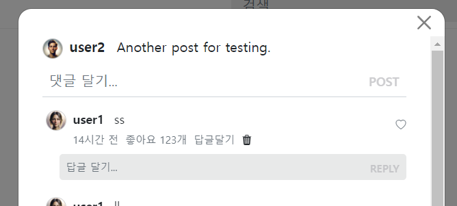
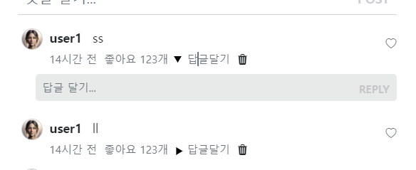

- cookie 인증 유튜브: https://www.youtube.com/watch?v=EO9XWml9Nt0
- 로그인 참고 깃허브(fastapi + htmx + pydantic): https://github.dev/sammyrulez/htmx-fastapi/blob/main/templates/owner_form.html
- ImageReq참고: https://github.dev/riseryan89/imizi-api/blob/main/app/middlewares/access_control.py
- **진짜배기 s3 세팅: https://wooogy-egg.tistory.com/77**
- **post개발 이후, s3 다운로드 참고 github: https://github.com/jrdeveloper124/file-transfer/blob/main/main.py#L30**
    - 유튜브: https://www.youtube.com/watch?v=mNwO_z6faAw
- **s3 boto3 드릴 블로그**: https://dschloe.github.io/aws/04_s3/s3_basic/
- **boto3 client말고 session으로 메서드들 정리 튜토리얼: https://thecodinginterface.com/blog/aws-s3-python-boto3/**

- bootstrap + github 인스타클론 참고:
    - 유튜브: https://www.youtube.com/watch?v=ZCvKlyAkjik
    - github: https://github.com/codingvenue/instagram-hompage-clone-bootstrap/blob/master/index.html
- django stream을 포함한 story : https://www.youtube.com/watch?v=5fG5xaIGzoI&list=WL&index=8&t=4s
- jinja2 지존 튜토리얼 블로그: https://ttl255.com/jinja2-tutorial-part-4-template-filters/


- todo:
    - form validation: https://medium.com/@soverignchriss/asynchronous-form-field-validation-with-htmx-and-django-eb721165b5e8
- comment: https://www.youtube.com/watch?v=T5Jfb_LkoV0&list=PL5E1F5cTSTtTAIw_lBp1hE8nAKfCXgUpW&index=14
- reply: https://github.dev/tcxcx/django-webapp/tree/main/a_inbox/templates/a_inbox

### alpine js를 이용하여 isOpen 활용하여 열고 닫기

1. **`클릭으로 open변수를 toggle할 태그`(a태그)와 `open변수에 의해 x-show로 나타날 태그`(reply_create_form)의 `공통부모`에 x-data `open변수 = false로` 선언한다**
    ```html
    
    <div x-data="{ replyAddOpen: false }">
        <div class="comment d-flex">
            <!-- replyAddOpen을 토글할 a태그 -->
            <a class="text-decoration-none text-muted">
                답글 달기
            </a>
            <!-- ... -->
            
        {# reply #}
        <div class="mt-1 mb-2 ps-3">
            
            {# 답글들 #}
            
            {# 답글 생성 form #}
            
            <!-- replyAddOpen  x-show를 적용받을 태그-->
                
            
        </div>
    
    </div>
    ```
   
2. **토글할 a태그에는 `href`대신 `@click`에 open변수를 반대boolena으로 `= !`토글한다.**
    ```html
    <a @click="replyAddOpen = !replyAddOpen"
       class="text-decoration-none text-muted">
        답글 달기
    </a>
    ``` 
   
3. **`x-show`를 적용받을 태그에는 `x-show="open변수"를 넣어준 div`로 감싸준다.**
    ```html
    {# 답글 생성 form #}
    
        <div x-show="replyAddOpen">
            
        </div>
    
    ```
   


4. **x-show를 사용할 때, 같이사용하는 속성 2개가 있다.**
    1. **`x-cloak`: 알파인이 다 로드되기 전에, false상태인데 나타났다가 사라지는 것을 방지 -> `css로 미리 정의해줘야함`**
        - x-cloak은 특정 요소에 적용되어 `해당 요소와 하위 요소들이 알파인 디렉티브가 실행되기 전까지 화면에 표시되지 않도록` 합니다.
        - 이것은 일반적으로 애플리케이션이 `초기에 로드될 때 플래시`(요소가 변경되기 전에 잠깐 나타나는 현상)를 `방지`하기 위해 사용됩니다. 특히 x-show와 같은 디렉티브를 사용하여 상태에 따라 요소를 조건부로 표시할 때 유용합니다.
        ```css
        [x-cloak] {
            display: none !important;
        }
        ```
        ```html
        <div x-show="replyAddOpen"
             x-cloak
        >
            
        </div>
        ```
    2. **`x-transition`: 자동으로 x-show되는 요소들에 애니메이션을 걸어준다. `닫힐때는 없이 들어가는 듯`**
        - **시간을 조정하고 싶으면, `x-transition:enter.duration.300ms x-transition:leave.duration.150ms` 형태로 조정할 수 있다.**
        ```html
        <div x-show="replyAddOpen"
             x-cloak
             x-transition:enter.duration.300ms
             x-transition:leave.duration.150ms
        >
            
        </div>
        ```
    

5. **include된 html속이지만, 연결되면 alpinejs가 작동하므로, `@click`으로 submit버튼에 false를 넣어줘서, 한번 작성하면 안보이게 하자**
    - **필요시 해주는데, 여러개 작성할 수도 있고, 직접끄면 되니 놔둔다.**
    ```html
    <button
            class="btn btn-sm d-inline position-absolute end-0 top-0 bottom-0
               btn-dark btn-post text-uppercase fs-7"
            :disabled="!content"
            type="submit"
            @click="replyAddOpen = false"
    >
        reply
    </button>
    ```

### isOpen 토글 태그안에 open시 svg로테이션 시키는 css를 x-bind:class로 적용하기
1. 토글태그(a)의 text안에 **`.d-inline-block`으로 한줄이지만 & w/h를 가지도록 `div`를 만들어놓고, 회전대비 정사각icon을 수직가운데정렬할 `.my-auto`를 추가한다**
    - **`replyOpen이 true`일 때, `roation css` + `duration css` 실시간 적용되도록 해야한다.**
    - **기본속성 class=""에 alpine을 적용하기 위해, `x-bind:class=""`를 사용한다**
        - **`or '값'`은 앞이 False라도 기본값을 주는 것이고**
        - **`and '값'`은 `앞이 True일때만 적용되는 값`을 주는 것이다.**
    - svg 내부의 transform은 하늘보는 세모icon을 미리 90도 돌려놓는 것이다.
    ```html
    {# 답글창 열기 #}
    <a class="text-decoration-none text-muted"
       @click="replyAddOpen = !replyAddOpen"
    >
        {# 회전되는 icon #}
        <div class="d-inline-block my-auto"
             x-bind:class="replyAddOpen && 'rotate-90 duration-300'"
        >
            <svg transform="rotate(90)"
                 width="9"
                 height="9"
                 viewBox="0 0 25 25"
            >
                <path d="M24 22h-24l12-20z"/>
            </svg>
        </div>
        
        답글달기
    </a>
    ```
   
2. tailwind에는 있는 `rotation-90`, `duration-300`(ms)를 style.css에 정의해둔다
    ```css
    /* tailwind css */
    .rotate-90{
        transform: rotate(90deg);
    }
    
    .rotate-180{
        transform: rotate(180deg);
    }
    
    .duration-300{
        transition: all 0.3s ease; /* 지속 시간을 0.3초로 정의 */
    }
    ```
    

3. 이제 커스텀으로서, **`open상태`: 돌아가는 부분에는 X버튼(글자는 돌아가면 안됨) + 180도 rotation**을 돌리고, 
    - **`닫힌상태`: 답글달기 text만 나오도록 바꾼다.**
    - **이 때, 아이콘뿐만 아니라 text도 바뀌어야하므로 `<template x-if >`를 이용해서 `open여부에 따른 text를 다르게 나타나게`한다.**
    ```html
    {# 답글창 열기 #}
    <a class="text-decoration-none text-muted"
       @click="replyAddOpen = !replyAddOpen"
    >
        {# 회전되는 icon #}
         <div class="d-inline-block my-auto"
             x-bind:class="replyAddOpen && 'rotate-180 duration-300'"
        >
            <!-- replyAddOpen이 true일 때 -->
            <template x-if="replyAddOpen">
                <span>❌</span>
            </template>
        </div>
        <!-- replyAddOpen이 false일 때 -->
        <template x-if="!replyAddOpen">
            <span class="text-dark">답글 달기</span>
        </template>
    </a>
    ```
    

### [상위] @click 토글 태그시, [하위] 조작하고 싶은 태그에 x-ref를 적용해서, 상위에서 태그컨트롤 + x-show이후는 $nextTick(())=>)과 함께 사용
1. 조절하고 싶은 하위 태그에 `x-ref="참조명"`을 기입한다.
    - **하위의 reply_create_form에 input태그에 focus를 메기고 싶어서, x-ref에 넣고 싶은데, `include내부에서 x-data초기화된 격리된 상황`이다.**
    - **그렇다면, `조작하고 싶은 태그가 있는 include`의 `부모태그`에 x-ref를 주고, 접근해나간다.**
    ```html
    {# 답글 생성 form #}
    
        <div x-show="replyAddOpen"
             x-cloak
             x-transition:enter.duration.300ms
             x-transition:leave.duration.150ms
             x-ref="replyAddFormWrapper"
        >
            
        </div>
    
    ```
   
2. 이제 상위 토글태그의 @click에서 토글외 **`토글 이후 x-show에 나타나는 타이밍`을 노리기 위해 `$nextTick(()=> )`에서 코드를 작성한다.**
    - **x-ref가 x-show에 포함된 한타이밍 뒤에 나타나는 것의 조작이라면 `$nextTick(()=>))`에서 `$ref.참조명`으로 접근한다.**
    - **해당 x-ref에서 더이상 하위로 접근불가능하므로 `js의 querySelector()`로 찾아가서 `.focus()`한다.**
    ```html
    {# 답글창 열기 #}
    <a class="text-decoration-none text-muted"
       @click="replyAddOpen = !replyAddOpen; $nextTick(() => $refs.replyAddFormWrapper.querySelector('input').focus());"
    >
    ```
    

### AWS 명령어 모음
```shell
%UserProfile%\.aws\credentials
%UserProfile%\.aws\config

aws configure list-profiles

# 등록
aws configure --profile {프로젝트명} # ap-northeast-2 # json
# 재사용시
set AWS_PROFILE={프로젝트명}

cat ~\.aws\credentials


# S3
aws s3 ls --profile {프로필명}
aws s3 mb s3://{버킷명}
aws s3 ls --profile {프로필명}


aws s3 cp {파일경로} s3://{버킷명}
aws s3 cp {파일경로} s3://{버킷명}/{폴더명} --acl public-read
```

#### IAM key 변경
1. root사용자 로그인 > IAM > 해당사용자 클릭 > `보안 자격 증명` 탭 > 액세스키
2. 기존 key `비활성화` 후 필요시 삭제 (있다가 cli에서 확인하고 비활성화하면 더 좋을 듯)
3. 새 액세스키 AWS CLI 선택하여 발급
4. 터미널 열어서 `AWS CLI`를 통해 해당프로젝트의 profile key들 덮어쓰기
    ```shell
    aws configure list-profiles # 현재 프로필들 확인
    cat ~\.aws\credentials # 현재 프로필들의 key설정값들 확인 (콘솔에서 비활성화시킨 것과 일치하는지)
    aws configure --picstargram # 특정프로필 key 덮어쓰기 with 콘솔
    ```
   
5. 프로젝트 .env의 `aws_access_key_id`와 `aws_secret_access_key`를 변경

   
