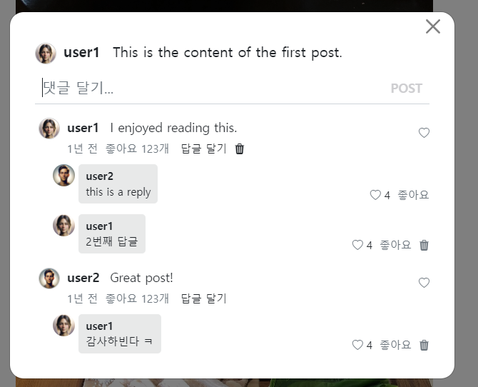

- cookie 인증 유튜브: https://www.youtube.com/watch?v=EO9XWml9Nt0
- 로그인 참고 깃허브(fastapi + htmx + pydantic): https://github.dev/sammyrulez/htmx-fastapi/blob/main/templates/owner_form.html
- ImageReq참고: https://github.dev/riseryan89/imizi-api/blob/main/app/middlewares/access_control.py
- **진짜배기 s3 세팅: https://wooogy-egg.tistory.com/77**
- **post개발 이후, s3 다운로드 참고 github: https://github.com/jrdeveloper124/file-transfer/blob/main/main.py#L30**
    - 유튜브: https://www.youtube.com/watch?v=mNwO_z6faAw
- **s3 boto3 드릴 블로그**: https://dschloe.github.io/aws/04_s3/s3_basic/
- **boto3 client말고 session으로 메서드들 정리 튜토리얼: https://thecodinginterface.com/blog/aws-s3-python-boto3/**

- bootstrap + github 인스타클론 참고:
    - 유튜브: https://www.youtube.com/watch?v=ZCvKlyAkjik
    - github: https://github.com/codingvenue/instagram-hompage-clone-bootstrap/blob/master/index.html
- django stream을 포함한 story : https://www.youtube.com/watch?v=5fG5xaIGzoI&list=WL&index=8&t=4s
- jinja2 지존 튜토리얼 블로그: https://ttl255.com/jinja2-tutorial-part-4-template-filters/


- todo:
    - form
      validation: https://medium.com/@soverignchriss/asynchronous-form-field-validation-with-htmx-and-django-eb721165b5e8
- comment: https://www.youtube.com/watch?v=T5Jfb_LkoV0&list=PL5E1F5cTSTtTAIw_lBp1hE8nAKfCXgUpW&index=14
- reply: https://github.dev/tcxcx/django-webapp/tree/main/a_inbox/templates/a_inbox

### reply create form용 route 생성

1. comment 생성시 post_id를 던진것 처럼, `reply 생성시에도 상위도메인 comment_id`를 던져야한다.
    - `생성시 one의 fk`에 사용 + `hx-trigger로서 상위도메인으로 보내 전체count` 등 처리 ex> f'repliesCountChanged-{comment_id}': True,
    ```html
    <div x-data="{ content: '' }" class="position-relative add-reply pb-2">
        <form hx-post="{{ url_for('pic_new_reply', comment_id=comment.id) }}"
              _="on htmx:afterRequest reset() me"
              hx-trigger="submit, keyup[enterkey]"
              hx-swap="none"
              autocomplete="off"
        >
    ```

2. pic_new_comment route를 복사해서 pic_new_reply로 만들어준다.
    - **`빈 템플릿을 응답하되, noContent가 아님 trigger = modal안닫힘` + `전체replies 변화를 위한 hx-trigger 추가`로 보내준다.**
    ```python
    @app.post("/picstargram/comments/{comment_id}/replies/new", response_class=HTMLResponse)
    @login_required
    async def pic_new_reply(
            request: Request,
            comment_id: int,
            reply_create_req=Depends(ReplyCreateReq.as_form),
    ):
        try:
            # 1) form데이터는 crud하기 전에 dict로 만들어야한다.
            data = reply_create_req.model_dump()
    
            data['comment_id'] = comment_id
            data['user_id'] = request.state.user.id
    
            reply = create_reply(data)
    
    
        except Exception as e:
            raise BadRequestException(f'Reply 생성에 실패함.: {str(e)}')
    
        return render(request, "",
                      hx_trigger={
                          'noContent': False, 'repliesChanged': True, f'repliesCountChanged-{comment_id}': True,
                      },
                      messages=[Message.CREATE.write("답글", level=MessageLevel.INFO)],
                      )
    ```
    - 적용은 잘되나, repliesChanged나 repliesCountChanged가 적용안되서, 모달을 새롭게 껐다켜야 적용된다.
      

### Form CUD 후 Read(replies렌더링 부모태그)에 hx-trigger 추가하기

- comment_modal_content.html에서 `전체댓글 렌더링`에 부모태그 hx-trigger 준것을 참고해서 작성한다.

1. reply_create_form.html 내부에 상위도메인인 comment가 comment.id로 쓰이므로, html명을 `reply_create_form_with_comment.html`로 변경한다.
    ```html
    {# reply #}
    <div class="mt-1 mb-2 ps-3">
        {# 전체 답글 #}
        
        
    
        {# 답글 생성 form #}
        
            <div x-show="replyAddOpen"
                 x-cloak
                 x-transition:enter.duration.300ms
                 x-transition:leave.duration.150ms
            >
                
            </div>
        
    </div>
    ```

2. comment_div.html의 전체 답글 렌더링 `include`부분에서 부모태그를 바꾸면 form까지 포함되어버리니, **빈 div를 씌우고 hx-trigger를 만든다.**
    - 스왑되서 업데이트되니, `hx-target="this"`로 outerHTML 기본 hx-swap옵션으로서, 그대로 넣으면 된다.
    ```html
    {# 전체 답글 #}
    
    <div hx-trigger="repliesChanged from:body"
         hx-get="{{ url_for('pic_hx_show_replies', comment_id=comment.id) }}"
         hx-target="this"
    >
        
    </div>
    ```

3. comment route를 참고해서 작성한다
    ```python
    @app.get("/picstargram/comments/{comment_id}/replies", response_class=HTMLResponse)
    async def pic_hx_show_replies(
            request: Request,
            comment_id: int,
            hx_request: Optional[str] = Header(None),
    ):
        replies = get_replies(comment_id, with_user=True)
    
        context = {
            'request': request,
            'replies': replies,
        }
    
        return render(request,
                      "picstargram/post/partials/replies.html",
                      context=context,
                      )
    ```

4. CUD에 의해 전체답글이 잘 렌더링되나, **모든 comment에 대해 대기하던 전체답글들이 모두 새로고침되어버린다.**
    - **현재 작성한 comment에 대한 trigger로 변경해야한다. post만 상위도메인이 없으므로 postChanged 그외 `딸린 comment나 replies는 Changed-상위도메인id`로
      처리하자**

#### 딸린 하위도메인의 CUD후 trigger 새로고침은, trigger에 상위도메인id를 붙혀 특정상위도메인에 딸린 애들만 refresh

1. hx-trigger를 상위도메인id를 붙혀서 만들어놓는다.
    ```html
    {# 전체 답글 #}
    
    <div hx-trigger="repliesChanged-{{ comment.id }} from:body"
         hx-get="{{ url_for('pic_hx_show_replies', comment_id=comment.id) }}"
         hx-target="this"
    >
        
    </div>
    ```

2. CUD route의 hx-trigger에 상위도메인의 id를 f-string으로 붙혀서 내려보낸다.
```python
@app.post("/picstargram/comments/{comment_id}/replies/new", response_class=HTMLResponse)
@login_required
async def pic_new_reply(
        request: Request,
        comment_id: int,
        reply_create_req=Depends(ReplyCreateReq.as_form),
):
    #...
    return render(request, "",
                  hx_trigger={
                      'noContent': False, f'repliesChanged-{comment_id}': True, f'repliesCountChanged-{comment_id}': True,
                  },
                  messages=[Message.CREATE.write("답글", level=MessageLevel.INFO)],
                  )

```
### delete 처리하기
1. a태그라면 href를 제거하고, cursor: pointer까지 합하여 `hx-post(not delete)` + hx-confirm + `hx-swap="none"` 을 속성을 준다.
    ```html
    {# 삭제 #}
    
    <a class="text-decoration-none text-muted"
       hx-post="{{ url_for('pic_hx_delete_reply', reply_id= reply.id ) }}"
       hx-confirm="정말 삭제하시겠습니까?"
       hx-swap="none"
       style="cursor: pointer;"
    >
        <i class="bi bi-trash3-fill"></i>
    </a>
    
    ```
   
2. route는 `modal 속` + `cud`라서, `noContent:false`주고 + `trigger`들을 내려준다.
    ```python
    @app.post("/replies/{reply_id}", response_class=HTMLResponse)
    @login_required
    async def pic_hx_delete_reply(
            request: Request,
            reply_id: int,
    ):
        # post가 필요없을 줄 알았는데, 어느 특정post의 댓글갯수를 update해야할지 trigger 시켜줘야한다
        reply = get_reply(reply_id)
        comment_id = reply.comment_id
    
        try:
            delete_reply(reply_id)
        except Exception as e:
            raise BadRequestException(f'Reply (id={reply_id})삭제에 실패했습니다.')
    
        return render(request,
                      "",
                      hx_trigger={
                          'noContent': False, f'repliesChanged-{comment_id}': True, f'repliesCountChanged-{comment_id}': True,
                      },
                      messages=[Message.DELETE.write("답글", level=MessageLevel.INFO)],
                      )
    ```
### AWS 명령어 모음

```shell
%UserProfile%\.aws\credentials
%UserProfile%\.aws\config

aws configure list-profiles

# 등록
aws configure --profile {프로젝트명} # ap-northeast-2 # json
# 재사용시
set AWS_PROFILE={프로젝트명}

cat ~\.aws\credentials


# S3
aws s3 ls --profile {프로필명}
aws s3 mb s3://{버킷명}
aws s3 ls --profile {프로필명}


aws s3 cp {파일경로} s3://{버킷명}
aws s3 cp {파일경로} s3://{버킷명}/{폴더명} --acl public-read
```

#### IAM key 변경

1. root사용자 로그인 > IAM > 해당사용자 클릭 > `보안 자격 증명` 탭 > 액세스키
2. 기존 key `비활성화` 후 필요시 삭제 (있다가 cli에서 확인하고 비활성화하면 더 좋을 듯)
3. 새 액세스키 AWS CLI 선택하여 발급
4. 터미널 열어서 `AWS CLI`를 통해 해당프로젝트의 profile key들 덮어쓰기
    ```shell
    aws configure list-profiles # 현재 프로필들 확인
    cat ~\.aws\credentials # 현재 프로필들의 key설정값들 확인 (콘솔에서 비활성화시킨 것과 일치하는지)
    aws configure --picstargram # 특정프로필 key 덮어쓰기 with 콘솔
    ```

5. 프로젝트 .env의 `aws_access_key_id`와 `aws_secret_access_key`를 변경

   
