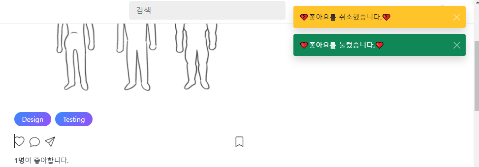

- cookie 인증 유튜브: https://www.youtube.com/watch?v=EO9XWml9Nt0
- 로그인 참고 깃허브(fastapi + htmx + pydantic): https://github.dev/sammyrulez/htmx-fastapi/blob/main/templates/owner_form.html
- ImageReq참고: https://github.dev/riseryan89/imizi-api/blob/main/app/middlewares/access_control.py
- **진짜배기 s3 세팅: https://wooogy-egg.tistory.com/77**
- **post개발 이후, s3 다운로드 참고 github: https://github.com/jrdeveloper124/file-transfer/blob/main/main.py#L30**
    - 유튜브: https://www.youtube.com/watch?v=mNwO_z6faAw
- **s3 boto3 드릴 블로그**: https://dschloe.github.io/aws/04_s3/s3_basic/
- **boto3 client말고 session으로 메서드들 정리 튜토리얼: https://thecodinginterface.com/blog/aws-s3-python-boto3/**

- bootstrap + github 인스타클론 참고:
    - 유튜브: https://www.youtube.com/watch?v=ZCvKlyAkjik
    - github: https://github.com/codingvenue/instagram-hompage-clone-bootstrap/blob/master/index.html
- django stream을 포함한 story : https://www.youtube.com/watch?v=5fG5xaIGzoI&list=WL&index=8&t=4s
- jinja2 지존 튜토리얼 블로그: https://ttl255.com/jinja2-tutorial-part-4-template-filters/
    - recursive: https://stackoverflow.com/questions/23657796/sum-a-value-inside-a-loop-in-jinja
    - 누적합: https://stackoverflow.com/questions/7537439/how-to-increment-a-variable-on-a-for-loop-in-jinja-template
    - list변경 post.likes -> like.user_id list로 : https://stackoverflow.com/questions/31895602/ansible-filter-a-list-by-its-attributes
- todo:
    - form
      validation: https://medium.com/@soverignchriss/asynchronous-form-field-validation-with-htmx-and-django-eb721165b5e8
- comment: https://www.youtube.com/watch?v=T5Jfb_LkoV0&list=PL5E1F5cTSTtTAIw_lBp1hE8nAKfCXgUpW&index=14
- reply: https://github.dev/tcxcx/django-webapp/tree/main/a_inbox/templates/a_inbox

- htmx
  - 검증: https://github.com/bigskysoftware/htmx/issues/75

1. LikeSchema를 LikedPost/LikedComment/LikedReplySchema로 변경한다.
    - 도메인마다 각 LikeSchema를 만들어준다. **나는 `도메인fk인 post_id`를 주석처리하고 `상속`을 이용해서 일단 정의했다.**
    ```python
    class LikeSchema(BaseModel):
        id: Optional[int] = None
        user_id: int
        # post_id: int
        created_at: Optional[datetime.datetime] = None
    
        user: Optional[UserSchema] = None  # like.user(좋아요 누른사람)
    
    
    class LikedPostSchema(LikeSchema):
        post_id: int
    
    
    class LikedCommentSchema(LikeSchema):
        comment_id: int
        pass
    
    
    class LikedReplySchema(LikeSchema):
        reply_id: int
        pass
    ```
   
2. 이미 만들어놓은 PostSchmea의 관계를 변경된 이름으로 정의한다.
    ```python
    class PostSchema(BaseModel):
        #...
        likes: Optional[List['LikedPostSchema']] = []
    ```
   
3. 그외 LikeSchema로 쓰인 것을 모두 변경해야한다.
    - json: liked`P`osts
    ```json
    "likedPosts": [
        {
          "id": 1,
          "user_id": 2,
          "post_id": 1,
          "created_at": "2023-01-01 12:00:00"
        },
        {
          "id": 2,
          "user_id": 1,
          "post_id": 1,
          "created_at": "2023-02-01 14:30:00"
        },
        {
          "id": 3,
          "user_id": 1,
          "post_id": 2,
          "created_at": "2023-03-01 08:45:00"
        },
        {
          "id": 4,
          "user_id": 2,
          "post_id": 2,
          "created_at": "2023-04-01 16:20:00"
        }
      ],
    ```
    - json을 load하는 init함수 in lifespan
    ```python
    async def init_picstargram_json_to_list_per_pydantic_model():
    
            liked_posts = [LikedPostSchema(**like) for like in picstargram.get("likedPosts", [])]
            liked_comments = [LikedCommentSchema(**like) for like in picstargram.get("likedComments", [])]
            liked_replies = [LikedReplySchema(**like) for like in picstargram.get("likedReplies", [])]
    
        print(
            f"[Picstargram] users-{len(users)}개, comments-{len(comments)}개, posts-{len(posts)}개, tags-{len(tags)}개, post_tags-{len(post_tags)}개, likes-Post{len(liked_posts)} / Comment{len(liked_comments)}/ Reply{len(liked_replies)}개"
            f"의 json 데이터, 각 list에 load")
        return users, comments, posts, tags, post_tags, replies, liked_posts, liked_comments, liked_replies
    ```
    - crud/.py의 전역변수: `liked_posts` + liked_comments, liked_replies
    ```python
    users, comments, posts, tags, post_tags, liked_posts, liked_comments, liked_replies = [], [], [], [], [], []
    ```
    - main.py import + lifespan load init 함수 `return 순서에 맞게` 받은 곳
    ```python
    users_, comments_, posts_, tags_, post_tags_, replies_, liked_posts_, liked_comments_, liked_replies_ = await init_picstargram_json_to_list_per_pydantic_model()
    users.extend(users_)
    comments.extend(comments_)
    posts.extend(posts_)
    tags.extend(tags_)
    post_tags.extend(post_tags_)
    replies.extend(replies_)
    liked_posts.extend(liked_posts_)
    liked_comments.extend(liked_comments_)
    liked_replies.extend(liked_replies_)
    ```
4. 기존 like crud도 바꿔줘야 한다. 일단 post에 적혀있던 likes부터 바꿔준다.
    - get_likes() -> get_liked_posts() 형식으로 다 변경해야, 나머지것도 될 듯.
- 일단 post에서 사용하던 get_likes()에서부터 일체변경해보자.
    ```python
    def get_post(
            post_id: int,
            with_user: bool = True, with_comments: bool = False, with_likes: bool = False,
            # with_post_tags: bool = False
            with_tags: bool = False
    ):
        if with_likes:
            post.likes = [
                get_liked_post(like.id, with_user=True) for like in liked_posts if like.post_id == post.id
            ]
    
    ```
    ```python
    def get_liked_post(like_id: int, with_user: bool = False):
        like = next((like for like in liked_posts if like.id == like_id), None)
        if not like:
            return None
    
        if with_user:
            user = get_user(like.user_id)
    
            if not user:
                return None
    
            like.user = user
    
        return like
    
    
    def get_liked_posts(post_id: int, with_user: bool = False):
        # new) path로 부모가 올 경우, 존재검사 -> CUD가 아니므로, raise 대신 []로 처리
        # post = get_post(post_id)
        # if not post:
        #     return []
    
        # one을 eagerload할 경우, get_like(,with_user=)를 이용하여 early return
        # -> 아닐 경우, list compt fk조건으로 데이터 반환
        if with_user:
            return [
                get_liked_post(like.id, with_user=True) for like in liked_posts if like.post_id == post_id
            ]
    
        return [like for like in liked_posts if like.post_id == post_id]
    
    
    def create_liked_post(data: dict):
        user = get_user(data['user_id'])
        if not user:
            raise Exception(f"해당 user(id={data['user_id']})가 존재하지 않습니다.")
        post = get_post(data['post_id'])
        if not post:
            raise Exception(f"해당 post(id={data['post_id']})가 존재하지 않습니다.")
    
    
        try:
            liked_post_schema = LikedPostSchema(**data)
            # id + created_at, updated_at 부여
            liked_post_schema.id = find_max_id(liked_posts) + 1
            liked_post_schema.created_at = datetime.datetime.now()
            liked_posts.append(liked_post_schema)
    
        except Exception as e:
            raise e
    
        return liked_post_schema
    
    
    # create_or_delete의 판단상황이므로, 삭제를 like_id가 안들어온다. 
    # -> 누른상태-> get으로 like객체얻은상태 -> schema 통째로 받아 post_id, user_id로 삭제처리한다.
    def delete_liked_post(liked_post_schema: LikedPostSchema):
        user = get_user(liked_post_schema.user_id)
        if not user:
            raise Exception(f"해당 user(id={liked_post_schema.user_id})가 존재하지 않습니다.")
        post = get_post(liked_post_schema.post_id)
        if not post:
            raise Exception(f"해당 post(id={liked_post_schema.post_id})가 존재하지 않습니다.")
    
        global liked_posts
        liked_posts = [like for like in liked_posts if
                       like.post_id != liked_post_schema.post_id and like.user_id != liked_post_schema.user_id]
    ```
### post.html에 likes 적용하기
1. post.likes | length로 view 나타내기
    ```html
    
    <div class="d-block my-1 fs-6">
        <strong>{{ post.likes | length }} 명</strong>이 좋아합니다.
    </div>
    ```
   

2. **좋아요 i태그에 `a태그`를 modal없이 처리하는 `hx-swap="none"`으로 메세지와 함께 처리하기**
    - **좋아요도, post하위처리로서, `path로 post_id`를 받아간다**
    - **post의 작성자 <-> 좋아요누를사람은 달라야한다 로직을 사용하기 위한 로직임.**
    ```html
     <a hx-post="{{ url_for('pic_hx_like_post', post_id= post.id ) }}"
        hx-trigger="click"
        hx-swap="none"
        class="text-decoration-none text-dark"
    >
        <i class="bi bi-heart"></i>
    </a>
    ```
    ```python
    @app.post("/posts/{post_id}/like")
    @login_required
    async def pic_hx_like_post(
            request: Request,
            post_id: int
    ):
        return render(request, template_name="picstargram/_empty.html", status_code=200,
                      messages=Message.SUCCESS.write('좋아요', text="❤좋아요를 눌렀습니다.❤", level=MessageLevel.SUCCESS),
                      )
    
    ```

### toggle개념의 create_or_delete like route 로직 작성하기
- **핵심은, `로그인user`가 `해당 post의 likes인 LikedPost List`안에 포함되어있는지 확인하고, create or delete하는 것이다.**
1. post_id로 찾은 post의 작성자 user_id <-> 로그인유저(좋아요누른 유저)가 같으면, raise 안된다고 해준다
2. 일단 post.likes 안에 현재유저가 포함되어있는지, 있으면 그 `like 객체`를 찾는다.
3. 좋아요를 눌러서, like객체가 있으면 -> like객체 속 user_id, post_id를 통해, delete_liked_post()를 호출한다.
4. 좋아요를 안눌렀다면, create_liked_post()를 호출한다.
    ```python
    @app.post("/posts/{post_id}/like")
    @login_required
    async def pic_hx_like_post(
            request: Request,
            post_id: int
    ):
        post = get_post(post_id, with_user=True, with_likes=True)
        likes = post.likes
        user_id = request.state.user.id
    
        # 1) 글작성자 <-> 좋아요누른 유저면, 안된다고 메세지를 준다.
        if post.user.id == user_id:
            raise BadRequestException('작성자는 좋아요를 누를 수 없어요🤣')
    
        # 2) 현재 post의 likes 중에 내가 좋아요 누른 적이 있는지 검사한다.
        user_exists_like = next((like for like in likes if like.user_id == user_id), None)
    
        # 2-1) 좋아요를 누른 상태면, 좋아요를 삭제하여 취소시킨다.
        #      => 삭제시, user_id, post_id가 필요한데, [누른 좋아요를 찾은상태]로서, 삭제시만 id가 아닌 schema객체를 통째로 넘겨 처리한다.
        if user_exists_like:
            delete_liked_post(user_exists_like)
            return render(request, "",
                          messages=Message.DELETE.write('좋아요', text="💔좋아요를 취소했습니다.💔", level=MessageLevel.WARNING),
                          )
    
        # 2-2) 좋아요를 안누른상태면, 좋아요를 생성한다.
        else:
            data = dict(user_id=user_id, post_id=post_id)
            like = create_liked_post(data)
            return render(request, "",
                          messages=Message.SUCCESS.write('좋아요', text="❤좋아요를 눌렀습니다.❤", level=MessageLevel.SUCCESS),
                          )
    ```
    


### AWS 명령어 모음

```shell
%UserProfile%\.aws\credentials
%UserProfile%\.aws\config

aws configure list-profiles

# 등록
aws configure --profile {프로젝트명} # ap-northeast-2 # json
# 재사용시
set AWS_PROFILE={프로젝트명}

cat ~\.aws\credentials


# S3
aws s3 ls --profile {프로필명}
aws s3 mb s3://{버킷명}
aws s3 ls --profile {프로필명}


aws s3 cp {파일경로} s3://{버킷명}
aws s3 cp {파일경로} s3://{버킷명}/{폴더명} --acl public-read
```

#### IAM key 변경

1. root사용자 로그인 > IAM > 해당사용자 클릭 > `보안 자격 증명` 탭 > 액세스키
2. 기존 key `비활성화` 후 필요시 삭제 (있다가 cli에서 확인하고 비활성화하면 더 좋을 듯)
3. 새 액세스키 AWS CLI 선택하여 발급
4. 터미널 열어서 `AWS CLI`를 통해 해당프로젝트의 profile key들 덮어쓰기
    ```shell
    aws configure list-profiles # 현재 프로필들 확인
    cat ~\.aws\credentials # 현재 프로필들의 key설정값들 확인 (콘솔에서 비활성화시킨 것과 일치하는지)
    aws configure --picstargram # 특정프로필 key 덮어쓰기 with 콘솔
    ```

5. 프로젝트 .env의 `aws_access_key_id`와 `aws_secret_access_key`를 변경

   
