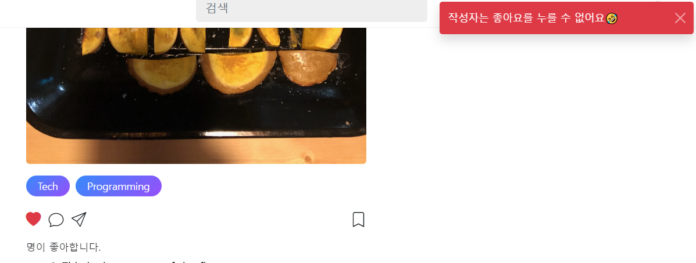
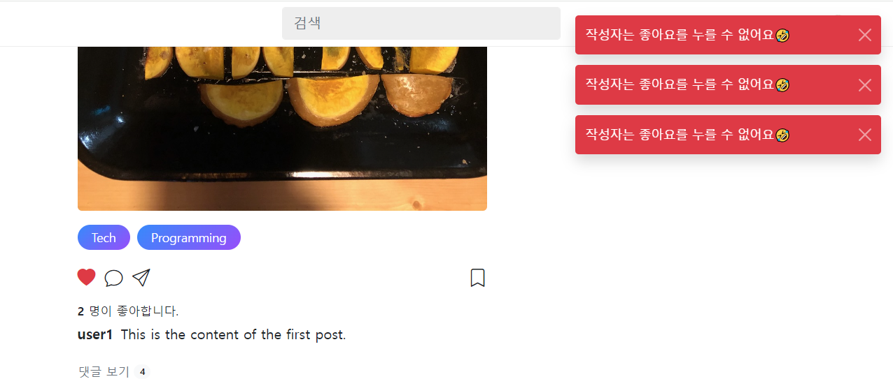
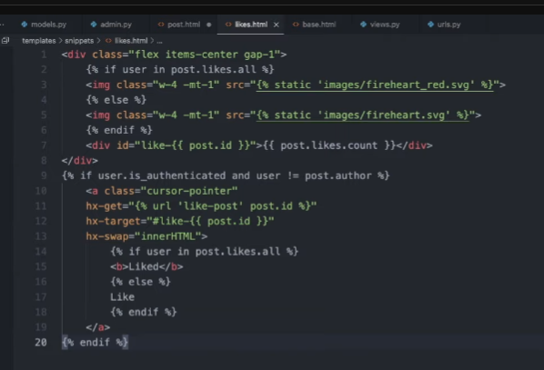
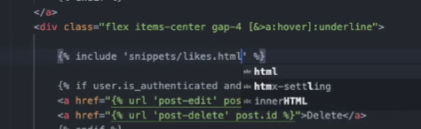
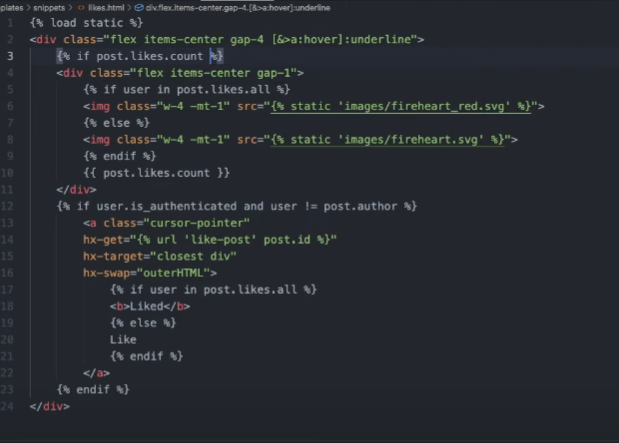

- cookie 인증 유튜브: https://www.youtube.com/watch?v=EO9XWml9Nt0
- 로그인 참고 깃허브(fastapi + htmx + pydantic): https://github.dev/sammyrulez/htmx-fastapi/blob/main/templates/owner_form.html
- ImageReq참고: https://github.dev/riseryan89/imizi-api/blob/main/app/middlewares/access_control.py
- **진짜배기 s3 세팅: https://wooogy-egg.tistory.com/77**
- **post개발 이후, s3 다운로드 참고 github: https://github.com/jrdeveloper124/file-transfer/blob/main/main.py#L30**
    - 유튜브: https://www.youtube.com/watch?v=mNwO_z6faAw
- **s3 boto3 드릴 블로그**: https://dschloe.github.io/aws/04_s3/s3_basic/
- **boto3 client말고 session으로 메서드들 정리 튜토리얼: https://thecodinginterface.com/blog/aws-s3-python-boto3/**

- bootstrap + github 인스타클론 참고:
    - 유튜브: https://www.youtube.com/watch?v=ZCvKlyAkjik
    - github: https://github.com/codingvenue/instagram-hompage-clone-bootstrap/blob/master/index.html
- django stream을 포함한 story : https://www.youtube.com/watch?v=5fG5xaIGzoI&list=WL&index=8&t=4s
- jinja2 지존 튜토리얼 블로그: https://ttl255.com/jinja2-tutorial-part-4-template-filters/
    - recursive: https://stackoverflow.com/questions/23657796/sum-a-value-inside-a-loop-in-jinja
    - 누적합: https://stackoverflow.com/questions/7537439/how-to-increment-a-variable-on-a-for-loop-in-jinja-template
    - list변경 post.likes -> like.user_id list로 : https://stackoverflow.com/questions/31895602/ansible-filter-a-list-by-its-attributes
- todo:
    - form
      validation: https://medium.com/@soverignchriss/asynchronous-form-field-validation-with-htmx-and-django-eb721165b5e8
- comment: https://www.youtube.com/watch?v=T5Jfb_LkoV0&list=PL5E1F5cTSTtTAIw_lBp1hE8nAKfCXgUpW&index=14
- reply: https://github.dev/tcxcx/django-webapp/tree/main/a_inbox/templates/a_inbox

- htmx
  - 검증: https://github.com/bigskysoftware/htmx/issues/75

### 좋아요 view 동적변경
- https://stackoverflow.com/questions/31895602/ansible-filter-a-list-by-its-attributes

1. 렌더링할 때, 좋아요판단(user_exists_like)를 미리 해놓고, 좋아요 -> 빨간색글씨 + fill 하트 / 아니면 검은색글씨 + 그냥하트가 나오게 한다
    - **이 때, jinja2의 `list변수 | map(attribute="") | list` 필터를 활용하여, `post.likes`를 순회하며 like의 각 `user_id list`로 변형한다.**
    - user_id에 현재로그인 user.id가 포함되어있으면, 좋아요를 누른 것이다.
    ```html
    {# 좋아요 버튼 #}
    
    <a hx-post="{{ url_for('pic_hx_like_post', post_id= post.id ) }}"
       hx-trigger="click"
       hx-swap="none"
       class="text-decoration-none
               text-dangertext-dark
            "
    >
        
            <i class="bi bi-heart-fill"></i>
        
            <i class="bi bi-heart"></i>
        
    </a>
    ```

2. **이제 클릭시 `좋아요갯수`부분을 hx-target해서, `innerHTML` hx-swap하여 바뀌도록 준비를 한다.**
3. 먼저, count가 들어가는 부분에, 상위도메인 post의 id를 이용한 div[id=""]로 카운터를 감싼다.
    ```html
    <div class="d-block my-1 fs-6">
        <strong>
            <div id="like-{{ post.id }}">{{ post.likes | length }}</div>
            명
        </strong>이 좋아합니다.
    </div>
    ```
4. 좋아요 버튼에서는 hx-target을 해당 id로, `hx-swap의 innerHTML`를 통해, `div안에 내용물(count숫자)`만 바뀔 수 있게 한다.
    ```html
    <a hx-post="{{ url_for('pic_hx_like_post', post_id= post.id ) }}"
       hx-trigger="click"
       hx-target="#like-{{ post.id }}"
       hx-swap="innerHTML"
       class="text-decoration-none
               text-dangertext-dark
            "
    >
        
            <i class="bi bi-heart-fill"></i>
        
            <i class="bi bi-heart"></i>
        
    </a>
    ```
   
5. 이제 좋아요 route에서는 div에 들어갈 좋아요 갯수를 `jinja문법 그대로 python화`시켜 return 넘겨준다.
    - **하지만, `render()`함수는 template만 받지, `html 문자열을 받지는 못하는 상태`다.**
    - **임시로 `HTMLResponse()`에 문자열html값을 넣어 return한다. 이렇게 되면 `trigger나, message는 못보낼 것이다.`**
    - **이 때, db가 아니므로 연동이 안되서, 새롭게 post를 with_likes=True로 가져와서 응답한다.**
    ```python
    @app.post("/posts/{post_id}/like")
    @login_required
    async def pic_hx_like_post(
            request: Request,
            post_id: int
    ):
        post = get_post(post_id, with_user=True, with_likes=True)
        likes = post.likes
        user_id = request.state.user.id
    
        # 1) 글작성자 <-> 좋아요누른 유저면, 안된다고 메세지를 준다.
        if post.user.id == user_id:
            raise BadRequestException('작성자는 좋아요를 누를 수 없어요🤣')
    
        # 2) 현재 post의 likes 중에 내가 좋아요 누른 적이 있는지 검사한다.
        user_exists_like = next((like for like in likes if like.user_id == user_id), None)
    
        # 2-1) 좋아요를 누른 상태면, 좋아요를 삭제하여 취소시킨다.
        #      => 삭제시, user_id, post_id가 필요한데, [누른 좋아요를 찾은상태]로서, 삭제시만 id가 아닌 schema객체를 통째로 넘겨 처리한다.
        if user_exists_like:
            delete_liked_post(user_exists_like)
    
            post = get_post(post_id, with_likes=True)
            return HTMLResponse(f"{len(post.likes)}")
        # 2-2) 좋아요를 안누른상태면, 좋아요를 생성한다.
        else:
            data = dict(user_id=user_id, post_id=post_id)
            like = create_liked_post(data)
    
            post = get_post(post_id, with_likes=True)
            return HTMLResponse(f"{len(post.likes)}")
    ```
   

6. **이 때, 문제가 발생하는데, 자신은 좋아요누를수 X -> raise BadRequest -> 미들웨어에서 render()빈 템플릿 -> `hx-swap은 일어난상황`이라, 빈문자열로 채워짐.**
    

#### hx TemplateException은, swap대비, context + template을 넘겨줄 수 있어야한다.
1. 가장 상위 Exception에 `context=dict()`와 `template_name=""`를 추가한다. 
    - **이 때, template_name 대신 html의 값을 직접 받을 수 있도록 `html=""`도 추가한다**
    - **이 때, `상속자식들이 주입안하면, dict(), ""를 가지고 있도록, 부모의 생성자에서 if/else를 통해 처리`해준다.**
    ```python
    class TemplateException(Exception):
        """
        oob message전달을 위해, 204를 제외한 200~399 까지 swap이 일어나는 코드로 반환한다.
        """
        status_code: int
        message: str
        ex: Exception
        context: dict
        template_name: str
    
        def __init__(self,
                     status_code: int = status.HTTP_200_OK,
                     message: str = None,
                     ex: Exception = None,
                     context: dict = None,
                     template_name: str = None,
                     html: str = None
                     ):
   
            if not (200 <= status_code < 400 or status_code != 204):
                raise Exception('템플릿 오류는 status_code가 200<= < 400 사이이며, 204 또한 제한됩니다.')
    
            self.status_code = status_code
            self.message = message
            self.ex = ex
            self.context = context if context else dict()
            self.template_name = template_name if template_name else ""
            self.html = html if html else ""
    ```


2. 현재 쓸 BadRequest만 일단, 추가된 인자를 기본값 = None으로 주고, 안주면 None -> super().init()에서 내부 기본값으로 들어갈 것이다.
    ```python
    class BadRequestException(TemplateException):
        def __init__(
                self,
                message,
                ex: Exception = None,
                context=None,
                template_name=None,
                html=None
        ):
            super().__init__(
                message=message,
                ex=ex,
                context=context,
                template_name=template_name,
                html=html,
            )
    ```
   
3. **미들웨어에서는 Template에서가 발생할 때, `except Exception as e: 내부에서 e.context, e.template_name, e.html`을 건네서, swap이라면 swap되게 한다.**
    ```python
    if isinstance(e, TemplateException):
        return render(request,
                      template_name=e.template_name,
                      html=e.html,
                      context=e.context,
                      messages=[Message.FAIL.write('', text=f'{str(e)}', level=MessageLevel.ERROR)],
                      )
    ```
   
4. render()함수에서는 template_name이 아닌 html이 주어지면 html을 html_str 누적변수에 할당해줘야한다.
    - 즉 2개중 1개가 처리되게 하자.
    - **2번째 인자 or template_naem이 주어지면, 템플릿렌더링을, 아니라면 직접 html을 누적하도록 if/else**
    ```python
    def render(request, template_name="", html="", context: dict = {}, status_code: int = 200,
               cookies: dict = None,
               delete_cookies: list = None,
               hx_trigger: dict | str | List[str] = None,
               messages: dict | List[dict] = None,
               # oobs: List[tuple] = None,
               oobs: List[str] = None,
               ):
        # 추가context가 안들어오는 경우는 외부에서 안넣어줘도 된다.
        ctx = {
            'request': request,
            'user': request.state.user,
            **context
        }
        # template render + oob도 아니면, 일반Response + 204로
        html_str = ""
        if template_name:        
            t = templates.get_template(template_name)
            html_str += t.render(ctx)
        else:
            html_str += html
    ```
4. 이제 like route에서, context + template_name= or html= 직접값을 같이 입력해서, 에러발생시에도 swap이 발생하도록 해준다.
    ```python
    # 1) 글작성자 <-> 좋아요누른 유저면, 안된다고 메세지를 준다.
    if post.user.id == user_id:
        raise BadRequestException(
            '작성자는 좋아요를 누를 수 없어요🤣',
            html=f"{len(post.likes)}"
        )
    ```
    


5. render()에도 html이 적용되니, render()함수로 바꿔주고 message도 같이 보낸다.
    ```python
    # 2-1) 좋아요를 누른 상태면, 좋아요를 삭제하여 취소시킨다.
    #      => 삭제시, user_id, post_id가 필요한데, [누른 좋아요를 찾은상태]로서, 삭제시만 id가 아닌 schema객체를 통째로 넘겨 처리한다.
    if user_exists_like:
        delete_liked_post(user_exists_like)
    
        post = get_post(post_id, with_likes=True)
        # return HTMLResponse(f"{len(post.likes)}")
        return render(request, html=f"{len(post.likes)}",
                      context=dict(post=post),
                      messages=Message.DELETE.write('좋아요', text="💔좋아요를 취소했습니다.💔", level=MessageLevel.WARNING),
                      )
    
    # 2-2) 좋아요를 안누른상태면, 좋아요를 생성한다.
    else:
        data = dict(user_id=user_id, post_id=post_id)
        like = create_liked_post(data)
    
        post = get_post(post_id, with_likes=True)
        # return HTMLResponse(f"{len(post.likes)}")
        return render(request, html=f"{len(post.likes)}",
                      context=dict(post=post),
                      messages=Message.SUCCESS.write('좋아요', text="❤좋아요를 눌렀습니다.❤", level=MessageLevel.SUCCESS),
                      )
    
    ```

### 좋아요 토글 -> hx-target인 갯수태그값 뿐만 아니라 자기자신도 바꿔야한다면?

#### 토글태그 + 대상 갯수태그가 붙어있다면?(여기선 해당x)
1. **(hx-target만 빠지면, 혼동) `두 태그를 같이` 묶어서 1개의 `html로 뺀 뒤, include`시키고**
    
    
2. **hx-target => `#id`에서, 더이상 `독립된 include html`로서**
    1. **include된 것은 내부에서 `hx-swap="outerHTML"`이 기본으로 바꿔주는데**  
    2. **2태그 중 1개에 걸린 요청이라서 -> `2태그를 묶은 div를 하나 새로 개설`**
    3. **`묶은 div에 hx요청을 넣는게 아니라` -> 묶은 div가 걸리도록 `hx-target="closest div"`으로 처리 -> `기존 target태그의 id제거`**

    

3. route에서는 include된 html로 응답
    

#### 토글태그 <-> 대상태그가 묶을 수 없이 떨어져있다면,
1. 토글태그가, 멀리있는 갯수태그가 아닌, 일단 자기자신을 변하게 하고
2. **멀리 있는 놈은 swap-oob나 hx-trigger로 처리해야한다.**

3. 일단 hx-target을 자신인 this로 바꾸고, hx-swap을 outerHTML로 바꾼 뒤, 
    - include + render()에서 쓸 수 있도록 `post_likes_button.html`로 빼서 처리한다.
    ```html
    
    <a hx-post="{{ url_for('pic_hx_like_post', post_id= post.id ) }}"
       hx-trigger="click"
       hx-target="this"
       hx-swap="outerHTML"
       class="text-decoration-none
               text-dangertext-dark
            "
    >
        
            <i class="bi bi-heart-fill"></i>
        
            <i class="bi bi-heart"></i>
        
    </a>
    ```
    ```html
    
    <div class="icons-left">
        {# 좋아요 버튼 #}
        
        <i class="bi bi-chat"></i>
        <i class="bi bi-send"></i>
    </div>
    ```
    ```python
    if user_exists_like:
        delete_liked_post(user_exists_like)
    
        post = get_post(post_id, with_likes=True)
        # return render(request, html=f"{len(post.likes)}",
        #               context=dict(post=post),
        #               messages=Message.DELETE.write('좋아요', text="💔좋아요를 취소했습니다.💔", level=MessageLevel.WARNING),
        #               )
        return render(request, "picstargram/post/partials/post_likes_button.html",
                      context=dict(post=post),
                      messages=Message.DELETE.write('좋아요', text="💔좋아요를 취소했습니다.💔", level=MessageLevel.WARNING),
                      )
    
    # 2-2) 좋아요를 안누른상태면, 좋아요를 생성한다.
    else:
        data = dict(user_id=user_id, post_id=post_id)
        like = create_liked_post(data)
    
        post = get_post(post_id, with_likes=True)
        return render(request, "picstargram/post/partials/post_likes_button.html",
                      context=dict(post=post),
                      messages=Message.SUCCESS.write('좋아요', text="❤좋아요를 눌렀습니다.❤", level=MessageLevel.SUCCESS),
                      )
    ```
    - count태그에는 id를 그대로 두고, hx-swap-oob에 사용해본다.
4. **render()를 template_name으로 바꿨다면, Exception도 html에서 template_name으로 바꿔준다.**
    ```python
    raise BadRequestException(
        '작성자는 좋아요를 누를 수 없어요🤣',
        template_name="picstargram/post/partials/post_likes_button.html"
        # html=f"{len(post.likes)}"
    )
    ```
5. 이제 count는 hx-oob로 써본다.

#### 하위도메인의 jinja변수가 들어간 id는, 최초렌더링에선 사용불가
1. **최초렌더링에선, hx-target의 id에 jinja변수가 들어가면, `oobTargetError`가 난다.**
    - **include할 oob는 hx-swap-oob를 추가하고, 최초렌더링에선 id만 명시하면 된다.**

2. 일단 count span태그를 빼지말고, 복사해서 `post_likes_count.html`의 html로 만든다.
    - **hx-swap-oob="true"를 추가한다.**
    - **이 때, post.html에 include시키지 않는다.**
    ```html
    <span hx-swap-oob="true" id="like-{{ post.id }}">{{ post.likes | length }}</span>
    ```

3. **post.html에서 최초렌더링할 땐, `hx-swap-oob="true"와 jinja변수id가 공존하지 못한다.`**
    - **그래서 따로 뺀 html을 include하지않고, `hx-swap-oob`가 없는 span태그를 그대로 사용한다.**
    ```html
    <b>
        {# 좋아요갯수 -> oob처리 됨. 여기서만 hx-swap-oob 표기가 없다. jinja변수 id때문에 #}
        <span id="like-{{ post.id }}">{{ post.likes | length }}</span>
    </b>명이 좋아합니다.
    ```
   
4. route에서는 oob를 추가해서 응답한다.
    ```python
    # 2-1) 좋아요를 누른 상태면, 좋아요를 삭제하여 취소시킨다.
    #      => 삭제시, user_id, post_id가 필요한데, [누른 좋아요를 찾은상태]로서, 삭제시만 id가 아닌 schema객체를 통째로 넘겨 처리한다.
    if user_exists_like:
        delete_liked_post(user_exists_like)
        post = get_post(post_id, with_likes=True)
        return render(request, "picstargram/post/partials/post_likes_button.html",
                      context=dict(post=post),
                      messages=Message.DELETE.write('좋아요', text="💔좋아요를 취소했습니다.💔", level=MessageLevel.WARNING),
                      oobs=["picstargram/post/partials/post_likes_count.html"]
                      )
    
    # 2-2) 좋아요를 안누른상태면, 좋아요를 생성한다.
    else:
        data = dict(user_id=user_id, post_id=post_id)
        like = create_liked_post(data)
        post = get_post(post_id, with_likes=True)
        return render(request, "picstargram/post/partials/post_likes_button.html",
                      context=dict(post=post),
                      messages=Message.SUCCESS.write('좋아요', text="❤좋아요를 눌렀습니다.❤", level=MessageLevel.SUCCESS),
                      oobs=["picstargram/post/partials/post_likes_count.html"]
                      )
    ```
    


### AWS 명령어 모음

```shell
%UserProfile%\.aws\credentials
%UserProfile%\.aws\config

aws configure list-profiles

# 등록
aws configure --profile {프로젝트명} # ap-northeast-2 # json
# 재사용시
set AWS_PROFILE={프로젝트명}

cat ~\.aws\credentials


# S3
aws s3 ls --profile {프로필명}
aws s3 mb s3://{버킷명}
aws s3 ls --profile {프로필명}


aws s3 cp {파일경로} s3://{버킷명}
aws s3 cp {파일경로} s3://{버킷명}/{폴더명} --acl public-read
```

#### IAM key 변경

1. root사용자 로그인 > IAM > 해당사용자 클릭 > `보안 자격 증명` 탭 > 액세스키
2. 기존 key `비활성화` 후 필요시 삭제 (있다가 cli에서 확인하고 비활성화하면 더 좋을 듯)
3. 새 액세스키 AWS CLI 선택하여 발급
4. 터미널 열어서 `AWS CLI`를 통해 해당프로젝트의 profile key들 덮어쓰기
    ```shell
    aws configure list-profiles # 현재 프로필들 확인
    cat ~\.aws\credentials # 현재 프로필들의 key설정값들 확인 (콘솔에서 비활성화시킨 것과 일치하는지)
    aws configure --picstargram # 특정프로필 key 덮어쓰기 with 콘솔
    ```

5. 프로젝트 .env의 `aws_access_key_id`와 `aws_secret_access_key`를 변경

   


