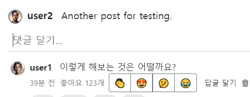
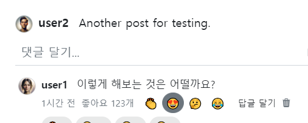
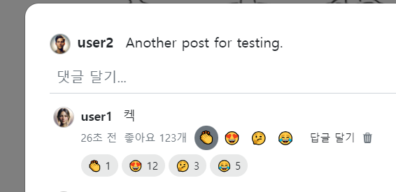
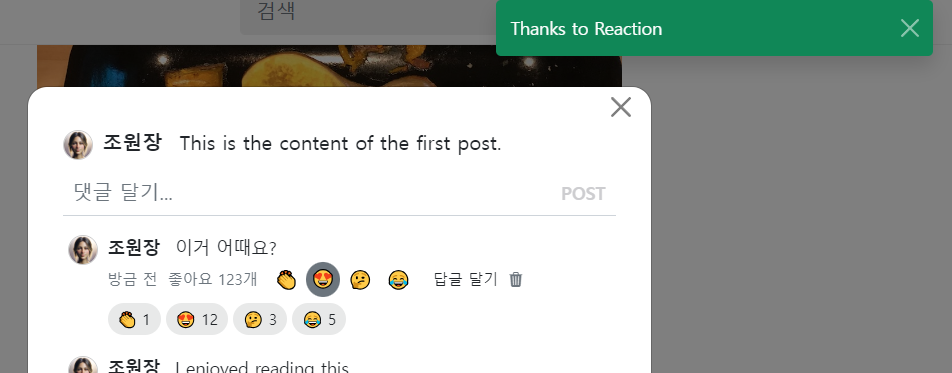
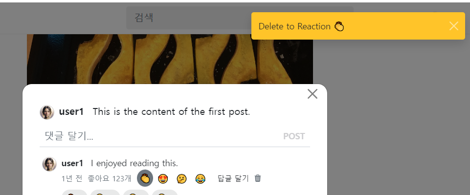

- cookie 인증 유튜브: https://www.youtube.com/watch?v=EO9XWml9Nt0
- 로그인 참고 깃허브(fastapi + htmx + pydantic): https://github.dev/sammyrulez/htmx-fastapi/blob/main/templates/owner_form.html
- ImageReq참고: https://github.dev/riseryan89/imizi-api/blob/main/app/middlewares/access_control.py
- **진짜배기 s3 세팅: https://wooogy-egg.tistory.com/77**
- **post개발 이후, s3 다운로드 참고 github: https://github.com/jrdeveloper124/file-transfer/blob/main/main.py#L30**
    - 유튜브: https://www.youtube.com/watch?v=mNwO_z6faAw
- **s3 boto3 드릴 블로그**: https://dschloe.github.io/aws/04_s3/s3_basic/
- **boto3 client말고 session으로 메서드들 정리 튜토리얼: https://thecodinginterface.com/blog/aws-s3-python-boto3/**

- bootstrap + github 인스타클론 참고:
    - 유튜브: https://www.youtube.com/watch?v=ZCvKlyAkjik
    - github: https://github.com/codingvenue/instagram-hompage-clone-bootstrap/blob/master/index.html
- django stream을 포함한 story : https://www.youtube.com/watch?v=5fG5xaIGzoI&list=WL&index=8&t=4s
- jinja2 지존 튜토리얼 블로그: https://ttl255.com/jinja2-tutorial-part-4-template-filters/
    - recursive: https://stackoverflow.com/questions/23657796/sum-a-value-inside-a-loop-in-jinja
    - 누적합: https://stackoverflow.com/questions/7537439/how-to-increment-a-variable-on-a-for-loop-in-jinja-template
    - list변경 post.likes -> like.user_id list로 : https://stackoverflow.com/questions/31895602/ansible-filter-a-list-by-its-attributes
- todo:
    - form
      validation: https://medium.com/@soverignchriss/asynchronous-form-field-validation-with-htmx-and-django-eb721165b5e8
- comment: https://www.youtube.com/watch?v=T5Jfb_LkoV0&list=PL5E1F5cTSTtTAIw_lBp1hE8nAKfCXgUpW&index=14
- reply: https://github.dev/tcxcx/django-webapp/tree/main/a_inbox/templates/a_inbox

- htmx
  - 검증: https://github.com/bigskysoftware/htmx/issues/75

### view
1. 좋아요 대신, reactions의 view로 만든다.
#### [reaction 택1 토글 태그]는 form > div.btn-group 안에 input[type=radio].btn-check로 만든다.
1. input[type=radio]는 체크버튼이 자동으로 생기는데, **`.btn-check`를 넣어주면, check box가 사라지고, label만 남게된다!!**
    - **`clip :rect(0, 0, 0, 0);`은 화면에 보이지 않게 만든다.**
    ```css
    .btn-check {
        position: absolute;
        clip: rect(0, 0, 0, 0);
        pointer-events: none;
    }
    ```

2. 체크박스가 사라진 input은 label로만 표시되므로, `label[for=]`와 연결되는 `input#id`를 넣어줘야한다.
    - input#id= / label[for = `comment-{{comment.id}}-reaction-{{reaction.id}}`로 준다. view용
3. **모든 `radio input은 name을 똑같게`준다.**
    - name="comment-reaction"으로 준다.  backend 요청용?
4. **label은 btn-group 하위의 요소들이므로 `.btn .btn-타입`을 줘야한다. 이 때, 내부가 빌라면 `.btn .btn-outline-secondary`으로 주면 된다.**
    - 버튼 크기는 `.btn-group .btn-group-크기(sm)`으로 결정되어 여기선 안줘도 된다.
5. value와 label의 text에는 똑같은 이모지를 넣어준다.
    - 추후에는 value는 reactions를 순회하며 `reaction.id`로 준다. label은 `reaction.emoji`으로 준다?
    ```html
    <form name="reaction-{{ comment.id }}">
        <div class="btn-group btn-group-sm"
             role="group"
             aria-label="comment reaction toggle button group"
        >
            {#onchange="reactionHandler({{ comment.id }}, '👏')#}
            {# .btn-check는 radio 박스를 가려주고 label만 보이게 한다. #}
            <input type="radio"
                   class="btn-check"
                   name="comment-reaction"
                   id="comment-{{ comment.id }}-reaction-1"
                   value="👏"
                   autocomplete="off"
            />
            <label class="btn btn-outline-secondary "
                   for="comment-{{ comment.id }}-reaction-1"
            >👏
            </label>
            <input type="radio"
                   class="btn-check"
                   name="comment-reaction"
                   id="comment-{{ comment.id }}-reaction-2"
                   value="😍"
                   autocomplete="off"
            />
            <label class="btn btn-outline-secondary "
                   for="comment-{{ comment.id }}-reaction-2"
            >😍
            </label>
            <input type="radio"
                   class="btn-check"
                   name="comment-reaction"
                   id="comment-{{ comment.id }}-reaction-3"
                   value="🤔"
                   autocomplete="off"
            />
            <label class="btn btn-outline-secondary "
                   for="comment-{{ comment.id }}-reaction-3"
            >🤔
            </label>
            <input type="radio"
                   class="btn-check"
                   name="comment-reaction"
                   id="comment-{{ comment.id }}-reaction-4"
                   value="😂"
                   autocomplete="off"
            />
            <label class="btn btn-outline-secondary "
                   for="comment-{{ comment.id }}-reaction-4"
            >😂
            </label>
        </div>
    </form>
    ```
    

### 택1토글 태그 btn-group 내부 버튼들 디자인 수정(암기)
#### 클릭시 생기는 outline, box-shadow 제거: input:checked + label의 outline/box-shadow/border 제거
1. btn-group의 각 `input버튼이 눌러질 때 생기는 outline을 제거`하려면, **`input:checked + label`을 통해, `radio가 체크됬을 때의 --> 형제label` 디자인을 수정해야한다.**
    - **왜 그런지 모르겠지만, label에서 처리를 해줘야하며, .btn-group에 대해서는 공식인 것 같다.**
    - style.css에 넣어주자.
    ```css
    /* comment reaction */
    .btn-group > input:checked + label {
        outline: none !important;
        box-shadow: none !important;
        border: 0;
    }
    ```
    
#### group내 버튼들은, label에 박힌 .btn에 btn 디자인 css를 추가해서 수정한다.
- 참고: https://codepen.io/hashi_shah/pen/BOvGKV

1. `.btn-reaction`으로 사각형모양의 버튼 디자인의 `label태그`에 추가해서 디자인 수정한다.
    - 내부 내용은 hover시 나올 border는 원형 + border색/배경색 없음 + `hover의 transition 시간 추가` hover시 원형배경이 뜨는 시간 추가 + `padding/margin은 !important`로 줘서, 각 hover시 버튼들 간격 조절 
    ```css
    /* .btn-group 내부 label.btn에 대해 hover시 적용된다.*/
    .btn-group .btn-reaction {
        border-radius: 50% !important;
        border-color: transparent;
        background-color: transparent;
    
        transition: all .5s ease;
    
        padding: 0.2em 0.3em !important;
        margin: 0.05em !important;
    }
    ```
    ```html
       <label class="btn btn-outline-secondary btn-reaction"
              for="comment-{{ comment.id }}-reaction-1"
    >👏
    </label>
    ```
    
    

#### reaction count view
1. 댓글창 우측에 있던 좋아요+count를 아래쪽으로 reactions로 뺀다.
2. 댓글 생성form아래에 div>span들로 꾸민다.
    - 없을 경우 안나타날 수 있으니 margin대신 padding으로 간격을 준다.
    - 넘치면 다음줄로 넘어가도록 flex-wrap도 같이 준다.
    ```html
    {# reaction(emoji) count  view #}
    <div class="fs-7 d-flex gap-1 align-items-center flex-wrap my-0 py-1">
        <span class="rounded-pill bg-dark bg-opacity-10 px-2 py-1 flex-grow-0 flex-shrink-0 flex-basis-auto">
            👏 1
        </span>
        <span class="rounded-pill bg-dark bg-opacity-10 px-2 py-1 flex-grow-0 flex-shrink-0 flex-basis-auto">
            😍 12
        </span>
        <span class="rounded-pill bg-dark bg-opacity-10 px-2 py-1 flex-grow-0 flex-shrink-0 flex-basis-auto">
            🤔 3
        </span>
        <span class="rounded-pill bg-dark bg-opacity-10 px-2 py-1 flex-grow-0 flex-shrink-0 flex-basis-auto">
             😂 5
        </span>
    </div>
    ```
    


### radio는 form에서 change trigger로 받아서 클릭시마다 요청할 수 있다.
1. trigger = "change"로 hx-post요청을 보낸다.
    - **comment_id는 path로, 현재 reaction emoji를 `name="comment-reaction"의 value`로 form으로 보낸다.**
    - **hx-swap="none"으로 테스트로 보내고, backend에서는 noContent:False로 모달안닫히게 + message를 같이 보낸다.**
    ```html
       <!-- 이모지 버튼 -->
    <form hx-post="{{ url_for('pic_hx_reaction_comment', comment_id=comment.id) }}"
          hx-trigger="change"
          hx-swap="none"
    >
        <div class="btn-group btn-group-sm"
             role="group"
             aria-label="comment reaction toggle button group"
        >
            <input type="radio"
                   class="btn-check"
                   name="comment-reaction"
                   id="comment-{{ comment.id }}-reaction-1"
                   value="👏"
                   au
    ```
   
2. form은 파이단틱 as_form으로 설정해서 받았지만, 1개의 form value가 오기 때문에, `route에서 Form(alias="")`로 받자
    - **이 때, alias를 안주고 직접 `_`로 변경하면, hx_request in Header()와 달리 `Form()은 자동변경 안되서 alias가 필수`이다.**
    ```python
    @app.post("/comments/{comment_id}/reaction")
    @login_required
    async def pic_hx_reaction_comment(
            request: Request,
            comment_id: int,
            comment_reaction: str = Form(alias='comment-reaction'),
    ):
        print(f"comment_reaction  >> {comment_reaction}")
        print(f"comment_id  >> {comment_id}")
        # comment_reaction  >> 🤔
        # comment_id  >> 3
   
        return render(request, "",
                      hx_trigger=dict(noContent=False),
                      messages=Message.SUCCESS.write('reaction', text=f"Thanks to Reaction", level=MessageLevel.SUCCESS),
                      )
    ```
    

3. name과 router파라미터의 이름을 comment-reaction -> emojin로 변경해주자.
    ```html
    <input type="radio"
           class="btn-check"
           name="emoji"
           id="comment-{{ comment.id }}-reaction-1"
           value="👏"
           autocomplete="off"
    />
    <label class="btn btn-outline-secondary btn-reaction"
           for="comment-{{ comment.id }}-reaction-1"
    >👏
    </label>
    ```
   
    ```python
    @app.post("/comments/{comment_id}/reaction")
    @login_required
    async def pic_hx_reaction_comment(
            request: Request,
            comment_id: int,
            emoji: str = Form(alias='emoji'),
    ):
        print(f"emoji  >> {emoji}")
        print(f"comment_id  >> {comment_id}")
        #...
    ```
   

### LikedComments -> ReactionedComments Schema로 모델 변경
1. json, load함수, 전역데이터변수
    ```json
    ```
    ```python
    async def init_picstargram_json_to_list_per_pydantic_model():
        #...
        reactioned_comments = [ReactionedCommentsSchema(**like) for like in picstargram.get("reactionedComments", [])]
        #...
    ```
    ```python
    users, comments, posts, tags, post_tags, liked_posts, reactioned_comments, liked_replies = [], [], [], [], [], [], [], []
    
    @asynccontextmanager
    async def lifespan(app: FastAPI):
        
        users_, comments_, posts_, tags_, post_tags_, replies_, liked_posts_, reactioned_comments_, liked_replies_ = await init_picstargram_json_to_list_per_pydantic_model()
        reactioned_comments.extend(reactioned_comments_)
    ```

2. Schema에서는 emoji필드를 추가해준다.
    ```python
    class ReactionedCommentsSchema(LikeSchema):
        comment_id: int
        emoji: str
    ```
   
3. **many를 생성했으면 one Schema에 추가해준다.**
    ```python
    class CommentSchema(BaseModel):
        id: Optional[int] = None
        content: str
        created_at: Optional[datetime.datetime] = None  # 서버부여 -> 존재는 해야함 but TODO: DB 개발되면, 예제 안뜨게 CreateSchema 분리하여 제거대상.
        updated_at: Optional[datetime.datetime] = None
        user_id: int
        post_id: int
    
        user: Optional['UserSchema'] = None
    
        replies: Optional[List['ReplySchema']] = []
    
        reactions: Optional[List['ReactionedCommentsSchema']] = []
    ```

#### crud에서 liked_posts를 참고하여 작성
1. CR은 liked_post의 함수를 복사해서 작성한다.
    ```python
    def get_reactioned_comment(reaction_id: int, with_user: bool = False):
        reaction = next((reaction for reaction in reactioned_comments if reaction.id == reaction_id), None)
        if not reaction:
            return None
    
        if with_user:
            user = get_user(reaction.user_id)
    
            if not user:
                return None
    
            reaction.user = user
    
        return reaction
    
    
    def get_reactioned_comments(comment_id: int, with_user: bool = False):
        if with_user:
            return [
                get_reactioned_comment(reaction.id, with_user=True) for reaction in reactioned_comments if reaction.comment_id == comment_id
            ]
    
        return [like for like in liked_posts if like.comment_id == comment_id]
    
    def create_reactioned_comment(data: dict):
        user = get_user(data['user_id'])
        if not user:
            raise Exception(f"해당 user(id={data['user_id']})가 존재하지 않습니다.")
        comment = get_comment(data['comment_id'])
        if not comment:
            raise Exception(f"해당 comment(id={data['comment_id']})가 존재하지 않습니다.")
    
        try:
            reactioned_comment_schema = ReactionedCommentsSchema(**data)
            # id + created_at, ~~updated_at~~ 부여
            reactioned_comment_schema.id = find_max_id(reactioned_comments) + 1
            reactioned_comment_schema.created_at = datetime.datetime.now()
            reactioned_comments.append(reactioned_comment_schema)
    
        except Exception as e:
            raise e
    
        return reactioned_comment_schema
    ```
2. Delete는 **삭제조건에 emoji를 추가해서, `해당comment에 해당user가 해당emoji`에 대해서 생성/삭제해야한다.**
    ```python
    def delete_reactioned_comment(reactioned_comment_schema: ReactionedCommentsSchema):
        user = get_user(reactioned_comment_schema.user_id)
        if not user:
            raise Exception(f"해당 user(id={reactioned_comment_schema.user_id})가 존재하지 않습니다.")
        comment = get_comment(reactioned_comment_schema.comment_id)
        if not comment:
            raise Exception(f"해당 comment(id={reactioned_comment_schema.comment_id})가 존재하지 않습니다.")
    
        global reactioned_comments
    
        reactioned_comments = [reaction for reaction in reactioned_comments if
                       not (reaction.comment_id == reactioned_comment_schema.comment_id
                            and reaction.user_id == reactioned_comment_schema.user_id
                            and reaction.emoji == reactioned_comment_schema.emoji
                            )]
    ```
   
### route에서 crd를 사용하며, liked post를 참고하여 추가작성
1. 상위도메인 comment에서 with_likes가 아니라 with_reactions
    ```python
    @app.post("/comments/{comment_id}/reaction")
    @login_required
    async def pic_hx_reaction_comment(
            request: Request,
            comment_id: int,
            emoji: str = Form(alias='emoji'),
    ):
    
        comment = get_comment(comment_id, with_user=True, with_reactions=True)
    ```
    ```python
    def get_comment(comment_id: int, with_user: bool = False, with_replies: bool = True,
                    with_reactions=True
                    ):
        #...
        if with_reactions:
            comment.reactions = [
                get_reactioned_comment(reaction.id, with_user=True) for reaction in reactioned_comments 
                if reaction.comment_id == comment.id
            ]
            
        return comment
    ```
2. post에서는 자기자신 좋아요 금지를 만들었으나 여기선 안한다.
3. 먼저, 자시자신이 `form에 들어오느 emoji`에 대해서, user_id & comment_id에 리액션 한적이 있는지 검사한다.
    - `post like와 달리 emoji까지 넣어서 read조회`한다.
    - **create를 제외하고, delete와, read 모두 삭제/조회 조건에 emoji가 추가되는 것이 좋아요와 다르다.**
    ```python
    @app.post("/comments/{comment_id}/reaction")
    @login_required
    async def pic_hx_reaction_comment(
            request: Request,
            comment_id: int,
            emoji: str = Form(alias='emoji'),
    ):
    
        #...
    
        # 1) post처럼 좋아요 자신 금지는 없다.
    
        # 2) 현재 comment의 reactions 중에 내가 [해당emoji]에 대해 && [좋아요] 누른 적이 있는지 검사한다.
        # => post의 like에 비해 필터링 조건이 [emojin일치]가 추가된다.
        user_exists_reaction = next((reaction for reaction in reactions
                                     if reaction.user_id == user_id and reaction.emoji == emoji)
                                    , None)
    ```
   
4. 이미 리액션했으면, 삭제하고 / 안했으면 생성한 뒤, -> 최신업데이트된 comment.reactions를 응답할 준비를 한다.
    ```python
    async def pic_hx_reaction_comment(
            request: Request,
            comment_id: int,
            emoji: str = Form(alias='emoji'),
    ):
    
        comment = get_comment(comment_id, with_user=True, with_reactions=True)
        reactions = comment.reactions
        user_id = request.state.user.id
    
        # 1) post처럼 좋아요 자신 금지는 없다.
    
        # 2) 현재 comment의 reactions 중에 내가 [해당emoji]에 대해 && [좋아요] 누른 적이 있는지 검사한다.
        # => post의 like에 비해 필터링 조건이 [emojin일치]가 추가된다.
        user_exists_reaction = next((reaction for reaction in reactions
                                     if reaction.user_id == user_id and reaction.emoji == emoji)
                                    , None)
        # 2-1) 좋아요를 누른 상태면, 좋아요를 삭제하여 취소시킨다.
        #      => 삭제시, user_id, post_id가 필요한데, [누른 좋아요를 찾은상태]로서, 삭제시만 id가 아닌 schema객체를 통째로 넘겨 처리한다.
        if user_exists_reaction:
            delete_reactioned_comment(user_exists_reaction)
            comment = get_comment(comment_id, with_reactions=True)
            return render(request, "",
                          hx_trigger=dict(noContent=False),
                          messages=Message.DELETE.write('reaction', text=f"Delete to Reaction {emoji}",
                                                         level=MessageLevel.WARNING),
                          )
        # 2-2) 좋아요를 안누른상태면, 좋아요를 생성한다.
        else:
            # [생성시에 emoji 추가]
            data = dict(user_id=user_id, comment_id=comment_id, emoji=emoji)
            reaction = create_reactioned_comment(data)
            comment = get_comment(comment_id, with_reactions=True)
            return render(request, "",
                          hx_trigger=dict(noContent=False),
                          messages=Message.SUCCESS.write('reaction', text=f"Thanks to Reaction {emoji}", level=MessageLevel.SUCCESS),
                          )
    ```
    

5. **지금까지의 문제점은, radio타입이라, `클릭한 것을 재클릭으로 인한 취소`가 안되고, 다음것만 넘어가는 상태다.**
    - **우리는 checkbox가 필요하다.**
    


### AWS 명령어 모음

```shell
%UserProfile%\.aws\credentials
%UserProfile%\.aws\config

aws configure list-profiles

# 등록
aws configure --profile {프로젝트명} # ap-northeast-2 # json
# 재사용시
set AWS_PROFILE={프로젝트명}

cat ~\.aws\credentials


# S3
aws s3 ls --profile {프로필명}
aws s3 mb s3://{버킷명}
aws s3 ls --profile {프로필명}


aws s3 cp {파일경로} s3://{버킷명}
aws s3 cp {파일경로} s3://{버킷명}/{폴더명} --acl public-read
```

#### IAM key 변경

1. root사용자 로그인 > IAM > 해당사용자 클릭 > `보안 자격 증명` 탭 > 액세스키
2. 기존 key `비활성화` 후 필요시 삭제 (있다가 cli에서 확인하고 비활성화하면 더 좋을 듯)
3. 새 액세스키 AWS CLI 선택하여 발급
4. 터미널 열어서 `AWS CLI`를 통해 해당프로젝트의 profile key들 덮어쓰기
    ```shell
    aws configure list-profiles # 현재 프로필들 확인
    cat ~\.aws\credentials # 현재 프로필들의 key설정값들 확인 (콘솔에서 비활성화시킨 것과 일치하는지)
    aws configure --picstargram # 특정프로필 key 덮어쓰기 with 콘솔
    ```

5. 프로젝트 .env의 `aws_access_key_id`와 `aws_secret_access_key`를 변경

   


