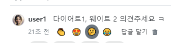

- cookie 인증 유튜브: https://www.youtube.com/watch?v=EO9XWml9Nt0
- 로그인 참고 깃허브(fastapi + htmx + pydantic): https://github.dev/sammyrulez/htmx-fastapi/blob/main/templates/owner_form.html
- ImageReq참고: https://github.dev/riseryan89/imizi-api/blob/main/app/middlewares/access_control.py
- **진짜배기 s3 세팅: https://wooogy-egg.tistory.com/77**
- **post개발 이후, s3 다운로드 참고 github: https://github.com/jrdeveloper124/file-transfer/blob/main/main.py#L30**
    - 유튜브: https://www.youtube.com/watch?v=mNwO_z6faAw
- **s3 boto3 드릴 블로그**: https://dschloe.github.io/aws/04_s3/s3_basic/
- **boto3 client말고 session으로 메서드들 정리 튜토리얼: https://thecodinginterface.com/blog/aws-s3-python-boto3/**

- bootstrap + github 인스타클론 참고:
    - 유튜브: https://www.youtube.com/watch?v=ZCvKlyAkjik
    - github: https://github.com/codingvenue/instagram-hompage-clone-bootstrap/blob/master/index.html
- django stream을 포함한 story : https://www.youtube.com/watch?v=5fG5xaIGzoI&list=WL&index=8&t=4s
- jinja2 지존 튜토리얼 블로그: https://ttl255.com/jinja2-tutorial-part-4-template-filters/
    - recursive: https://stackoverflow.com/questions/23657796/sum-a-value-inside-a-loop-in-jinja
    - 누적합: https://stackoverflow.com/questions/7537439/how-to-increment-a-variable-on-a-for-loop-in-jinja-template
    - list변경 post.likes -> like.user_id list로 : https://stackoverflow.com/questions/31895602/ansible-filter-a-list-by-its-attributes
- todo:
    - form
      validation: https://medium.com/@soverignchriss/asynchronous-form-field-validation-with-htmx-and-django-eb721165b5e8
- comment: https://www.youtube.com/watch?v=T5Jfb_LkoV0&list=PL5E1F5cTSTtTAIw_lBp1hE8nAKfCXgUpW&index=14
- reply: https://github.dev/tcxcx/django-webapp/tree/main/a_inbox/templates/a_inbox

- htmx
  - 검증: https://github.com/bigskysoftware/htmx/issues/75

### reaction 택1토글 radio태그를  껐다켰다 checkbox태그로 바꾸기

#### radio -> checkbox로 바꿀 때의 디자인 css 추가
1. 기존의 input `type`속성만 radio -> checkbox로 바꾼다.
    ```html
     <input type="checkbox"
            class="btn-check"
            name="emoji"
            id="comment-{{ comment.id }}-reaction-1"
            value="👏"
            autocomplete="off"
    >
    <label class="btn btn-outline-secondary btn-reaction"
           for="comment-{{ comment.id }}-reaction-1"
    >👏
    </label>
    ```
2. 이 때 radio가 아닌, checkbox의 체크(focus)를 풀 때, 아웃라인 잔상이 남는데, 제거하려면
    - **`.btn-check:focus+.btn` 이나 `.btn-check:focus+label`로 checkbox가 focus일 때의 label or .btn의 아웃라인제거도 추가한다.**
    ```css
    /* comment reaction */
    /* 1) .btn-group > input:checked + label 는 .btn-group하위 input[type="radio"].btn-check input의 label에 생기는 아웃라인 제거 */
    /* 2) .btn-check:focus+.btn,  .btn-check:focus+label는 btn-group하위 input[type="checkbox"].btn-check로 바꿨을 때, input focus를 풀때 생기는 잔상 같은 아웃라인 제거 */
    .btn-group > input:checked + label,
    .btn-check:focus+.btn, .btn-check:focus+label
    {
        outline: none !important;
        box-shadow: none !important;
        border: 0;
    }
    ```
    

3. radio는 취소는 못하는 반면, `항상 1개의 값을 가지고 form을 change trigger시키는 장점`이 있었다.
    - **하지만, checkbox는 체크를 해제하면, 남아있는 check input을 내보내거나, `다 체크가해제되면 name에는 빈값이 전달되는 문제`가 발생한다.**


### Alpinejs로, 최근 check항목 저장하여, 체크해제시 hidden input에 넣고, 그것을 보내도록 하자.
1. form에 최근체크해제된 값을 저장하기 위한 변수를 x-data로 선언한다.
    ```html
    <form hx-post="{{ url_for('pic_hx_reaction_comment', comment_id=comment.id) }}"
          hx-trigger="change"
          hx-swap="none"
          x-data="{recentlyUncheckedEmoji: ''}"
    >
    ```
2. **각 input태그에 `@change="recentlyUncheckedEmoji ="`를 걸어 input의 값을 집어넣어야하는데**
    - **alpinejs에서는 `$event.target`으로 작동된 input태그를 가져올 수 있다.**
    - .value는 값을  **`.checked`는 체크박스가 체크되었는지를 판단할 수 있다.**
    - **` .checked ? '' : .value `의 3단논법으로 recentlyUncheckedEmoji에 할당되게 한다**
    ```html
    <input type="checkbox"
           class="btn-check"
           name="emoji"
           id="comment-{{ comment.id }}-reaction-1"
           value="👏"
           autocomplete="off"
    
           @change="recentlyUncheckedEmoji = $event.target.checked ? '' : $event.target.value;"
    />
    ```
   
3. 이제 **체크해제된 최근 이모지를 form에 같이 보낼 `hidden input태그`를 만들어 `x-bind:value=""`를 통해 값이 실시간으로 저장되게 한다.**
    ```html
    <input type="hidden" name="uncheckedEmoji" x-bind:value="recentlyUncheckedEmoji">
    ```

#### htmx change trigger는 변화를 일으킨 input만 전달한다 -> hx-include="this"를 통해 모든 input을 다 전달할 수 있다.
1. form태그에 hx-include="this"를 걸어서, form안의 모든 input을 전달하게 한다.
    ```html
     <!-- 이모지 버튼 -->
    <form hx-post="{{ url_for('pic_hx_reaction_comment', comment_id=comment.id) }}"
          hx-trigger="change"
          hx-swap="none"
          x-data="{recentlyUncheckedEmoji: ''}"
          hx-include="this"
    >
    ```

### route에서 form에선 2가지 input이 Nullable하게 들어오게 된다.
1. 그동안 radio changed -> name="emoji"가 무조건 1개로 들어왔지만,
    - **체크해제시, `name="emoji"는 비어서 pydantic에러`, hidden인 `name="uncheckedEmoji"는 체크해제된 emoji`를 들고 온다.**
    - **그렇다면, route에서 `Form(alias=)로 받던 emoji:str이 기본값 None을 준 nullable이 되어야한다.`**
    - 또한, 체크시 uncheckedEmoji역시 빈값으로 오기 때문에, nullable이어야한다.
    ```python
    @app.post("/comments/{comment_id}/reaction")
    @login_required
    async def pic_hx_reaction_comment(
            request: Request,
            comment_id: int,
            emoji: str = Form(None, alias='emoji'),
            unchecked_emoji: str = Form(None, alias='uncheckedEmoji'),
    ):
        print(f"emoji  >> {emoji}")
        print(f"unchecked_emoji  >> {unchecked_emoji}")
    ```
   

2. **좋아요한상태냐/안한상태냐의 판단은 python에서하므로, 우리는 2개 중 1개의 선택된 emoji를 넘겨주기만 하면 된다.**
    - 2개중 1개만 들어오므로, 필터조건에 or를 거는 것보다, 미리 `emoji = unchecked_emoji or emoji`로 1개의 변수로 넣어놓는다.
    - **이 때, unchecked_emoji를 우선순위로 있으면 넣어야한다. `왜냐면, 1checked 2체크해제`하는 순간, hx-include때문에, `기존 체크된 input 1번도 같이` 딸려오기 때문에, `같이온다면, 체크해제를 처리`한다.**
    ```python
    @app.post("/comments/{comment_id}/reaction")
    @login_required
    async def pic_hx_reaction_comment(
            request: Request,
            comment_id: int,
            emoji: str = Form(None, alias='emoji'),
            unchecked_emoji: str = Form(None, alias='uncheckedEmoji'),
    ):
        emoji = unchecked_emoji or emoji 
   
        #...
        user_exists_reaction = next(
        (reaction for reaction in reactions if reaction.user_id == user_id and reaction.emoji == emoji)
        , None)
    ```
    

### 버그) checkbox는 원래 name arary[]에 append해야하는데, 1개만 전달하다보니, 맨마지막 chekced만 전달된다.
- **현재, `[] [] [x]` 상태에서, 2번째 emoji를 클릭하면 -> `[][x][x]`로서 form에서는 name이 같으니 맨 마지막 input만 전달하게 된다.**
- **그냥 form의 input[name="emoji"]는 활용안하고, `input의 @change`만 이용해서, `$event.target.value`만 뽑아서, `클릭된 checkbox의 값`만 hidden input에 넣어주자**

#### [alpine] input의 @change -> 최근emoij hidden에 저장 / [htmx] form의 change trigger -> 최근emoji 1개만 hx요청
- 다행이도, alpinejs의 @change가 작동이 끝나고 htmx form change trigger가 작동하여 보내는 것 같다.

1. x-data에 recentlyEmoji로 변수를 변경하고
    - **hx-include는 제거 및 `form 속 input태그들은 name을 제거하여 전달 안되도록` 한다.**
    ```html
    <form hx-post="{{ url_for('pic_hx_reaction_comment', comment_id=comment.id) }}"
          hx-trigger="change"
          hx-swap="none"
          x-data="{recentlyEmoji: ''}"
    >
    ```
2. hidden input의 name을 `emoji`로 대표하도록 변경하고, **`x-bind:value="recentlyEmoji"`로 단방향으로, input@change에 의해 값이 바뀌는 것을 받아먹자.**   
    ```html
    <input type="hidden" name="emoji" x-bind:value="recentlyEmoji">
    ```
   
3. **각 form 속 input들은, `name을 삭제하여 전달안되는 input`으로 만들고, `@change`에는 `체크여부 상관없이 $event.target.value`로 선택된 input의 value만 변수에 저장**
    ```html
    <input type="checkbox"
           class="btn-check"
           {#name="emoji" #}
           id="comment-{{ comment.id }}-reaction-1"
           value="👏"
           autocomplete="off"
    
           @change="recentlyEmoji = $event.target.value"
    />
    <label class="btn btn-outline-secondary btn-reaction"
           for="comment-{{ comment.id }}-reaction-1"
    >👏
    </label>
    ```

4. route에서도 emoji Form()필드만 받고, nullable하지 않게 된다.
    ```python
    @app.post("/comments/{comment_id}/reaction")
    @login_required
    async def pic_hx_reaction_comment(
            request: Request,
            comment_id: int,
            emoji: str = Form(None, alias='emoji'),
            # unchecked_emoji: str = Form(None, alias='uncheckedEmoji'),
    ):
    
    
        # emoji = unchecked_emoji or emoji
    
    ```
### reaction 여부 확인해서 미리 checkbox 체크해놓기 - jinja selectattr('필드명', '연산자', '값') 필터링
1. post에서는 아래와 같이 했었다.
    1. 좋아요 여부를 backend변수와 동일한 변수로 set한다.
        ```html
        
        ```
    2. front가 아닌 `백엔드에서 변환 처리`되게 하기 위해, `html로 빼서 include`하고, `swap을 none에서 outerHTML`로 바꿔 실시간 업뎃한다.

2. 하지만 reaction 여부를 판단할 변수가, emoji갯수만큼 늘어난다. 
    - 백엔드에선 emoji전체종류를 모르는 상태라서, emoji reaction여부를 판단할 수 조차 없다.
    - **일단은 view에서, jinja의 select-값으로 필터링 / `selectattr(,,)` - 객체필드로 필터링을 이용해서, user껏을 필터링하고, emoji값으로 한번더 필터링한다.**
        - 이미 comment.reactions에서 comment_id로 필터링 된 상태이다.
    - emoji input마다 reaction여부 변수를 만들고 -> if로 checked 속성을 준다.
    ```html
    
    <input type="checkbox"
           class="btn-check"
           name="emoji"
           id="comment-{{ comment.id }}-reaction-2"
           value="😍"
           autocomplete="off"
    
           @change="recentlyEmoji = $event.target.value"
    
           checked
    />
    ```
   

3. emoji input마다 user필터링을 할 필요없으니, `미리 user_id로 필터링`해놓고, `emoji필터링만 각 chekcbox input마다` 한다
    - map으로 변경한 emoji list만 가지고 emoji마다 필터링한다.
    - **반복되는 부분에서 달라지는 부분은 emoji필터링만 있으므로 그 부분만 빼고 미리 필터링**
    ```html
    
    
    <input type="checkbox"
           class="btn-check"
           name="emoji"
           id="comment-{{ comment.id }}-reaction-1"
           value="👏"
           autocomplete="off"
    
           @change="recentlyEmoji = $event.target.value"
           checked
    />
    <label class="btn btn-outline-secondary btn-reaction"
           for="comment-{{ comment.id }}-reaction-1"
    >👏
    </label>
    
    <input type="checkbox"
           class="btn-check"
           name="emoji"
           id="comment-{{ comment.id }}-reaction-2"
           value="😍"
           autocomplete="off"
    
           @change="recentlyEmoji = $event.target.value"
    
           checked
    />
    <label class="btn btn-outline-secondary btn-reaction"
           for="comment-{{ comment.id }}-reaction-2"
    >😍
    </label>
    ```


### AWS 명령어 모음

```shell
%UserProfile%\.aws\credentials
%UserProfile%\.aws\config

aws configure list-profiles

# 등록
aws configure --profile {프로젝트명} # ap-northeast-2 # json
# 재사용시
set AWS_PROFILE={프로젝트명}

cat ~\.aws\credentials


# S3
aws s3 ls --profile {프로필명}
aws s3 mb s3://{버킷명}
aws s3 ls --profile {프로필명}


aws s3 cp {파일경로} s3://{버킷명}
aws s3 cp {파일경로} s3://{버킷명}/{폴더명} --acl public-read
```

#### IAM key 변경

1. root사용자 로그인 > IAM > 해당사용자 클릭 > `보안 자격 증명` 탭 > 액세스키
2. 기존 key `비활성화` 후 필요시 삭제 (있다가 cli에서 확인하고 비활성화하면 더 좋을 듯)
3. 새 액세스키 AWS CLI 선택하여 발급
4. 터미널 열어서 `AWS CLI`를 통해 해당프로젝트의 profile key들 덮어쓰기
    ```shell
    aws configure list-profiles # 현재 프로필들 확인
    cat ~\.aws\credentials # 현재 프로필들의 key설정값들 확인 (콘솔에서 비활성화시킨 것과 일치하는지)
    aws configure --picstargram # 특정프로필 key 덮어쓰기 with 콘솔
    ```

5. 프로젝트 .env의 `aws_access_key_id`와 `aws_secret_access_key`를 변경

   


