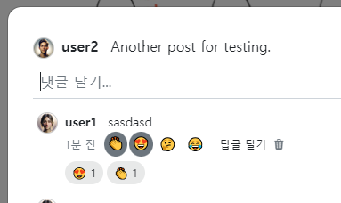

- cookie 인증 유튜브: https://www.youtube.com/watch?v=EO9XWml9Nt0
- 로그인 참고 깃허브(fastapi + htmx + pydantic): https://github.dev/sammyrulez/htmx-fastapi/blob/main/templates/owner_form.html
- ImageReq참고: https://github.dev/riseryan89/imizi-api/blob/main/app/middlewares/access_control.py
- **진짜배기 s3 세팅: https://wooogy-egg.tistory.com/77**
- **post개발 이후, s3 다운로드 참고 github: https://github.com/jrdeveloper124/file-transfer/blob/main/main.py#L30**
    - 유튜브: https://www.youtube.com/watch?v=mNwO_z6faAw
- **s3 boto3 드릴 블로그**: https://dschloe.github.io/aws/04_s3/s3_basic/
- **boto3 client말고 session으로 메서드들 정리 튜토리얼: https://thecodinginterface.com/blog/aws-s3-python-boto3/**

- bootstrap + github 인스타클론 참고:
    - 유튜브: https://www.youtube.com/watch?v=ZCvKlyAkjik
    - github: https://github.com/codingvenue/instagram-hompage-clone-bootstrap/blob/master/index.html
- django stream을 포함한 story : https://www.youtube.com/watch?v=5fG5xaIGzoI&list=WL&index=8&t=4s
- jinja2 지존 튜토리얼 블로그: https://ttl255.com/jinja2-tutorial-part-4-template-filters/
    - recursive: https://stackoverflow.com/questions/23657796/sum-a-value-inside-a-loop-in-jinja
    - 누적합: https://stackoverflow.com/questions/7537439/how-to-increment-a-variable-on-a-for-loop-in-jinja-template
    - list변경 post.likes -> like.user_id list로 : https://stackoverflow.com/questions/31895602/ansible-filter-a-list-by-its-attributes
- todo:
    - form
      validation: https://medium.com/@soverignchriss/asynchronous-form-field-validation-with-htmx-and-django-eb721165b5e8
- comment: https://www.youtube.com/watch?v=T5Jfb_LkoV0&list=PL5E1F5cTSTtTAIw_lBp1hE8nAKfCXgUpW&index=14
- reply: https://github.dev/tcxcx/django-webapp/tree/main/a_inbox/templates/a_inbox

- htmx
  - 검증: https://github.com/bigskysoftware/htmx/issues/75

### 카운트 집계(결과물 tuplie list)를 위해 Schema에 property로 정의
1. CommentSchema에 집계 property를 정의한다.
    - Counter를 사용해서 가지고 있는 모든 reactions을 집계한다.
    - reactions가 없으면 결과물 tuple list 대신 빈list를 early return 한다.
    - **`dict.items() 후, list()를` 씌우면 key,value tuple list가 반환된다.**
    ```python
    class CommentSchema(BaseModel):
        #...
        
        @property
        def count_by_reactions(self):
            if not self.reactions:
                return []
            
            reaction_counts = Counter()
            for reaction in self.reactions:
                reaction_counts[reaction.emoji] += 1
                
            return list(reaction_counts.items())
    ```

2. view에서 reactions count를 jinja2로 한번 찍어본다.
    ```python
    {{ comment.count_by_reactions }}
    ```
    


3. 인증 되었으니, tuple list를 순회하며, static을 대신한다.
    ```html
    {# reaction(emoji) count  view #}
    <div class="fs-7 d-flex gap-1 align-items-center flex-wrap my-0 py-1">
        
        <span class="rounded-pill bg-dark bg-opacity-10 px-2 py-1 flex-grow-0 flex-shrink-0 flex-basis-auto">
            {{ reaction }} {{ count }}
        </span>
        
    </div>
    ```
    

4. 이제 comment emoji checked속성 여부를 확인하기 위해 `user_reactioned_emojis`을 set해서 썼던게 남아있지만,
    - **backend에서 동적변화시킬 놈으로서 include + render될 예정이므로, `새롭게 set`해서 emoji 포함여부를 확인한다.**
    - 이 때, 포함되어있으면 파란색글자 + 파란색배경 + border를 추가한다.
    ```html
    
    <div class="fs-7 d-flex gap-1 align-items-center flex-wrap my-0 py-1">
        
            <span class="rounded-pill px-2 py-1 flex-grow-0 flex-shrink-0 flex-basis-auto
                            bg-opacity-10 border border-1 border-primary-subtle text-primary bg-primarytext-dark bg-dark
                        ">
                {{ reaction }} {{ count }}
            </span>
        
    </div>
    ```
    

5. **`comment_reactions_count.html`로 추출한 뒤, `hx-target이 될 예정으로서 id를 추가`하고 include하고, 리액션 버튼의 hx-target과 hx-swap을 지정한다.**
    ```html
    
    <div id="comment-reactions-count" class="fs-7 d-flex gap-1 align-items-center flex-wrap my-0 py-1">
        
        <span class="rounded-pill px-2 py-1 flex-grow-0 flex-shrink-0 flex-basis-auto
                        bg-opacity-10 border border-1 border-primary-subtle text-primary bg-primarytext-dark bg-dark
                    ">
            {{ reaction }} {{ count }}
        </span>
        
    </div>
    ```
    ```html
    {# reaction(emoji) count  view #}
    
    ```
    ```html
    <!-- 이모지 버튼 -->
    
    <form hx-post="{{ url_for('pic_hx_reaction_comment', comment_id=comment.id) }}"
          hx-trigger="change"
          x-data="{recentlyEmoji: ''}"
          hx-target="#comment-reactions-count"
          hx-swap="outerHTML"
    >
    ```

6. route에서는 이제 hx-swap될, include뽑은 html을 반환하는데
    - **orm이 아니므로, 추가된 reaction이 반영될 수 있게, `최신 comment를 한번더 get해서 context`로 넣어준다.**
    - 응답되는 html이 있으므로, 더이상 trigger는 필요없다.
    ```python
    @app.post("/comments/{comment_id}/reaction")
    @login_required
    async def pic_hx_reaction_comment(
            request: Request,
            comment_id: int,
            emoji: str = Form(alias='emoji'),
    ):
        #...
   
       # 2-1) 좋아요를 누른 상태면, 좋아요를 삭제하여 취소시킨다.
        #      => 삭제시, user_id, post_id가 필요한데, [누른 좋아요를 찾은상태]로서, 삭제시만 id가 아닌 schema객체를 통째로 넘겨 처리한다.
        if user_exists_reaction:
            delete_reactioned_comment(user_exists_reaction)
    
            comment = get_comment(comment_id, with_reactions=True)
            return render(request, 'picstargram/post/partials/comment_reactions_count.html',
                          context=dict(comment=comment),
                          messages=Message.DELETE.write('reaction', text=f"Delete to Reaction {emoji}",
                                                        level=MessageLevel.WARNING),
                          )
    
        # 2-2) 좋아요를 안누른상태면, 좋아요를 생성한다.
        else:
            # 2-2-1) 좋아요 안누른상태 &  uncehck상태가 아닐 때만 생성
            data = dict(user_id=user_id, comment_id=comment_id, emoji=emoji)
            reaction = create_reactioned_comment(data)
    
            comment = get_comment(comment_id, with_reactions=True)
            return render(request, 'picstargram/post/partials/comment_reactions_count.html',
                          context=dict(comment=comment),
                          messages=Message.SUCCESS.write('reaction', text=f"Thanks to Reaction {emoji}",
                                                         level=MessageLevel.SUCCESS),
                          )
    ```
    

### AWS 명령어 모음

```shell
%UserProfile%\.aws\credentials
%UserProfile%\.aws\config

aws configure list-profiles

# 등록
aws configure --profile {프로젝트명} # ap-northeast-2 # json
# 재사용시
set AWS_PROFILE={프로젝트명}

cat ~\.aws\credentials


# S3
aws s3 ls --profile {프로필명}
aws s3 mb s3://{버킷명}
aws s3 ls --profile {프로필명}


aws s3 cp {파일경로} s3://{버킷명}
aws s3 cp {파일경로} s3://{버킷명}/{폴더명} --acl public-read
```

#### IAM key 변경

1. root사용자 로그인 > IAM > 해당사용자 클릭 > `보안 자격 증명` 탭 > 액세스키
2. 기존 key `비활성화` 후 필요시 삭제 (있다가 cli에서 확인하고 비활성화하면 더 좋을 듯)
3. 새 액세스키 AWS CLI 선택하여 발급
4. 터미널 열어서 `AWS CLI`를 통해 해당프로젝트의 profile key들 덮어쓰기
    ```shell
    aws configure list-profiles # 현재 프로필들 확인
    cat ~\.aws\credentials # 현재 프로필들의 key설정값들 확인 (콘솔에서 비활성화시킨 것과 일치하는지)
    aws configure --picstargram # 특정프로필 key 덮어쓰기 with 콘솔
    ```

5. 프로젝트 .env의 `aws_access_key_id`와 `aws_secret_access_key`를 변경

   


