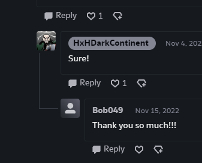
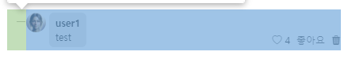
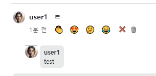
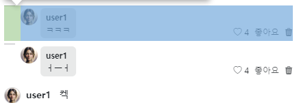
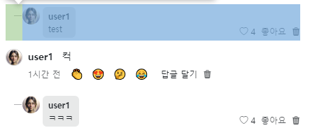
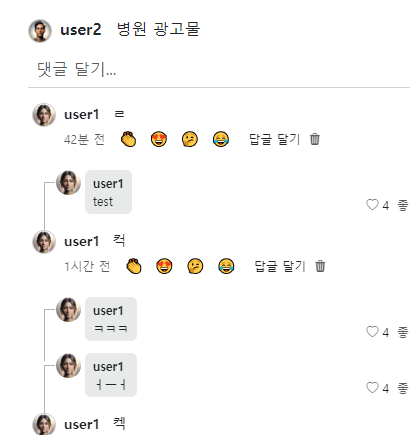
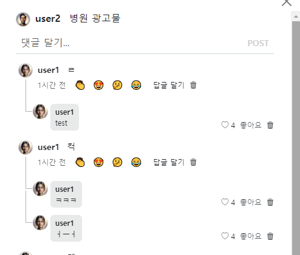
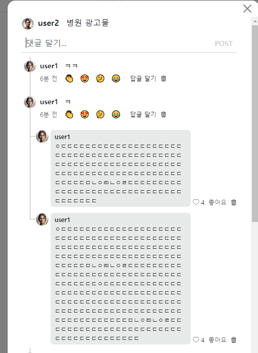
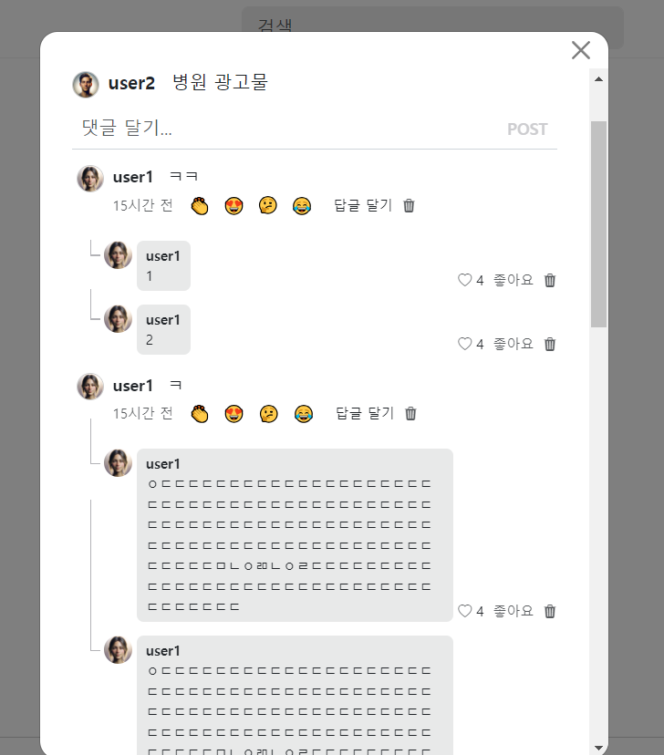

- cookie 인증 유튜브: https://www.youtube.com/watch?v=EO9XWml9Nt0
- 로그인 참고 깃허브(fastapi + htmx + pydantic): https://github.dev/sammyrulez/htmx-fastapi/blob/main/templates/owner_form.html
- ImageReq참고: https://github.dev/riseryan89/imizi-api/blob/main/app/middlewares/access_control.py
- **진짜배기 s3 세팅: https://wooogy-egg.tistory.com/77**
- **post개발 이후, s3 다운로드 참고 github: https://github.com/jrdeveloper124/file-transfer/blob/main/main.py#L30**
    - 유튜브: https://www.youtube.com/watch?v=mNwO_z6faAw
- **s3 boto3 드릴 블로그**: https://dschloe.github.io/aws/04_s3/s3_basic/
- **boto3 client말고 session으로 메서드들 정리 튜토리얼: https://thecodinginterface.com/blog/aws-s3-python-boto3/**

- bootstrap + github 인스타클론 참고:
    - 유튜브: https://www.youtube.com/watch?v=ZCvKlyAkjik
    - github: https://github.com/codingvenue/instagram-hompage-clone-bootstrap/blob/master/index.html
- django stream을 포함한 story : https://www.youtube.com/watch?v=5fG5xaIGzoI&list=WL&index=8&t=4s
- jinja2 지존 튜토리얼 블로그: https://ttl255.com/jinja2-tutorial-part-4-template-filters/
    - recursive: https://stackoverflow.com/questions/23657796/sum-a-value-inside-a-loop-in-jinja
    - 누적합: https://stackoverflow.com/questions/7537439/how-to-increment-a-variable-on-a-for-loop-in-jinja-template
    - list변경 map post.likes -> like.user_id list로 : https://stackoverflow.com/questions/31895602/ansible-filter-a-list-by-its-attributes
    - loop의 다양한 변수들(나중에 재귀시 재귀레벨 확인하자): https://stackoverflow.com/questions/57414751/how-to-use-enumeratezipseq1-seq2-in-jinja2
- todo:
    - form
      validation: https://medium.com/@soverignchriss/asynchronous-form-field-validation-with-htmx-and-django-eb721165b5e8
- comment: https://www.youtube.com/watch?v=T5Jfb_LkoV0&list=PL5E1F5cTSTtTAIw_lBp1hE8nAKfCXgUpW&index=14
- reply: https://github.dev/tcxcx/django-webapp/tree/main/a_inbox/templates/a_inbox

- htmx
  - 검증: https://github.com/bigskysoftware/htmx/issues/75

### reply마다, comment에서 내려오는 line그려주기 -> 핵심은 여백을 준 new wrapper absolute 부모태그

- 아래사이트에서 참고했다.
    - https://www.deviantart.com/hxhdarkcontinent
    

#### 들여쓰기 대비 가로선부터 긋기

1. 답글이 반복되는 곳의 가장바깥에서 단순히 `ps-3`으로 들여쓰기를 줬는데, `css로 들여쓰기 계산`하기 위해서, ps-3를 제거
    ```html
        <!--<div class="mt-1 mb-2 ps-3">-->
        <div class="mt-1 mb-2">
            {# 전체 답글 #}
            
            <div hx-trigger="repliesChanged-{{ comment.id }} from:body"
                 hx-get="{{ url_for('pic_hx_show_replies', comment_id=comment.id) }}"
                 hx-target="this"
            >
                
            </div>
    ```
   
2. replies -> reply형태로 돌아가고 있기 때문에, 일단 reply단위에서 style태그로 그려준다.
    - reply.html로 이동

3. reply.html의 `ps를 부여해줄 부모 태그`에 `.reply-wrapper`클래스를 부여하고,  `ps-3`에 해당하는 `padding-left:1.5rem`을 확인해서, 넣어준다.
    - **이 때, 답글공간전체를 싸는 div가 부모-relative예정**
    - **답글의 젤 왼쪽 div(프로필사진 공간?)를 자식-absolute예정**
    ```html
    <style>
        .reply-wrapper {
            padding-left: 1.5rem;
        }
    </style>
    
    {# 답글 내용 #}
    <div class="reply-wrapper d-flex justify-content-between align-items-end py-1 w-100 mb-1">
        {# 답글 정보 = 사진/ 닉넴|body #}
        {#<div class="d-flex fs-7">#}
        <div class="d-flex fs-7">
            {# 사진 #}
            
    
    ```
    

4. **일단 부모가 벌려준 padding 1.5rem을 가지고 `자식 가장 왼쪽요소인 프로필 div`를 자식으로서 `가로선을 ::after`로 그릴 것이다.**
    - **젤 왼쪽 자식div에 `reply-xxx(profile)` css를 정의해주고**
    - **선이 시작되는, `자신(reply-xxx)를 position-absloute`로 그리기 위해, `부모(reply-wrapper)는 relative`부터 만들어줘야한다.**
    - `자식css`에서 `::after`로 선을 긋는데, ::before, ::after를 그릴 땐,`content:''`를 넣어주고 시작이다.
    ```html
    {# 답글 내용 #}
    <div class="reply-wrapper d-flex justify-content-between align-items-end py-1 w-100 mb-1">
        {# 답글 정보 = 사진/ 닉넴|body #}
        <div class="reply-profile d-flex fs-7">
            {# 사진 #}
            
    ```
    ```html
    <style>
        .reply-wrapper {
            padding-left: 1.5rem;
    
            position: relative;
        }
    
        {# reply선을 긋는 자식 젤 왼쪽 div #}
        .reply-profile::after {
            position: absolute;
            content: '';
    
        }
    </style>
    ```


5. **가로선을 그을거면 `height:1px`로 `두께`를 정해놓고 -> `width는 선의 길이`가 되며, `background가 선의 색`이 된다.**
    - 일단 들여쓰기만큼을 선의길이(width)로 주고 회색을 줘보자.
    ```css
    .reply-profile::after {
        position: absolute;
        content: '';
    
        height: 1px;
        width: 1.5rem;
        background: #b3b3b7;
    }
    ```
    

6. **absolute로 뭔가를 그릴 때는, `top/left` 나 `bottom/right`로 `absolute 부모태그 기준` 시작지점을 지정할 수 있다.**
    - **일단 `top:0, left:0`을 지정해서 `시작되는 위치`가 `여백을 줬던 부모`의 좌상단인지 확인한다.**
    ```css
    .reply-profile::after {
        position: absolute;
        content: '';
    
        height: 1px;
        width: 1.5rem;
        background: #b3b3b7;
    
        top: 0;
        left: 0;
    }
    ```
    

7. **통상적으로 `left는 들여쓰기의 절반`에서 시작하면 될 것이다.**
    - **`top`은 `프로필사진높이의 1/2 ( 25px/2) `에서, 원래 `프로필사진 위쪽에 가진 pt-1 ( 0.25rem)만큼 더 내린다`.**
    - **`width`의 가로길이는, 들여쓰기의 절반 시작(left) -> `들여쓰기 절반 만큼 하면, 딱 달라붙으니 1~2px정도 빼`준다.**
    ```css
    .reply-profile::after {
        position: absolute;
        content: '';
    
        height: 1px;
        background: #b3b3b7;
    
        top: calc(25px/2 + .25rem); /*프로필사진 세로 1/2 + 프로필사진의 위쪽패딩*/ 
        left: calc(1.5rem/2); /*왼쪽들여쓰기의 절반*/
        width: calc(1.5rem/2 - 1px); /*왼쪽들여쓰기의 절반만큼 남았는데, 1px 빼서 프로필사진과 띄워주기*/
    }
    ```
    

#### 세로선 by before -> 길이는 모르니 일단,, 100%로  
1. 세로선은 `width:1px`로 선을 그리고, `height:100%`로 일단 준다.
    - **left는 `absolute부모의 들여쓰기 절반`으로 가로선과 똑같이 주고**
    - **top도 `가로선이 내려온만큼(프로필1/2 + 마진)` 내려오게 한다.**
    ```css
    .reply-profile::before {
        position: absolute;
        content: '';
    
        width: 1px;
        height: 100%;
        background: #b3b3b7;
    
        top: calc(25px/2 + .25rem); /*{# 프로필사진 세로 1/2 + 프로필사진의 위쪽패딩 #}*/
        left: calc(1.5rem/2); /*{#  왼쪽들여쓰기의 절반 #}*/
    }
    ```
    


2. **이 때, `top`에 `-100%`를 더하면, `내려온만큼 올리는 효과`로서 내려온만큼을 뒤집어준다**
    ```css
    .reply-profile::before {
        position: absolute;
        content: '';
    
        width: 1px;
        height: 100%;
        background: #b3b3b7;
    
        /*top: calc(25px/2 + .25rem); #}{# 프로필사진 세로 1/2 + 프로필사진의 위쪽패딩 */
        top: calc(-100% + calc(25px / 2 + .25rem)); /*{# 프로필사진 세로 1/2 + 프로필사진의 위쪽패딩  + -100%로 내려온만큼 뒤집기#}*/
        left: calc(1.5rem / 2); /*{#  왼쪽들여쓰기의 절반 #}*/
    }
    ```
    

3. 댓글이 길 경우,  height를 reply 100%로 할 경우, 넘쳐버린다.
    

4. 댓글이 길경우를 대비해서 `height: 35%`로 수정하고, `top은 -35%`로 수정하면 된다.
    ```css
    .reply-profile::before {
        position: absolute;
        content: '';
    
        width: 1px;
        /*{#height: 100%;#}*/
        background: #b3b3b7;
    
        left: calc(1.5rem/2);/* {#  왼쪽들여쓰기의 절반 #}*/
    
        height: 35%;
        top: calc(-35% + calc(25px/2 + .25rem));  /*{#프로필사진 세로 1/2 + 프로필사진의 위쪽패딩  + -100%로 내려온만큼 뒤집기#}*/
    }
    ```
5. 이제 높이의 30%밖에 안되는 세로선을, `reply 순서만큼 x` 해주도록 해보자.

### style="" 속성에 --변수 선언하여 -> 적용 css에서 var(--변수) 사용하기
1. css 적용을 받을 태그인 `div.reply-profile`에 **`style="--reply_index: {{loop.index}}"`를 써서, 1부터시작하는 순서를 css에서도 사용할 수 있게 한다.**
    - **하지만, jinja for문에 `직접적인 scope 내부`가 아니라 `include된 공간`이라서, for reply의 reply는 쓸 수 있어도 `loop변수는 못쓴다.`**
        - 참고: loop의 다양한 변수들(나중에 재귀시 재귀레벨 확인하자): https://stackoverflow.com/questions/57414751/how-to-use-enumeratezipseq1-seq2-in-jinja2
    - **loop를 못찾겠다고 에러난다 -> include된 환경에서는 for 안에 있어도 loop.index를 못쓴다.**
2. include환경에서 쓸 수 있게 하려면 따로 `set loop_index = loop.index`를 include 외부 for문 내에서 직접변수로 줘야한다.
    ```html
    
        
        
    
    ```
    ```html
    <div class="reply-wrapper">
        <div class="d-flex justify-content-between align-items-end py-1 w-100 mb-1">
            {# 답글 정보 = 사진/ 닉넴|body #}
            <div class="reply-profile d-flex fs-7" style="--reply_index:{{ loop_index }}">
    ```
3. **이제 세로선을 긋는 css(`.reply-profile::before`) 로 가서, style속성으로 입력했던 변수 `--reply_index`를 `var()`를 씌워서 사용하면 된다.**
    - height를 35% ->  `calc(35% * var(--reply_index))`로 곱하고
    - **top은 -35% -> `calc(-35% * var(--reply_index)) `로  -를 35%에만 유지하면서 곱해주면 된다.**
    ```css
        .reply-profile::before {
    
            /*height: 35%;*/

            /*top: calc(-35% + calc(25px/2 + .25rem));*/
    
            height: calc(35% * var(--reply_index)); /*{# 프로필사진 세로 1/2 + 프로필사진의 위쪽패딩  + -100%로 내려온만큼 뒤집기#}*/
            top: calc(  calc(-35% * var(--reply_index))    + calc(25px/2 + .25rem));  /*{#프로필사진 세로 1/2 + 프로필사진의 위쪽패딩  + -100%로 내려온만큼 뒤집기#}*/
        }
    ```
4. 이 때, height를 조금 낮추고 싶은데, height를 건들면 top까지 바뀌므로 **곱해지는 reply_index의 값인 loop_index에 0.7을 곱해서 줄이자.**
    ```html
    <div class="reply-profile d-flex fs-7" style="--reply_index:{{ loop_index * 0.7  }}">
    ```
    

5. 반복되는 style태그 대신, style.css내부로 코드를 옮긴다.
    ```css
    /* reply여백 & 가로세로선 */
    
    .reply-wrapper {
        padding-left: 1.5rem;
    
        position: relative;
    }
    
    
    .reply-profile::after {
        position: absolute;
        content: '';
    
        height: 1px;
        background: #b3b3b7;
    
        top: calc(25px / 2 + .25rem); /*프로필사진 세로 1/2 + 프로필사진의 위쪽패딩 */
        left: calc(1.5rem / 2); /*왼쪽들여쓰기의 절반*/
        width: calc(1.5rem / 2 - 3px); /*왼쪽들여쓰기의 절반만큼 남았는데, 1px 빼서 프로필사진과 띄워주기*/
    }
    
    .reply-profile::before {
        position: absolute;
        content: '';
    
        width: 1px;
        background: #b3b3b7;
    
        left: calc(1.5rem / 2); /* 왼쪽들여쓰기의 절반*/
    
        height: calc(35% * var(--reply_index)); /*{# 프로필사진 세로 1/2 + 프로필사진의 위쪽패딩  + -100%로 내려온만큼 뒤집기#}*/
        top: calc(calc(-35% * var(--reply_index)) + calc(25px / 2 + .25rem)); /*{#프로필사진 세로 1/2 + 프로필사진의 위쪽패딩  + -100%로 내려온만큼 뒤집기#}*/
    }
    ```
### AWS 명령어 모음

```shell
%UserProfile%\.aws\credentials
%UserProfile%\.aws\config

aws configure list-profiles

# 등록
aws configure --profile {프로젝트명} # ap-northeast-2 # json
# 재사용시
set AWS_PROFILE={프로젝트명}

cat ~\.aws\credentials


# S3
aws s3 ls --profile {프로필명}
aws s3 mb s3://{버킷명}
aws s3 ls --profile {프로필명}


aws s3 cp {파일경로} s3://{버킷명}
aws s3 cp {파일경로} s3://{버킷명}/{폴더명} --acl public-read
```

#### IAM key 변경

1. root사용자 로그인 > IAM > 해당사용자 클릭 > `보안 자격 증명` 탭 > 액세스키
2. 기존 key `비활성화` 후 필요시 삭제 (있다가 cli에서 확인하고 비활성화하면 더 좋을 듯)
3. 새 액세스키 AWS CLI 선택하여 발급
4. 터미널 열어서 `AWS CLI`를 통해 해당프로젝트의 profile key들 덮어쓰기
    ```shell
    aws configure list-profiles # 현재 프로필들 확인
    cat ~\.aws\credentials # 현재 프로필들의 key설정값들 확인 (콘솔에서 비활성화시킨 것과 일치하는지)
    aws configure --picstargram # 특정프로필 key 덮어쓰기 with 콘솔
    ```

5. 프로젝트 .env의 `aws_access_key_id`와 `aws_secret_access_key`를 변경

   


