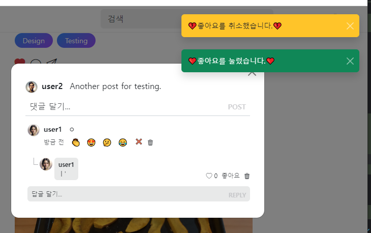
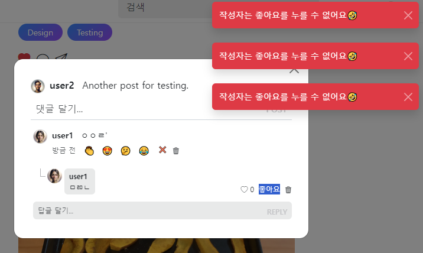
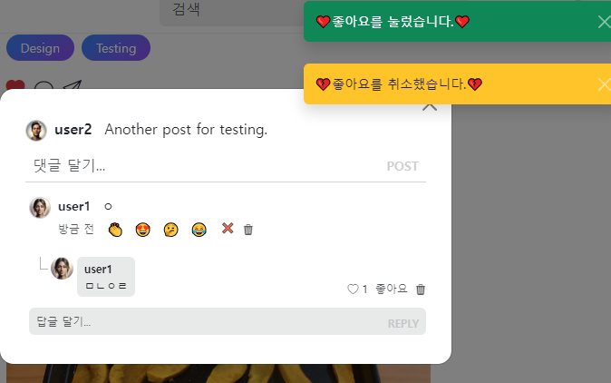
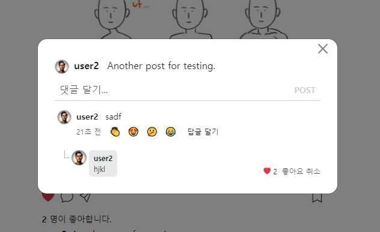
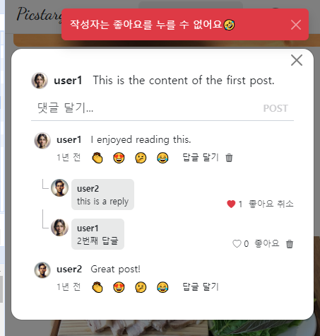

- cookie 인증 유튜브: https://www.youtube.com/watch?v=EO9XWml9Nt0
- 로그인 참고 깃허브(fastapi + htmx + pydantic): https://github.dev/sammyrulez/htmx-fastapi/blob/main/templates/owner_form.html
- ImageReq참고: https://github.dev/riseryan89/imizi-api/blob/main/app/middlewares/access_control.py
- **진짜배기 s3 세팅: https://wooogy-egg.tistory.com/77**
- **post개발 이후, s3 다운로드 참고 github: https://github.com/jrdeveloper124/file-transfer/blob/main/main.py#L30**
    - 유튜브: https://www.youtube.com/watch?v=mNwO_z6faAw
- **s3 boto3 드릴 블로그**: https://dschloe.github.io/aws/04_s3/s3_basic/
- **boto3 client말고 session으로 메서드들 정리 튜토리얼: https://thecodinginterface.com/blog/aws-s3-python-boto3/**

- bootstrap + github 인스타클론 참고:
    - 유튜브: https://www.youtube.com/watch?v=ZCvKlyAkjik
    - github: https://github.com/codingvenue/instagram-hompage-clone-bootstrap/blob/master/index.html
- django stream을 포함한 story : https://www.youtube.com/watch?v=5fG5xaIGzoI&list=WL&index=8&t=4s
- jinja2 지존 튜토리얼 블로그: https://ttl255.com/jinja2-tutorial-part-4-template-filters/
    - recursive: https://stackoverflow.com/questions/23657796/sum-a-value-inside-a-loop-in-jinja
    - 누적합: https://stackoverflow.com/questions/7537439/how-to-increment-a-variable-on-a-for-loop-in-jinja-template
    - list변경 map post.likes -> like.user_id
      list로 : https://stackoverflow.com/questions/31895602/ansible-filter-a-list-by-its-attributes
    - loop의 다양한 변수들(나중에 재귀시 재귀레벨
      확인하자): https://stackoverflow.com/questions/57414751/how-to-use-enumeratezipseq1-seq2-in-jinja2
- todo:
    - form
      validation: https://medium.com/@soverignchriss/asynchronous-form-field-validation-with-htmx-and-django-eb721165b5e8
- comment: https://www.youtube.com/watch?v=T5Jfb_LkoV0&list=PL5E1F5cTSTtTAIw_lBp1hE8nAKfCXgUpW&index=14
- reply: https://github.dev/tcxcx/django-webapp/tree/main/a_inbox/templates/a_inbox

- htmx
    - 검증: https://github.com/bigskysoftware/htmx/issues/75

1. liked_post를 참고해서 작성한다.
    - post를 작성할 때, json(예제데이터X), load, init함수, 전역변수, schema는 작성해놨다.

2. crud함수를 만든다.
    - liked_post의 것을 복사해서 수정한다.
    - delete만 id가 아닌 schema로 처리한다.
    ```python
    def get_liked_reply(like_id: int, with_user: bool = False):
        like = next((like for like in liked_replies if like.id == like_id), None)
        if not like:
            return None
    
        if with_user:
            user = get_user(like.user_id)
    
            if not user:
                return None
    
            like.user = user
    
        return like
    
    
    def get_liked_replies(reply_id: int, with_user: bool = False):
        # one을 eagerload할 경우, get_like(,with_user=)를 이용하여 early return
        # -> 아닐 경우, list compt fk조건으로 데이터 반환
        if with_user:
            return [
                get_liked_reply(like.id, with_user=True) for like in liked_replies if like.reply_id == reply_id
            ]
    
        return [like for like in liked_replies if like.reply_id == reply_id]
    
    
    def create_liked_reply(data: dict):
        user = get_user(data['user_id'])
        if not user:
            raise Exception(f"해당 user(id={data['user_id']})가 존재하지 않습니다.")
        reply = get_reply(data['reply_id'])
        if not reply:
            raise Exception(f"해당 reply(id={data['reply_id']})가 존재하지 않습니다.")
    
        try:
            liked_reply_schema = LikedReplySchema(**data)
            # id + created_at, ~~updated_at~~ 부여
            liked_reply_schema.id = find_max_id(liked_replies) + 1
            liked_reply_schema.created_at = datetime.datetime.now()
            liked_replies.append(liked_reply_schema)
    
        except Exception as e:
            raise e
    
        return liked_reply_schema
    
    
    def delete_liked_reply(liked_reply_schema: LikedReplySchema):
        user = get_user(liked_reply_schema.user_id)
        if not user:
            raise Exception(f"해당 user(id={liked_reply_schema.user_id})가 존재하지 않습니다.")
        reply = get_reply(liked_reply_schema.reply_id)
        if not reply:
            raise Exception(f"해당 reply(id={liked_reply_schema.reply_id})가 존재하지 않습니다.")
    
        global liked_replies
    
        liked_replies = [like for like in liked_replies if
                       not (like.reply_id == liked_reply_schema.reply_id and like.user_id == liked_reply_schema.user_id)]
    ```

### many-중간테이블(LikedReply)로서 one-호출메인(ReplySchema)에 관계필드 추가 및 one의 조회(get_)함수 옵션 추가

1. Reply에 관계필드를 추가하고
    ```python
    class ReplySchema(BaseModel):
        # ...
        likes: Optional[List['LikedReplySchema']] = []
    ```
2. Reply조회함수에 옵션을 추가한다.
    ```python
    # def get_reply(reply_id: int, with_user: bool = False):
    def get_reply(reply_id: int, with_user: bool = False, with_likes:bool = False):
        reply = next((reply for reply in replies if reply.id == reply_id), None)
        if not reply:
            return None
    
        if with_user:
            user = get_user(reply.user_id)
    
            if not user:
                return None
            
            reply.user = user
            
        # likes(중간테이블) 구현후, with_likes 추가
        if with_likes:
            reply.likes = [
                get_liked_reply(like.id, with_user=True) for like in liked_replies if like.reply_id == reply.id
            ]
    
        return reply
    ```

   3. 복수 조회에서도 추가해준다.
       - 복수조회에서는 with가 여러개일 경우 경우의 수를 따진다.
       - **get_comments()를 참고한다. 하나가 없을때를 2경우, 모두 있을때, else 모두없을때**
       ```python
       def get_replies(comment_id: int, with_user: bool = False, with_likes: bool = False):
           #### get_복수에서는 부모검사하지말자! 재귀발생하게 됨.
           # get_comment는, post.comments 만들 때 쓰는데, 여기서도 또 쓴다.
           # => 앞으로 부모검사는 `조회메서드안에 있으면 주석처리 -> 조회전 외부에서 하자.` 상하위도메인의 순수조회 vs 검사용조회가 중복되어 재귀를 발생시킨다.
           # comment = get_comment(comment_id)
           # if not comment:
           #     return []
    
           # one을 eagerload할 경우, get_replies(,with_user=)를 이용하여 early return
           # -> 아닐 경우, list compt fk조건으로 데이터 반환
           # if with_user:
           #     return [
           #         get_reply(reply.id, with_user=True) for reply in replies if reply.comment_id == comment_id
           #     ]
    
           if with_user and not with_likes:
               return [
                   get_reply(reply.id, with_user=True) for reply in replies if reply.comment_id == comment_id
               ]
           elif not with_user and with_likes:
               return [
                   get_reply(reply.id, with_likes=True) for reply in replies if reply.comment_id == comment_id
               ]
           elif with_user and with_likes:
               return [
                   get_reply(reply.id, with_user=True, with_likes=True) for reply in replies if reply.comment_id == comment_id
               ]
    
           return [reply for reply in replies if reply.comment_id == comment_id]
       ```

4. 상위도메인에서 복수조회함수를 사용할 때, 그 좋아요옶션을 추가하지말고, 상황에 따라 같이 따라가도록 하자.
    ```python
    def get_comment(comment_id: int, with_user: bool = False, with_replies: bool = True,
                    with_reactions=True
                    ):
        # ...
        if with_replies:
            comment.replies = get_replies(comment_id, with_user=True, with_likes=True)
    ```

### view에 reply의 좋아요 적용하기

1. reply.html `좋아요 count`에는 reply.likes | length 필터로 처리해준다.
    ```html
    {# 좋아요 = 아이콘 + 좋아요갯수 / 좋아요버튼 #}
    <div class="d-flex align-items-center gap-1 cursor-pointer">
        <a href="#" class="text-decoration-none text-muted">
            <i class="bi bi-heart"></i>
        </a>
        <span>{{ reply.likes | length }}</span>
    </div>
    <a href="#" class="text-decoration-none text-nowrap text-muted"
       style="cursor: pointer;"
    >
        좋아요
    </a>
    ```

2. `좋아요 토글 태그(a)`에는 hx요청을 보낸다. 일단은 hx-swap="none"으로 반응을 먼저 본다.
    ```html
    <a hx-post="{{ url_for('pic_hx_like_reply', reply_id= reply.id ) }}"
       hx-trigger="click"
       hx-swap="none"
       class="text-decoration-none text-nowrap text-muted cursor-pointer"
    >
        좋아요
    </a>
    ```

3. 해당 route를 post를 참고하며 + `post like route`의 `바로 아래 작성 해놓고 공통로직이 많으니 데코레이터 처리할 예정`이다.
    - 응답대신 `noContent:False의 trigger 로 modal안닫히게` 하고 + messages만 보낸다.
    - **test를 위해서 자기자신도 누를시 에러X도 주석처리**
    ```python
    @app.post("/replies/{reply_id}/like")
    @login_required
    async def pic_hx_like_reply(
            request: Request,
            reply_id: int
    ):
        reply = get_reply(reply_id, with_user=True, with_likes=True)
        likes = reply.likes
        user_id = request.state.user.id
    
        # 1) 글작성자 <-> 좋아요누른 유저면, 안된다고 메세지를 준다.
        # if reply.user.id == user_id:
        #     raise BadRequestException(
        #         '작성자는 좋아요를 누를 수 없어요🤣',
        #         context=dict(reply=reply),
        #         html=f"{len(reply.likes)}",
        #         template_name="picstargram/post/partials/reply_likes_button.html"
        #     )
    
        # 2) 현재 post의 likes 중에 내가 좋아요 누른 적이 있는지 검사한다.
        user_exists_like = next((like for like in likes if like.user_id == user_id), None)
        # 2-1) 좋아요를 누른 상태면, 좋아요를 삭제하여 취소시킨다.
        #      => 삭제시, user_id, reply_id가 필요한데, [누른 좋아요를 찾은상태]로서, 삭제시만 id가 아닌 schema객체를 통째로 넘겨 처리한다.
        if user_exists_like:
            delete_liked_reply(user_exists_like)
            return render(request, "",
                          hx_trigger={'noContent': False},
                          messages=Message.DELETE.write('좋아요', text="💔좋아요를 취소했습니다.💔", level=MessageLevel.WARNING),
                          )
        # 2-2) 좋아요를 안누른상태면, 좋아요를 생성한다.
        else:
            data = dict(user_id=user_id, reply_id=reply_id)
            like = create_liked_reply(data)
            return render(request, "",
                          hx_trigger={'noContent': False},
                          messages=Message.SUCCESS.write('좋아요', text="❤좋아요를 눌렀습니다.❤", level=MessageLevel.SUCCESS),
                          )
    ```
    

4. **test를 위해 에러낼때, modal안꺼지게 TemplateException에 contenxt/template_name/html이외에 `hx_trigger`도 전달할 수 있게 추가하자.**
    ```python
    # 1) 글작성자 <-> 좋아요누른 유저면, 안된다고 메세지를 준다.
    if reply.user.id == user_id:
        raise BadRequestException(
            '작성자는 좋아요를 누를 수 없어요🤣',
            hx_trigger={'noContent': False},
      )
    ```
    ```python
    class BadRequestException(TemplateException):
        def __init__(
                self,
                message,
                ex: Exception = None,
                hx_trigger=None,
                context=None,
                template_name=None,
                html=None
        ):
            super().__init__(
                message=message,
                ex=ex,
                hx_trigger=hx_trigger,
                context=context,
                template_name=template_name,
                html=html,
            )
    ```
   
    ```python
    class TemplateException(Exception):
        """
        oob message전달을 위해, 204를 제외한 200~399 까지 swap이 일어나는 코드로 반환한다.
        """
        status_code: int
        message: str
        ex: Exception
        hx_trigger: dict
        context: dict
        template_name: str
    
        def __init__(self,
                     status_code: int = status.HTTP_200_OK,
                     message: str = None,
                     ex: Exception = None,
                     hx_trigger=None,
                     context: dict = None,
                     template_name: str = None,
                     html: str = None
                     ):
            if not (200 <= status_code < 400 or status_code != 204):
                raise Exception('템플릿 오류는 status_code가 200<= < 400 사이이며, 204 또한 제한됩니다.')
    
            self.status_code = status_code
            self.message = message
            self.ex = ex
            self.hx_trigger = hx_trigger if hx_trigger else dict()
            self.context = context if context else dict()
            self.template_name = template_name if template_name else ""
            self.html = html if html else ""
    ```
    ```python
    if isinstance(e, TemplateException):
        return render(request,
                      hx_trigger=e.hx_trigger,
                      template_name=e.template_name,
                      html=e.html,
                      context=e.context,
                      messages=[Message.FAIL.write('', text=f'{str(e)}', level=MessageLevel.ERROR)],
                      )
    ```
    - **이제 noContent:False로 인해, modal이 안꺼진다.**
        


5. hx-swap="none" 대신 , `{{좋아요 count}}만 innerHTML hx-swap`되도록 토글태그의 `hx-target`을 지정한다.
    - **이 때, `id를 쭐 때, 여러반복되는 것이면, 도메인.id를 같이 입력`해야한다.**
    ```html
    <span id="reply-{{ reply.id }}-count">{{ reply.likes | length }}</span>
    ```
    ```html
    <a hx-post="{{ url_for('pic_hx_like_reply', reply_id= reply.id ) }}"
       hx-trigger="click"
       hx-target="#reply-{{ reply.id }}-count"
       hx-swap="innerHTML"
       class="text-decoration-none text-nowrap text-muted cursor-pointer"
    >
        좋아요
    </a>
    ```
   

6. **route에서는 innerHTML에 대한 내용물만 `template_name=`이 아닌 `html=`안에 fstring으로 count값만 넣어준다.**
    ```python
    # 2-1) 좋아요를 누른 상태면, 좋아요를 삭제하여 취소시킨다.
    
    if user_exists_like:
        delete_liked_reply(user_exists_like)
        reply = get_reply(reply_id, with_likes=True)
        return render(request, html=f"{len(reply.likes)}",
                      hx_trigger={'noContent': False},
                      messages=Message.DELETE.write('좋아요', text="💔좋아요를 취소했습니다.💔", level=MessageLevel.WARNING),
                      )
    # 2-2) 좋아요를 안누른상태면, 좋아요를 생성한다.
    else:
        data = dict(user_id=user_id, reply_id=reply_id)
        like = create_liked_reply(data)
        reply = get_reply(reply_id, with_likes=True)
        return render(request, html=f"{len(reply.likes)}",
                      hx_trigger={'noContent': False},
                      messages=Message.SUCCESS.write('좋아요', text="❤좋아요를 눌렀습니다.❤", level=MessageLevel.SUCCESS),
                      )
    ```
    


7. 좋아요아이콘도, 최초렌더링시 바뀌도록 jinja로 처리해준다.
    - 좋아요 포함여부는 `로그인유저` user가 and 도메인.likes를 순회하며 `| selecattr('user_id', 'eq', 값 )`으로 `속성 필터링`을 한 뒤, `| lenth or | count`로 필터링한 것이 존재하는지까지 확인해야한다.
    - **좋아요 전체부분 윗상단에 set으로 먼저 포함여부 변수를 선언해놓고 처리하자.**
    - 일단, 기존 post에서는 `map() 으로 속성으로 변환`하여 순회하던 후 `in`으로 판단했었는데, comment에서 했떤 selectattr 속성필터링을 활용해본다
        ```html
        {##}
        
        ``` 
    - reply에서도 user_id의 속성필터링 하여, 일치하는 것의 갯수를 확인한 변수 `user_exists_reply_like`를 set한 뒤, 아이콘과, 글자를 바꿔준다.
    ```html
    {# 좋아요 = 아이콘 + 좋아요갯수 / 좋아요버튼 #}
    
    <div class="d-flex align-items-center gap-1 cursor-pointer">
        <a href="#" class="text-decoration-none text-muted">
            <i class="bi bi-heart-fill text-danger"></i>
        </a>
        <span id="reply-{{ reply.id }}-count">{{ reply.likes | length }}</span>
    </div>
    <a hx-post="{{ url_for('pic_hx_like_reply', reply_id= reply.id ) }}"
       hx-trigger="click"
       hx-target="#reply-{{ reply.id }}-count"
       hx-swap="innerHTML"
       class="text-decoration-none text-nowrap text-muted cursor-pointer"
    >
        좋아요 취소 
    </a>
    ```
   
8. 최초렌더링에서는 적용되나, `좋아요 토글 버튼` 누를 때, **count 뿐만 아니라 `icon` + `텍스트`도 바뀌어야하는데, `다행히 붙어있다`**
    - 붙어있으면 한꺼번에 잡아서, target을 count span ->  `closest div` 같이 활용해주면 된다.
9. 토글 버튼의 hx-target을 `closest div`로 잡아주고, count span의 id를 제거한다. + hx-swap은 outerHTML로 변경한다.
    ```html
    {# 좋아요 = 아이콘 + 좋아요갯수 / 좋아요버튼 #}
    
    <div class="d-flex align-items-center gap-1 cursor-pointer">
        <a href="#" class="text-decoration-none text-muted">
            <i class="bi bi-heart-fill text-danger"></i>
        </a>
        <span>{{ reply.likes | length }}</span>
    </div>
    <a hx-post="{{ url_for('pic_hx_like_reply', reply_id= reply.id ) }}"
       hx-trigger="click"
       hx-target="closest div"
       hx-swap="outerHTML"
       class="text-decoration-none text-nowrap text-muted cursor-pointer"
    >
        좋아요 취소 
    </a>
    ```
10. 이제 backend에서 동적으로 변환시켜 뿌려주기 위해 html로 추출한다.
    - like와 count가 같이 있으니 `reply_like_button_and_count.html`로 추출한다.
    - 동적id + hx-swap-oob가 없으면 include + 렌더시 뿌려주기가 바로 가능하다.
    - **근데 삭제버튼까지 같이 있어서, 같이 묶어도 되지만, `좋아요 파트만 묶인 div를 하나 씌워준 뒤, 기존 부모가 가지고 있던 .d-flex.gap-2.수직정렬은 포함시켜서 안깨지게 한다`**
    ```html
    {# 답글 좋아요/삭제 #}
    <div class="d-flex align-items-center gap-2 fs-7">
        {# 좋아요 = 아이콘 + 좋아요갯수 / 좋아요버튼 #}
        <div class="d-flex align-items-center gap-2">
            
            <div class="d-flex align-items-center gap-1 cursor-pointer">
                <a href="#" class="text-decoration-none text-muted">
                    <i class="bi bi-heart-fill text-danger"></i>
                </a>
                <span>{{ reply.likes | length }}</span>
            </div>
            <a hx-post="{{ url_for('pic_hx_like_reply', reply_id= reply.id ) }}"
               hx-trigger="click"
               hx-target="closest div"
               hx-swap="outerHTML"
               class="text-decoration-none text-nowrap text-muted cursor-pointer"
            >
                좋아요 취소 
            </a>
        </div>
    
        {# 삭제 #}
        
            <a class="text-decoration-none text-muted cursor-pointer"
               hx-post="{{ url_for('pic_hx_delete_reply', reply_id= reply.id ) }}"
               hx-confirm="정말 삭제하시겠습니까?"
               hx-swap="none"
            >
                <i class="bi bi-trash3-fill"></i>
            </a>
        
    </div>
    ```
    ```html
    {# 좋아요 = 아이콘 + 좋아요갯수 / 좋아요버튼 #}
    
    <div class="d-flex align-items-center gap-2">
        <div class="d-flex align-items-center gap-1 cursor-pointer">
            <a href="#" class="text-decoration-none text-muted">
                <i class="bi bi-heart-fill text-danger"></i>
            </a>
            <span>{{ reply.likes | length }}</span>
        </div>
        <a hx-post="{{ url_for('pic_hx_like_reply', reply_id= reply.id ) }}"
           hx-trigger="click"
           hx-target="closest div"
           hx-swap="outerHTML"
           class="text-decoration-none text-nowrap text-muted cursor-pointer"
        >
            좋아요 취소 
        </a>
    </div>
    ```
    ```html
    {# 답글 좋아요/삭제 #}
    <div class="d-flex align-items-center gap-2 fs-7">
        
        
    
        {# 삭제 #}
        
            <a class="text-decoration-none text-muted cursor-pointer"
               hx-post="{{ url_for('pic_hx_delete_reply', reply_id= reply.id ) }}"
               hx-confirm="정말 삭제하시겠습니까?"
               hx-swap="none"
            >
                <i class="bi bi-trash3-fill"></i>
            </a>
        
    </div>
    ```
    


11. 이제 route에서도, `html=f"{len(reply.likes)}"`가 아닌 `` include와 같은 템플릿의 html로 렌더링해준다.
    ```python
    # 2-1) 좋아요를 누른 상태면, 좋아요를 삭제하여 취소시킨다.
    #      => 삭제시, user_id, reply_id가 필요한데, [누른 좋아요를 찾은상태]로서, 삭제시만 id가 아닌 schema객체를 통째로 넘겨 처리한다.
    if user_exists_like:
        delete_liked_reply(user_exists_like)
        reply = get_reply(reply_id, with_likes=True)
        return render(request, "picstargram/post/partials/reply_likes_button_and_count.html",
                      context=dict(reply=reply),
                      messages=Message.DELETE.write('좋아요', text="💔좋아요를 취소했습니다.💔", level=MessageLevel.WARNING),
                      )
    
    # 2-2) 좋아요를 안누른상태면, 좋아요를 생성한다.
    else:
        data = dict(user_id=user_id, reply_id=reply_id)
        like = create_liked_reply(data)
        reply = get_reply(reply_id, with_likes=True)
        return render(request, "picstargram/post/partials/reply_likes_button_and_count.html",
                      context=dict(reply=reply),
                      messages=Message.SUCCESS.write('좋아요', text="❤좋아요를 눌렀습니다.❤", level=MessageLevel.SUCCESS),
                    )
    ```
    
    

12. **마지막으로 자신은 좋아요 금지 -> 에러시 context와 template 같이 넘겨주도록 변경한다.**
    ```python
    # 1) 글작성자 <-> 좋아요누른 유저면, 안된다고 메세지를 준다.
    if reply.user.id == user_id:
        raise BadRequestException(
            '작성자는 좋아요를 누를 수 없어요🤣',
            context=dict(reply=reply),
            template_name="picstargram/post/partials/reply_likes_button_and_count.html"
        )
    ```
    


### AWS 명령어 모음

```shell
%UserProfile%\.aws\credentials
%UserProfile%\.aws\config

aws configure list-profiles

# 등록
aws configure --profile {프로젝트명} # ap-northeast-2 # json
# 재사용시
set AWS_PROFILE={프로젝트명}

cat ~\.aws\credentials


# S3
aws s3 ls --profile {프로필명}
aws s3 mb s3://{버킷명}
aws s3 ls --profile {프로필명}


aws s3 cp {파일경로} s3://{버킷명}
aws s3 cp {파일경로} s3://{버킷명}/{폴더명} --acl public-read
```

#### IAM key 변경

1. root사용자 로그인 > IAM > 해당사용자 클릭 > `보안 자격 증명` 탭 > 액세스키
2. 기존 key `비활성화` 후 필요시 삭제 (있다가 cli에서 확인하고 비활성화하면 더 좋을 듯)
3. 새 액세스키 AWS CLI 선택하여 발급
4. 터미널 열어서 `AWS CLI`를 통해 해당프로젝트의 profile key들 덮어쓰기
    ```shell
    aws configure list-profiles # 현재 프로필들 확인
    cat ~\.aws\credentials # 현재 프로필들의 key설정값들 확인 (콘솔에서 비활성화시킨 것과 일치하는지)
    aws configure --picstargram # 특정프로필 key 덮어쓰기 with 콘솔
    ```

5. 프로젝트 .env의 `aws_access_key_id`와 `aws_secret_access_key`를 변경

   


