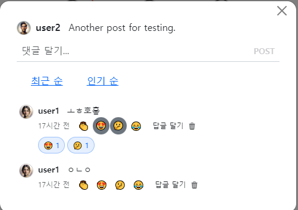

- cookie 인증 유튜브: https://www.youtube.com/watch?v=EO9XWml9Nt0
- 로그인 참고 깃허브(fastapi + htmx + pydantic): https://github.dev/sammyrulez/htmx-fastapi/blob/main/templates/owner_form.html
- ImageReq참고: https://github.dev/riseryan89/imizi-api/blob/main/app/middlewares/access_control.py
- **진짜배기 s3 세팅: https://wooogy-egg.tistory.com/77**
- **post개발 이후, s3 다운로드 참고 github: https://github.com/jrdeveloper124/file-transfer/blob/main/main.py#L30**
    - 유튜브: https://www.youtube.com/watch?v=mNwO_z6faAw
- **s3 boto3 드릴 블로그**: https://dschloe.github.io/aws/04_s3/s3_basic/
- **boto3 client말고 session으로 메서드들 정리 튜토리얼: https://thecodinginterface.com/blog/aws-s3-python-boto3/**

- bootstrap + github 인스타클론 참고:
    - 유튜브: https://www.youtube.com/watch?v=ZCvKlyAkjik
    - github: https://github.com/codingvenue/instagram-hompage-clone-bootstrap/blob/master/index.html
- django stream을 포함한 story : https://www.youtube.com/watch?v=5fG5xaIGzoI&list=WL&index=8&t=4s
- jinja2 지존 튜토리얼 블로그: https://ttl255.com/jinja2-tutorial-part-4-template-filters/
    - recursive: https://stackoverflow.com/questions/23657796/sum-a-value-inside-a-loop-in-jinja
    - 누적합: https://stackoverflow.com/questions/7537439/how-to-increment-a-variable-on-a-for-loop-in-jinja-template
    - list변경 map post.likes -> like.user_id
      list로 : https://stackoverflow.com/questions/31895602/ansible-filter-a-list-by-its-attributes
    - loop의 다양한 변수들(나중에 재귀시 재귀레벨
      확인하자): https://stackoverflow.com/questions/57414751/how-to-use-enumeratezipseq1-seq2-in-jinja2
- todo:
    - form
      validation: https://medium.com/@soverignchriss/asynchronous-form-field-validation-with-htmx-and-django-eb721165b5e8
- comment: https://www.youtube.com/watch?v=T5Jfb_LkoV0&list=PL5E1F5cTSTtTAIw_lBp1hE8nAKfCXgUpW&index=14
- reply: https://github.dev/tcxcx/django-webapp/tree/main/a_inbox/templates/a_inbox

- htmx
    - 검증: https://github.com/bigskysoftware/htmx/issues/75

###   

```css
.tab {
    cursor: pointer;
    padding: 0.75rem 1rem;
    color: rgb(0, 0, 0, 0.6);
    background-color: rgb(0, 0, 0, 0.05);
    border-radius: 0.75rem;
    text-align: center;
    display: flex;
    align-items: center;
}

.tab:hover {
    background-color: rgb(0, 0, 0, 0.1);
}

.tab.selected {
    color: white;
    background-color: var(--black);
}
```

```html

<div class="mb-20">
    <div id="tabs"
         class="ml-4 flex gap-1 mb-4  hidden "
    >
        <a class="tab selected">Newest First</a>
        <a class="tab">Top Comments</a>
    </div>
    <div id="tab-contents">
        
        
        
    </div>
</div>
```

```html

<div class="mb-20">
    <div id="tabs"
         class="ml-4 flex gap-1 mb-4  hidden "
         hx-target="#tab-contents"
         hx-swap="innerHTML"
         _="on htmx:afterOnLoad take .selected for event.target"
    >
        <a hx-get=""
           class="tab selected">Newest First</a>
        <a hx-get="?top"
           class="tab">Top Comments</a>
    </div>
    <div id="tab-contents">
        
        
        
    </div>
</div>
```

#### tab 구조 = div#tabs > a.tab 과 #tab-contents

1. 전체댓글이 순회하고 있는 `comments_modal_content.html`에서, 기존 전체댓글 반복문에서
    1. 위쪽에는 별개의 `div#tabs`를 생성하고 **`왼쪽/아래 약간의 마진`을 준 뒤, 버튼사이 갭을 `d-flex gap-`으로 줘서 만들고**
        - **각 `a.tab 태그`를 탭종류별로 만든 뒤, 첫번째 `a.tab에는 selected`를 준다.**
    2. 전체댓글을 싸고 있는 태그에는 `#tab-contents`를 준다.
        - **또한, 댓글 추가시, 자식에서 추가되어야하기 때문에, `hx-target="innerHTML"`로 수정해준다.**
    ```html
    {# 전체 댓글 #}
    {# 1) 탭 #}
    <div id="tabs" class="ms-2 d-flex gap-2 mb-2">
        <a href="#" class="tab selected">최근 순</a>
        <a href="#" class="tab ">인기 순</a>
    </div>
    
    {# 2) 탭 컨텐츠#}
    <div id="tab-contents"
         class="comments ps-1"
         hx-trigger="commentsChanged-{{ post.id }} from:body"
         hx-get="{{ url_for('pic_hx_show_comments', post_id=post.id) }}"
         hx-target="innerHTML"
    >
        
    </div>
    ```
   


2. 이제 tabs버튼들인 a.tab에 관하여 `css`로 꾸민다.

#### tab css

1. 색관련은 class로 주고, `모양`만 일단 잡는다.
    - **`좌우가 약간 넓은 패딩` + `border가 없이 border-radius`로 배경만 pill모양 + `flex + 가로 + 세로정렬로 텍스트 정렬` + `cursor모양`을 줘서 잡는다.**
    ```html
    
    <style>
        .tab {
            padding: 0.75rem 1rem;
            border-radius: 0.75rem;
    
            display: flex;
            justify-content: center;
            align-items: center;
    
            cursor: pointer;
    
        }
    </style>
    ```
   

#### .tab 기본 회색톤 css 지정

2. `글자크기 + 글자색 + 배경색`을 class로 직접 주고 싶은데 **`selected에 의해 css로 바뀔 예정이므로, 미리 css로 정의`해야한다.**
    - **선택 전 tab으로서 `검은색000의 0.6`은 글자, `검은색000의 0.05`는 배경색으로, 회색으로 통일한다.**
    - 글자크기에 맞게, padding도 조절해야한다.

    ```html 
    <style>
        .tab {
            padding: 0.25rem .50rem;
            border-radius: 0.75rem;
    
            display: flex;
            justify-content: center;
            align-items: center;
    
            cursor: pointer;
    
            font-size: 0.75rem;
            text-decoration: none;
            background-color: rgb(0, 0, 0, 0.05);
            color: rgb(0, 0, 0, 0.6);
        }
    </style>
    ```
   

#### .tab:hover 와 .tab.selected css 지정

3. **`:hover`시에는 `배경색만 0.05 -> 0.1`로 진하게 준다. `글자색보다 좀 더 진`해진다.**
4. **`.selected` 배정시, `글자는 완전흰색 + 배경은 완전검은색`으로 극단적인 반전으로 준다.**
    ```css
    .tab:hover {
        background-color: rgb(0, 0, 0, 0.1);
    }
    .tab.selected {
        color: white;
        background-color: black;
    }
    ```
   

5. style.css로 옮긴다.


### 떠있는 form의 target-this + swap-none + CRUD 후 hx-trigger -> target-#tab-contents + swap-afterbegin의 최신순 기반으로 가져오도록 변경
1. `comments_create_form.html`의 form태그에서 hx-target을 기본this 생략에서 -> 전체댓글 순회를 싸는 태그의id `hx-target="#taget-contents"`을 추가하고 
2. **최신순은 `target의 맨앞에서 첫번째 자식`에 추가해야하므로, hx-swap="none" -> `hx-swap="afterbegin"`으로 변경한다.**
    ```html
    <div x-data="{ content: '' }" class="position-relative add-comment pb-2">
        <form hx-post="{{ url_for('pic_new_comment', post_id=post.id) }}"
              _="on htmx:afterRequest reset() me"
              hx-trigger="submit, keyup[enterkey]"
              hx-target="#tab-contents"
              hx-swap="afterbegin"
              autocomplete="off"
        >
    ```
   
3. pic_new_comment router로 가서, **afterbegin으로 추가될 1개의 `생성된 comment` + `comment_div.html`을 반환한다**
    - 생성된comment를 context에 추가하고, 1개짜리 html을 render하도록 바꾼다.
    ```python
    @app.post("/picstargram/posts/{post_id}/comments/new", response_class=HTMLResponse)
    @login_required
    async def pic_new_comment(
            request: Request,
            post_id: int,
            comment_create_req=Depends(CommentCreateReq.as_form),
    ):
        #...
        
        # return render(request, "",
        return render(request, "picstargram/post/partials/comment_div.html",
                      context=dict(comment=comment),
    
                      hx_trigger={
                          'noContent': False, f'commentsChanged-{post_id}': True, f'commentsCountChanged-{post_id}': True,
                      },
                      messages=[Message.CREATE.write("댓글", level=MessageLevel.INFO)],
                      )
    ```
   
### trigger를 제거(전체댓글 백엔드 실시간처리X)하거나, oob(전체댓글갯수 실시간 처리 유지)로 변경
4. html을 렌더링하므로 더이상 noContent=False `trigger`는 필요없다. 
    - **또한, commentChanged-post_id trigger도 `더이상 전체조회하지 않고, 기존전체 + 새댓글만 추가`하는 상황으로서 trigger를 제거한다.**
    - **하지만, modal이 아닌 post상의 댓글갯수 업데이트는, 진행되도록, commentsCountChanged-{post_id}는 남겨두자.**
        ```python
        return render(request, "picstargram/post/partials/comment_div.html",
                          context=dict(comment=comment),
                          # hx_trigger={
                          #     'noContent': False, f'commentsChanged-{post_id}': True, f'commentsCountChanged-{post_id}': True,
                          # },
                          hx_trigger={f'commentsCountChanged-{post_id}': True, },
                          messages=[Message.CREATE.write("댓글", level=MessageLevel.INFO)],
                          )
        
        ```
    - **백엔드 trigger를 제거하면, front에서 받아주는 trigger + 그에 따른 hx-요청 + hx-target 부분들도 제거한다.**
        ```html
        {# 2) 탭 컨텐츠#}
         <!--hx-trigger="commentsChanged-{{ post.id }} from:body"-->
         <!--hx-get="{{ url_for('pic_hx_show_comments', post_id=post.id) }}"-->
         <!--hx-target="innerHTML"-->
        <div id="tab-contents"
             class="comments ps-1"
        > 
            
        </div>
        ```
5. **문제는 최초에 댓글이 없을 때, 나타나는 문구가 전체새로고침없으니 -> 그대로 남아있다.**
    - **애초에 `댓글이 없으면, 댓글없다 멘트를 표시`하는 것 안나오게(실시간 새로고침x)하는 대신, 댓글 관련이 아예 안나타나게 하자.**
    ```html
    
        
            
        
    {##}
    {#    <p>댓글이 아직 없습니다</p>#}
    
    
    ```
   - **또한, router에서 comment = create_comment()로 생성한 객체에는 `orm이 아니라 user가 자동 연동x`되어서, `comment.user`가 접근안되어 프로필 사진이 안나온다.**
       - 직접 관계필드를 넣어서 새롭게 조회하여 context에 들어가게 한다.
    ```python
    comment = get_comment(comment.id, with_user=True, with_replies=True)
    
    return render(request, "picstargram/post/partials/comment_div.html",
                  context=dict(comment=comment),
                  # hx_trigger={
                  #     'noContent': False, f'commentsChanged-{post_id}': True, f'commentsCountChanged-{post_id}': True,
                  # },
                  hx_trigger={f'commentsCountChanged-{post_id}': True, },
                  messages=[Message.CREATE.write("댓글", level=MessageLevel.INFO)],
                  )
    ```
    

6. `comments.html`에서 댓글이 없습니다 멘트 생략하기(실시간 백엔드 렌더링 처리 안되게 됨)
    ```html
    
        
            
        
    {##}
    {#    <p>댓글이 아직 없습니다</p>#}
        
    ```
    
 
7. **조회종류인 `div.tabs`태그도 안보이게 하고 싶은데, `css class` + `jinja if`를 활용한다**
    - **타일윈드에서는 `hidden` 태그가 boostrap 5에선 `visually hidden`이다.**
    ```html
    {# 전체 댓글 #}
    {# 1) 탭 #}
    <div id="tabs" class="d-flex gap-2 ms-2 mb-2 visually-hidden">
        <a href="#" class="tab selected">최근 순</a>
        <a href="#" class="tab ">인기 순</a>
    </div>
    ```
    
    
   
8. commentsCountChanged-post.id의 trigger는 **실시간 처리하고 싶으니, oob처리한다.** 
    - trigger 제거하고
    ```python
    return render(request, "picstargram/post/partials/comment_div.html",
                  context=dict(comment=comment),
                  # hx_trigger={f'commentsCountChanged-{post_id}': True, },
                  messages=[Message.CREATE.write("댓글", level=MessageLevel.INFO)],
                  )
    ```
  
     - **front에서 trigger 및 동작들 제거하고, oob를 위해 동적id를 `trigger명을 id=`로 변경하자**
    ```html
    {#hx-trigger="commentsCountChanged-{{ post.id }} from:body"#}
    {#hx-get="{{ url_for('pic_hx_show_comments_count', post_id=post.id) }}"#}
    {#hx-target="this"#}
    {#hx-swap="outerHTML"#}
    <span id="commentsCountChanged-{{ post.id }}"
          hx-swap-oob="true"
    > 댓글
        
            보기 <span class="badge bg-light text-dark rounded-pill">{{ comments_count }}</span>
        
            달기
        
    </span>
    ```
    - **이 때, trigger로 새롭게 조회된 post가 필요하므로, 현재 route에서도, post를 조회하고, context에 넣어준다.**
        - comments_count도 context가 아니라, 내부에서 처리하게 하자.
        - 기존 include되는 count html을 oob옵션으로  render하도록 한다.
    ```python
    comment = get_comment(comment.id, with_user=True, with_replies=True)
    post = get_post(data['post_id'], with_comments=True)
    return render(request, "picstargram/post/partials/comment_div.html",
                  context=dict(comment=comment,post=post),
                  oobs=["picstargram/post/partials/comments_count_with_post.html"],
                  messages=[Message.CREATE.write("댓글", level=MessageLevel.INFO)],
                  )
    ```
    - **동적 id를 가진 oob는 render시에만 넣어야하므로, hx-swap-oob를 제거한 태그는, post.html의 기존 include하는 부분에 oob빼고 그대로 넣는다.**
    ```html
    {##}
    <span id="commentsCountChanged-{{ post.id }}"
    > 댓글
        
            보기 <span class="badge bg-light text-dark rounded-pill">{{ comments_count }}</span>
        
            달기
        
    </span>
    ```
   

### tab에 최근순 추가되는 comment 1개에 transition(fadein + slide down) 넣기
#### 렌더링되는 되는 새 댓글 html은 on load transition my 시작_name to yyy over zzz 0.6 seconds로  애니메이션 넣기 
1. **htmx렌더링되는 html에는 hyperscript로 애니메이션을 넣을 수 있다.**
2. 렌더링되는 `comment_div.html`에 fade-in태그를 씌우고 hyperscript를 적용한다.
    - **애니메이션 적용될 전체태그를 `<fade-in>`태그를 싸고, css class로 `opacity-0`으로 시작하게 한다. v5.1부터 가능**
    - **하지만, 알아봤더니 bootstrap `opacity-0`은 `important가 붙혀져있어서 변경이 안된다`. important빼고 style.css에 정의해도 씹힌다.**
        - style태그로 opacity:0을 너허준다.
    ```html
    <fade-in style="opacity:0">
        <div x-data="{ replyAddOpen: false }" class="position-relative">
            <div class="comment d-flex">
    
    ``` 

3. 렌더링되는 되는 새 댓글 html은에 hyperscript로 `_="on load transition my 시작css_name to yyy over zzz 0.6 seconds"`로  애니메이션 넣기
    ```html
    <fade-in style="opacity:0"
             _="on load transition my opacity to 1 over 0.4 seconds"
    >
    ```
    - **하지만, 문제는 comments순회하는 전체댓글도 애니메이션이 적용되어 버린다.**
    - **comment_div.html은 그대로 두고, new_comment.html을 만들어서, 기존 것을 include하고 fadein을 적용해주자.**

    ```html
    <fade-in style="opacity:0"
             _="on load transition my opacity to 1 over 0.4 seconds"
    >
        
    </fade-in>
    ```
    - **렌더링되는 html도 바꿔서, fade쌓인 comment_div_new만 애니메이션 적용되게 한다.**
    ```python
    return render(request, "picstargram/post/partials/comment_div_new.html",
    ```
   
4. 이제 시작css를 `margin-top`으로 충분히 주고, opacity보다 먼저 `transition을 짧게 실행`시키고 `then`으로 opactiy가 시작되도록 추가한다.
    ```html
    <fade-in style="opacity:0; margin-top: 3rem;"
             _="on load transition my margin-top to 0 over 0.1 seconds then transition my opacity to 1 over 0.4 seconds"
    >
        
    </fade-in>
    ```
    


### Reply도 똑같이 적용해서 trigger 제거하고 tranision 적용하되, 최신순이 아니라, swap beforeend(not afterbegin)
1. 일단 답글을 싸는 replyWrapper만큼, padding-left를 줘서, 답글생성form이 조금 드러가게 디자인
    ```html
    {# 답글 생성 form #}
    
    <div x-show="replyAddOpen"
         x-cloak
         x-transition:enter.duration.300ms
         x-transition:leave.duration.150ms
         x-ref="replyAddFormWrapper"
         style="padding-left: 1.5rem;"
    >
        
    </div>
    
    ```
   
#### reply swap none + noContent:False + trigger의 조합을 깨기 위해
1. 생성 form `reply_create_form_with_comment.html`에서 hx-swap을 beforeend로 주는데, **hx-target이 되는 곳인 `hx-trigger` 작성를 찾는다**
    - swap none -> backend `trigger` -> `hx-trigger` + hx-target this
    - swap `beforeend or afterbegin` -> backend html 렌더링 -> `hx-target 전체순회 wrapper태그`

    ```html
    <div x-data="{ content: '' }" class="position-relative add-reply pb-2">
        <form hx-post="{{ url_for('pic_new_reply', comment_id=comment.id) }}"
              _="on htmx:afterRequest reset() me"
              hx-trigger="submit, keyup[enterkey]"
              hx-swap="beforeend"
              hx-target=""
              autocomplete="off"
        >
    ```
    - **hx-target은 보통 `전체 답글 순회하는 wrapper`태그가 target이 된다. `comment_div.html` 내부에 있으니 `id=`를 `hx-trigger명`으로 맞춰본다.**
        - trigger `repliesChanged-{{ comment.id }}` 를 -> `id="comment-{{ comment.id }}-replies"`로 변경
        - **trigger외 hx요청들도 다 삭제한다.**
    ```html
    {# 전체 답글 #}
    
    <!--<div hx-trigger=" from:body" -->
    <!--hx-get="{{ url_for('pic_hx_show_replies', comment_id=comment.id) }}"-->
    <!--hx-target="this"-->
    <div id="comment-{{ comment.id }}-replies">
        
    </div>
    ```
3. trigger명 변환으로 만들어진, id를 생성form hx-target으로 넣어준다.
    ```html
    <div x-data="{ content: '' }" class="position-relative add-reply pb-2">
        <form hx-post="{{ url_for('pic_new_reply', comment_id=comment.id) }}"
              _="on htmx:afterRequest reset() me"
              hx-trigger="submit, keyup[enterkey]"
              hx-swap="beforeend"
              hx-target="#comment-{{ comment.id }}-replies"
              autocomplete="off"
        >
    ```

4. 답글 생성 route로 가서, 해당 trigger를 제거하고, **1개 답글 html로 렌더링 + 필요한 context가지도록** 바꾸며, html포함시 noContent:False trigger도 제거한다.
    - **1개짜리 렌더링 swap으로 바꿀 때, `해당 html에 필요한 변수들`을 확인하여, `context로 같이 넣어줘야한다`**
    - reply.html에는 `최신 reply`외 `loop_index`까지 포함되어있다.
        - **백엔드에서 미리 순회하고 있는 loop_index를 모르니, `현재 comment의 active한 갯수`를 `최초 렌더링 변수와 동일한 loop_index=`로 context에 넣어줘야한다.**
    ```python
    File "templates\picstargram\post\partials\reply.html", line 6, in top-level template code
    <div class="reply-profile d-flex fs-7" style="--reply_index:{{ loop_index * 0.7 }}">
    jinja2.exceptions.UndefinedError: 'loop_index' is undefined
    ```
    
5. 이제 남은 trigger `f'repliesCountChanged-{comment_id}': True`와 `f'commentsCountChanged-{post_id}': True,`를 어떻게 처리할지 고민한다
    - 리플갯수변화는 원래 반영안하고 comments변화에서 처리하도록 변경했으니 삭제한다.
    - **커멘트 갯수변화는 oob로 변경했으니, 해당 html을 렌더링해주되, 필요한 변수들을 미리 보고 context에 포함시킨다.**
        - `comments_count_with_post.html`로서 `with_comments=True로 조회한 post`객체가 필요하다.
        - **post schema에 replies갯수까지 카운팅하는 `post.comments_count`의 프로퍼티를 정의해놨으니 post를 넣어줘야 oob를 처리할 수 있다.**
    ```python
    # return render(request, "",
    reply = get_reply(reply.id)
    loop_index = len(comment.replies)
    post = get_post(post_id, with_comments=True)
    return render(request, "picstargram/post/partials/reply.html",
                  context=dict(reply=reply, loop_index=loop_index, post=post),
                  hx_trigger={
                      # 'noContent': False,
                      # f'repliesChanged-{comment_id}': True,
                      # f'repliesCountChanged-{comment_id}': True,
                      # f'commentsCountChanged-{post_id}': True,  # 답글달시 댓글갯수변화도
                  },
                  oobs=["picstargram/post/partials/comments_count_with_post.html"],
                  messages=[Message.CREATE.write("답글", level=MessageLevel.INFO)],
                  )
    ```
   
#### reply에도 transition 적용하기
1. reply.html를 include하는 <fade-in>태그에 hyperscript를 씌워서 애니메이션을 만들어 렌더링 되게 한다.
    - comment_div_new.html와 include만 다르니, 복사해서 include만 다르게 해준다.
    ```html
    <fade-in style="opacity:0; margin-top: 3rem;"
             _="on load transition my margin-top to 0 over 0.1 seconds then transition my opacity to 1 over 0.4 seconds"
    >
        
    </fade-in>    
    ```
   
2. route에서 reply.html 대신, reply_new.html로 변경한다.
    ```python
    return render(request, "picstargram/post/partials/reply_new.html",
                  context=dict(reply=reply, loop_index=loop_index, post=post),
                  oobs=["picstargram/post/partials/comments_count_with_post.html"],
                  messages=[Message.CREATE.write("답글", level=MessageLevel.INFO)],
                  )
    
    ```
    


### AWS 명령어 모음

```shell
%UserProfile%\.aws\credentials
%UserProfile%\.aws\config

aws configure list-profiles

# 등록
aws configure --profile {프로젝트명} # ap-northeast-2 # json
# 재사용시
set AWS_PROFILE={프로젝트명}

cat ~\.aws\credentials


# S3
aws s3 ls --profile {프로필명}
aws s3 mb s3://{버킷명}
aws s3 ls --profile {프로필명}


aws s3 cp {파일경로} s3://{버킷명}
aws s3 cp {파일경로} s3://{버킷명}/{폴더명} --acl public-read
```

#### IAM key 변경

1. root사용자 로그인 > IAM > 해당사용자 클릭 > `보안 자격 증명` 탭 > 액세스키
2. 기존 key `비활성화` 후 필요시 삭제 (있다가 cli에서 확인하고 비활성화하면 더 좋을 듯)
3. 새 액세스키 AWS CLI 선택하여 발급
4. 터미널 열어서 `AWS CLI`를 통해 해당프로젝트의 profile key들 덮어쓰기
    ```shell
    aws configure list-profiles # 현재 프로필들 확인
    cat ~\.aws\credentials # 현재 프로필들의 key설정값들 확인 (콘솔에서 비활성화시킨 것과 일치하는지)
    aws configure --picstargram # 특정프로필 key 덮어쓰기 with 콘솔
    ```

5. 프로젝트 .env의 `aws_access_key_id`와 `aws_secret_access_key`를 변경

   


