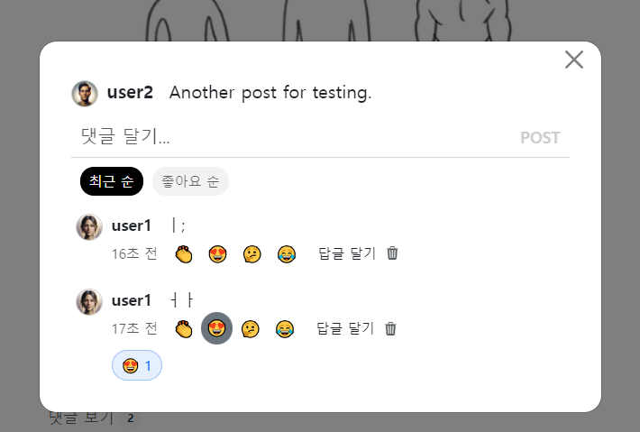
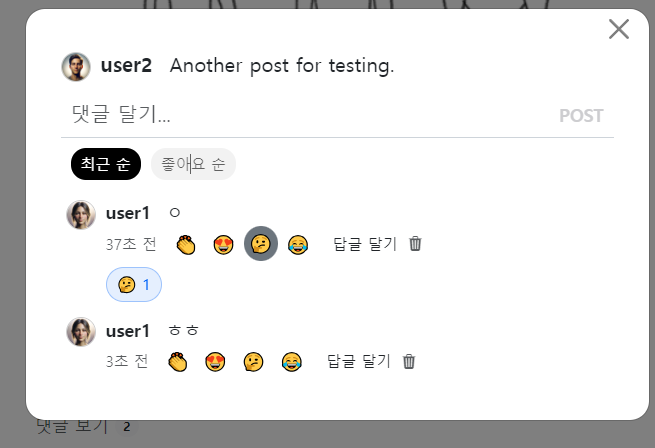
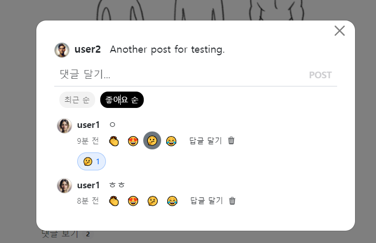

- cookie 인증 유튜브: https://www.youtube.com/watch?v=EO9XWml9Nt0
- 로그인 참고 깃허브(fastapi + htmx + pydantic): https://github.dev/sammyrulez/htmx-fastapi/blob/main/templates/owner_form.html
- ImageReq참고: https://github.dev/riseryan89/imizi-api/blob/main/app/middlewares/access_control.py
- **진짜배기 s3 세팅: https://wooogy-egg.tistory.com/77**
- **post개발 이후, s3 다운로드 참고 github: https://github.com/jrdeveloper124/file-transfer/blob/main/main.py#L30**
    - 유튜브: https://www.youtube.com/watch?v=mNwO_z6faAw
- **s3 boto3 드릴 블로그**: https://dschloe.github.io/aws/04_s3/s3_basic/
- **boto3 client말고 session으로 메서드들 정리 튜토리얼: https://thecodinginterface.com/blog/aws-s3-python-boto3/**

- bootstrap + github 인스타클론 참고:
    - 유튜브: https://www.youtube.com/watch?v=ZCvKlyAkjik
    - github: https://github.com/codingvenue/instagram-hompage-clone-bootstrap/blob/master/index.html
- django stream을 포함한 story : https://www.youtube.com/watch?v=5fG5xaIGzoI&list=WL&index=8&t=4s
- jinja2 지존 튜토리얼 블로그: https://ttl255.com/jinja2-tutorial-part-4-template-filters/
    - recursive: https://stackoverflow.com/questions/23657796/sum-a-value-inside-a-loop-in-jinja
    - 누적합: https://stackoverflow.com/questions/7537439/how-to-increment-a-variable-on-a-for-loop-in-jinja-template
    - list변경 map post.likes -> like.user_id
      list로 : https://stackoverflow.com/questions/31895602/ansible-filter-a-list-by-its-attributes
    - loop의 다양한 변수들(나중에 재귀시 재귀레벨
      확인하자): https://stackoverflow.com/questions/57414751/how-to-use-enumeratezipseq1-seq2-in-jinja2
- todo:
    - form
      validation: https://medium.com/@soverignchriss/asynchronous-form-field-validation-with-htmx-and-django-eb721165b5e8
- comment: https://www.youtube.com/watch?v=T5Jfb_LkoV0&list=PL5E1F5cTSTtTAIw_lBp1hE8nAKfCXgUpW&index=14
- reply: https://github.dev/tcxcx/django-webapp/tree/main/a_inbox/templates/a_inbox

- htmx
    - 검증: https://github.com/bigskysoftware/htmx/issues/75


1. `comments_modal_content.html`내부에 #tabs의 각 a.tab태그에 `hx-get`으로 post를 조회하도록 할 수 있게 한다.
    - **원래 commnets를 가져오는 router는 default로 그대로 요청하게 하고**
    - **정렬에 대한 것은 `.include_query_params(sort=like)`로 sort key로 value를 준다**
    ```html
    <div id="tabs" class="d-flex gap-2 ms-2 mb-2 visually-hidden">
        {#<a href="#" class="tab selected">최근 순</a>#}
        {#<a href="#" class="tab ">좋아요 순</a>#}
        <a hx-get="{{ url_for('pic_hx_show_comments', post_id=post.id) }}" class="tab selected">최근 순</a>
        <a hx-get="{{ url_for('pic_hx_show_comments', post_id=post.id).include_query_params(sort='like') }}" class="tab ">좋아요 순</a>
    </div>
    ```
    - **route에서는 `= Query(None, alias='sort')`로 특정 쿼리파라미터를 받을 수 있다.**
    ```python
    @app.get("/picstargram/posts/{post_id}/comments", response_class=HTMLResponse)
    async def pic_hx_show_comments(
            request: Request,
            post_id: int,
            hx_request: Optional[str] = Header(None),
            sort: str = Query(None, alias='sort'),
    ):
        print(f"sort  >> {sort}")
        # sort  >> like
    ```
 
2. 이제 sort가 있을 경우에는, 실제로 정렬해줘서 comments를 채워주자.
    - **list이므로 `sorted( list, key=lambda x:x.기준필드 , reversed=True)`로 `정렬 역순이 많은 순`으로 반환되게 한다**
    ```python
    @app.get("/picstargram/posts/{post_id}/comments", response_class=HTMLResponse)
    async def pic_hx_show_comments(
            request: Request,
            post_id: int,
            hx_request: Optional[str] = Header(None),
            sort: str = Query(None, alias='sort'),
    ):
        # print(f"sort  >> {sort}")
        # sort  >> like
    
        comments = get_comments(post_id, with_user=True)
        
        # comments = list(reversed(comments))
        if sort and sort == 'like':
            comments = sorted(comments, key=lambda x: x.reactions_count, reverse=True)
        else:
            comments = list(reversed(comments))
    ```
    - **이 때, comment Schema는 reaction들의 총 갯수 필드가 없으니, `schema`에서 property로 정의해준다.**
    ```python
    class CommentSchema(BaseModel):
        #...
        @property
        def reactions_count(self):
            if not self.reactions:
                return 0
    
            return len(self.reactions)
    ```
    - **좋아요가 같을 때, 생성 역순으로 주려면 `lambda x: (x.기준1, x.기준2)`로서, 기준필드 여러개를 tuple로 주면 된다.**
    ```python
    comments = sorted(comments, key=lambda x: (x.reactions_count, x.created_at), reverse=True)
    ```


3. hx-요청에는 swap="none"이 아니라면 hx-target이 필요하다. tabs들의 target은 `#tab-contnent` + swap은 `innerHTML`이다.
    ```html
    <div id="tabs" class="d-flex gap-2 ms-2 mb-2 visually-hidden">
        {#<a href="#" class="tab selected">최근 순</a>#}
        {#<a href="#" class="tab ">좋아요 순</a>#}
        <a class="tab selected"
           hx-get="{{ url_for('pic_hx_show_comments', post_id=post.id) }}"
           hx-target="#tab-contents"
           hx-swap="innerHTML"
        >최근 순</a>
        <a class="tab"
           hx-get="{{ url_for('pic_hx_show_comments', post_id=post.id).include_query_params(sort='like') }}"
           hx-target="#tab-contents"
           hx-swap="innerHTML"
        >좋아요 순</a>
    </div>
    ```
    
    
  

4. 전체 순회되는 `comments.html`에는 새 자식X -> mt 애니메이션 없이 opacity만 fade-in태그에서 처리되도록 on load를 걸어준다
    ```html
    <fade-in style="opacity: 0;"
             _ = "on load transition my opacity to 1 over 0.2 seconds"
    >
        
            
                
            
        
    </fade-in>
    
    ```
   

### 핵심) hyperscript로, tab highlight 하기
#### on htmx:afterOnLoad 시 take .selected를 취해서 for event.target에 주기
1. on load가 아닌 이유는, 최초렌더링시는 X default에서 가지고 있떤 `.selected`를, event를 만든 자식a.tab태그를 발생시킨 hx요청후 처리되기 위함.
    ```html
    <div id="tabs" class="d-flex gap-2 ms-2 mb-2 visually-hidden"
         _="on htmx:afterOnLoad take .selected for event.target"
    >
        <a class="tab selected"
           hx-get="{{ url_for('pic_hx_show_comments', post_id=post.id) }}"
           hx-target="#tab-contents"
           hx-swap="innerHTML"
        >최근 순</a>
        <a class="tab"
           hx-get="{{ url_for('pic_hx_show_comments', post_id=post.id).include_query_params(sort='like') }}"
           hx-target="#tab-contents"
           hx-swap="innerHTML"
        >좋아요 순</a>
    </div>
    ```
    


### 삭제도 댓글 or 답글 1개만
#### 답글 삭제 -> count는 oob로
1. 그동안 삭제버튼은 hx-delete가 아닌 `hx-post`로 수행해서 swap이 되게 했고
    - **hx-swap="none"인 대신, noContent:False + trigger로 전체 새로고침한 상황이었다.**
    - **지금은 hx-swap="outerHTML"로 대상태그가 전체바뀌게 하고 `hx-target=closest fade-in`으로 모든 댓글마다 <fade-in>을 달고 나타나게 되었으니 그것을 찾아서 삭제하게 해준다.**
    ```html
    <!-- comment_div.html -->
    
    <a hx-post="{{ url_for('pic_hx_delete_comment', comment_id= comment.id ) }}"
       hx-confirm="정말 삭제하시겠습니까?"
       hx-target="closest fade-in"
       hx-swap="outerHTML"
       class="text-decoration-none text-muted cursor-pointer"
    >
        <i class="bi bi-trash3-fill"></i>
    </a>
    
    ```

2. 삭제는 잘되는데, trigger를 제거해야한다. 이 때 코멘트 갯수는 post에서 property로 처리하니, 조회해서 `context`까지 추가한 `oob`를 보내준다.
    ```python
    @app.post("/comments/{comment_id}", response_class=HTMLResponse)
    @login_required
    async def pic_hx_delete_comment(
            request: Request,
            comment_id: int,
    ):
        #...
        
        post = get_post(post_id, with_comments=True)
        return render(request,
                      "",
                      # hx_trigger={
                      #     'noContent': False, 'commentsChanged': True, f'commentsCountChanged-{post_id}': True,
                      # },
                      context=dict(post=post),
                      oobs=["picstargram/post/partials/comments_count_with_post.html"],
                      messages=[Message.DELETE.write("댓글", level=MessageLevel.INFO)],
                      )
    ```

3. **delete는 ""로 응답하여, html이 비어서, noContent=False를 줘야 모달이 안꺼진다. 남겨둔다.**
    ```python
    post = get_post(post_id, with_comments=True)
    return render(request,
                  "",
                  hx_trigger={
                      'noContent': False, 
                  },
                  context=dict(post=post),
                  oobs=["picstargram/post/partials/comments_count_with_post.html"],
                  messages=[Message.DELETE.write("댓글", level=MessageLevel.INFO)],
                  )
    ```
#### 답글 삭제 및 갯수 업뎃 
1. 답글은 다행히, 대상 부모wrapp가 `div.reply-wrapper`로 있어서, 그것을 잡아서 target으로 삼아준다.
    ```html
    <!-- reply.html -->
    {# 삭제 #}
    
        <a class="text-decoration-none text-muted cursor-pointer"
           hx-post="{{ url_for('pic_hx_delete_reply', reply_id= reply.id ) }}"
           hx-confirm="정말 삭제하시겠습니까?"
           hx-target="closest div.reply-wrapper"
           hx-swap="outerHTML"
        >
            <i class="bi bi-trash3-fill"></i>
        </a>
    
    ```
2. route에서는 trigger를 제거하고, oob와 그에 필요한 context를 넣어준다.
    - 이 때, modal안닫히기용 noContent : False는 내려줘야한다.
```python
@app.post("/replies/{reply_id}", response_class=HTMLResponse)
@login_required
async def pic_hx_delete_reply(
        request: Request,
        reply_id: int,
):
    #...
    comment = get_comment(comment_id, with_replies=True)
    post = get_post(comment.post_id, with_comments=True)
    return render(request,
                  "",
                  hx_trigger={
                      'noContent': False, 
                  #     f'repliesChanged-{comment_id}': True,
                  #     f'repliesCountChanged-{comment_id}': True,
                  },
                  context=dict(post=post),
                  oobs=["picstargram/post/partials/comments_count_with_post.html"],
                  messages=[Message.DELETE.write("답글", level=MessageLevel.INFO)],
                  )

```

### AWS 명령어 모음

```shell
%UserProfile%\.aws\credentials
%UserProfile%\.aws\config

aws configure list-profiles

# 등록
aws configure --profile {프로젝트명} # ap-northeast-2 # json
# 재사용시
set AWS_PROFILE={프로젝트명}

cat ~\.aws\credentials


# S3
aws s3 ls --profile {프로필명}
aws s3 mb s3://{버킷명}
aws s3 ls --profile {프로필명}


aws s3 cp {파일경로} s3://{버킷명}
aws s3 cp {파일경로} s3://{버킷명}/{폴더명} --acl public-read
```

#### IAM key 변경

1. root사용자 로그인 > IAM > 해당사용자 클릭 > `보안 자격 증명` 탭 > 액세스키
2. 기존 key `비활성화` 후 필요시 삭제 (있다가 cli에서 확인하고 비활성화하면 더 좋을 듯)
3. 새 액세스키 AWS CLI 선택하여 발급
4. 터미널 열어서 `AWS CLI`를 통해 해당프로젝트의 profile key들 덮어쓰기
    ```shell
    aws configure list-profiles # 현재 프로필들 확인
    cat ~\.aws\credentials # 현재 프로필들의 key설정값들 확인 (콘솔에서 비활성화시킨 것과 일치하는지)
    aws configure --picstargram # 특정프로필 key 덮어쓰기 with 콘솔
    ```

5. 프로젝트 .env의 `aws_access_key_id`와 `aws_secret_access_key`를 변경

   


