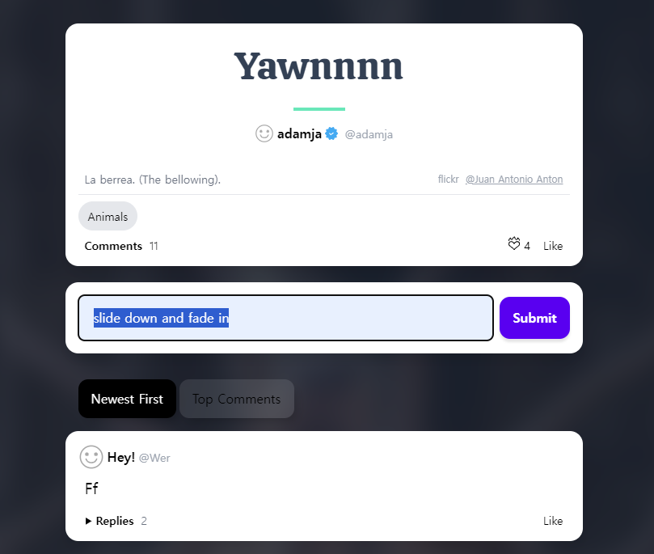
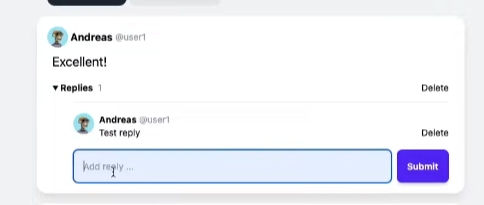
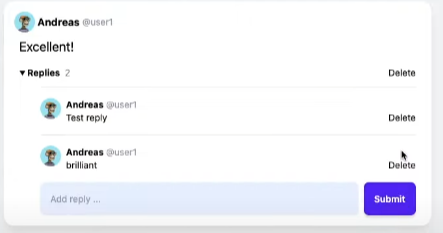

### form 제출 후 reset 
#### [on htmx:afterRequest reset() me ] 

```html
<form hx-post="{{ url_for('pic_new_comment', post_id=post.id) }}"
          hx-swap="none"
          _="on htmx:afterRequest reset() me"
    >
```


### form제출 후, render되는 html에 fade-in with 태그 효과 
#### fade-in + on load transition my css to value over x sec ]
```html

<fade-in style="opacity: 0" _="on load transition my opacity to 1 over 0.2 seconds">
        {{ request.query_params.get('next') }}

<form
        hx-trigger="submit"
        hx-post="{{ url_for('pic_new_user').include_query_params(next=request.query_params.get('next', '')) }}"
        {#hx-encoding="multipart/form-data"#}
>
    <!-- email -->
    <!-- password -->
    
</form>
</fade-in>
```

#### 응용) 따로 위쪽에 떠있는 form + add_comemnt(새댓글1+CountOob)가 afterbegin로 form 제출 후 slide down then fade in
- **응용: slide down with mt-x -> mt-0**
    - comment 생성 form 제출시 tab내부 `hx-swap="afterbegin"`과 함께 slidedown
    
    ```python
    class Comment(models.Model):
    
        class Meta:
            ordering = ['-created']
    
    ```
    ```html
     
    
        
    
    
    <div class="card !pb-0 -mt-3">
      <form hx-post="" 
      class="flex items-center p-4" 
      autocomplete="off"
      hx-target="#tab-contents" 
      hx-swap="#afterbegin"
      _="on htmx:afterRequest reset() me"
      >
        {csrf_token} 
        {{ commentform }}
        <button @click="open = false" class="block ml-2" type="submit">
          Submit
        </button>
      </form>
    </div>
    
    
    
    <div class="mb-20">
      <div 
      id="tabs" 
      class="ml-4 flex gap-1 mb-4  hidden "
      hx-target="#tab-contents"
      hx-swap="innerHTML"
      _="on htmx:afterOnLoad take .selected for event.target"
      >
        <a 
        hx-get=""
        class="tab selected">Newest First</a>
        <a 
        hx-get="?top"
        class="tab">Top Comments</a>
      </div>
      <div id="tab-contents">
         
            
        
      </div>
    </div>
    
    
    
    ```
    ```python
    @login_required
    def comment_sent(request, pk):
        post = get_object_or_404(Post, id=pk)
        replyform = ReplyCreateForm()
    
        if request.method == 'POST':
            form = CommentCreateForm(request.POST)
            if form.is_valid:
                comment = form.save(commit=False)
                comment.author = request.user
                comment.parent_post = post
                comment.save()
                
        context= {
            'post' : post, 
            'comment' : comment,
            'replyform' : replyform
        }    
                
        return render(request, 'snippets/add_comment.html', context)
    ```
    ```html
    <fade-in 
    class="opacity-0 block -mt-20 ease-in-out" 
    _="on load transition my margin-top to 0 over 0.2 seconds then transition my opacity to 1 over 0.4 seconds"
    >
    
    
    </fade-in>
    <span hx-swap-oob="True" id="commentscount-{{ post.id }}" class="font-light text-gray-500 ml-1">{{ post.comments.count }}</span>
    
    ```
  
#### 응용2) 답글들 + 마지막에 있는 form -> outerHTML로 새답글1+form 으로 교체되는 경우에도 slide down + fade in



```html
<div
    x-show="repliesOpen"
    x-cloak
    class="basis-full mt-3 pl-8 grid grid-cols-1"
  >
   
       
   
   
    
    <form
      class="replyform flex justify-between"
      autocomplete="off"
      hx-post=""
      hx-target="this"
      hx-swap="outerHTML" 
    >
    
     {{ replyform }}
      <button class="block" type="submit">Submit</button>
    </form>

   { % endif % }
  </div>
```
```python
@login_required
def reply_sent(request, pk):
    comment = get_object_or_404(Comment, id=pk)
    replyform = ReplyCreateForm()
    if request.method == 'POST':
        form = ReplyCreateForm(request.POST)
        if form.is_valid:
            reply = form.save(commit=False)
            reply.author = request.user
            reply.parent_comment = comment
            reply.save()
    context= {
        'reply' : reply,
        'comment' : comment,
        'replyform' : replyform
    }      
    return render(request, 'snippets/add_reply.html', context)
```
```html

<fade-in
        class="opacity-0 block -mt-20 ease-in-out"
        _="on load transition my margin-top to 0 over 0.2 seconds then transition my opacity to 1 over 0.4 seconds"
>

    
</fade-in>

<form
        class="replyform flex justify-between"
        autocomplete="off"
        hx-post=""
        hx-target="this"
        hx-swap="outerHTML"
>
    
    {{ replyform }}
    <button class="block" type="submit">Submit</button>
</form>

<span hx-swap-oob="True" id="repliescount-{{ comment.id }}" class="font-light text-gray-500 ml-1">{{ comment.replies.count }}</span>

```